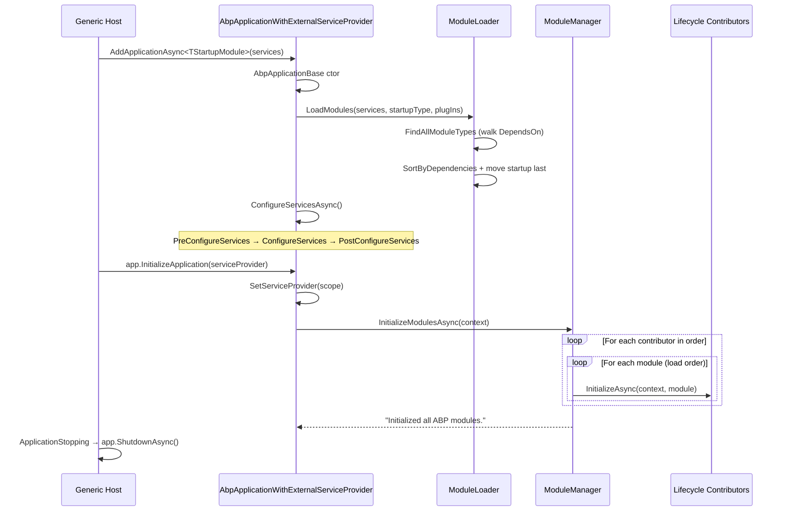

ABP boots through a small set of well-defined hand-offs between the .NET generic host, the `AbpApplicationFactory`, the `IModuleLoader`, and the `IModuleManager`. Each module declares dependencies, contributes services, and listens for lifecycle phases via interfaces that are dispatched by named contributors. This page walks the entire startup graph the way the framework actually executes it so you can reason about ordering, scope boundaries, and where to plug your own logic.

The trace below follows the **external service provider** variant — the most common in ASP.NET Core hosts — but the internal variant differs only in how `IServiceProvider` is created.

## High-level sequence



## 1. Host wires the application

In an ASP.NET Core host you call `builder.Services.AddApplicationAsync<TStartupModule>(...)`. This eventually instantiates [`AbpApplicationWithExternalServiceProvider`](https://github.com/abpframework/abp/blob/dev/framework/src/Volo.Abp.Core/Volo/Abp/AbpApplicationWithExternalServiceProvider.cs), whose constructor delegates to the abstract base, [`AbpApplicationBase`](https://github.com/abpframework/abp/blob/dev/framework/src/Volo.Abp.Core/Volo/Abp/AbpApplicationBase.cs).

```csharp
// framework/src/Volo.Abp.Core/Volo/Abp/AbpApplicationBase.cs
internal AbpApplicationBase(Type startupModuleType, IServiceCollection services, Action<AbpApplicationCreationOptions>? optionsAction)
{
    StartupModuleType = startupModuleType;
    Services = services;

    services.TryAddObjectAccessor<IServiceProvider>();
    var options = new AbpApplicationCreationOptions(services);
    optionsAction?.Invoke(options);

    services.AddSingleton<IAbpApplication>(this);
    services.AddSingleton<IApplicationInfoAccessor>(this);
    services.AddSingleton<IModuleContainer>(this);
    services.AddSingleton<IAbpHostEnvironment>(new AbpHostEnvironment { EnvironmentName = options.Environment });

    services.AddCoreServices();
    services.AddCoreAbpServices(this, options);

    Modules = LoadModules(services, options);   // ← dependency-sorted descriptor list

    if (!options.SkipConfigureServices)
    {
        ConfigureServices();                    // ← Pre / Configure / Post
    }
}
```

[`AbpApplicationFactory`](https://github.com/abpframework/abp/blob/dev/framework/src/Volo.Abp.Core/Volo/Abp/AbpApplicationFactory.cs) provides the public `CreateAsync` overloads; the async variants set `SkipConfigureServices = true` so they can call `await app.ConfigureServicesAsync()` themselves and surface async exceptions cleanly.

## 2. Loading the module graph

`LoadModules` calls into [`ModuleLoader`](https://github.com/abpframework/abp/blob/dev/framework/src/Volo.Abp.Core/Volo/Abp/Modularity/ModuleLoader.cs):

```csharp
// framework/src/Volo.Abp.Core/Volo/Abp/Modularity/ModuleLoader.cs
public IAbpModuleDescriptor[] LoadModules(IServiceCollection services, Type startupModuleType, PlugInSourceList plugInSources)
{
    var modules = GetDescriptors(services, startupModuleType, plugInSources);
    modules = SortByDependency(modules, startupModuleType);
    return modules.ToArray();
}

protected virtual List<IAbpModuleDescriptor> SortByDependency(List<IAbpModuleDescriptor> modules, Type startupModuleType)
{
    var sortedModules = modules.SortByDependencies(m => m.Dependencies);
    sortedModules.MoveItem(m => m.Type == startupModuleType, modules.Count - 1);
    return sortedModules;
}
```

Three things happen here:

1. **Discovery.** `AbpModuleHelper.FindAllModuleTypes(startupModuleType, ...)` walks `[DependsOn]` attributes recursively from the startup module. Plug-in modules contributed via `PlugInSourceList` are added afterwards.
2. **Instantiation.** Each module type is created via `Activator.CreateInstance` and registered as a singleton (`services.AddSingleton(moduleType, instance)`).
3. **Topological sort.** `SortByDependencies` produces a deterministic order in which a module appears **after** every module it depends on. The startup module is then forcibly moved to the very end so its hooks run last — a useful guarantee when the app needs to apply final overrides.

Each module is wrapped in an `AbpModuleDescriptor` (`Type`, `Instance`, `Dependencies`, `IsLoadedAsPlugIn`).

## 3. Configuring services

After `LoadModules`, the base class calls `ConfigureServicesAsync()` (or its sync twin). It iterates through the module list **three times**:

| Pass | Interface | Purpose |
|------|-----------|---------|
| 1 | `IPreConfigureServices` | Set options/markers other modules need at registration time. |
| 2 | `AbpModule.ConfigureServicesAsync` | The main registration phase. `services.AddAssembly(assembly)` runs for each module's assemblies (unless `SkipAutoServiceRegistration = true`). |
| 3 | `IPostConfigureServices` | Final corrections — e.g. replacing services another module added. |

Errors in any phase throw `AbpInitializationException` with the offending module's `AssemblyQualifiedName` and the original exception as `InnerException`, which is the trace you'll see in the host log.

Once all three passes complete, `_configuredServices = true` blocks a second call and `TryToSetEnvironment(Services)` propagates the environment marker.

## 4. Host builds the container

For the external variant the host builds the `IServiceProvider` (via Microsoft DI or Autofac). After the container is built the host calls `app.InitializeApplication(serviceProvider)`. The ABP extension does this in [`AbpApplicationBuilderExtensions`](https://github.com/abpframework/abp/blob/dev/framework/src/Volo.Abp.AspNetCore/Microsoft/AspNetCore/Builder/AbpApplicationBuilderExtensions.cs):

```csharp
public async static Task InitializeApplicationAsync(this IApplicationBuilder app)
{
    app.ApplicationServices.GetRequiredService<ObjectAccessor<IApplicationBuilder>>().Value = app;
    var application = app.ApplicationServices.GetRequiredService<IAbpApplicationWithExternalServiceProvider>();
    var applicationLifetime = app.ApplicationServices.GetRequiredService<IHostApplicationLifetime>();

    applicationLifetime.ApplicationStopping.Register(() => AsyncHelper.RunSync(() => application.ShutdownAsync()));
    applicationLifetime.ApplicationStopped.Register(() => application.Dispose());

    await application.InitializeAsync(app.ApplicationServices);
}
```

`IAbpApplicationWithExternalServiceProvider.InitializeAsync` then calls into `AbpApplicationBase.InitializeModulesAsync`:

```csharp
// AbpApplicationBase.cs
protected virtual async Task InitializeModulesAsync()
{
    using (var scope = ServiceProvider.CreateScope())
    {
        WriteInitLogs(scope.ServiceProvider);
        await scope.ServiceProvider
            .GetRequiredService<IModuleManager>()
            .InitializeModulesAsync(new ApplicationInitializationContext(scope.ServiceProvider));
    }
}
```

Initialization runs inside a **disposable DI scope** so transient services resolved by lifecycle hooks are cleaned up the moment startup finishes.

## 5. The module manager runs lifecycle contributors

[`ModuleManager`](https://github.com/abpframework/abp/blob/dev/framework/src/Volo.Abp.Core/Volo/Abp/Modularity/ModuleManager.cs) reads `AbpModuleLifecycleOptions.Contributors` (an `ITypeList<IModuleLifecycleContributor>`) and iterates the resolved instances:

```csharp
// ModuleManager.cs
public virtual async Task InitializeModulesAsync(ApplicationInitializationContext context)
{
    foreach (var contributor in _lifecycleContributors)
    {
        foreach (var module in _moduleContainer.Modules)
        {
            try { await contributor.InitializeAsync(context, module.Instance); }
            catch (Exception ex)
            {
                throw new AbpInitializationException($"An error occurred during the initialize {contributor.GetType().FullName} phase of the module {module.Type.AssemblyQualifiedName}: {ex.Message}. See the inner exception for details.", ex);
            }
        }
    }
    _logger.LogInformation("Initialized all ABP modules.");
}
```

The default contributors are registered by `InternalServiceCollectionExtensions.AddCoreAbpServices`:

```csharp
// framework/src/Volo.Abp.Core/Volo/Abp/Internal/InternalServiceCollectionExtensions.cs
services.Configure<AbpModuleLifecycleOptions>(options =>
{
    options.Contributors.Add<OnPreApplicationInitializationModuleLifecycleContributor>();
    options.Contributors.Add<OnApplicationInitializationModuleLifecycleContributor>();
    options.Contributors.Add<OnPostApplicationInitializationModuleLifecycleContributor>();
});
```

Each contributor pattern-matches the module against the matching interface in [`DefaultModuleLifecycleContributor.cs`](https://github.com/abpframework/abp/blob/dev/framework/src/Volo.Abp.Core/Volo/Abp/Modularity/DefaultModuleLifecycleContributor.cs):

```csharp
public class OnApplicationInitializationModuleLifecycleContributor : ModuleLifecycleContributorBase
{
    public override async Task InitializeAsync(ApplicationInitializationContext context, IAbpModule module)
    {
        if (module is IOnApplicationInitialization onApplicationInitialization)
        {
            await onApplicationInitialization.OnApplicationInitializationAsync(context);
        }
    }
}
```

The order is therefore deterministic and easy to reason about:

| Phase | Interface | When to use it |
|-------|-----------|----------------|
| 1 — Pre | `IOnPreApplicationInitialization` | Late configuration that must happen before middleware wiring. |
| 2 — Main | `IOnApplicationInitialization` | `app.UseRouting()`, middlewares, endpoint maps. The startup module typically owns this. |
| 3 — Post | `IOnPostApplicationInitialization` | Post-pipeline tasks (warm-up, health checks). |

Within each phase modules run in **load order** — i.e. dependencies first, startup module last.

## 6. Shutdown

`IHostApplicationLifetime.ApplicationStopping` invokes `application.ShutdownAsync()`. The base implementation mirrors initialization but iterates `_moduleContainer.Modules.Reverse()`:

```csharp
// ModuleManager.cs
public virtual async Task ShutdownModulesAsync(ApplicationShutdownContext context)
{
    var modules = _moduleContainer.Modules.Reverse().ToList();
    foreach (var contributor in _lifecycleContributors)
    {
        foreach (var module in modules)
        {
            await contributor.ShutdownAsync(context, module.Instance);
        }
    }
}
```

The `OnApplicationShutdownModuleLifecycleContributor` dispatches `IOnApplicationShutdown.OnApplicationShutdownAsync`. After all modules finish, `ApplicationStopped` triggers `application.Dispose()`, which on the external variant disposes the root `IServiceProvider`.

## Failure modes worth knowing

- **Missing depended module.** `ModuleLoader.SetDependencies` throws `AbpException("Could not find a depended module …")`. Almost always means a `[DependsOn(typeof(X))]` references a module whose assembly isn't loaded.
- **Cyclic dependency.** `SortByDependencies` throws an `AbpException` listing the cycle.
- **Multiple `ConfigureServices` calls.** `CheckMultipleConfigureServices` throws. Triggers when `SkipConfigureServices` is set but the caller still invokes `Initialize` without `ConfigureServicesAsync`.
- **Exception inside any lifecycle hook.** Wrapped as `AbpInitializationException` with the module FQN — read the `InnerException` for the real cause.

## Related pages

- [/framework/core/abp-application](/framework/core/abp-application) — the conceptual model behind this trace.
- [/framework/core/modularity](/framework/core/modularity) — `[DependsOn]`, plug-ins, and `AbpModuleDescriptor`.
- [/flows/http-request-pipeline](/flows/http-request-pipeline) — what happens after the application has finished initializing.
- [/flows/unit-of-work-lifecycle](/flows/unit-of-work-lifecycle) — UoW wiring that depends on the order shown above.
