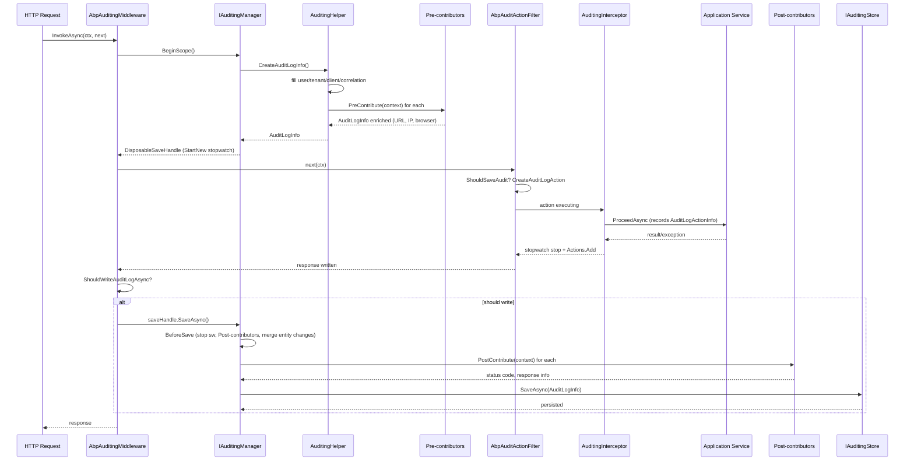

The ABP auditing pipeline turns a single HTTP request (or a single application-service call) into one `AuditLogInfo` containing the user, tenant, client, URL, HTTP status, exceptions, per-method `AuditLogActionInfo` entries and per-entity `EntityChangeInfo` rows. The mechanism is intentionally layered: a middleware (`AbpAuditingMiddleware`) opens an ambient scope, the auditing interceptor on application services records actions inside that scope, an MVC action filter appends controller actions, contributors enrich the log before/after, and the `IAuditingStore` persists it on dispose. This page walks the whole flow from `AuditingManager.BeginScope` to `IAuditingStore.SaveAsync` for an HTTP request.

The companion overview lives at [Auditing](/framework/cross-cutting/auditing); the persistence side is documented in the [Audit Logging module](/modules/audit-logging) and the HTTP pipeline order is in [HTTP Request Pipeline](/flows/http-request-pipeline).

## File inventory

| Concern | File |
| --- | --- |
| Ambient scope manager | `framework/src/Volo.Abp.Auditing/Volo/Abp/Auditing/AuditingManager.cs` |
| Log/action factory + pre-contributors | `framework/src/Volo.Abp.Auditing/Volo/Abp/Auditing/AuditingHelper.cs` |
| Interceptor for app services | `framework/src/Volo.Abp.Auditing/Volo/Abp/Auditing/AuditingInterceptor.cs` |
| Dynamic-proxy registrar | `framework/src/Volo.Abp.Auditing/Volo/Abp/Auditing/AuditingInterceptorRegistrar.cs` |
| Options + selectors | `framework/src/Volo.Abp.Auditing/Volo/Abp/Auditing/AbpAuditingOptions.cs` |
| Log DTO | `framework/src/Volo.Abp.Auditing/Volo/Abp/Auditing/AuditLogInfo.cs` |
| Action DTO | `framework/src/Volo.Abp.Auditing/Volo/Abp/Auditing/AuditLogActionInfo.cs` |
| Entity change DTO | `framework/src/Volo.Abp.Auditing/Volo/Abp/Auditing/EntityChangeInfo.cs` |
| Store contract | `framework/src/Volo.Abp.Auditing/Volo/Abp/Auditing/IAuditingStore.cs` |
| Default store (logger) | `framework/src/Volo.Abp.Auditing/Volo/Abp/Auditing/SimpleLogAuditingStore.cs` |
| HTTP middleware | `framework/src/Volo.Abp.AspNetCore/Volo/Abp/AspNetCore/Auditing/AbpAuditingMiddleware.cs` |
| HTTP contributor (URL, IP, status) | `framework/src/Volo.Abp.AspNetCore/Volo/Abp/AspNetCore/Auditing/AspNetCoreAuditLogContributor.cs` |
| MVC action filter | `framework/src/Volo.Abp.AspNetCore.Mvc/Volo/Abp/AspNetCore/Mvc/Auditing/AbpAuditActionFilter.cs` |

## Sequence — one HTTP request



## Step 1 — Middleware opens the scope

`AbpAuditingMiddleware` is registered by `app.UseAuditing()` and runs after `UseMultiTenancy`/`UseAbpClaimsMap` so `ICurrentUser` and `ICurrentTenant` are already populated. It short-circuits when auditing is disabled or the URL is ignored:

```csharp
// AbpAuditingMiddleware.cs
public async override Task InvokeAsync(HttpContext context, RequestDelegate next)
{
    if (await ShouldSkipAsync(context, next) || !AuditingOptions.IsEnabled || IsIgnoredUrl(context))
    {
        await next(context);
        return;
    }

    var hasError = false;
    using (var saveHandle = _auditingManager.BeginScope())
    {
        try { await next(context); /* ... */ }
        catch (Exception ex) { hasError = true; _auditingManager.Current.Log.Exceptions.Add(ex); throw; }
        finally
        {
            if (await ShouldWriteAuditLogAsync(_auditingManager.Current.Log, context, hasError))
            {
                if (UnitOfWorkManager.Current != null)
                    await UnitOfWorkManager.Current.SaveChangesAsync();
                await saveHandle.SaveAsync();
            }
        }
    }
}
```

Skipped paths (`AbpAspNetCoreAuditingOptions.IgnoredUrls`) and integration-service URLs (when `IsEnabledForIntegrationServices=false`) never even open a scope.

## Step 2 — `AuditingManager.BeginScope`

The manager stores the current `IAuditLogScope` in an `IAmbientScopeProvider` keyed by `"Volo.Abp.Auditing.IAuditLogScope"`. Async-flow propagation makes it safe across `await` boundaries:

```csharp
// AuditingManager.cs
public IAuditLogSaveHandle BeginScope()
{
    var ambientScope = _ambientScopeProvider.BeginScope(
        AmbientContextKey,
        new AuditLogScope(_auditingHelper.CreateAuditLogInfo())
    );

    return new DisposableSaveHandle(this, ambientScope, Current!.Log, Stopwatch.StartNew());
}
```

The returned `DisposableSaveHandle` carries the `AuditLogInfo`, the ambient `IDisposable`, and a `Stopwatch` that measures total execution duration.

## Step 3 — `AuditingHelper.CreateAuditLogInfo`

The helper builds the empty log and immediately runs **pre-contributors** so URL/IP/browser are present before any action runs:

```csharp
// AuditingHelper.cs
public virtual AuditLogInfo CreateAuditLogInfo()
{
    var auditInfo = new AuditLogInfo
    {
        ApplicationName     = Options.ApplicationName,
        TenantId            = CurrentTenant.Id,
        TenantName          = CurrentTenant.Name,
        UserId              = CurrentUser.Id,
        UserName            = CurrentUser.UserName,
        ClientId            = CurrentClient.Id,
        CorrelationId       = CorrelationIdProvider.Get(),
        ExecutionTime       = Clock.Now,
        ImpersonatorUserId  = CurrentUser.FindImpersonatorUserId(),
        // ...impersonator fields
    };

    ExecutePreContributors(auditInfo);
    return auditInfo;
}
```

`ExecutePreContributors` creates a new DI scope and walks `AbpAuditingOptions.Contributors`. The built-in `AspNetCoreAuditLogContributor` sets `HttpMethod`, `Url`, `ClientIpAddress`, and `BrowserInfo` (skipping WebSocket requests).

## Step 4 — Action filter records the controller action

`AbpAuditActionFilter` is an `IAsyncActionFilter` registered via `IAbpFilter`. It only records when (a) auditing is enabled, (b) the descriptor is a controller action, (c) a scope is already open and (d) `AuditingHelper.ShouldSaveAudit` returns true:

```csharp
// AbpAuditActionFilter.cs
if (!options.DisableLogActionInfo)
{
    auditLogAction = auditingHelper.CreateAuditLogAction(
        auditLog,
        context.ActionDescriptor.AsControllerActionDescriptor().ControllerTypeInfo.AsType(),
        context.ActionDescriptor.AsControllerActionDescriptor().MethodInfo,
        context.ActionArguments
    );
}
// ...
using (AbpCrossCuttingConcerns.Applying(context.Controller, AbpCrossCuttingConcerns.Auditing))
{
    var stopwatch = Stopwatch.StartNew();
    try { var result = await next(); /* capture exception into auditLog.Exceptions */ }
    finally { auditLogAction.ExecutionDuration = sw.Elapsed.TotalMilliseconds; auditLog.Actions.Add(auditLogAction); }
}
```

The `AbpCrossCuttingConcerns.Applying(..., Auditing)` marker is what causes the auditing interceptor to skip the same controller, so you don't get the action recorded twice.

## Step 5 — Auditing interceptor records app-service calls

`AuditingInterceptor` is wired by `AuditingInterceptorRegistrar` onto every service class for which `ShouldAuditTypeByDefaultOrNull` says "audit". It reuses the ambient scope opened by the middleware, but if there isn't one (e.g. a background worker call), it opens a new one:

```csharp
// AuditingInterceptor.cs
var auditingManager = serviceScope.ServiceProvider.GetRequiredService<IAuditingManager>();
if (auditingManager.Current != null)
{
    await ProceedByLoggingAsync(invocation, auditingOptions, auditingHelper, auditingManager.Current);
}
else
{
    await ProcessWithNewAuditingScopeAsync(invocation, auditingOptions, currentUser,
        auditingManager, auditingHelper, unitOfWorkManager);
}
```

`ProceedByLoggingAsync` builds an `AuditLogActionInfo` via `AuditingHelper.CreateAuditLogAction`, runs the actual method, measures duration on a `Stopwatch`, captures thrown exceptions into `auditLog.Exceptions`, and appends the action to `auditLog.Actions`.

`ShouldIntercept` honours the `AuditedAttribute` / `DisableAuditingAttribute` pair and skips methods already inside an `AbpCrossCuttingConcerns.Auditing` scope, so the MVC action filter wins for controller actions.

## Step 6 — Entity changes piggy-back on the same scope

The EF Core integration (`AbpDbContext.OnSaveChanges`) calls into `IAuditingManager.Current` and appends `EntityChangeInfo` records, including their `PropertyChanges`. `AuditingManager.MergeEntityChanges` collapses repeated `Updated` rows for the same `(EntityTypeFullName, EntityId)` so that one entity producing several change-tracker snapshots inside a single request collapses to one row with all property changes merged:

```csharp
// AuditingManager.cs
protected virtual void MergeEntityChanges(AuditLogInfo auditLog)
{
    var changeGroups = auditLog.EntityChanges
        .Where(e => e.ChangeType == EntityChangeType.Updated)
        .GroupBy(e => new { e.EntityTypeFullName, e.EntityId })
        .ToList();
    // first wins, subsequent merged with EntityChangeInfo.Merge
}
```

`EntityChangeInfo.Merge` overwrites `NewValue` for matching `PropertyName`s and appends extras with a counter suffix when keys collide.

## Step 7 — `ShouldWriteAuditLogAsync`

Before saving, the middleware decides whether the log is interesting enough to persist:

- Any registered `AbpAuditingOptions.AlwaysLogSelectors` returning `true` forces a save.
- If `AlwaysLogOnException` is `true` and `hasError`, the log is saved.
- Anonymous requests are skipped when `IsEnabledForAnonymousUsers` is `false`.
- GET/HEAD requests are skipped when `IsEnabledForGetRequests` is `false` (the default).

Defaults (`AbpAuditingOptions` ctor): `IsEnabled=true`, `IsEnabledForAnonymousUsers=true`, `HideErrors=true`, `AlwaysLogOnException=true`, `IsEnabledForGetRequests=false`.

## Step 8 — `SaveAsync` → `BeforeSave` → store

`DisposableSaveHandle.SaveAsync` delegates to `AuditingManager.SaveAsync`, which runs `BeforeSave` and then the store:

```csharp
// AuditingManager.cs
protected virtual void BeforeSave(DisposableSaveHandle saveHandle)
{
    saveHandle.StopWatch.Stop();
    saveHandle.AuditLog.ExecutionDuration =
        Convert.ToInt32(saveHandle.StopWatch.Elapsed.TotalMilliseconds);
    ExecutePostContributors(saveHandle.AuditLog);
    MergeEntityChanges(saveHandle.AuditLog);
}

protected virtual async Task SaveAsync(DisposableSaveHandle saveHandle)
{
    BeforeSave(saveHandle);
    await _auditingStore.SaveAsync(saveHandle.AuditLog);
}
```

Post-contributors get the final HTTP status code via `AspNetCoreAuditLogContributor.PostContribute`, which falls back to `httpContext.Response.StatusCode` when no exception was captured.

## Stores

`IAuditingStore` has a single method:

```csharp
public interface IAuditingStore { Task SaveAsync(AuditLogInfo auditInfo); }
```

The default registration is `SimpleLogAuditingStore`, which just writes `AuditLogInfo.ToString()` via `ILogger`. The Audit Logging pro module replaces this with a persistent store using `Dependency(ReplaceServices = true)` — see [Audit Logging](/modules/audit-logging).

## Configuration surface (`AbpAuditingOptions`)

| Property | Default | Effect |
| --- | --- | --- |
| `IsEnabled` | `true` | Master switch checked in middleware and interceptor |
| `IsEnabledForAnonymousUsers` | `true` | Persist logs even without an authenticated user |
| `IsEnabledForGetRequests` | `false` | Skip read-only HTTP verbs by default |
| `AlwaysLogOnException` | `true` | Persist even when other filters say "skip" |
| `IsEnabledForIntegrationServices` | `false` | Audit `[IntegrationService]` controllers / `/integration-api/` URLs |
| `DisableLogActionInfo` | `false` | Skip per-method `AuditLogActionInfo` entries |
| `HideErrors` | `true` | Swallow store failures instead of bubbling them |
| `IgnoredTypes` | `Stream`, `Expression`, `CancellationToken` | Replaced with `null` in serialized parameters |
| `Contributors` | empty | Pre/Post hooks invoked in `Helper` and `Manager` |
| `AlwaysLogSelectors` | empty | Predicates that force a save |
| `EntityHistorySelectors` | empty | Opt entities into change tracking |

## Invariants

- The ambient scope is async-safe: nested app-service calls share one `AuditLogInfo` instance.
- The action filter and interceptor both append to `auditLog.Actions`; the `AbpCrossCuttingConcerns.Auditing` marker prevents duplicates for the controller.
- `BeforeSave` stops the stopwatch before contributors run, so `ExecutionDuration` measures only the request, not the persistence I/O.
- `IAuditingStore` is invoked exactly once per scope (`SaveHandle.SaveAsync`); `Dispose()` only disposes the ambient `IDisposable`, never re-saves.
- The middleware calls `UnitOfWorkManager.Current.SaveChangesAsync()` before `SaveAsync` so entity changes are flushed into the same `AuditLogInfo` before the store writes it (see [Unit of Work](/flows/unit-of-work-lifecycle)).

## Related

<CardGroup cols={2}>
  <Card title="Auditing" href="/framework/cross-cutting/auditing">Cross-cutting overview and attributes.</Card>
  <Card title="HTTP Request Pipeline" href="/flows/http-request-pipeline">Middleware order around audit scope.</Card>
  <Card title="Unit of Work" href="/flows/unit-of-work-lifecycle">Why entity changes land inside the same scope.</Card>
  <Card title="Audit Logging Module" href="/modules/audit-logging">Persistent `IAuditingStore` implementation.</Card>
</CardGroup>
