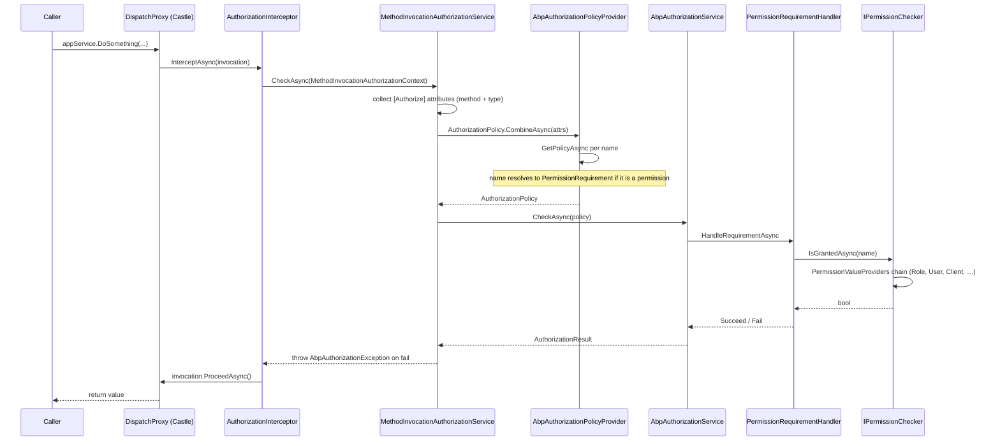
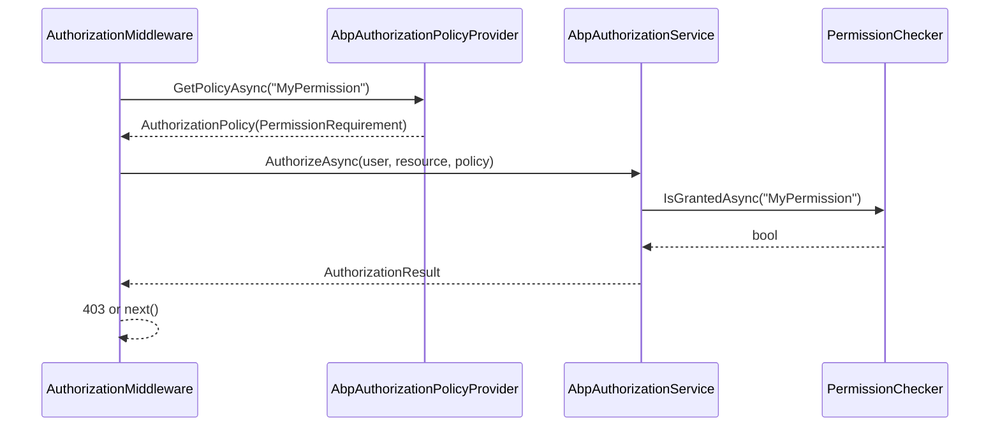

ABP layers two distinct authorization paths on top of ASP.NET Core: the standard MVC `AuthorizationMiddleware` (for controller endpoints) and a Castle/DispatchProxy-based **interceptor** (for direct application service calls and Blazor/MAUI scenarios that don't pass through MVC). Both eventually converge on `AuthorizationPolicy.CombineAsync`, `IAbpAuthorizationService.CheckAsync`, and finally `IPermissionChecker.IsGrantedAsync`. This page traces the full path of a `[Authorize("MyPermission")]` on an application service.

## End-to-end sequence



## 1. Registration: who gets intercepted?

[`AuthorizationInterceptorRegistrar`](https://github.com/abpframework/abp/blob/dev/framework/src/Volo.Abp.Authorization/Volo/Abp/Authorization/AuthorizationInterceptorRegistrar.cs) is hooked into the DI registration pipeline via `IOnServiceRegistredContext`:

```csharp
public static void RegisterIfNeeded(IOnServiceRegistredContext context)
{
    if (ShouldIntercept(context.ImplementationType))
    {
        context.Interceptors.TryAdd<AuthorizationInterceptor>();
    }
}

private static bool ShouldIntercept(Type type)
{
    return !DynamicProxyIgnoreTypes.Contains(type) &&
           (type.IsDefined(typeof(AuthorizeAttribute), true) || AnyMethodHasAuthorizeAttribute(type));
}
```

A type is intercepted when either the class or any method carries `[Authorize]` (or any subclass — e.g. `[AbpAuthorize]`). This is why `ApplicationService` base classes typically pick up authorization automatically: the `[Authorize]` is declared on a method, the registrar adds the interceptor, and every call goes through it.

`AbpInterceptionService` then wires the interceptor pipeline based on the DI provider (Castle for the Autofac integration, the in-box DispatchProxy implementation for the default Microsoft container).

## 2. Inside the interceptor

[`AuthorizationInterceptor`](https://github.com/abpframework/abp/blob/dev/framework/src/Volo.Abp.Authorization/Volo/Abp/Authorization/AuthorizationInterceptor.cs) is intentionally tiny — it just delegates to `IMethodInvocationAuthorizationService`:

```csharp
public override async Task InterceptAsync(IAbpMethodInvocation invocation)
{
    await AuthorizeAsync(invocation);
    await invocation.ProceedAsync();
}

protected virtual async Task AuthorizeAsync(IAbpMethodInvocation invocation)
{
    await _methodInvocationAuthorizationService.CheckAsync(
        new MethodInvocationAuthorizationContext(invocation.Method));
}
```

If `CheckAsync` throws `AbpAuthorizationException`, `ProceedAsync` is never called and the exception bubbles up to the caller — or to `AbpExceptionHandlingMiddleware` for HTTP requests.

## 3. Collecting authorization attributes

[`MethodInvocationAuthorizationService`](https://github.com/abpframework/abp/blob/dev/framework/src/Volo.Abp.Authorization/Volo/Abp/Authorization/MethodInvocationAuthorizationService.cs) does three things:

```csharp
public virtual async Task CheckAsync(MethodInvocationAuthorizationContext context)
{
    if (AllowAnonymous(context)) return;

    var authorizationPolicy = await AuthorizationPolicy.CombineAsync(
        _abpAuthorizationPolicyProvider,
        GetAuthorizationDataAttributes(context.Method));

    if (authorizationPolicy == null) return;

    await _abpAuthorizationService.CheckAsync(authorizationPolicy);
}
```

- **AllowAnonymous short-circuits.** Any `[AllowAnonymous]` (or subclass implementing `IAllowAnonymous`) on the method causes immediate success.
- **Attribute discovery merges method + type.** `GetAuthorizationDataAttributes` unions attributes from the method and from the declaring class **only for public methods**:

```csharp
protected virtual IEnumerable<IAuthorizeData> GetAuthorizationDataAttributes(MethodInfo methodInfo)
{
    var attributes = methodInfo.GetCustomAttributes(true).OfType<IAuthorizeData>();
    if (methodInfo.IsPublic && methodInfo.DeclaringType != null)
    {
        attributes = attributes.Union(
            methodInfo.DeclaringType.GetCustomAttributes(true).OfType<IAuthorizeData>());
    }
    return attributes;
}
```

- **Policy combination** uses ASP.NET Core's standard `AuthorizationPolicy.CombineAsync`, which merges requirements (`PermissionRequirement`, roles, schemes, etc.) into a single policy.

## 4. Policy resolution: permission names *become* policies

[`AbpAuthorizationPolicyProvider`](https://github.com/abpframework/abp/blob/dev/framework/src/Volo.Abp.Authorization/Volo/Abp/Authorization/AbpAuthorizationPolicyProvider.cs) extends ASP.NET's `DefaultAuthorizationPolicyProvider`:

```csharp
public override async Task<AuthorizationPolicy?> GetPolicyAsync(string policyName)
{
    var policy = await base.GetPolicyAsync(policyName);
    if (policy != null) return policy;

    var permission = await _permissionDefinitionManager.GetOrNullAsync(policyName);
    if (permission != null)
    {
        var policyBuilder = new AuthorizationPolicyBuilder(Array.Empty<string>());
        policyBuilder.Requirements.Add(new PermissionRequirement(policyName));
        return policyBuilder.Build();
    }

    if ((await _permissionDefinitionManager.GetResourcePermissionsAsync()).Any(x => x.Name == policyName))
    {
        var policyBuilder = new AuthorizationPolicyBuilder(Array.Empty<string>());
        policyBuilder.Requirements.Add(new ResourcePermissionRequirement(policyName));
        return policyBuilder.Build();
    }

    return null;
}
```

This is the magic that lets `[Authorize("MyPermission")]` work without registering a policy: if a permission with that name was declared via `IPermissionDefinitionProvider`, ABP synthesises a policy carrying a `PermissionRequirement`. The class also handles resource-scoped permissions (`ResourcePermissionRequirement`) used by features like CMS Kit page permissions.

`GetPoliciesNamesAsync()` is used by tooling to enumerate every policy — both built-in ASP.NET ones and ABP-permission names.

## 5. Running the policy

[`AbpAuthorizationService`](https://github.com/abpframework/abp/blob/dev/framework/src/Volo.Abp.Authorization/Volo/Abp/Authorization/AbpAuthorizationService.cs) replaces ASP.NET's `DefaultAuthorizationService` (`[Dependency(ReplaceServices = true)]`) and exposes one extra method: `CurrentPrincipal => _currentPrincipalAccessor.Principal`. The base behaviour is unchanged — `AuthorizeAsync(principal, resource, policy)` evaluates requirements via handlers — but using `ICurrentPrincipalAccessor` means non-HTTP callers (background workers, IDistributedEventHandlers) can `using (CurrentPrincipalAccessor.Change(principal)) { ... }` and authorization still works.

`CheckAsync(policy)` is the convenience overload: it calls `AuthorizeAsync` against the current principal and **throws `AbpAuthorizationException`** if the result is not succeeded:

```csharp
public static async Task CheckAsync(this IAuthorizationService authorizationService, ...)
{
    var result = await authorizationService.AuthorizeAsync(...);
    if (!result.Succeeded) throw new AbpAuthorizationException("Authorization failed!");
}
```

`AbpExceptionHandlingMiddleware` later translates this to HTTP 403 (with the ABP error envelope when the request expects JSON).

## 6. `PermissionRequirement` → `IPermissionChecker`

`PermissionRequirementHandler` (transient, lives next to the requirement type) resolves `IPermissionChecker` and asks `IsGrantedAsync(requirement.Name)`. The default implementation is [`PermissionChecker`](https://github.com/abpframework/abp/blob/dev/framework/src/Volo.Abp.Authorization/Volo/Abp/Authorization/Permissions/PermissionChecker.cs):

```csharp
public virtual async Task<bool> IsGrantedAsync(ClaimsPrincipal? claimsPrincipal, string name)
{
    var permission = await PermissionDefinitionManager.GetOrNullAsync(name);
    if (permission == null) return false;
    if (!permission.IsEnabled) return false;
    if (!await StateCheckerManager.IsEnabledAsync(permission)) return false;

    var multiTenancySide = claimsPrincipal?.GetMultiTenancySide() ?? CurrentTenant.GetMultiTenancySide();
    if (!permission.MultiTenancySide.HasFlag(multiTenancySide)) return false;

    var isGranted = false;
    var context = new PermissionValueCheckContext(permission, claimsPrincipal);
    foreach (var provider in PermissionValueProviderManager.ValueProviders)
    {
        if (context.Permission.Providers.Any() && !context.Permission.Providers.Contains(provider.Name)) continue;

        var result = await provider.CheckAsync(context);
        if (result == PermissionGrantResult.Granted) isGranted = true;
        else if (result == PermissionGrantResult.Prohibited) return false;
    }
    return isGranted;
}
```

Each gate is meaningful:

| Gate | Effect when false |
|------|-------------------|
| `IsEnabled` | Permission was explicitly disabled (admin can switch off a whole feature). |
| `StateCheckerManager.IsEnabledAsync` | Lets `RequirePermissionsSimpleStateChecker` (and feature-flag checkers) disable a permission when other permissions aren't granted, or when a global feature is off. |
| `MultiTenancySide.HasFlag(side)` | Permission was declared host-only but a tenant user is asking, or vice versa. |
| Value provider chain | The actual grant lookup — Role/User/Client/Anonymous/etc. |

The value providers are registered via `AbpPermissionOptions.ValueProviders`. The Permission Management module ships:

- `UserPermissionValueProvider`
- `RolePermissionValueProvider`
- `ClientPermissionValueProvider`
- `AnonymousPermissionValueProvider` (only checks definitions, never grants)

The order matters because **`Prohibited` short-circuits**. A role explicitly prohibiting a permission overrides a user-level grant unless the user provider runs first (it does in the default registration).

## 7. Web API: how the MVC pipeline reaches the same checker

When a controller action is invoked through ASP.NET's standard `AuthorizationMiddleware`, the framework already discovers `[Authorize]` policies via the same `AbpAuthorizationPolicyProvider` (registered as `IAuthorizationPolicyProvider`). So:



If the controller method is *also* on an application service interface (the usual ABP pattern), the interceptor will run as well, but `MethodInvocationAuthorizationService.CheckAsync` will pass because the policy already succeeded — no double cost beyond attribute discovery.

## 8. Imperative checks

You can short-circuit the attribute path entirely by injecting `IAuthorizationService` (the ABP one) and calling:

```csharp
await _authorizationService.CheckAsync("MyPermission");           // throws if denied
var granted = await _authorizationService.IsGrantedAsync("MyPermission");
```

Both helpers go through `AbpAuthorizationService` → `PermissionChecker` and respect the same multi-tenancy and feature gates.

For permission-only checks without a policy, use `IPermissionChecker.IsGrantedAsync(name)` directly — it skips the policy combination overhead. The extensions in `AuthorizationServiceExtensions` also support resource-based authorization (`AuthorizeAsync(user, resource, policy)`) used by `ResourcePermissionRequirement`.

## 9. Authorization in non-HTTP contexts

Background workers and event handlers don't have a `ClaimsPrincipal` on `HttpContext.User`. ABP exposes `ICurrentPrincipalAccessor.Change(principal)` to push a principal onto the async-local stack:

```csharp
using (_currentPrincipalAccessor.Change(impersonationPrincipal))
{
    await _someAppService.DoProtectedThingAsync();
}
```

Because `AbpAuthorizationService.CurrentPrincipal` reads through the accessor, every gate above keeps working.

## Failure modes

- **`AbpAuthorizationException` from anonymous caller** → HTTP 401 (the exception handler upgrades 403 to 401 when there is no authenticated user).
- **Permission name typo** → `GetPolicyAsync` returns null, `CombineAsync` succeeds with a no-op policy, the check passes silently. Run the Permission Management dashboard or `GetPoliciesNamesAsync()` to validate that names match.
- **Wrong tenant side** → Permission is defined `MultiTenancySide.Host` but a tenant user calls; `PermissionChecker` returns false. Configure with `permission.MultiTenancySide = MultiTenancySide.Both` if the resource is shared.
- **Prohibited wins** → A role's grant of `Prohibited` blocks even host admins. Inspect the `AbpPermissionGrants` table or `IPermissionGrantRepository` to debug.

## Related pages

- [/framework/cross-cutting/authorization](/framework/cross-cutting/authorization) — defining permissions, providers, and policies.
- [/flows/http-request-pipeline](/flows/http-request-pipeline) — where `UseAuthorization` sits in the middleware stack.
- [/flows/audit-log-pipeline](/flows/audit-log-pipeline) — failed authorization is recorded as part of the audit log via captured exceptions.
- [/framework/core/aspects-and-interceptors](/framework/core/aspects-and-interceptors) — how `AuthorizationInterceptor` is registered alongside `UnitOfWorkInterceptor`/`AuditingInterceptor`.
