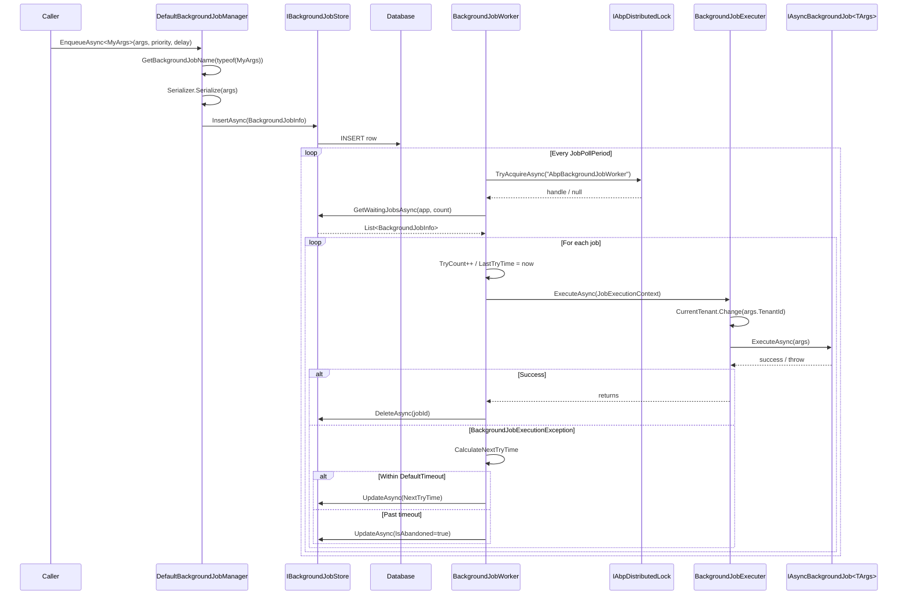

ABP's built-in background job system is a database-backed queue with a polling worker. Producers call `IBackgroundJobManager.EnqueueAsync`, which persists a `BackgroundJobInfo` row. A background worker (`BackgroundJobWorker`) polls the store every few seconds, grabs the next waiting batch under a distributed lock, and runs each through `BackgroundJobExecuter`. Failed jobs are re-tried with exponential backoff until the configured timeout. This page traces both halves of that flow.

The relevant source lives under [`framework/src/Volo.Abp.BackgroundJobs`](https://github.com/abpframework/abp/tree/dev/framework/src/Volo.Abp.BackgroundJobs) and `framework/src/Volo.Abp.BackgroundJobs.Abstractions`.

## End-to-end sequence



## 1. Enqueueing a job

[`DefaultBackgroundJobManager`](https://github.com/abpframework/abp/blob/dev/framework/src/Volo.Abp.BackgroundJobs/Volo/Abp/BackgroundJobs/DefaultBackgroundJobManager.cs) is the default `IBackgroundJobManager`:

```csharp
public virtual async Task<string> EnqueueAsync<TArgs>(TArgs args, BackgroundJobPriority priority = BackgroundJobPriority.Normal, TimeSpan? delay = null)
{
    var jobName = BackgroundJobOptions.Value.GetBackgroundJobName(typeof(TArgs));
    var jobId = await EnqueueAsync(jobName, args!, priority, delay);
    return jobId.ToString();
}

protected virtual async Task<Guid> EnqueueAsync(string jobName, object args, BackgroundJobPriority priority = BackgroundJobPriority.Normal, TimeSpan? delay = null)
{
    var jobInfo = new BackgroundJobInfo
    {
        Id = GuidGenerator.Create(),
        ApplicationName = BackgroundJobWorkerOptions.Value.ApplicationName,
        JobName = jobName,
        JobArgs = Serializer.Serialize(args),
        Priority = priority,
        CreationTime = Clock.Now,
        NextTryTime = Clock.Now
    };

    if (delay.HasValue)
    {
        jobInfo.NextTryTime = Clock.Now.Add(delay.Value);
    }

    await Store.InsertAsync(jobInfo);
    return jobInfo.Id;
}
```

What you should notice:

- **Job name resolution.** `AbpBackgroundJobOptions.GetBackgroundJobName(typeof(TArgs))` resolves the registered job (`AddJob<MyJob>()`) by its `TArgs` type. The `[BackgroundJobName("...")]` attribute on the args class overrides the default `FullName`.
- **Application name partitioning.** `BackgroundJobInfo.ApplicationName` is set from `AbpBackgroundJobWorkerOptions.ApplicationName`. The worker only fetches rows for its own application name (so a single DB can be shared by multiple deployments).
- **Args are serialized to a string** via `IBackgroundJobSerializer` ([`JsonBackgroundJobSerializer`](https://github.com/abpframework/abp/blob/dev/framework/src/Volo.Abp.BackgroundJobs/Volo/Abp/BackgroundJobs/JsonBackgroundJobSerializer.cs) by default). Avoid embedding non-serializable references; pass IDs and resolve services inside the job.
- **`delay` shifts `NextTryTime`** — the worker only fetches rows whose `NextTryTime <= now`, so a scheduled job sleeps until then.
- The method **returns the job id** so callers can correlate against the DB.

`InsertAsync` runs inside the caller's UoW. If you `EnqueueAsync` from an application service, the row is committed atomically with the rest of your changes — the job will not run unless the producing transaction succeeded.

## 2. Registering job handlers

Job handlers implement `IAsyncBackgroundJob<TArgs>` (or the sync `IBackgroundJob<TArgs>`):

```csharp
public class SendEmailJob : AsyncBackgroundJob<SendEmailArgs>, ITransientDependency
{
    public override async Task ExecuteAsync(SendEmailArgs args) { ... }
}
```

Modules call `Configure<AbpBackgroundJobOptions>(opt => opt.AddJob<SendEmailJob>())`. The options class indexes jobs by name and stores the runtime `JobType` plus `ArgsType` — both consulted by the worker.

## 3. The worker

[`BackgroundJobWorker`](https://github.com/abpframework/abp/blob/dev/framework/src/Volo.Abp.BackgroundJobs/Volo/Abp/BackgroundJobs/BackgroundJobWorker.cs) extends `AsyncPeriodicBackgroundWorkerBase`. Its `Timer.Period` is set from [`AbpBackgroundJobWorkerOptions`](https://github.com/abpframework/abp/blob/dev/framework/src/Volo.Abp.BackgroundJobs/Volo/Abp/BackgroundJobs/AbpBackgroundJobWorkerOptions.cs) (5 seconds by default).

```csharp
protected override async Task DoWorkAsync(PeriodicBackgroundWorkerContext workerContext)
{
    await using (var handler = await DistributedLock.TryAcquireAsync(WorkerOptions.DistributedLockName, cancellationToken: StoppingToken))
    {
        if (handler != null)
        {
            var store = workerContext.ServiceProvider.GetRequiredService<IBackgroundJobStore>();
            var waitingJobs = await store.GetWaitingJobsAsync(WorkerOptions.ApplicationName, WorkerOptions.MaxJobFetchCount);
            if (!waitingJobs.Any()) return;

            var jobExecuter = workerContext.ServiceProvider.GetRequiredService<IBackgroundJobExecuter>();
            var clock = workerContext.ServiceProvider.GetRequiredService<IClock>();
            var serializer = workerContext.ServiceProvider.GetRequiredService<IBackgroundJobSerializer>();

            foreach (var jobInfo in waitingJobs)
            {
                jobInfo.TryCount++;
                jobInfo.LastTryTime = clock.Now;

                try
                {
                    var jobConfiguration = JobOptions.GetJob(jobInfo.JobName);
                    var jobArgs = serializer.Deserialize(jobInfo.JobArgs, jobConfiguration.ArgsType);
                    var context = new JobExecutionContext(
                        workerContext.ServiceProvider,
                        jobConfiguration.JobType,
                        jobArgs,
                        workerContext.CancellationToken);

                    try
                    {
                        await jobExecuter.ExecuteAsync(context);
                        await store.DeleteAsync(jobInfo.Id);
                    }
                    catch (BackgroundJobExecutionException)
                    {
                        var nextTryTime = CalculateNextTryTime(jobInfo, clock);
                        if (nextTryTime.HasValue) jobInfo.NextTryTime = nextTryTime.Value;
                        else                      jobInfo.IsAbandoned = true;
                        await TryUpdateAsync(store, jobInfo);
                    }
                }
                catch (Exception ex)
                {
                    Logger.LogException(ex);
                    jobInfo.IsAbandoned = true;
                    await TryUpdateAsync(store, jobInfo);
                }
            }
        }
        else
        {
            try { await Task.Delay(WorkerOptions.JobPollPeriod * 12, StoppingToken); }
            catch (TaskCanceledException) { }
        }
    }
}
```

Key invariants:

- **Distributed lock**, default name `AbpBackgroundJobWorker`. Without an Redis/SqlServer distributed lock module, the in-memory implementation makes the lock local to the process — fine for a single instance but you'll process every job twice if you scale out.
- **Pull, don't push.** `GetWaitingJobsAsync(applicationName, count)` is the only contract for the store — the contract (documented on `IBackgroundJobStore`) is to return up to `MaxJobFetchCount` (default 1000) rows where `ApplicationName == applicationName && !IsAbandoned && NextTryTime <= Clock.Now`, ordered by `Priority DESC, TryCount ASC, NextTryTime ASC`.
- **TryCount/LastTryTime updated before execution.** If the process crashes mid-execution the next poll sees the incremented count and uses the backoff schedule.
- **Successful jobs are deleted, not marked.** Persistence is intentionally short-lived; if you need audit history of executed jobs, write your own log inside the job.
- **`BackgroundJobExecutionException` is the retry signal.** Anything else escaping the executer marks the job `IsAbandoned`.
- **Backoff:** `CalculateNextTryTime` uses `DefaultFirstWaitDuration * Pow(DefaultWaitFactor, tryCount - 1)`. Defaults: 60 s, 2.0 → 60, 120, 240, 480 s. Capped by `DefaultTimeout` (default 172,800 s = 2 days).

## 4. The executer

[`BackgroundJobExecuter`](https://github.com/abpframework/abp/blob/dev/framework/src/Volo.Abp.BackgroundJobs.Abstractions/Volo/Abp/BackgroundJobs/BackgroundJobExecuter.cs) is the place where ABP cross-cutting concerns intersect with your handler:

```csharp
public virtual async Task ExecuteAsync(JobExecutionContext context)
{
    var job = context.ServiceProvider.GetService(context.JobType);
    if (job == null) throw new AbpException("The job type is not registered to DI: " + context.JobType);

    var jobExecuteMethod = context.JobType.GetMethod(nameof(IBackgroundJob<object>.Execute)) ??
                           context.JobType.GetMethod(nameof(IAsyncBackgroundJob<object>.ExecuteAsync));
    if (jobExecuteMethod == null) throw new AbpException(...);

    try
    {
        using (CurrentTenant.Change(GetJobArgsTenantId(context.JobArgs)))
        {
            var cancellationTokenProvider = context.ServiceProvider.GetRequiredService<ICancellationTokenProvider>();
            using (cancellationTokenProvider.Use(context.CancellationToken))
            {
                if (jobExecuteMethod.Name == nameof(IAsyncBackgroundJob<object>.ExecuteAsync))
                    await ((Task)jobExecuteMethod.Invoke(job, new[] { context.JobArgs })!);
                else
                    jobExecuteMethod.Invoke(job, new[] { context.JobArgs });
            }
        }
    }
    catch (Exception ex)
    {
        Logger.LogException(ex);
        await context.ServiceProvider.GetRequiredService<IExceptionNotifier>().NotifyAsync(new ExceptionNotificationContext(ex));
        throw new BackgroundJobExecutionException(...) { JobType = ..., JobArgs = context.JobArgs };
    }
}

protected virtual Guid? GetJobArgsTenantId(object jobArgs) => jobArgs switch
{
    IMultiTenant multiTenantJobArgs => multiTenantJobArgs.TenantId,
    _ => CurrentTenant.Id
};
```

Three things to note:

- **Tenant propagation.** If `TArgs` implements `IMultiTenant`, the executer pushes the tenant scope. The job sees `ICurrentTenant.Id == args.TenantId` for its entire run. This is also how the data filter for `IMultiTenant` entities gets applied automatically.
- **Cancellation propagation.** The worker's `StoppingToken` is registered through `ICancellationTokenProvider`, so any service inside the job that respects `CancellationTokenProvider.Token` cooperates with graceful shutdown.
- **Exception notifier.** Even though the worker re-tries, the executer raises an `IExceptionNotifier` event so logging/alerting modules (e.g. `Volo.Abp.ExceptionHandling.Notifiers`) see the failure on the first attempt — not just after `IsAbandoned = true`.

The wrapping `BackgroundJobExecutionException` carries the original via `InnerException`. The worker inspects only the wrapper to decide whether to retry.

## 5. The store

`IBackgroundJobStore` is implemented per provider:

| Implementation | Module | Notes |
|----------------|--------|-------|
| `InMemoryBackgroundJobStore` | `Volo.Abp.BackgroundJobs` | Default — pure memory. Useful for tests, not for production. |
| `EfCoreBackgroundJobStore` | `Volo.Abp.BackgroundJobs.EntityFrameworkCore` | EF Core, persists `AbpBackgroundJobs` table. |
| `MongoBackgroundJobStore` | `Volo.Abp.BackgroundJobs.MongoDB` | Mongo equivalent. |

The contract (`framework/src/Volo.Abp.BackgroundJobs/Volo/Abp/BackgroundJobs/IBackgroundJobStore.cs`) exposes only `InsertAsync`, `GetWaitingJobsAsync`, `UpdateAsync`, `DeleteAsync`. There is no separate "in-flight" state — concurrency is handled by the worker's distributed lock.

## 6. Choosing a provider

ABP also ships an alternative manager backed by Hangfire (`Volo.Abp.BackgroundJobs.Hangfire`) and Quartz (`Volo.Abp.BackgroundJobs.Quartz`). When those modules are added, the IoC container's `IBackgroundJobManager` is replaced with a Hangfire/Quartz adapter and the polling worker is disabled. Your `EnqueueAsync` callsite stays identical.

The built-in implementation is best for:

- Small/medium workloads (a few hundred jobs/minute).
- Apps that don't want an extra dependency.
- Tests, where `InMemoryBackgroundJobStore` makes assertions easy.

Hangfire is the right pick when you need a dashboard, fan-out workers, or cron-like recurring jobs. See [/framework/background/background-jobs](/framework/background/background-jobs).

## 7. Options reference

| Option | Default | Effect |
|--------|---------|--------|
| `ApplicationName` | null | Logical partition; rows are tagged and only matching workers pick them up. |
| `JobPollPeriod` | 5000 ms | Worker tick interval. |
| `MaxJobFetchCount` | 1000 | Upper bound per tick. |
| `DefaultFirstWaitDuration` | 60 s | First retry delay. |
| `DefaultTimeout` | 172,800 s (2 days) | Absolute abandon threshold. |
| `DefaultWaitFactor` | 2.0 | Exponential backoff multiplier. |
| `DistributedLockName` | `AbpBackgroundJobWorker` | Mutex name. Change when running multiple isolated workers in the same database. |

`AbpBackgroundJobOptions` (abstractions side) has:

- `AddJob<TJob>()` — register a handler.
- `IsJobExecutionEnabled` — set to false on producer-only nodes (workers won't start polling but `Enqueue` still works).

## Failure modes

- **Jobs never execute.** Either the producing UoW didn't commit (`Enqueue` from inside a UoW that rolled back), or `IsJobExecutionEnabled = false`, or the distributed lock is held by another dead process.
- **`AbpException: The job type is not registered to DI`.** Job class is missing `[Dependency]` or not in an assembly scanned by ABP. Implement `ITransientDependency` or call `services.AddTransient<TJob>()` manually.
- **`IsAbandoned = true` after first failure.** The handler threw something other than `BackgroundJobExecutionException` and the worker's outer catch labelled it abandoned. Wrap your code so transient errors throw `BackgroundJobExecutionException`.
- **Tenant data filter off.** Make sure `TArgs : IMultiTenant`; otherwise the executer keeps the worker's tenant (typically host = null).

## Related pages

- [/framework/background/background-jobs](/framework/background/background-jobs) — provider matrix, dashboard support, recurring jobs.
- [/flows/unit-of-work-lifecycle](/flows/unit-of-work-lifecycle) — why the `InsertAsync` happens transactionally.
- [/flows/distributed-event-publish](/flows/distributed-event-publish) — similar polling/lock pattern used for the outbox.
- [/framework/infra/distributed-locking](/framework/infra/distributed-locking) — production lock providers.
