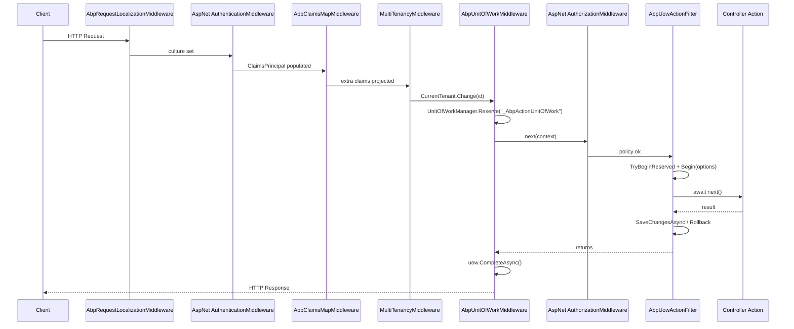

An ABP web host stacks several ABP-specific middlewares on top of the standard ASP.NET Core ones. Order matters: tenant resolution depends on a working `ClaimsPrincipal`, the per-request unit of work must be reserved before MVC action filters try to begin it, and audit scopes must wrap the UoW so save handles see populated state. This page traces the canonical pipeline you get from the templates and the ABP API surface (`UseAbpRequestLocalization`, `UseAuthentication`, `UseAbpClaimsMap`, `UseMultiTenancy`, `UseUnitOfWork`, `UseAuthorization`, endpoints) end-to-end.

The extension methods themselves live in [`AbpApplicationBuilderExtensions`](https://github.com/abpframework/abp/blob/dev/framework/src/Volo.Abp.AspNetCore/Microsoft/AspNetCore/Builder/AbpApplicationBuilderExtensions.cs).

## Sequence



## 1. `UseAbpRequestLocalization`

```csharp
// AbpApplicationBuilderExtensions.cs
public static IApplicationBuilder UseAbpRequestLocalization(this IApplicationBuilder app,
    Action<RequestLocalizationOptions>? optionsAction = null)
{
    app.ApplicationServices
        .GetRequiredService<IAbpRequestLocalizationOptionsProvider>()
        .InitLocalizationOptions(optionsAction);

    return app.UseMiddleware<AbpRequestLocalizationMiddleware>();
}
```

The provider lazily builds `RequestLocalizationOptions` from `AbpLocalizationOptions.Languages` (so tenant-defined cultures contribute) and the middleware then behaves like the ASP.NET `RequestLocalizationMiddleware` — selecting culture via query string, cookie, header, or `Accept-Language`. The picked culture is stored on the `IRequestCultureFeature` so downstream middlewares can read it.

The tenant middleware later checks this feature to decide whether to override culture from a tenant default — see step 4.

## 2. `UseAuthentication`

This is the standard ASP.NET Core middleware. ABP only contributes by registering identity/JWT/OpenIddict handlers in modules — there is no ABP-specific replacement. After this step:

- `HttpContext.User` is set.
- `ICurrentPrincipalAccessor.Principal` (a transient that proxies through `IHttpContextAccessor`) yields that principal.

If you use OpenIddict or IdentityServer modules, the access token's claims (e.g. `tenantid`, `sub`) live on `HttpContext.User` from this point onwards.

## 3. `UseAbpClaimsMap` (legacy) / `TransformAbpClaims`

The original `UseAbpClaimsMap` middleware ([`AbpClaimsMapMiddleware`](https://github.com/abpframework/abp/blob/dev/framework/src/Volo.Abp.AspNetCore/Volo/Abp/AspNetCore/Security/Claims/AbpClaimsMapMiddleware.cs)) is now marked `[Obsolete("Use the TransformAbpClaims extension method from IServiceCollection instead.")]` but is still on the application builder for backward compatibility:

```csharp
public async override Task InvokeAsync(HttpContext context, RequestDelegate next)
{
    var currentPrincipalAccessor = context.RequestServices.GetRequiredService<ICurrentPrincipalAccessor>();
    var mapOptions = context.RequestServices.GetRequiredService<IOptions<AbpClaimsMapOptions>>().Value;

    var mapClaims = currentPrincipalAccessor.Principal.Claims
        .Where(claim => mapOptions.Maps.Keys.Contains(claim.Type));

    currentPrincipalAccessor.Principal.AddIdentity(
        new ClaimsIdentity(
            mapClaims.Select(c => new Claim(mapOptions.Maps[c.Type](), c.Value, c.ValueType, c.Issuer))));

    await next(context);
}
```

It reads `AbpClaimsMapOptions.Maps` — a `Dictionary<string, Func<string>>` that the framework uses to project standard tokens (e.g. `sub` → `ClaimTypes.NameIdentifier`, `preferred_username` → `ClaimTypes.Name`) onto ABP's expected claim names. Newer apps use the `TransformAbpClaims` claim transformer (registered into `IClaimsTransformation`) which runs inside the authentication middleware itself.

By the end of this step `ICurrentUser` will resolve identity, tenant id, roles, and impersonator info from the augmented principal.

## 4. `UseMultiTenancy`

[`MultiTenancyMiddleware`](https://github.com/abpframework/abp/blob/dev/framework/src/Volo.Abp.AspNetCore.MultiTenancy/Volo/Abp/AspNetCore/MultiTenancy/MultiTenancyMiddleware.cs) is the bridge between the resolver chain and the ambient `ICurrentTenant`:

```csharp
public async override Task InvokeAsync(HttpContext context, RequestDelegate next)
{
    TenantConfiguration? tenant = null;
    try
    {
        tenant = await _tenantConfigurationProvider.GetAsync(saveResolveResult: true);
    }
    catch (Exception e)
    {
        Logger.LogException(e);
        if (await _options.MultiTenancyMiddlewareErrorPageBuilder(context, e)) return;
    }

    if (tenant?.Id != _currentTenant.Id)
    {
        using (_currentTenant.Change(tenant?.Id, tenant?.Name))
        {
            if (_tenantResolveResultAccessor.Result != null &&
                _tenantResolveResultAccessor.Result.AppliedResolvers.Contains(QueryStringTenantResolveContributor.ContributorName))
            {
                AbpMultiTenancyCookieHelper.SetTenantCookie(context, _currentTenant.Id, _options.TenantKey);
            }

            var requestCulture = await TryGetRequestCultureAsync(context);
            if (requestCulture != null)
            {
                CultureInfo.CurrentCulture = requestCulture.Culture;
                CultureInfo.CurrentUICulture = requestCulture.UICulture;
                AbpRequestCultureCookieHelper.SetCultureCookie(context, requestCulture);
                context.Items[AbpRequestLocalizationMiddleware.HttpContextItemName] = true;
            }

            await next(context);
        }
    }
    else
    {
        await next(context);
    }
}
```

Three things are happening:

1. `ITenantConfigurationProvider.GetAsync` runs the resolver chain (query string → route → header → cookie → current user — see [/flows/tenant-resolution-flow](/flows/tenant-resolution-flow)).
2. If the resolved tenant differs from the ambient one, `_currentTenant.Change(id, name)` pushes a new `BasicTenantInfo` onto the `AsyncLocal` and `using` ensures it is restored on the way back up.
3. If the tenant came from a query string, a cookie is set so subsequent requests bypass the slow path. If `RequestLocalizationMiddleware` didn't already pick a culture and the tenant has a default language setting, the culture is overridden here.

After this step `ICurrentTenant.Id` is authoritative for the rest of the pipeline.

## 5. `UseUnitOfWork`

`UseUnitOfWork` chains `UseAbpExceptionHandling` first (idempotent — guarded by a marker key) and then registers [`AbpUnitOfWorkMiddleware`](https://github.com/abpframework/abp/blob/dev/framework/src/Volo.Abp.AspNetCore/Volo/Abp/AspNetCore/Uow/AbpUnitOfWorkMiddleware.cs):

```csharp
public async override Task InvokeAsync(HttpContext context, RequestDelegate next)
{
    if (await ShouldSkipAsync(context, next) || IsIgnoredUrl(context))
    {
        await next(context);
        return;
    }

    using (var uow = _unitOfWorkManager.Reserve(UnitOfWork.UnitOfWorkReservationName))
    {
        await next(context);
        await uow.CompleteAsync(_cancellationTokenProvider.Token);
    }
}
```

Key facts:

- The reservation name is the public constant `UnitOfWork.UnitOfWorkReservationName = "_AbpActionUnitOfWork"`.
- `Reserve` only **allocates** a UoW; it does not `Initialize` it. The UoW does not become "active" (with options, isolation level, etc.) until something — typically `AbpUowActionFilter` — calls `TryBeginReserved`.
- Blazor server endpoints set `RootComponentMetadata`; `ShouldSkipAsync` short-circuits those because each component renders in its own async flow.
- `_options.IgnoredUrls` (from `AbpAspNetCoreUnitOfWorkOptions`) lets you opt out per path prefix.

If the action filter never begins the reservation (e.g. non-MVC endpoints), `CompleteAsync` is still safe — `UnitOfWork.CompleteAsync` just iterates the active database APIs, which is empty.

## 6. `UseAuthorization`

Standard ASP.NET middleware. ABP plugs in `AbpAuthorizationPolicyProvider` (see [/flows/authorization-pipeline](/flows/authorization-pipeline)) so policy names matching a permission produce a `PermissionRequirement`. The handler resolves `IPermissionChecker` per request — and that checker honours the `ICurrentTenant` and `ICurrentUser` set by the previous middlewares.

Authorization runs **after** UoW reservation so that authorization handlers can perform queries inside the same DI scope.

## 7. MVC action filters — the inner UoW lifecycle

`UseRouting` + `UseEndpoints` (or `MapControllers`) execute MVC, which runs ABP's filters. The relevant one is [`AbpUowActionFilter`](https://github.com/abpframework/abp/blob/dev/framework/src/Volo.Abp.AspNetCore.Mvc/Volo/Abp/AspNetCore/Mvc/Uow/AbpUowActionFilter.cs):

```csharp
public async Task OnActionExecutionAsync(ActionExecutingContext context, ActionExecutionDelegate next)
{
    if (!context.ActionDescriptor.IsControllerAction()) { await next(); return; }

    var methodInfo = context.ActionDescriptor.GetMethodInfo();
    var unitOfWorkAttr = UnitOfWorkHelper.GetUnitOfWorkAttributeOrNull(methodInfo);

    context.HttpContext.Items["_AbpActionInfo"] = new AbpActionInfoInHttpContext
    {
        IsObjectResult = context.ActionDescriptor.HasObjectResult()
    };

    if (unitOfWorkAttr?.IsDisabled == true) { await next(); return; }

    var options = CreateOptions(context, unitOfWorkAttr);
    var unitOfWorkManager = context.GetRequiredService<IUnitOfWorkManager>();
    var cancellationTokenProvider = context.GetRequiredService<ICancellationTokenProvider>();

    if (unitOfWorkManager.TryBeginReserved(UnitOfWork.UnitOfWorkReservationName, options))
    {
        var result = await next();
        if (Succeed(result)) await SaveChangesAsync(context, unitOfWorkManager, cancellationTokenProvider.Token);
        else                 await RollbackAsync(context, unitOfWorkManager, cancellationTokenProvider.Token);
        return;
    }

    using (var uow = unitOfWorkManager.Begin(options))
    {
        var result = await next();
        if (Succeed(result)) await uow.CompleteAsync(cancellationTokenProvider.Token);
        else                 await uow.RollbackAsync(cancellationTokenProvider.Token);
    }
}
```

`CreateOptions` honours `[UnitOfWork(IsTransactional=true)]` on the method, but if `IsTransactional` is null it defaults to `IsTransactional = (Request.Method != "GET")` so reads run without a transaction and writes wrap in one (see [/flows/unit-of-work-lifecycle](/flows/unit-of-work-lifecycle) for the full options story).

`TryBeginReserved` matches the reservation made by `AbpUnitOfWorkMiddleware`. If it succeeds the filter only `SaveChanges`/`Rollback`s — the middleware later calls `CompleteAsync` which commits transactions and publishes UoW-scoped events. If the reservation isn't there (e.g. minimal API endpoints, or when `UseUnitOfWork` is not in the pipeline), the filter starts its own UoW.

## 8. Endpoint, response, unwinding

The endpoint runs the action. On return the filter saves or rolls back, then the MVC layer renders the result. Control unwinds through:

1. `AbpUnitOfWorkMiddleware` → `uow.CompleteAsync` → flushes pending local events, distributed events (UoW-scoped), commits transactions, fires `OnCompleted` handlers.
2. `MultiTenancyMiddleware` → disposes the `ICurrentTenant.Change(...)` scope, restoring the outer tenant.
3. `AbpRequestLocalizationMiddleware` → unwinds culture.
4. The ASP.NET response is flushed to the client.

## Other middlewares you'll see

The same extension file exposes several optional middlewares slotted in similar order:

| Extension | Middleware | Position guidance |
|-----------|-----------|-------------------|
| `UseCorrelationId()` | `AbpCorrelationIdMiddleware` | Very first — generates/forwards `X-Correlation-Id`. |
| `UseAuditing()` | `AbpAuditingMiddleware` | Between auth and UoW so audit captures the user but wraps the UoW save. See [/flows/audit-log-pipeline](/flows/audit-log-pipeline). |
| `UseAbpSecurityHeaders()` | `AbpSecurityHeadersMiddleware` | Right before endpoints. |
| `UseDynamicClaims()` | `AbpDynamicClaimsMiddleware` | After auth — recomputes user claims on demand. |
| `UseAbpExceptionHandling()` | `AbpExceptionHandlingMiddleware` | Wrap everything; auto-added by `UseUnitOfWork`. |

## Failure points & gotchas

- **Order swap auth ↔ tenant.** Swap them and `CurrentUserTenantResolveContributor` runs with an empty principal, falling back to anonymous → host tenant.
- **Skipping `UseUnitOfWork`.** Each MVC action then starts its own UoW; UoW-scoped distributed events are committed before the response is flushed, which can race with controller-side code that expects the event to fire on completion.
- **Blazor + UoW.** `ShouldSkipAsync` checks `RootComponentMetadata` to avoid sharing a single `DbContext` across concurrent component renders — see the comment in `AbpUnitOfWorkMiddleware`.
- **Ignored URLs.** `AbpAspNetCoreUnitOfWorkOptions.IgnoredUrls` is path-prefix based; configure it for paths that must never open a UoW (websocket, SignalR negotiation, static assets).

## Related pages

- [/flows/unit-of-work-lifecycle](/flows/unit-of-work-lifecycle) — what `CompleteAsync` actually does.
- [/flows/authorization-pipeline](/flows/authorization-pipeline) — how `[Authorize]` and `[RequiresPermission]` flow through the same scope.
- [/flows/audit-log-pipeline](/flows/audit-log-pipeline) — how `AbpAuditingMiddleware` and `AbpAuditActionFilter` cooperate inside this stack.
- [/flows/tenant-resolution-flow](/flows/tenant-resolution-flow) — the resolver chain feeding step 4.
- [/framework/aspnetcore/overview](/framework/aspnetcore/overview) — reference catalog.
