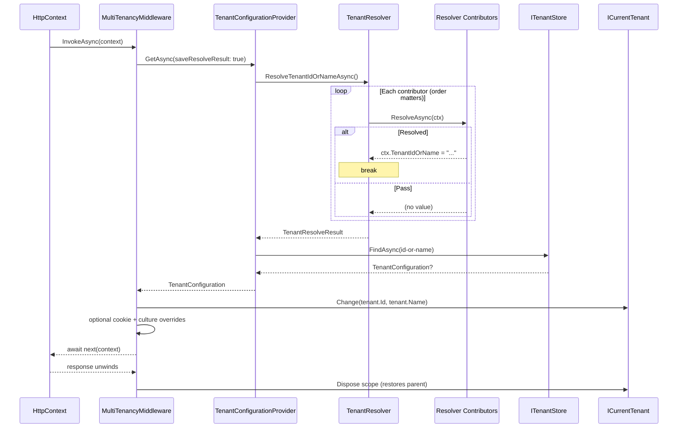

ABP resolves the current tenant once per request inside `MultiTenancyMiddleware`. The middleware delegates to `ITenantConfigurationProvider`, which fans out to a chain of `ITenantResolveContributor`s (query string → route → header → cookie → current user, by default) and finally hits `ITenantStore` to load the full `TenantConfiguration`. The resolved tenant id is then pushed onto an `AsyncLocal` via `ICurrentTenant.Change(...)` so every downstream service — repositories, settings, permissions — sees the same tenant. This page walks that flow end-to-end.

The relevant code is split between [`framework/src/Volo.Abp.AspNetCore.MultiTenancy`](https://github.com/abpframework/abp/tree/dev/framework/src/Volo.Abp.AspNetCore.MultiTenancy) and [`framework/src/Volo.Abp.MultiTenancy`](https://github.com/abpframework/abp/tree/dev/framework/src/Volo.Abp.MultiTenancy).

## End-to-end sequence



## 1. The middleware entry point

[`MultiTenancyMiddleware`](https://github.com/abpframework/abp/blob/dev/framework/src/Volo.Abp.AspNetCore.MultiTenancy/Volo/Abp/AspNetCore/MultiTenancy/MultiTenancyMiddleware.cs):

```csharp
public async override Task InvokeAsync(HttpContext context, RequestDelegate next)
{
    TenantConfiguration? tenant = null;
    try
    {
        tenant = await _tenantConfigurationProvider.GetAsync(saveResolveResult: true);
    }
    catch (Exception e)
    {
        Logger.LogException(e);
        if (await _options.MultiTenancyMiddlewareErrorPageBuilder(context, e)) return;
    }

    if (tenant?.Id != _currentTenant.Id)
    {
        using (_currentTenant.Change(tenant?.Id, tenant?.Name))
        {
            if (_tenantResolveResultAccessor.Result != null &&
                _tenantResolveResultAccessor.Result.AppliedResolvers.Contains(QueryStringTenantResolveContributor.ContributorName))
            {
                AbpMultiTenancyCookieHelper.SetTenantCookie(context, _currentTenant.Id, _options.TenantKey);
            }

            var requestCulture = await TryGetRequestCultureAsync(context);
            if (requestCulture != null)
            {
                CultureInfo.CurrentCulture = requestCulture.Culture;
                CultureInfo.CurrentUICulture = requestCulture.UICulture;
                AbpRequestCultureCookieHelper.SetCultureCookie(context, requestCulture);
                context.Items[AbpRequestLocalizationMiddleware.HttpContextItemName] = true;
            }

            await next(context);
        }
    }
    else
    {
        await next(context);
    }
}
```

Three observations:

- **Resolution failures don't kill the pipeline.** They are logged and handed to `AbpAspNetCoreMultiTenancyOptions.MultiTenancyMiddlewareErrorPageBuilder` (default renders a small razor page). If that returns true the pipeline stops; otherwise execution continues with the previously ambient tenant.
- **Identity change is guarded.** If the resolved tenant equals the ambient one (e.g. when the middleware re-runs in a sub-pipeline) `Change` is skipped, saving allocations.
- **Query-string wins propagate to a cookie.** This is what makes "?\__tenant=" change persist across the session.

## 2. Provider: resolver + store

[`TenantConfigurationProvider`](https://github.com/abpframework/abp/blob/dev/framework/src/Volo.Abp.MultiTenancy/Volo/Abp/MultiTenancy/TenantConfigurationProvider.cs):

```csharp
public virtual async Task<TenantConfiguration?> GetAsync(bool saveResolveResult = false)
{
    var resolveResult = await TenantResolver.ResolveTenantIdOrNameAsync();

    if (saveResolveResult) TenantResolveResultAccessor.Result = resolveResult;

    TenantConfiguration? tenant = null;
    if (resolveResult.TenantIdOrName != null)
    {
        tenant = await FindTenantAsync(resolveResult.TenantIdOrName);

        if (tenant == null)
            throw new BusinessException(code: "Volo.AbpIo.MultiTenancy:010001",
                message: StringLocalizer["TenantNotFoundMessage"],
                details: StringLocalizer["TenantNotFoundDetails", resolveResult.TenantIdOrName]);

        if (!tenant.IsActive)
            throw new BusinessException(code: "Volo.AbpIo.MultiTenancy:010002",
                message: StringLocalizer["TenantNotActiveMessage"],
                details: StringLocalizer["TenantNotActiveDetails", resolveResult.TenantIdOrName]);
    }

    return tenant;
}

protected virtual async Task<TenantConfiguration?> FindTenantAsync(string tenantIdOrName)
{
    if (Guid.TryParse(tenantIdOrName, out var parsedTenantId))
        return await TenantStore.FindAsync(parsedTenantId);
    return await TenantStore.FindAsync(TenantNormalizer.NormalizeName(tenantIdOrName)!);
}
```

Two notable behaviours:

- **The resolved value can be an id or a name.** `Guid.TryParse` chooses the lookup. Tenant names are normalized (default normalizer upper-cases) before hitting the store.
- **Inactive tenants throw.** `IsActive == false` is treated identically to "not found" — clients get a `BusinessException` with code `Volo.AbpIo.MultiTenancy:010002`, which the exception middleware translates to HTTP 400.

`ITenantResolveResultAccessor.Result` exposes the resolver chain trace for downstream code (the middleware uses it to detect query-string wins).

## 3. The resolver chain

[`TenantResolver`](https://github.com/abpframework/abp/blob/dev/framework/src/Volo.Abp.MultiTenancy/Volo/Abp/MultiTenancy/TenantResolver.cs):

```csharp
public virtual async Task<TenantResolveResult> ResolveTenantIdOrNameAsync()
{
    var result = new TenantResolveResult();

    using (var serviceScope = ServiceProvider.CreateScope())
    {
        var context = new TenantResolveContext(serviceScope.ServiceProvider);
        foreach (var tenantResolver in Options.TenantResolvers)
        {
            await tenantResolver.ResolveAsync(context);
            result.AppliedResolvers.Add(tenantResolver.Name);
            if (context.HasResolvedTenantOrHost())
            {
                result.TenantIdOrName = context.TenantIdOrName;
                break;
            }
        }
    }

    if (result.TenantIdOrName.IsNullOrEmpty() && !string.IsNullOrWhiteSpace(Options.FallbackTenant))
    {
        result.TenantIdOrName = Options.FallbackTenant;
        result.AppliedResolvers.Add(TenantResolverNames.FallbackTenant);
    }

    return result;
}
```

Contributors are an ordered list in `AbpTenantResolveOptions.TenantResolvers`. The chain stops at the first contributor that calls `context.TenantIdOrName = value` or `context.Handled = true` (host).

The default registration is performed in two places:

```csharp
// AbpMultiTenancyModule.cs (Volo.Abp.MultiTenancy)
Configure<AbpTenantResolveOptions>(options =>
{
    options.TenantResolvers.Insert(0, new CurrentUserTenantResolveContributor());
});

// AbpAspNetCoreMultiTenancyModule.cs (Volo.Abp.AspNetCore.MultiTenancy)
Configure<AbpTenantResolveOptions>(options =>
{
    options.TenantResolvers.Add(new QueryStringTenantResolveContributor());
    options.TenantResolvers.Add(new RouteTenantResolveContributor());
    options.TenantResolvers.Add(new HeaderTenantResolveContributor());
    options.TenantResolvers.Add(new CookieTenantResolveContributor());
});
```

After both modules load, the final order is:

| # | Contributor | Source | Notes |
|---|-------------|--------|-------|
| 0 | `CurrentUserTenantResolveContributor` | `ClaimsPrincipal` `tenantid` claim | Inserted at index 0 so an authenticated user with a `tenantid` claim trumps everything else. |
| 1 | `QueryStringTenantResolveContributor` | `?__tenant=...` | Useful for switching tenants in tooling; sets cookie via the middleware. |
| 2 | `RouteTenantResolveContributor` | Route token `{__tenant}` | Used when tenants live under `/t/{__tenant}/...` routes. |
| 3 | `HeaderTenantResolveContributor` | `__tenant` HTTP header | Common for API clients. |
| 4 | `CookieTenantResolveContributor` | `__tenant` cookie | Persists query-string switches across requests. |
| 5 | `DomainTenantResolveContributor` *(if registered)* | Host header against a configured template | Add manually: `options.TenantResolvers.Add(new DomainTenantResolveContributor("{0}.myhost.com"));`. |

All HTTP contributors derive from `HttpTenantResolveContributorBase`, which reads `HttpContext` from the scoped service provider — that's why `TenantResolver` calls `ServiceProvider.CreateScope()` to give them request access.

Example contributor body — [`QueryStringTenantResolveContributor`](https://github.com/abpframework/abp/blob/dev/framework/src/Volo.Abp.AspNetCore.MultiTenancy/Volo/Abp/AspNetCore/MultiTenancy/QueryStringTenantResolveContributor.cs):

```csharp
public class QueryStringTenantResolveContributor : HttpTenantResolveContributorBase
{
    public const string ContributorName = "QueryString";
    public override string Name => ContributorName;

    protected override Task<string?> GetTenantIdOrNameFromHttpContextOrNullAsync(ITenantResolveContext context, HttpContext httpContext)
    {
        if (httpContext.Request.QueryString.HasValue)
        {
            var tenantKey = context.GetAbpAspNetCoreMultiTenancyOptions().TenantKey;
            if (httpContext.Request.Query.ContainsKey(tenantKey))
            {
                var tenantValue = httpContext.Request.Query[tenantKey].ToString();
                if (!tenantValue.IsNullOrWhiteSpace()) return Task.FromResult<string?>(tenantValue);
            }
        }
        return Task.FromResult<string?>(null);
    }
}
```

`AbpAspNetCoreMultiTenancyOptions.TenantKey` is the shared key (`__tenant` by default) used by all HTTP contributors.

## 4. Tenant store

`ITenantStore` is the final lookup contract — implementations choose how to load tenant rows:

| Implementation | Module | Use case |
|----------------|--------|----------|
| `ConfigurationTenantStore` | `Volo.Abp.MultiTenancy` | Reads `AbpDefaultTenantStoreOptions` (bound from `appsettings.json` via `Configure<AbpDefaultTenantStoreOptions>(configuration)`). |
| `TenantStore` from `Volo.Abp.TenantManagement` | tenant management module | EF Core / Mongo backed admin UI. |
| Custom | n/a | Implement `ITenantStore` to point at any external directory. |

`FindAsync(Guid)` and `FindAsync(string)` return a `TenantConfiguration` containing id, name, connection string entries, and `IsActive`.

## 5. Setting the ambient tenant

[`CurrentTenant`](https://github.com/abpframework/abp/blob/dev/framework/src/Volo.Abp.MultiTenancy/Volo/Abp/MultiTenancy/CurrentTenant.cs):

```csharp
public IDisposable Change(Guid? id, string? name = null) => SetCurrent(id, name);

private IDisposable SetCurrent(Guid? tenantId, string? name = null)
{
    var parentScope = _currentTenantAccessor.Current;
    _currentTenantAccessor.Current = new BasicTenantInfo(tenantId, name);

    return new DisposeAction<(ICurrentTenantAccessor, BasicTenantInfo?)>(static state =>
    {
        var (accessor, parent) = state;
        accessor.Current = parent;
    }, (_currentTenantAccessor, parentScope));
}
```

`ICurrentTenantAccessor` is the singleton `AsyncLocalCurrentTenantAccessor`. That async-local guarantees:

- All `await` resumptions within the same request see the same tenant.
- Parallel `Task.Run` siblings get independent values (each captures the ambient at fork time).
- `using` blocks restore the parent on exit — even if an exception is thrown inside.

Every ABP cross-cutting concern that depends on tenancy reads through `ICurrentTenant`:

- **EF Core / Mongo data filters** apply `e.TenantId == _currentTenant.Id` to entities marked `IMultiTenant`.
- **Settings** check `TenantSettingValueProvider` — inserted right after `GlobalSettingValueProvider`.
- **Permissions** push the tenant id when resolving `PermissionGrantInfo`s.
- **Connection strings** route through `MultiTenantConnectionStringResolver` to pick tenant-specific connections.

## 6. Culture override for tenants

The middleware re-derives request culture after switching tenant so a tenant default-language setting overrides the global default — but only if `RequestLocalizationMiddleware` didn't already pick one explicitly. `TryGetRequestCultureAsync`:

```csharp
private async Task<RequestCulture?> TryGetRequestCultureAsync(HttpContext httpContext)
{
    var requestCultureFeature = httpContext.Features.Get<IRequestCultureFeature>();
    if (requestCultureFeature == null) return null;       // RequestLocalization not registered
    if (requestCultureFeature.Provider != null) return null; // user/header picked culture

    var settingProvider = httpContext.RequestServices.GetRequiredService<ISettingProvider>();
    var defaultLanguage = await settingProvider.GetOrNullAsync(LocalizationSettingNames.DefaultLanguage);
    // … parse "culture[;uiCulture]" and return RequestCulture
}
```

If you've turned on multi-tenancy but not `UseAbpRequestLocalization`, this override is a no-op.

## 7. Non-HTTP entry points

Outside an HTTP request the same primitives apply, just without middleware:

```csharp
using (_currentTenant.Change(myTenantId))
{
    await _someAppService.DoTenantWorkAsync();
}
```

Background jobs do this automatically (see [/flows/background-job-execution](/flows/background-job-execution)). Distributed event handlers do too — `EventBusBase.TriggerHandlersAsync` wraps the call in `CurrentTenant.Change(eventData.TenantId)` when the ETO is an `IMultiTenant`.

## 8. Host vs tenant

`Guid? Id` returns null for the **host**. A `TenantResolveContext.Handled = true` with no value tells the chain "I'm sure this is the host — stop looking." This is useful for contributors that want to force host context (e.g. an admin panel route) even when downstream contributors might pick something up.

`ICurrentTenant.GetMultiTenancySide()` returns `MultiTenancySide.Host` when id is null and `MultiTenancySide.Tenant` otherwise — used everywhere from permission definitions to UI rendering.

## Failure modes

- **`TenantNotFoundException`-style `BusinessException`** — typically a stale tenant id in a cookie after the tenant was deleted; clear the `__tenant` cookie.
- **Inactive tenant** — same shape, different code (`010002`).
- **Wrong host header → wrong tenant** — `DomainTenantResolveContributor` is permissive about subdomains; double-check templates like `"{0}.myhost.com"` against your reverse-proxy headers.
- **`tenantid` claim mismatch** — `CurrentUserTenantResolveContributor` wins; if a user from tenant A presents a token for tenant B you'll see B. Validate at issuer time.
- **Sub-pipeline change ignored** — `_currentTenant.Change` is a no-op when the new value equals the ambient one; if you need a re-render of tenant-scoped caches, call it with the parent tenant explicitly via `ICurrentTenant.Change(null)` first.

## Related pages

- [/framework/multi-tenancy/overview](/framework/multi-tenancy/overview) — the conceptual model.
- [/framework/multi-tenancy/tenant-resolution](/framework/multi-tenancy/tenant-resolution) — configuration knobs and custom contributors.
- [/flows/http-request-pipeline](/flows/http-request-pipeline) — where `UseMultiTenancy` sits in the stack.
- [/flows/background-job-execution](/flows/background-job-execution) — how the background executer pushes tenant scope from job args.
- [/flows/distributed-event-publish](/flows/distributed-event-publish) — distributed events propagate `IMultiTenant.TenantId` for the receiving side.
