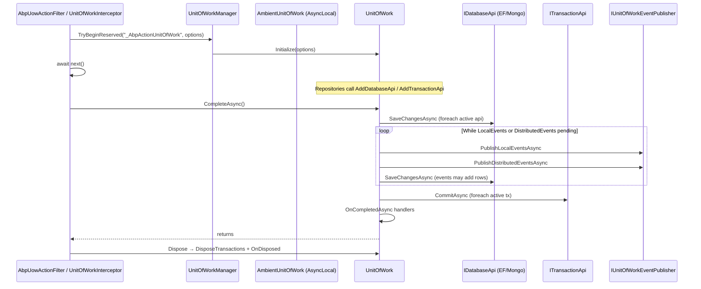
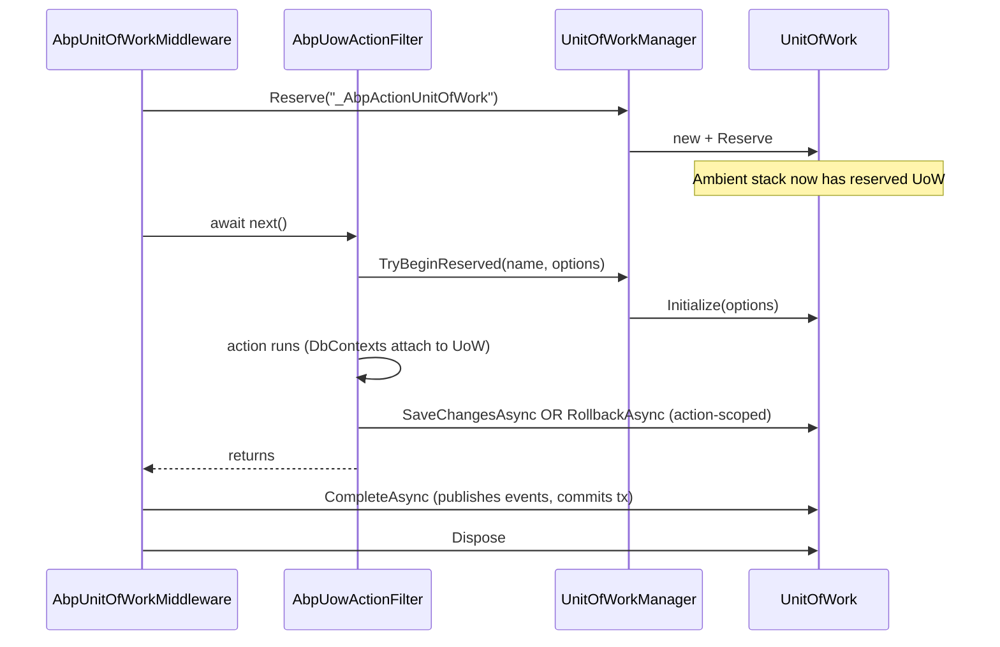

ABP's unit of work (UoW) is the framework's transaction boundary. The same `IUnitOfWork` instance batches `DbContext.SaveChanges` for EF Core, transaction commits across multiple databases, and the publishing of pending local/distributed events. Three entry points start a UoW — the `AbpUowActionFilter` for MVC, the `UnitOfWorkInterceptor` for direct application service calls, and a manual `IUnitOfWorkManager.Begin(...)` — and all of them converge on the same `UnitOfWork.CompleteAsync` finale. This page traces that journey end-to-end.

## High-level sequence



## 1. Entry points

### 1a. The MVC action filter

[`AbpUowActionFilter`](https://github.com/abpframework/abp/blob/dev/framework/src/Volo.Abp.AspNetCore.Mvc/Volo/Abp/AspNetCore/Mvc/Uow/AbpUowActionFilter.cs) is the most common entry point. It reads the `[UnitOfWork]` attribute (if any) via `UnitOfWorkHelper.GetUnitOfWorkAttributeOrNull`, builds an `AbpUnitOfWorkOptions`, and either resumes a UoW reserved by `AbpUnitOfWorkMiddleware` or begins a new one.

```csharp
if (unitOfWorkAttr?.IsDisabled == true) { await next(); return; }

var options = CreateOptions(context, unitOfWorkAttr);
var unitOfWorkManager = context.GetRequiredService<IUnitOfWorkManager>();

if (unitOfWorkManager.TryBeginReserved(UnitOfWork.UnitOfWorkReservationName, options))
{
    var result = await next();
    if (Succeed(result)) await SaveChangesAsync(context, unitOfWorkManager, cancellationTokenProvider.Token);
    else                 await RollbackAsync(context, unitOfWorkManager, cancellationTokenProvider.Token);
    return;
}

using (var uow = unitOfWorkManager.Begin(options))
{
    var result = await next();
    if (Succeed(result)) await uow.CompleteAsync(cancellationTokenProvider.Token);
    else                 await uow.RollbackAsync(cancellationTokenProvider.Token);
}
```

`CreateOptions` calls `AbpUnitOfWorkDefaultOptions.CalculateIsTransactional`, defaulting to `true` for non-GET HTTP methods. Override per action with `[UnitOfWork(IsTransactional = true, IsolationLevel = …)]`.

### 1b. The interceptor

For application services (and any class implementing `IUnitOfWorkEnabled`), [`UnitOfWorkInterceptor`](https://github.com/abpframework/abp/blob/dev/framework/src/Volo.Abp.Uow/Volo/Abp/Uow/UnitOfWorkInterceptor.cs) does the same dance using `UnitOfWorkHelper.IsUnitOfWorkMethod`:

```csharp
public override async Task InterceptAsync(IAbpMethodInvocation invocation)
{
    if (!UnitOfWorkHelper.IsUnitOfWorkMethod(invocation.Method, out var unitOfWorkAttribute))
    {
        await invocation.ProceedAsync();
        return;
    }

    using (var scope = _serviceScopeFactory.CreateScope())
    {
        var options = CreateOptions(scope.ServiceProvider, invocation, unitOfWorkAttribute);
        var unitOfWorkManager = scope.ServiceProvider.GetRequiredService<IUnitOfWorkManager>();

        if (unitOfWorkManager.TryBeginReserved(UnitOfWork.UnitOfWorkReservationName, options))
        {
            await invocation.ProceedAsync();
            if (unitOfWorkManager.Current != null)
                await unitOfWorkManager.Current.SaveChangesAsync();
            return;
        }

        using (var uow = unitOfWorkManager.Begin(options))
        {
            await invocation.ProceedAsync();
            await uow.CompleteAsync();
        }
    }
}
```

`UnitOfWorkHelper.IsUnitOfWorkMethod` returns `true` for any of these:

| Source | Behaviour |
|--------|-----------|
| `[UnitOfWork]` on the method | wins — including `IsDisabled = true` (filter/interceptor short-circuit). |
| `[UnitOfWork]` on the class/interface | applies to every method. |
| `IUnitOfWorkEnabled` marker on the declaring type | every method becomes a UoW boundary with default options. |

Application services derive from `ApplicationService`, which implements `IUnitOfWorkEnabled`, so by convention every public method is a UoW.

### 1c. Manual `IUnitOfWorkManager.Begin`

In background workers, console apps, and integration tests you typically open a UoW manually:

```csharp
using (var uow = _unitOfWorkManager.Begin(new AbpUnitOfWorkOptions { IsTransactional = true }))
{
    await SomeWorkAsync();
    await uow.CompleteAsync();
}
```

`Begin` is implemented as:

```csharp
// UnitOfWorkManager.cs
public IUnitOfWork Begin(AbpUnitOfWorkOptions options, bool requiresNew = false)
{
    var currentUow = Current;
    if (currentUow != null && !requiresNew) return new ChildUnitOfWork(currentUow);

    var unitOfWork = CreateNewUnitOfWork();
    unitOfWork.Initialize(options);
    return unitOfWork;
}
```

`ChildUnitOfWork` is a no-op shell that forwards to the ambient UoW; only the outermost `CompleteAsync` actually commits.

## 2. Reservation pattern

The middleware in [`AbpUnitOfWorkMiddleware`](https://github.com/abpframework/abp/blob/dev/framework/src/Volo.Abp.AspNetCore/Volo/Abp/AspNetCore/Uow/AbpUnitOfWorkMiddleware.cs) calls `Reserve("_AbpActionUnitOfWork")` rather than `Begin`:

```csharp
public IUnitOfWork Reserve(string reservationName, bool requiresNew = false)
{
    if (!requiresNew && _ambientUnitOfWork.UnitOfWork != null &&
        _ambientUnitOfWork.UnitOfWork.IsReservedFor(reservationName))
    {
        return new ChildUnitOfWork(_ambientUnitOfWork.UnitOfWork);
    }

    var unitOfWork = CreateNewUnitOfWork();
    unitOfWork.Reserve(reservationName);
    return unitOfWork;
}
```

A reserved UoW exists on the ambient stack but has no options set — its `Options` is `default!`. The action filter (or interceptor) later calls `TryBeginReserved`, which walks the outer chain looking for the named reservation and **initializes it with the action-specific options**:

```csharp
public bool TryBeginReserved(string reservationName, AbpUnitOfWorkOptions options)
{
    var uow = _ambientUnitOfWork.UnitOfWork;
    while (uow != null && !uow.IsReservedFor(reservationName)) uow = uow.Outer;
    if (uow == null) return false;
    uow.Initialize(options);
    return true;
}
```

This way the middleware owns the lifetime (it controls the `using` and the final `CompleteAsync`) while the action filter owns the *options* (transaction or not, isolation level). The two never fight over the same UoW.

## 3. Inside `CreateNewUnitOfWork`

Both `Begin` and `Reserve` call `CreateNewUnitOfWork`:

```csharp
private IUnitOfWork CreateNewUnitOfWork()
{
    var scope = _serviceScopeFactory.CreateScope();
    try
    {
        var outerUow = _ambientUnitOfWork.UnitOfWork;
        var unitOfWork = scope.ServiceProvider.GetRequiredService<IUnitOfWork>();
        unitOfWork.SetOuter(outerUow);
        _ambientUnitOfWork.SetUnitOfWork(unitOfWork);

        unitOfWork.Disposed += (sender, args) =>
        {
            _ambientUnitOfWork.SetUnitOfWork(outerUow);
            scope.Dispose();
        };

        return unitOfWork;
    }
    catch { scope.Dispose(); throw; }
}
```

Two crucial bits:

- Every UoW gets its **own DI scope**. EF Core `DbContext` instances resolved within the UoW are therefore unique to that UoW. The scope is disposed when the UoW disposes.
- `AmbientUnitOfWork` is an `AsyncLocal` holder, so the ambient UoW flows through `await` resumptions but is isolated across parallel tasks.

## 4. Initialize: options resolution

[`UnitOfWork.Initialize`](https://github.com/abpframework/abp/blob/dev/framework/src/Volo.Abp.Uow/Volo/Abp/Uow/UnitOfWork.cs):

```csharp
public virtual void Initialize(AbpUnitOfWorkOptions options)
{
    if (Options != null) throw new AbpException("This unit of work has already been initialized.");
    Options = _defaultOptions.Normalize(options.Clone());
    IsReserved = false;
}
```

`AbpUnitOfWorkDefaultOptions.Normalize` fills missing `IsolationLevel`/`Timeout` from globals. `CalculateIsTransactional` then resolves the policy:

```csharp
public bool CalculateIsTransactional(bool autoValue) => TransactionBehavior switch
{
    UnitOfWorkTransactionBehavior.Enabled  => true,
    UnitOfWorkTransactionBehavior.Disabled => false,
    UnitOfWorkTransactionBehavior.Auto     => autoValue,
    _ => throw new AbpException("Not implemented TransactionBehavior value: " + TransactionBehavior)
};
```

- For HTTP, `autoValue` is `Request.Method != "GET"`.
- For the interceptor, `autoValue` is taken from `IUnitOfWorkTransactionBehaviourProvider` (replaced by EF Core / Mongo modules) or falls back to `!Method.Name.StartsWith("Get")`.

## 5. Inside the boundary: database & transaction APIs

Repositories never call `SaveChanges` directly. EF Core's `EfCoreDbContextProvider`, the Mongo equivalent, and Dapper integration each register an `IDatabaseApi` (and optionally an `ITransactionApi`) onto the current UoW the first time they're touched:

```csharp
// UnitOfWork.cs
public virtual IDatabaseApi GetOrAddDatabaseApi(string key, Func<IDatabaseApi> factory)
{
    return _databaseApis.GetOrAdd(key, factory);
}

public virtual ITransactionApi GetOrAddTransactionApi(string key, Func<ITransactionApi> factory)
{
    return _transactionApis.GetOrAdd(key, factory);
}
```

The key is provider-specific — typically the connection string or the DbContext type — so a single UoW can host several databases simultaneously. Each `IDatabaseApi` optionally implements `ISupportsSavingChanges` and `ISupportsRollback`; each `ITransactionApi` is responsible for `CommitAsync`/`RollbackAsync`/`Dispose`.

This is also where local & distributed events are queued via `AddOrReplaceLocalEvent` and `AddOrReplaceDistributedEvent`, called by entity domain events and `IDistributedEventBus.PublishAsync(..., onUnitOfWorkComplete: true)` respectively.

## 6. `SaveChangesAsync`

Called by the action filter (after `TryBeginReserved`) on successful completion, and as the first step of `CompleteAsync`:

```csharp
public virtual async Task SaveChangesAsync(CancellationToken cancellationToken = default)
{
    if (_isRolledback) return;

    foreach (var databaseApi in GetAllActiveDatabaseApis())
    {
        if (databaseApi is ISupportsSavingChanges supportsSavingChangesDatabaseApi)
        {
            await supportsSavingChangesDatabaseApi.SaveChangesAsync(cancellationToken);
        }
    }
}
```

For EF Core this triggers change-tracker traversal, audit-property setting (`AuditPropertySetter`), and the publishing of entity domain events into the UoW's event queues.

## 7. `CompleteAsync` — the event/save loop

`CompleteAsync` is the heart of the UoW:

```csharp
public virtual async Task CompleteAsync(CancellationToken cancellationToken = default)
{
    if (_isRolledback) return;
    PreventMultipleComplete();

    try
    {
        _isCompleting = true;
        await SaveChangesAsync(cancellationToken);

        LocalEvents.AddRange(GetEventsRecords(LocalEventWithPredicates));
        LocalEventWithPredicates.Clear();
        DistributedEvents.AddRange(GetEventsRecords(DistributedEventWithPredicates));
        DistributedEventWithPredicates.Clear();

        while (LocalEvents.Any() || DistributedEvents.Any())
        {
            if (LocalEvents.Any())
            {
                var toPublish = LocalEvents.OrderBy(e => e.EventOrder).ToArray();
                LocalEvents.Clear();
                await UnitOfWorkEventPublisher.PublishLocalEventsAsync(toPublish);
            }
            if (DistributedEvents.Any())
            {
                var toPublish = DistributedEvents.OrderBy(e => e.EventOrder).ToArray();
                DistributedEvents.Clear();
                await UnitOfWorkEventPublisher.PublishDistributedEventsAsync(toPublish);
            }

            await SaveChangesAsync(cancellationToken);   // handlers may have added more changes/events

            LocalEvents.AddRange(GetEventsRecords(LocalEventWithPredicates));
            LocalEventWithPredicates.Clear();
            DistributedEvents.AddRange(GetEventsRecords(DistributedEventWithPredicates));
            DistributedEventWithPredicates.Clear();
        }

        await CommitTransactionsAsync(cancellationToken);
        IsCompleted = true;
        await OnCompletedAsync();
    }
    catch (Exception ex)
    {
        _exception = ex;
        throw;
    }
}
```

Key invariants:

- **At-least-one save**, then a publish/save loop until the event queues drain. Event handlers that mutate state will be saved before the transaction commits.
- **Distributed events are published into the outbox** (if configured) via [`UnitOfWorkEventPublisher`](https://github.com/abpframework/abp/blob/dev/framework/src/Volo.Abp.EventBus/Volo/Abp/EventBus/UnitOfWorkEventPublisher.cs) — see [/flows/distributed-event-publish](/flows/distributed-event-publish).
- **`CommitTransactionsAsync` runs last.** All `ITransactionApi.CommitAsync` calls happen after all `SaveChangesAsync` succeed, so a failed handler rolls everything back.
- `IsCompleted = true` only after `CommitTransactionsAsync` returns — `OnCompletedAsync` handlers run with the data already committed and observable externally.

## 8. Rollback and dispose

`RollbackAsync` sets `_isRolledback = true` and calls every `ISupportsRollback` on the active database/transaction APIs. Subsequent `SaveChangesAsync`/`CompleteAsync` calls return early.

`Dispose` (triggered by the outermost `using`) calls:

1. `DisposeTransactions` — `Dispose()` on each `ITransactionApi`, swallowing errors.
2. If `!IsCompleted || _exception != null` → `OnFailed` fires the `Failed` event with the captured exception and the rollback flag.
3. `OnDisposed` fires the `Disposed` event, which the `UnitOfWorkManager` uses to pop the ambient UoW and dispose the DI scope created in step 3.

`UnitOfWork` implements `IDisposable` (not `IAsyncDisposable`), so the dispose itself is synchronous — keep that in mind if you write hooks.

## 9. Transactional API per provider

Different providers register distinct APIs:

| Provider | `IDatabaseApi` | `ITransactionApi` | Transaction model |
|----------|----------------|-------------------|-------------------|
| EF Core | `EfCoreDatabaseApi` (per `DbContext` type) | `EfCoreTransactionApi` | Uses `DbContext.Database.BeginTransactionAsync(isolationLevel)`. If `AbpUnitOfWorkDefaultOptions.IsolationLevel == null`, EF defaults are used. Multiple `DbContext` instances on the same connection share the transaction. |
| MongoDB | `MongoDbDatabaseApi` | `MongoDbTransactionApi` | Wraps `IClientSessionHandle.StartTransaction` — requires a replica set. Disabled by default; opt in with `AbpMongoDbContextOptions`. |
| Dapper | piggybacks on the EF/Mongo transaction via `IConnectionStringResolver` | n/a directly | Dapper uses `IConnectionStringResolver` + the active `DbContext` transaction. |
| Memory DB | none | none | No transactions; `SaveChanges` is best-effort. |

`Options.IsTransactional = false` skips transaction creation altogether — useful for read-only paths to avoid taking implicit locks.

## 10. Putting it together with the request pipeline

Inside an HTTP request the lifecycle splits between middleware (which owns the boundary) and the action filter (which owns options):



This is why event handlers that publish more events keep working — the loop inside `CompleteAsync` drains them — and why `OnCompleted` is the right hook for "after-commit" side effects.

## Related pages

- [/framework/data/unit-of-work](/framework/data/unit-of-work) — conceptual primer and configuration knobs.
- [/flows/http-request-pipeline](/flows/http-request-pipeline) — the surrounding middleware order.
- [/flows/distributed-event-publish](/flows/distributed-event-publish) — the outbox path triggered from `CompleteAsync`.
- [/flows/audit-log-pipeline](/flows/audit-log-pipeline) — note how audit save calls `UnitOfWorkManager.Current.SaveChangesAsync` before persisting the log.
