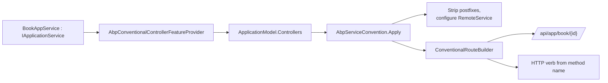
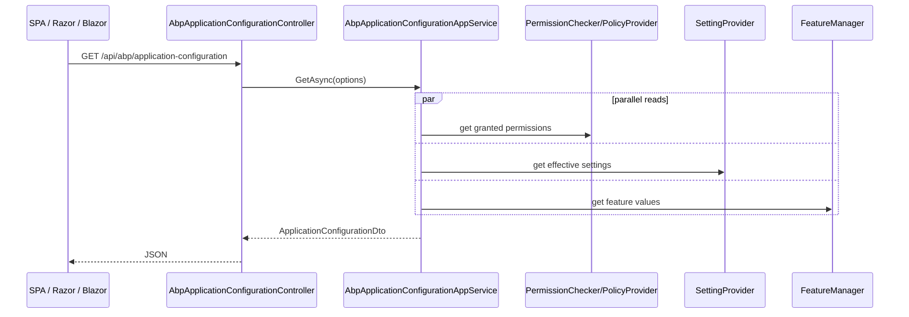

`Volo.Abp.AspNetCore.Mvc` is the largest single integration in the framework and the one almost every ABP host loads. It does three jobs that are easy to conflate. First, it turns plain `IApplicationService` interfaces into real ASP.NET Core controllers without writing a controller class — the *conventional controller* feature. Second, it installs an opinionated cross-cutting filter pipeline (auditing, exception handling, validation, unit-of-work, content negotiation, model binding) that makes those controllers behave consistently. Third, it exposes a single, machine-readable endpoint — `/api/abp/application-configuration` — that browser clients (Angular, MVC, Blazor WebAssembly) hit on startup to learn about features, permissions, settings, localization, and current user.

Source layout: `framework/src/Volo.Abp.AspNetCore.Mvc/Volo/Abp/AspNetCore/Mvc/`.

## AbpAspNetCoreMvcOptions and conventional controllers

`AbpAspNetCoreMvcOptions.cs` is the surface that hosts use to drive the module:

```csharp
public class AbpAspNetCoreMvcOptions
{
    public bool? MinifyGeneratedScript { get; set; }
    public AbpConventionalControllerOptions ConventionalControllers { get; }
    public HashSet<Type> IgnoredControllersOnModelExclusion { get; }
    public HashSet<Type> ControllersToRemove { get; }
    public bool ExposeIntegrationServices { get; set; } = false;
    public bool ExposeClientProxyServices { get; set; } = false;
    public bool AutoModelValidation { get; set; }
    public bool ChangeControllerModelApiExplorerGroupName { get; set; }
}
```

`ConventionalControllers` (typed as `AbpConventionalControllerOptions`, defined in `Conventions/AbpConventionalControllerOptions.cs`) is where assemblies opt into the AppService → Controller projection:

```csharp
Configure<AbpAspNetCoreMvcOptions>(options =>
{
    options.ConventionalControllers.Create(typeof(MyApplicationModule).Assembly);
});
```

`Create(...)` instantiates a `ConventionalControllerSetting` for the assembly, defaulting the root path to `ModuleApiDescriptionModel.DefaultRootPath` ("app") and the remote service name to `DefaultRemoteServiceName` ("Default"). The setting holds a `Func<Type, bool>? TypePredicate`, an `ApplicationServiceTypes` filter, optional `UrlControllerNameNormalizer` / `UrlActionNameNormalizer` callbacks, an `ApiVersions` list, and a `ControllerModelConfigurer` action for last-mile tweaks.

Other useful knobs:

- `UseV3UrlStyle` — restores the pre-4.x URL convention.
- `IgnoredUrlSuffixesInControllerNames` — defaults to `{ "Integration" }`, used by `AbpServiceConvention` to strip the suffix.
- `FormBodyBindingIgnoredTypes` — types like `IFormFile` and `IRemoteStreamContent` that must never be bound from the body.

> The task description mentions an `AbpAutoControllerOptions` — there is no such type. The framework uses `AbpConventionalControllerOptions` (and its parent `AbpAspNetCoreMvcOptions.ConventionalControllers`) for what is sometimes called "auto API controller" registration.

## Conventions: AppService → Controller projection

The projection runs inside MVC's `ApplicationModel` pipeline via `Conventions/AbpServiceConvention.cs`. It is registered as `IApplicationModelConvention` through `AbpServiceConventionWrapper` and applies in two passes:

1. `ApplyForControllers` — for every controller in `ApplicationModel.Controllers` that implements `IRemoteService` (a marker on `IApplicationService`), it strips common postfixes (`AppService`, `ApplicationService`, `Service`) from the controller name, then calls `ConfigureRemoteService`.
2. `RemoveIntegrationControllersIfNotExposed` and `RemoveDuplicateControllers` — controllers tagged `[IntegrationService]` or that subclass `ClientProxyBase<>` are stripped unless `ExposeIntegrationServices` / `ExposeClientProxyServices` is on.

The route is built by `IConventionalRouteBuilder` (default: `ConventionalRouteBuilder`) using a small grammar derived from the service interface:

| Service method shape | Inferred HTTP verb | Inferred route segment |
| --- | --- | --- |
| `GetAsync(...)` / `GetListAsync(...)` | `GET` | from action name without `Async`/`Get` |
| `CreateAsync(...)` | `POST` | empty |
| `UpdateAsync(...)` | `PUT` | `{id}` if `id` is the first arg |
| `DeleteAsync(...)` | `DELETE` | `{id}` |

The full mapping is in `HttpMethodHelper.cs` (in `Volo.Abp.Http`) and `ConventionalRouteBuilder.cs`. The resulting route follows the pattern `api/<root-path>/<controller-name>[/<action-name>]`, e.g. `api/app/book/123` for `BookAppService.GetAsync(Guid id)`.



`AbpConventionalControllerFeatureProvider` is what makes MVC even *see* an interface-typed service — it adds non-controller types that satisfy `AbpConventionalApiControllerSpecification` to MVC's controller feature so the runtime treats them as controllers.

## ApiExploring: machine-readable API description

`ApiExploring/` produces the metadata that powers Swagger generation, the dynamic client proxy (see [Dynamic Client Proxy](/framework/http/dynamic-client-proxy)), and proxy-script generation.

- `AbpApiDefinitionController` is registered at `[Route("api/abp/api-definition")]`. It exposes a single `GET` that returns an `ApplicationApiDescriptionModel` (modules → controllers → actions → parameters, defined in `Volo.Abp.Http`). Clients call this once and cache it.
- `AbpRemoteServiceApiDescriptionProvider` implements MVC's `IApiDescriptionProvider`. It runs after MVC's default provider and enriches each `ApiDescription` with ABP-specific extensions: the controller's interface type, the matching `MethodInfo`, whether the action is paged/sorted, parameter binding source mappings, etc.
- `AbpNoContentApiDescriptionProvider` removes the `200 OK` response from actions that return `Task` (no body) so Swagger emits `204 No Content`.
- `XmlDocumentationProvider` reads `<summary>` / `<param>` from compiled XML doc files for description enrichment.

## Auditing and Authentication filters

`Auditing/` ships two filters:

- `AbpAuditActionFilter` — wraps controller actions in an `IAuditingHelper.AuditingDisabled` check; on success, records action name, parameters, return value, and elapsed time into the audit log scope opened by `AbpAuditingMiddleware`.
- `AbpAuditPageFilter` — same behaviour for Razor Pages.

`Authentication/ChallengeAccountController.cs` is a single razor-route controller used by interactive auth flows (e.g. cookie sign-out triggering an OIDC challenge); see [Authentication](/framework/aspnetcore/authentication).

## ContentFormatters: streaming uploads and downloads

ABP avoids `IFormFile` for cross-tier APIs because it does not survive a dynamic client proxy round-trip. `ContentFormatters/` adds:

- `AbpRemoteStreamContentModelBinder` / `AbpRemoteStreamContentModelBinderProvider` — binds `IRemoteStreamContent` parameters from `multipart/form-data` on the way in.
- `RemoteStreamContentOutputFormatter` — writes `IRemoteStreamContent` return values back to the response stream with the right `Content-Disposition` and content type.

The provider is registered automatically; you only need to declare the parameter or return type as `IRemoteStreamContent` (defined in `Volo.Abp.Content`).

## ExceptionHandling

`ExceptionHandling/AbpExceptionFilter.cs` and `AbpExceptionPageFilter.cs` are the MVC-layer counterparts to `AbpExceptionHandlingMiddleware`. They convert exceptions into HTTP status codes via `IHttpExceptionStatusCodeFinder`, wrap the payload in a `RemoteServiceErrorResponse`, and integrate with `IAuthorizationService` and `IAbpAuthorizationExceptionHandler` for 401/403 flows. The filter respects the `AbpHttpConsts.AbpErrorFormat` flag in `HttpContext.Items` — when set, the response is always JSON regardless of `Accept` header.

## ModelBinding

`ModelBinding/` provides binders for ABP-specific types:

- `AbpDateTimeModelBinder` / `AbpDateTimeModelBinderProvider` — normalises `DateTime` values to the timezone resolved by `ITimezoneProvider`, so input `DateTime`s arrive in UTC and output values are converted to the user's zone (via the clock subsystem).
- `AbpExtraPropertyModelBinder` and `AbpExtraPropertiesDictionaryModelBinderProvider` — bind dynamic `ExtraProperties` dictionaries on objects implementing `IHasExtraProperties`. The binder calls `ExtraPropertyBindingHelper.ConvertValueIfNeeded(...)` to coerce strings into the correct CLR type based on `ObjectExtensionManager` metadata.

## ProxyScripting

`ProxyScripting/AbpServiceProxyScriptController.cs` exposes the legacy `abp.services.app.book.get(id)` jQuery client used by classic MVC apps. It delegates generation to `IProxyScriptManager` (in `Volo.Abp.Http`, see [HTTP Overview](/framework/http/overview)). The output respects `AbpAspNetCoreMvcOptions.MinifyGeneratedScript`.

## Uow: per-request unit of work

`Uow/AbpUowActionFilter.cs` and `AbpUowPageFilter.cs` open a UoW around any action that needs one. The decision uses `AspNetCoreUnitOfWorkTransactionBehaviourProvider`, which reads `AspNetCoreUnitOfWorkTransactionBehaviourProviderOptions` and falls back to "transactional for non-GET HTTP verbs". `AbpAspNetCoreUnitOfWorkOptions.IgnoredUrls` lets the host skip the UoW for endpoints like `/health` and `/_blazor`.

## Validation

`Validation/AbpValidationActionFilter.cs` runs after model binding. When `AbpAspNetCoreMvcOptions.AutoModelValidation` is `true` (default), the filter delegates to `IModelStateValidator` which throws `AbpValidationException` on any `ModelState` error. The validation pipeline shared with the rest of the framework (`Volo.Abp.Validation`) then converts that into a `RemoteServiceErrorInfo` payload with per-field `ValidationErrors`.

`ValidationAttributeHelper` is used by the Swagger / API description providers to extract `[Required]`, `[StringLength]`, `[Range]`, and similar attributes into the API model so generated clients can reproduce client-side checks.

## Versioning

`Versioning/HttpContextRequestedApiVersion.cs` implements `IRequestedApiVersion` (from `Volo.Abp.ApiVersioning.Abstractions`, see [API Versioning](/framework/aspnetcore/api-versioning)) by reading from `HttpContext.GetRequestedApiVersion()`. The conventional controller layer reads `ConventionalControllerSetting.ApiVersions` and applies them as `[MapToApiVersion]` attributes on the generated controller model — so a single AppService can be exposed at multiple `?api-version=` values.

## Response

`Response/AbpNoContentActionFilter.cs` strips empty arrays / empty objects from successful responses and turns them into `204 No Content`. The filter respects the controller-level `[ProducesResponseType]` to avoid breaking clients that explicitly expect a body.

## ApplicationConfigurations: the `/api/abp/application-configuration` endpoint

This is the single most important endpoint shipped by the MVC module. Every browser-side client calls it on startup to learn what the server knows about the current user, tenant, features, permissions, settings, time zone, and supported cultures.

`ApplicationConfigurations/AbpApplicationConfigurationController.cs` is the HTTP face:

```csharp
[Area("abp")]
[RemoteService(Name = "abp")]
[Route("api/abp/application-configuration")]
public class AbpApplicationConfigurationController : AbpControllerBase, IAbpApplicationConfigurationAppService
{
    [HttpGet]
    public virtual async Task<ApplicationConfigurationDto> GetAsync(
        ApplicationConfigurationRequestOptions options)
    {
        AntiForgeryManager.SetCookie();
        return await ApplicationConfigurationAppService.GetAsync(options);
    }
}
```

`AbpApplicationConfigurationAppService.cs` (≈ 30 constructor dependencies) is the canonical "aggregate everything ABP knows about the current request" service. It composes the response from:

- `IAbpAuthorizationPolicyProvider` + `IPermissionDefinitionManager` + `IPermissionChecker` → which permissions are granted for the current principal.
- `ISettingProvider` + `ISettingDefinitionManager` → effective setting values.
- `IFeatureDefinitionManager` → feature flags for the current tenant.
- `ILanguageProvider`, `AbpLocalizationOptions`, `AbpRequestLocalizationOptions` → supported languages and the current culture.
- `ITimezoneProvider` + `AbpClockOptions` → timezone list and current zone.
- `ICurrentUser` + `ICurrentTenant` + `AbpMultiTenancyOptions` → identity payload.
- `ICachedObjectExtensionsDtoService` → object extension descriptors (extra properties) so dynamic forms know what fields to render.

A companion `AbpApplicationConfigurationScriptController` (`/Abp/ApplicationConfigurationScript`) serves the same payload as JavaScript globals for the classic MVC UI. `AbpApplicationLocalizationAppService` / `AbpApplicationLocalizationController` (`/api/abp/application-localization`) returns the full localization dictionary on demand — separately, because it can be megabytes.



Clients (`@abp/ng.core`, the static MVC `abp.config.*`, Blazor's `ApplicationConfigurationCache`, MAUI's `MauiCachedApplicationConfigurationClient`) cache this DTO and refresh it on login, logout, tenant switch, and language change — the cache invalidation primitives live in `ICurrentApplicationConfigurationCacheResetService` (see [Blazor Overview](/framework/blazor/overview)).

## Where to go from here

- [Authentication](/framework/aspnetcore/authentication) covers `AddAbpJwtBearer`, `AddAbpOpenIdConnect`, and the OAuth claim-mapping extensions that feed `ICurrentUser`.
- [Swashbuckle](/framework/aspnetcore/swashbuckle) shows how the API descriptions above are turned into Swagger documents.
- [Dynamic Client Proxy](/framework/http/dynamic-client-proxy) consumes the API definition controller to invoke remote AppServices as if they were local.
- [Bundling](/framework/aspnetcore/bundling) and [UI MVC](/framework/ui-mvc/overview) describe how the Razor/MVC UI layer rides on top of these controllers.
