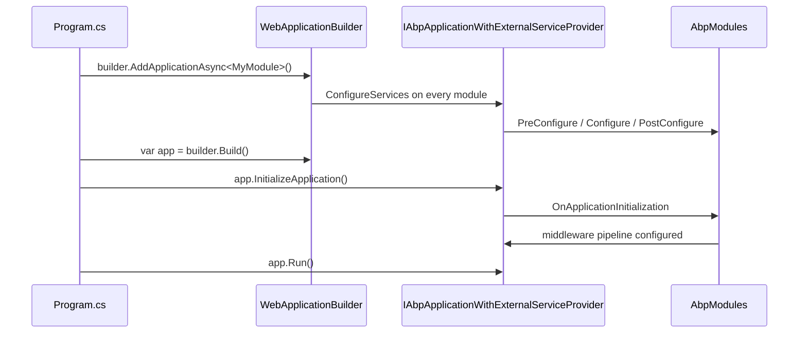

`Volo.Abp.AspNetCore` is the bridge module that takes an `IAbpApplication` and embeds it into a stock ASP.NET Core host. It is not a framework-on-top-of-a-framework — it leaves Kestrel, routing, MVC, and DI exactly where they are and instead plugs ABP's module lifecycle, virtual file system, auditing, exception handling, and object-accessor pattern into the standard `IApplicationBuilder` pipeline. Two halves matter: a module (`AbpAspNetCoreModule`) that contributes services during `ConfigureServices`, and a pair of extension methods (`AddApplicationAsync` and `InitializeApplication`) that handshake ABP's lifecycle with `WebApplicationBuilder` / `WebApplication`.

The split between `Volo.Abp.AspNetCore.Abstractions` and `Volo.Abp.AspNetCore` keeps the surface small. The abstractions package (`framework/src/Volo.Abp.AspNetCore.Abstractions/Volo/Abp/AspNetCore/`) defines `IAbpFilter`, `IWebContentFileProvider`, `IWebClientInfoProvider`, and `AbpAspNetCoreTokenUnauthorizedErrorInfo` — interfaces that downstream modules (MVC, SignalR, Blazor) target without taking a dependency on the full ASP.NET Core hosting stack.

## AbpAspNetCoreModule

`framework/src/Volo.Abp.AspNetCore/Volo/Abp/AspNetCore/AbpAspNetCoreModule.cs` is the entry point. Its `[DependsOn]` graph pulls in the runtime building blocks shared by every web host:

```csharp
[DependsOn(
    typeof(AbpAuditingModule),
    typeof(AbpSecurityModule),
    typeof(AbpVirtualFileSystemModule),
    typeof(AbpUnitOfWorkModule),
    typeof(AbpHttpModule),
    typeof(AbpAuthorizationModule),
    typeof(AbpValidationModule),
    typeof(AbpExceptionHandlingModule),
    typeof(AbpAspNetCoreAbstractionsModule)
)]
public class AbpAspNetCoreModule : AbpModule
```

`PreConfigureServices` synchronises `IAbpHostEnvironment.EnvironmentName` with ASP.NET Core's `IWebHostEnvironment` when the host has not already set it. `ConfigureServices` then:

- Calls `context.Services.AddAuthorization()` so the standard authorization stack is present.
- Adds `AspNetCoreAuditLogContributor` to `AbpAuditingOptions.Contributors` — every audited operation will pick up HTTP context data.
- Replaces the default `StaticFileOptions.ContentTypeProvider` with `AbpFileExtensionContentTypeProvider` (defined in `Volo/Abp/AspNetCore/VirtualFileSystem/`).
- Registers `IHttpContextAccessor` and the user-agent parser (`MyCSharp.HttpUserAgentParser`).
- Calls `StaticWebAssetsLoader.UseStaticWebAssets(...)` so RCL static assets resolve at dev-time without an extra opt-in.

The critical line is the chain of `AddObjectAccessor` calls:

```csharp
context.Services.AddObjectAccessor<IApplicationBuilder>();
context.Services.AddObjectAccessor<WebApplication>();
context.Services.AddObjectAccessor<IHost>();
context.Services.AddObjectAccessor<IEndpointRouteBuilder>();
```

`ObjectAccessor<T>` is the deferred-publication primitive from `Volo.Abp.Core` (see [Core Overview](/framework/core/overview)). At service-configuration time the builder, host, and endpoint-route-builder do not yet exist — these accessors reserve a slot so modules can advertise a *future* dependency on them. `OnApplicationInitialization` then upgrades `IWebHostEnvironment.WebRootFileProvider` to a `CompositeFileProvider` that merges the physical `wwwroot` with the virtual file system, giving every module the ability to ship embedded static assets.

## Bridging the host: AddApplicationAsync

`framework/src/Volo.Abp.AspNetCore/Microsoft/Extensions/DependencyInjection/WebApplicationBuilderExtensions.cs` provides the canonical entry point used by every minimal-API and Razor host:

```csharp
public static async Task<IAbpApplicationWithExternalServiceProvider> AddApplicationAsync<TStartupModule>(
    this WebApplicationBuilder builder,
    Action<AbpApplicationCreationOptions>? optionsAction = null)
    where TStartupModule : IAbpModule
{
    return await builder.Services.AddApplicationAsync<TStartupModule>(options =>
    {
        options.Services.ReplaceConfiguration(builder.Configuration);
        optionsAction?.Invoke(options);
        if (options.Environment.IsNullOrWhiteSpace())
        {
            options.Environment = builder.Environment.EnvironmentName;
        }
    });
}
```

Two things happen here that are easy to miss. First, the builder's `IConfiguration` is force-injected into the ABP service collection so that `IConfiguration` resolution always returns the same instance the host built. Second, the environment name flows from `builder.Environment` into `AbpApplicationCreationOptions.Environment`, which downstream modules read through `IAbpHostEnvironment`.

## InitializeApplication

After `var app = builder.Build();` the host owns a configured DI container but ABP modules have not yet had `OnApplicationInitialization` called. `framework/src/Volo.Abp.AspNetCore/Microsoft/AspNetCore/Builder/AbpApplicationBuilderExtensions.cs` closes that gap. Both `InitializeApplicationAsync` and the synchronous `InitializeApplication` perform the same three steps:

1. Resolve each `ObjectAccessor<T>` and write the live runtime instance (`IApplicationBuilder`, `WebApplication`, `IHost`, `IEndpointRouteBuilder`) into `Value`. From this point on, any service that depends on `IObjectAccessor<IApplicationBuilder>` will resolve the real builder.
2. Register `ApplicationStopping` / `ApplicationStopped` callbacks on `IHostApplicationLifetime` so that `application.ShutdownAsync()` runs on graceful stop and `Dispose()` runs after.
3. Call `application.InitializeAsync(app.ApplicationServices)` (or `Initialize` for the sync overload), which fans out `OnPreApplicationInitialization` → `OnApplicationInitialization` → `OnPostApplicationInitialization` across every module.



## ApplicationInitializationContext extensions

Inside `OnApplicationInitialization` a module receives an `ApplicationInitializationContext`. The extension methods in `framework/src/Volo.Abp.AspNetCore/Volo/Abp/ApplicationInitializationContextExtensions.cs` make it trivial to reach the underlying ASP.NET Core primitives without taking a constructor dependency:

| Extension | Returns | Notes |
| --- | --- | --- |
| `GetApplicationBuilder()` | `IApplicationBuilder` | Throws if accessor is empty. |
| `GetWebApplication()` | `WebApplication` | Set when the host is a minimal-API `WebApplication`. |
| `GetHost()` | `IHost` | Generic host alternative. |
| `GetEndpointRouteBuilder()` | `IEndpointRouteBuilder` | For `app.MapXxx(...)` calls. |
| `GetEnvironment()` | `IWebHostEnvironment` | Re-resolved each call. |
| `GetConfiguration()` | `IConfiguration` | Same root configuration as the host. |
| `GetLoggerFactory()` | `ILoggerFactory` | For module-level logging. |

The `OrNull` variants are provided for every accessor that may not be populated (e.g. `GetWebApplicationOrNull()` returns `null` when running under a non-`WebApplication` host such as a worker service that still uses ABP web modules).

## What the module does at runtime

Beyond options registration, `AbpAspNetCoreModule` indirectly opts into the middleware shipped under `Volo/Abp/AspNetCore/`:

- `AbpExceptionHandlingMiddleware` (`Volo/Abp/AspNetCore/ExceptionHandling/`) — converts thrown `BusinessException`, `EntityNotFoundException`, and `AbpAuthorizationException` instances into JSON responses shaped by `RemoteServiceErrorInfo` (see [HTTP Overview](/framework/http/overview)).
- `AbpAuditingMiddleware` (`Volo/Abp/AspNetCore/Auditing/`) — wraps the request in an audit log scope when `AbpAspNetCoreAuditingOptions` allows the URL.
- `AbpUnitOfWorkMiddleware` (`Volo/Abp/AspNetCore/Uow/`) — opens a UoW for non-MVC endpoints (Minimal API, gRPC handlers).
- `AbpCorrelationIdMiddleware` (`Volo/Abp/AspNetCore/Tracing/`) — reads/generates the `X-Correlation-Id` header.
- `AbpSecurityHeadersMiddleware` (`Volo/Abp/AspNetCore/Security/`) — applies the headers declared by `AbpSecurityHeadersOptions`.
- `AbpClaimsMapMiddleware` and `AbpDynamicClaimsMiddleware` (`Volo/Abp/AspNetCore/Security/Claims/`) — remap upstream JWT claims onto ABP's `AbpClaimTypes` constants and refresh dynamic claims (roles, custom claims) on a configurable schedule.
- `AbpRequestLocalizationMiddleware` (`Microsoft/AspNetCore/RequestLocalization/`) — resolves the active culture from cookie, header, or query string via `IAbpRequestLocalizationOptionsProvider`.
- `AbpTimeZoneMiddleware` (`Microsoft/AspNetCore/Timing/`) — pushes the user's timezone into `ICurrentTimezoneProvider`.

None of these are automatically inserted into the pipeline — the application module is expected to call them inside `OnApplicationInitialization`, typically via `app.UseConfiguredEndpoints()` and `app.UseAbpRequestLocalization()` extensions. Reading [MVC](/framework/aspnetcore/mvc) is the next step; that page documents the controller convention, application configuration endpoint, and filter pipeline that ride on top of this bootstrap.
