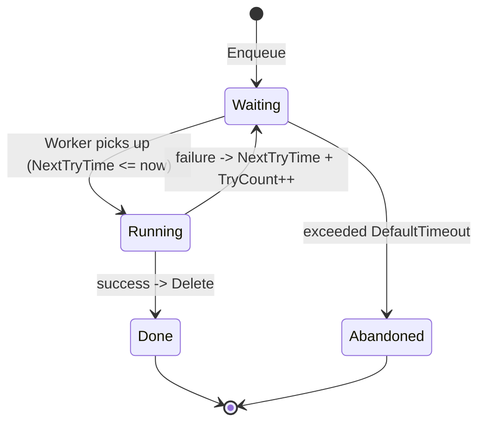

ABP's background jobs subsystem turns a serialisable args object into a durable work item that survives process restarts (when a persistent store is plugged in) and retries on failure with exponential backoff. The default implementation is fully in-memory and lives in `Volo.Abp.BackgroundJobs`; persistent providers (Hangfire, Quartz, RabbitMQ, TickerQ) replace the manager and/or store via standard ABP DI overrides.

## Public surface

`IBackgroundJobManager` (`framework/src/Volo.Abp.BackgroundJobs.Abstractions/Volo/Abp/BackgroundJobs/IBackgroundJobManager.cs`) is intentionally minimal:

```csharp
Task<string> EnqueueAsync<TArgs>(
    TArgs args,
    BackgroundJobPriority priority = BackgroundJobPriority.Normal,
    TimeSpan? delay = null);
```

You write a job by deriving from `BackgroundJob<TArgs>` (sync) or `AsyncBackgroundJob<TArgs>` (async). Both expose `ILogger<...>` and require an `Execute` / `ExecuteAsync` override:

```csharp
public class EmailSendingJob : AsyncBackgroundJob<EmailSendingArgs>, ITransientDependency
{
    public override async Task ExecuteAsync(EmailSendingArgs args)
    {
        // ...
    }
}
```

Job arg types are wired into `AbpBackgroundJobOptions` automatically by the conventional registrar; the routing key is derived by `BackgroundJobNameAttribute.GetName(typeof(TArgs))`, which falls back to the type's full name.

## DefaultBackgroundJobManager

`DefaultBackgroundJobManager` (`framework/src/Volo.Abp.BackgroundJobs/Volo/Abp/BackgroundJobs/DefaultBackgroundJobManager.cs`) is registered with `[Dependency(ReplaceServices = true)]`. It constructs a `BackgroundJobInfo`, serialises the args, and inserts the row:

```csharp
var jobInfo = new BackgroundJobInfo
{
    Id = GuidGenerator.Create(),
    ApplicationName = BackgroundJobWorkerOptions.Value.ApplicationName,
    JobName = jobName,
    JobArgs = Serializer.Serialize(args),
    Priority = priority,
    CreationTime = Clock.Now,
    NextTryTime = Clock.Now
};
if (delay.HasValue) jobInfo.NextTryTime = Clock.Now.Add(delay.Value);
await Store.InsertAsync(jobInfo);
```

The returned id is the `BackgroundJobInfo.Id` as a string — callers can persist it for later tracing.

## BackgroundJobInfo

The persisted entity tracks lifecycle state:

```csharp
public class BackgroundJobInfo
{
    public Guid Id { get; set; }
    public virtual string? ApplicationName { get; set; }
    public virtual string JobName { get; set; }
    public virtual string JobArgs { get; set; }
    public virtual short TryCount { get; set; }
    public virtual DateTime CreationTime { get; set; }
    public virtual DateTime NextTryTime { get; set; }
    public virtual DateTime? LastTryTime { get; set; }
    public virtual bool IsAbandoned { get; set; }
    public virtual BackgroundJobPriority Priority { get; set; }
}
```

`IsAbandoned` is set when retries exceed `AbpBackgroundJobWorkerOptions.DefaultTimeout` (default 2 days) — abandoned rows are pruned by `InMemoryBackgroundJobStore.UpdateAsync`, but durable providers usually keep them for inspection.

## IBackgroundJobStore

`IBackgroundJobStore` (`Volo.Abp.BackgroundJobs/Volo/Abp/BackgroundJobs/IBackgroundJobStore.cs`) is small:

```csharp
Task<BackgroundJobInfo> FindAsync(Guid jobId);
Task InsertAsync(BackgroundJobInfo jobInfo);
Task<List<BackgroundJobInfo>> GetWaitingJobsAsync(string? applicationName, int maxResultCount);
Task DeleteAsync(Guid jobId);
Task UpdateAsync(BackgroundJobInfo jobInfo);
```

The contract for `GetWaitingJobsAsync` is documented inline: conditions are `ApplicationName == applicationName && !IsAbandoned && NextTryTime <= Clock.Now`, ordered by `Priority DESC, TryCount ASC, NextTryTime ASC`. `InMemoryBackgroundJobStore` implements this against a `ConcurrentDictionary`; the EF Core and MongoDB modules provide durable variants.

## BackgroundJobWorker

`BackgroundJobWorker` (`framework/src/Volo.Abp.BackgroundJobs/Volo/Abp/BackgroundJobs/BackgroundJobWorker.cs`) extends `AsyncPeriodicBackgroundWorkerBase` and is the drain. On every tick (default 5 s, set via `AbpBackgroundJobWorkerOptions.JobPollPeriod`) it:

1. Acquires `IAbpDistributedLock` under `AbpBackgroundJobWorkerOptions.DistributedLockName` (default `"AbpBackgroundJobWorker"`) so only one host polls a given store.
2. Calls `store.GetWaitingJobsAsync(applicationName, MaxJobFetchCount)` — default cap is 1000.
3. For each row, increments `TryCount`, sets `LastTryTime`, looks up the `BackgroundJobConfiguration` from `AbpBackgroundJobOptions`, deserialises the args via `IBackgroundJobSerializer`, builds a `JobExecutionContext`, and calls `IBackgroundJobExecuter.ExecuteAsync`.
4. On success the row is deleted; on failure (caught as `BackgroundJobExecutionException`) it recomputes `NextTryTime` via `CalculateNextTryTime` (using `DefaultFirstWaitDuration` × `DefaultWaitFactor^TryCount`) or sets `IsAbandoned = true` once `DefaultTimeout` is exhausted.

```csharp
// BackgroundJobWorker.DoWorkAsync excerpt
foreach (var jobInfo in waitingJobs)
{
    jobInfo.TryCount++;
    jobInfo.LastTryTime = clock.Now;
    try
    {
        await jobExecuter.ExecuteAsync(context);
        await store.DeleteAsync(jobInfo.Id);
    }
    catch (BackgroundJobExecutionException)
    {
        var nextTryTime = CalculateNextTryTime(jobInfo, clock);
        if (nextTryTime.HasValue) jobInfo.NextTryTime = nextTryTime.Value;
        else jobInfo.IsAbandoned = true;
    }
}
```

## BackgroundJobExecuter

`BackgroundJobExecuter` (`Volo.Abp.BackgroundJobs.Abstractions/Volo/Abp/BackgroundJobs/BackgroundJobExecuter.cs`) resolves the job from DI, switches `ICurrentTenant` based on `IMultiTenantBackgroundJobArgs`, and invokes either the sync `Execute` or async `ExecuteAsync` method via reflection. If neither method exists it throws `AbpException`.

## IBackgroundJobSerializer

The default is `JsonBackgroundJobSerializer` (built on `IJsonSerializer`). Providing your own implementation is the standard extension point for compressing or encrypting persisted args.

## Options

`AbpBackgroundJobWorkerOptions` controls the polling loop:

```csharp
public class AbpBackgroundJobWorkerOptions
{
    public string? ApplicationName { get; set; }
    public int JobPollPeriod { get; set; } = 5000;
    public int MaxJobFetchCount { get; set; } = 1000;
    public int DefaultFirstWaitDuration { get; set; } = 60;     // seconds
    public int DefaultTimeout { get; set; } = 172800;            // 2 days
    public double DefaultWaitFactor { get; set; } = 2.0;
    public string DistributedLockName { get; set; } = "AbpBackgroundJobWorker";
}
```

`AbpBackgroundJobOptions.IsJobExecutionEnabled` is a global kill-switch — set to `false` in a service that should only enqueue and let a dedicated host drain.

## Lifecycle



## Disabling and overriding

To disable processing on a specific host (e.g. an API tier that only enqueues):

```csharp
Configure<AbpBackgroundJobOptions>(o => o.IsJobExecutionEnabled = false);
```

To swap the in-memory store for EF Core or MongoDB, add `Volo.Abp.BackgroundJobs.EntityFrameworkCore` (or MongoDB) and depend on its module — it registers an `IBackgroundJobStore` that replaces `InMemoryBackgroundJobStore` automatically.

## Related

<CardGroup cols={3}>
  <Card title="Overview" href="/framework/background/overview" icon="layer-group" />
  <Card title="Background Workers" href="/framework/background/background-workers" icon="gears" />
  <Card title="Hangfire" href="/framework/background/hangfire" icon="fire" />
  <Card title="Quartz" href="/framework/background/quartz" icon="clock" />
  <Card title="RabbitMQ" href="/framework/background/rabbitmq" icon="rabbit" />
  <Card title="TickerQ" href="/framework/background/tickerq" icon="hourglass" />
</CardGroup>
