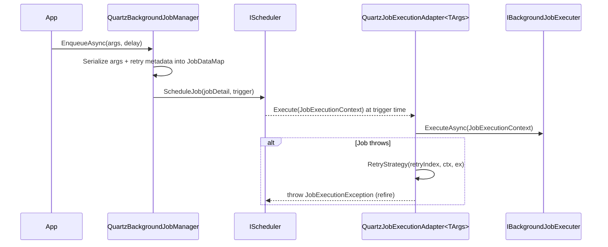

ABP ships three NuGet packages that integrate Quartz.NET: `Volo.Abp.Quartz` wires up the scheduler itself, `Volo.Abp.BackgroundJobs.Quartz` replaces the default `IBackgroundJobManager` with a Quartz-backed implementation, and `Volo.Abp.BackgroundWorkers.Quartz` lets you author `IQuartzBackgroundWorker` jobs and adapts the legacy periodic workers onto Quartz triggers.

## Scheduler bootstrap

`AbpQuartzModule` registers Quartz, materializes an `IScheduler` as a singleton, and starts/stops it during the application lifecycle. Configuration flows through `AbpQuartzOptions`.

```csharp framework/src/Volo.Abp.Quartz/Volo/Abp/Quartz/AbpQuartzOptions.cs
public class AbpQuartzOptions
{
    public NameValueCollection Properties { get; set; }
    public Action<IServiceCollectionQuartzConfigurator>? Configurator { get; set; }
    public TimeSpan StartDelay { get; set; }

    [NotNull]
    public Func<IScheduler, Task> StartSchedulerFactory { get; set; }
}
```

`AbpQuartzModule.ConfigureServices` applies sensible defaults — `UseSimpleTypeLoader`, `UseInMemoryStore`, a 10-thread default pool, and `UseTimeZoneConverter` — only when you have not supplied your own value via `Properties`. Anything else you set on `Configurator` is invoked after the defaults so you can swap to AdoJobStore, configure clustering, etc.

```csharp framework/src/Volo.Abp.Quartz/Volo/Abp/Quartz/AbpQuartzModule.cs
context.Services.AddQuartz(options.Properties, build =>
{
    if (options.Properties[StdSchedulerFactory.PropertyJobStoreType] == null)
        build.UseInMemoryStore();
    if (options.Properties[StdSchedulerFactory.PropertyThreadPoolType] == null)
        build.UseDefaultThreadPool(tp => { tp.MaxConcurrency = 10; });
    options.Configurator?.Invoke(build);
});
```

The scheduler is started in `OnApplicationInitializationAsync` (honoring `StartDelay`) and shut down in `OnApplicationShutdownAsync`.

## QuartzBackgroundJobManager

When `AbpBackgroundJobsQuartzModule` is added, `QuartzBackgroundJobManager` replaces the default `IBackgroundJobManager` via `[Dependency(ReplaceServices = true)]`.

```csharp framework/src/Volo.Abp.BackgroundJobs.Quartz/Volo/Abp/BackgroundJobs/Quartz/QuartzBackgroundJobManager.cs
[Dependency(ReplaceServices = true)]
public class QuartzBackgroundJobManager : IBackgroundJobManager, ITransientDependency
{
    public virtual async Task<string> EnqueueAsync<TArgs>(TArgs args,
        BackgroundJobPriority priority = BackgroundJobPriority.Normal,
        TimeSpan? delay = null)
    {
        return await ReEnqueueAsync(args, Options.RetryCount,
            Options.RetryIntervalMillisecond, priority, delay);
    }
}
```

Each enqueue serializes the arguments into a Quartz `JobDataMap`, builds a `QuartzJobExecutionAdapter<TArgs>` job, and schedules it either immediately (`StartNow`) or at `DateTime.Now + delay` (`StartAt`). The returned string is the Quartz `JobKey`.



## Retry strategy

Retry behavior is encapsulated in `AbpBackgroundJobQuartzOptions`. The default values are `RetryCount = 3` and `RetryIntervalMillisecond = 3000`; the strategy itself is a delegate so you can replace it.

```csharp framework/src/Volo.Abp.BackgroundJobs.Quartz/Volo/Abp/BackgroundJobs/Quartz/AbpBackgroundJobQuartzOptions.cs
private async Task DefaultRetryStrategy(int retryIndex,
    IJobExecutionContext executionContext, JobExecutionException exception)
{
    exception.RefireImmediately = true;
    if (retryIndex > retryCount)
    {
        exception.RefireImmediately = false;
        exception.UnscheduleAllTriggers = true;
        return;
    }
    await Task.Delay(retryInterval);
}
```

`QuartzJobExecutionAdapter<TArgs>` increments `RetryIndex` in the `JobDataMap` after every failure, invokes `RetryStrategy`, then rethrows the wrapped `JobExecutionException` so Quartz can refire (or unschedule) the trigger.

## Quartz background workers

`Volo.Abp.BackgroundWorkers.Quartz` lets you author workers that target Quartz directly and seamlessly hosts the existing `PeriodicBackgroundWorkerBase` / `AsyncPeriodicBackgroundWorkerBase` workers on top of Quartz.

`IQuartzBackgroundWorker` extends both `IBackgroundWorker` and `Quartz.IJob`:

```csharp framework/src/Volo.Abp.BackgroundWorkers.Quartz/Volo/Abp/BackgroundWorkers/Quartz/IQuartzBackgroundWorker.cs
public interface IQuartzBackgroundWorker : IBackgroundWorker, IJob
{
    ITrigger Trigger { get; set; }
    IJobDetail JobDetail { get; set; }
    bool AutoRegister { get; set; }
    Func<IScheduler, Task>? ScheduleJob { get; set; }
}
```

`QuartzBackgroundWorkerBase` provides a no-op base; you override `Execute(IJobExecutionContext)` and set `Trigger`/`JobDetail` in your constructor.

`QuartzBackgroundWorkerManager` replaces the default `BackgroundWorkerManager`. When a worker is added it inspects the type:

- `IQuartzBackgroundWorker` → schedules `JobDetail` against `Trigger` (or calls the worker's custom `ScheduleJob`), and gracefully reschedules when the job key already exists.
- `AsyncPeriodicBackgroundWorkerBase` / `PeriodicBackgroundWorkerBase` → constructs a `QuartzPeriodicBackgroundWorkerAdapter<>` so the legacy worker runs on a Quartz trigger derived from its `Period`.
- Anything else → falls through to the base implementation.

```csharp framework/src/Volo.Abp.BackgroundWorkers.Quartz/Volo/Abp/BackgroundWorkers/Quartz/QuartzBackgroundWorkerManager.cs
public async override Task StartAsync(CancellationToken cancellationToken = default)
{
    if (Scheduler.IsStarted && Scheduler.InStandbyMode)
        await Scheduler.Start(cancellationToken);
    await base.StartAsync(cancellationToken);
}

public async override Task StopAsync(CancellationToken cancellationToken = default)
{
    if (Scheduler.IsStarted && !Scheduler.InStandbyMode)
        await Scheduler.Standby(cancellationToken);
    await base.StopAsync(cancellationToken);
}
```

Auto-registration of workers via `AbpQuartzConventionalRegistrar` is controlled by `AbpBackgroundWorkerQuartzOptions.IsAutoRegisterEnabled` (default `true`).

## Suppressing execution

`AbpBackgroundJobsQuartzModule.OnPreApplicationInitialization` reads `AbpBackgroundJobOptions.IsJobExecutionEnabled`; if jobs are disabled the module rewrites `AbpQuartzOptions.StartSchedulerFactory` to a no-op so the scheduler never starts. This is the recommended way to keep producers enqueuing jobs while a dedicated worker host performs execution.

## See also

<CardGroup cols={2}>
  <Card title="Background Jobs" icon="briefcase" href="/framework/background/background-jobs" />
  <Card title="Background Workers" icon="repeat" href="/framework/background/background-workers" />
  <Card title="Hangfire Provider" icon="fire" href="/framework/background/hangfire" />
  <Card title="RabbitMQ Provider" icon="rabbit" href="/framework/background/rabbitmq" />
</CardGroup>
