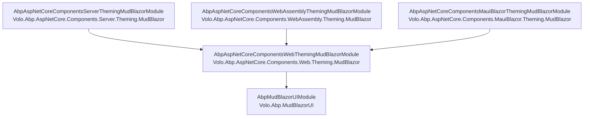

ABP wraps **MudBlazor** as a first-class UI theme behind the same component contracts (`IUiMessageService`, `IUiNotificationService`, `IUiPageProgressService`, `AbpExtensibleDataGrid`) used by the Blazorise theme. The packaging layers are intentional: a `Volo.Abp.MudBlazorUI` core that registers MudBlazor services and exposes the abstract `AbpMudCrudPageBase`, a `*.Web.Theming.MudBlazor` layer with theme-agnostic layout primitives (`PageLayout`, `PageToolbar`, `DynamicLayoutComponent`), and host-specific modules — `Server.Theming.MudBlazor`, `WebAssembly.Theming.MudBlazor`, `MauiBlazor.Theming.MudBlazor` — that wire up bundling for each Blazor hosting model. This page maps those pieces.

Companion pages: [Blazor Overview](/framework/blazor/overview), [Blazor Server](/framework/blazor/server), [Blazor WebAssembly](/framework/blazor/webassembly), [Blazor MAUI](/framework/blazor/maui).

## Module graph



Every theme variant pulls in the shared `Web.Theming.MudBlazor` (layouts + page toolbars + dynamic-layout options) and adds its own bundling story.

## `AbpMudBlazorUIModule` — registering MudBlazor

`framework/src/Volo.Abp.MudBlazorUI/AbpMudBlazorUIModule.cs`:

```csharp
[DependsOn(
    typeof(AbpAspNetCoreComponentsWebModule),
    typeof(AbpDddApplicationContractsModule),
    typeof(AbpAuthorizationModule),
    typeof(AbpGlobalFeaturesModule),
    typeof(AbpFeaturesModule)
)]
public class AbpMudBlazorUIModule : AbpModule
{
    public override void ConfigureServices(ServiceConfigurationContext context)
    {
        context.Services.AddMudServices(config =>
        {
            config.SnackbarConfiguration.PositionClass     = Defaults.Classes.Position.BottomEnd;
            config.SnackbarConfiguration.PreventDuplicates = false;
            config.SnackbarConfiguration.NewestOnTop       = true;
            config.SnackbarConfiguration.ShowCloseIcon     = true;
            config.SnackbarConfiguration.VisibleStateDuration = 5000;
            // ...
            config.SnackbarConfiguration.SnackbarVariant   = Variant.Filled;
        });

        context.Services.AddSingleton(typeof(AbpMudBlazorMessageLocalizerHelper<>));
    }
}
```

The module's job is narrow: hand off to MudBlazor's `AddMudServices` with ABP-friendly defaults (snackbars in the bottom-right, filled variant, 5-second visible state) and register the message-localizer helper.

Companion services in the same package:

| Class | Role |
| --- | --- |
| `MudBlazorUiMessageService` | `IUiMessageService` implementation that pops `MudDialog` confirm / message dialogs |
| `MudBlazorUiNotificationService` | `IUiNotificationService` adapter onto `ISnackbar` |
| `MudBlazorUiPageProgressService` | `IUiPageProgressService` adapter onto a global progress bar |
| `MudBlazorExtensionPropertyPolicyChecker` | Object-extending integration |
| `MudBlazorUiObjectExtensionPropertyInfoExtensions` | Object-extending property metadata bridge |
| `AbpMudBlazorMessageLocalizerHelper<TResource>` | Localizes UI messages, wired in via the singleton above |

## `AbpMudCrudPageBase<TAppService, TEntityDto, TKey, …>`

`framework/src/Volo.Abp.MudBlazorUI/AbpMudCrudPageBase.cs` is the abstract page that every CRUD page in a MudBlazor template inherits. It mirrors the Blazorise `AbpCrudPageBase` so the same `ICrudAppService<TEntityDto, TKey>` contracts drive both themes.

```csharp
public abstract class AbpMudCrudPageBase<TAppService, TEntityDto, TKey>
    : AbpMudCrudPageBase<TAppService, TEntityDto, TKey, PagedAndSortedResultRequestDto>
    where TAppService : ICrudAppService<TEntityDto, TKey>
    where TEntityDto : class, IEntityDto<TKey>, new()
{
}

public abstract class AbpMudCrudPageBase<TAppService, TEntityDto, TKey, TGetListInput, ...>
    : AbpComponentBase
{
    // shared paging, sorting, dialog, permission checking, and OnInitializedAsync seam
}
```

The chained generic overloads collapse from a 3-parameter `CrudAppService` all the way down to a 7-parameter version that handles distinct `TCreateInput`, `TUpdateInput`, `TGetListInput`, `TListViewModel`, `TCreateViewModel`, `TUpdateViewModel` — same shape as the [Application Services](/framework/ddd/application-services) base. UI page authors normally inherit the 3-parameter or 4-parameter form and override the few extension hooks.

Reusable MudBlazor-specific components built on top:

| Razor component | File | Role |
| --- | --- | --- |
| `AbpMudExtensibleDataGrid<TItem>` | `Volo.Abp.MudBlazorUI/Components/AbpMudExtensibleDataGrid.razor` | `MudDataGrid<TItem>` configured with object-extending columns, sorting, filtering |
| `MudDataGridEntityActionsColumn<TItem>` | `Components/MudDataGridEntityActionsColumn.razor` | Last-column actions menu fed by `IEntityActions` |
| `MudEntityAction` / `MudEntityActions` | `Components/MudEntityAction(s).razor` | Authorised action buttons inside the action column |
| `MudExtensionProperties<T>` | `Components/ObjectExtending/MudExtensionProperties.razor` | Renders extra properties (lookup/date/check/select/text) |
| `UiMessageAlert`, `UiNotificationAlert`, `PageAlert`, `UiPageProgress` | `Components/*.razor` | The UI service implementations' DOM-side counterparts |

## `Web.Theming.MudBlazor` — host-agnostic layout

`framework/src/Volo.Abp.AspNetCore.Components.Web.Theming.MudBlazor/AbpAspNetCoreComponentsWebThemingMudBlazorModule.cs` brings the layout-shaping services to every Blazor host:

```csharp
[DependsOn(typeof(AbpMudBlazorUIModule), typeof(AbpUiNavigationModule))]
public class AbpAspNetCoreComponentsWebThemingMudBlazorModule : AbpModule
{
    public override void ConfigureServices(ServiceConfigurationContext context)
    {
        Configure<AbpDynamicLayoutComponentOptions>(options =>
        {
            options.Components.Add(typeof(AbpAuthenticationState), null);
        });
    }
}
```

`AbpUiNavigationModule` is the source of `IMenuManager`, which the MudBlazor theme's `MainLayout`/navmenu component injects to render the per-tenant, per-user side menu. Modules contribute menu items via `IMenuContributor.ConfigureMenuAsync(MenuConfigurationContext)` — same contract as the MVC theme, see [Navigation Menu](/framework/ui-mvc/navigation).

### `PageLayout` — the per-page state container

`Volo.Abp.AspNetCore.Components.Web.Theming.MudBlazor/Layout/PageLayout.cs`:

```csharp
public class PageLayout : IScopedDependency, INotifyPropertyChanged
{
    public virtual string? Title { get; set; }
    public string? MenuItemName { get; set; }
    public bool ShowToolbar { get; set; } = true;
    public virtual ObservableCollection<BreadcrumbItem> BreadcrumbItems { get; } = new();
    public virtual ObservableCollection<PageToolbarItem> ToolbarItems { get; } = new();

    public event PropertyChangedEventHandler? PropertyChanged;
    public void Reset() { /* clear everything */ }
}
```

A `PageLayout` instance is **scoped** (one per circuit / WebAssembly app). Each Razor page injects it and sets `Title`, `MenuItemName`, `BreadcrumbItems`, `ToolbarItems` in `OnInitializedAsync`; the `MainLayout` (in the consumer template) subscribes to `PropertyChanged` and re-renders the title/breadcrumb area.

`MenuItemName` is the bridge to the menu manager: setting it to e.g. `"AbpIdentity.Users"` tells the layout to highlight that node in the side menu. The mapping from name to menu item is done by `IMenuManager.GetMainMenuAsync()` (`Volo.Abp.UI.Navigation`).

### `PageHeader.razor` — title, breadcrumbs, toolbar

`Layout/PageHeader.razor` and its `.razor.cs` use the injected `PageLayout` to render the standard MudBlazor header strip (breadcrumbs at the top, page title under it, toolbar buttons on the right). It cooperates with `IPageToolbarManager` so module-contributed toolbar entries (`IPageToolbarContributor`) end up next to the page-local ones from `PageLayout.ToolbarItems`.

### `DynamicLayoutComponent.razor` — pluggable layout slots

```razor
@if (AbpDynamicLayoutComponentOptions.Value.Components.Any())
{
    foreach (var (componentType, parameters) in AbpDynamicLayoutComponentOptions.Value.Components)
    {
        <DynamicComponent Type="@componentType" Parameters="@parameters" />
    }
}
```

Modules contribute layout-wide widgets (auth state, telemetry beacons, etc.) by calling `Configure<AbpDynamicLayoutComponentOptions>(o => o.Components.Add(typeof(MyWidget), parameters))`. The Web theming module itself adds `AbpAuthenticationState` so login/logout reactively re-renders the whole layout.

### Page toolbars

`PageToolbars/` contains the contributor model (the same shape ABP uses elsewhere):

- `IPageToolbarContributor` — module entry point.
- `PageToolbarContributionContext` — gives access to the current `IServiceProvider` and the `PageToolbarDictionary`.
- `IPageToolbarManager` — resolves the merged list of items per page key.
- `PageToolbarItem` / `MudPageToolbarButton.razor` — model + rendered button.

A module's startup adds an `IPageToolbarContributor` to the `PageToolbarContributorList` so that, say, the User Management page acquires an "Export" button without the page source code needing to know.

### `StandardLayouts.cs`

```csharp
public static class StandardLayouts
{
    public const string Application = "Application";
    public const string Empty       = "Empty";
    // …
}
```

These string constants are used in `[Layout(StandardLayouts.Application)]` annotations on Razor pages so the routing layer picks the correct MainLayout file at consumer level.

## Server hosting — `Server.Theming.MudBlazor`

`AbpAspNetCoreComponentsServerThemingMudBlazorModule` registers the **bundling** contributors for Blazor Server. ABP's bundling system stitches together `.css`/`.js` contributions from many modules into one minified `Blazor.Global` bundle so the page only has one `<link>` and one `<script>`:

```csharp
[DependsOn(
    typeof(AbpAspNetCoreComponentsServerModule),
    typeof(AbpAspNetCoreMvcUiPackagesModule),
    typeof(AbpAspNetCoreComponentsWebThemingMudBlazorModule),
    typeof(AbpAspNetCoreMvcUiBundlingModule))]
public class AbpAspNetCoreComponentsServerThemingMudBlazorModule : AbpModule
{
    public override void ConfigureServices(ServiceConfigurationContext context)
    {
        Configure<AbpBundlingOptions>(options =>
        {
            options.StyleBundles.Add(
                BlazorServerMudBlazorStandardBundles.Styles.Global,
                bundle => bundle.AddContributors(typeof(BlazorServerMudBlazorStyleContributor)));
            options.ScriptBundles.Add(
                BlazorServerMudBlazorStandardBundles.Scripts.Global,
                bundle => bundle.AddContributors(typeof(BlazorServerMudBlazorScriptContributor)));
        });
    }
}
```

`BlazorServerMudBlazorStandardBundles.Styles.Global = "Blazor.Global"` is the bundle key the layout markup references. `BlazorServerMudBlazorComponentBundleManager` is the runtime that resolves contributor chains for the page.

## WebAssembly — `WebAssembly.Theming.MudBlazor`

The WASM module depends on the Server-equivalent bundling abstractions and adds its own contributors:

```csharp
[DependsOn(
    typeof(AbpAspNetCoreComponentsWebAssemblyThemingMudBlazorBundlingModule),
    typeof(AbpAspNetCoreComponentsWebThemingMudBlazorModule),
    typeof(AbpAspNetCoreComponentsWebAssemblyModule))]
public class AbpAspNetCoreComponentsWebAssemblyThemingMudBlazorModule : AbpModule
{
    public override void ConfigureServices(ServiceConfigurationContext context)
    {
        Configure<AbpBundlingOptions>(options =>
        {
            options.StyleBundles.Add(
                BlazorWebAssemblyMudBlazorStandardBundles.Styles.Global,
                bundle => bundle.AddContributors(typeof(BlazorWebAssemblyMudBlazorStyleContributor)));
            options.ScriptBundles.Add(
                BlazorWebAssemblyMudBlazorStandardBundles.Scripts.Global,
                bundle => bundle.AddContributors(typeof(BlazorWebAssemblyMudBlazorScriptContributor)));
        });
    }
}
```

`CultureAwareRedirectToLoginHelper.cs` (same project) keeps the WASM auth redirect respecting the current `ICurrentUiCulture` so unauthenticated users land on the login page in their language.

## MAUI — `MauiBlazor.Theming.MudBlazor`

The MAUI variant adds offline-aware bundling (`MauiBlazorMudBlazorStyleContributor`, `MauiBlazorMudBlazorScriptContributor` in `Volo.Abp.AspNetCore.Components.MauiBlazor.Theming.MudBlazor.Bundling`) so static assets ship inside the MAUI bundle rather than being fetched at runtime.

## Cross-references

- The DI registrations and modular bundling pipeline are documented at [Bundling](/framework/aspnetcore/bundling).
- The CRUD page base contract is shared with [Application Services](/framework/ddd/application-services).
- The Blazorise theme — same shape, different package — is at [Blazorise](/framework/blazor/blazorise).

## Related

<CardGroup cols={2}>
  <Card title="Blazor Overview" href="/framework/blazor/overview">Pick a hosting model and a theme.</Card>
  <Card title="Blazor Server" href="/framework/blazor/server">Server hosting model the MudBlazor server theme builds on.</Card>
  <Card title="Blazor WebAssembly" href="/framework/blazor/webassembly">WASM hosting + bundling.</Card>
  <Card title="Blazorise" href="/framework/blazor/blazorise">The other supported Blazor theme.</Card>
</CardGroup>
