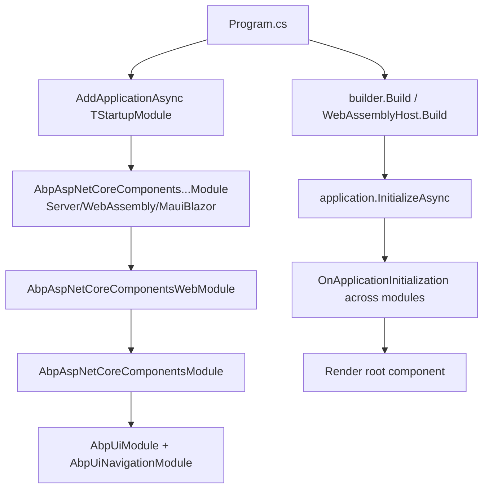

ABP's Blazor support is layered into three packages so that the same Razor components run unchanged across Blazor Server, Blazor WebAssembly, MAUI Blazor Hybrid, and the Blazor WebApp interactive auto modes. The architecture is:

- `Volo.Abp.AspNetCore.Components` — abstract base classes (`AbpComponentBase`), service interfaces (`IUiMessageService`, `IUiNotificationService`, `IAlertManager`, `IUserExceptionInformer`, `IBlockUiService`, `IUiPageProgressService`) and conventional DI scanners. No reference to a specific render mode.
- `Volo.Abp.AspNetCore.Components.Web` — code that is safe in both server-rendered and client-rendered modes: cookie service, exception-handling logger, current-user/tenant primitives, `AbpAspNetCoreComponentsWebOptions`, `AbpAuthenticationOptions`.
- A render-mode-specific module on top: `*.Server`, `*.WebAssembly`, `*.MauiBlazor`.

Source: `framework/src/Volo.Abp.AspNetCore.Components/` and `framework/src/Volo.Abp.AspNetCore.Components.Web/`.

## AbpComponentBase

`Volo/Abp/AspNetCore/Components/AbpComponentBase.cs` derives from `OwningComponentBase` so each component owns a service scope (`ScopedServices`) tied to its lifetime. That scope is what makes per-component unit-of-work, scoped logging, and disposable services work without leaks. Every framework-provided amenity is exposed through *lazy* properties:

```csharp
public abstract class AbpComponentBase : OwningComponentBase
{
    protected IStringLocalizerFactory StringLocalizerFactory => LazyGetRequiredService(ref _stringLocalizerFactory)!;
    protected IStringLocalizer L { ... }                  // built from LocalizationResource, default DefaultResource
    protected Type? LocalizationResource { get; set; } = typeof(DefaultResource);

    protected ILogger Logger => _lazyLogger.Value;
    protected ILoggerFactory LoggerFactory => LazyGetRequiredService(ref _loggerFactory)!;
    protected IAuthorizationService AuthorizationService => LazyGetRequiredService(ref _authorizationService)!;
    protected ICurrentUser CurrentUser => LazyGetRequiredService(ref _currentUser)!;
    protected ICurrentTenant CurrentTenant => LazyGetRequiredService(ref _currentTenant)!;
    protected IUiMessageService Message => LazyGetNonScopedRequiredService(ref _message)!;
    protected IUiNotificationService Notify => LazyGetNonScopedRequiredService(ref _notify)!;
    protected IUserExceptionInformer UserExceptionInformer => LazyGetNonScopedRequiredService(ref _userExceptionInformer)!;
    protected IAlertManager AlertManager => LazyGetNonScopedRequiredService(ref _alertManager)!;
    protected IClock Clock => LazyGetNonScopedRequiredService(ref _clock)!;
    protected IObjectMapper ObjectMapper { ... }
    protected Type? ObjectMapperContext { get; set; }
}
```

The `LazyGetRequiredService` / `LazyGetNonScopedRequiredService` split is the key convention: services that need request-scoped state (`ICurrentUser`, `IAuthorizationService`) come from `ScopedServices`; UI singletons (`IUiMessageService`, `IClock`) come from `NonScopedServices` to avoid double-dispose issues when the component is torn down. The pattern mirrors `AbpController` and `AbpPage` from MVC — every layer in ABP that wants lazy framework amenities follows this contract.

`L` is built from `LocalizationResource` (default `DefaultResource`); assigning a different type resets the cached localizer, so a feature component can do:

```csharp
public partial class BookList : AbpComponentBase
{
    public BookList() { LocalizationResource = typeof(BookStoreResource); }
}
```

## Conventional registration

`DependencyInjection/AbpWebAssemblyConventionalRegistrar.cs` and `ServiceProviderComponentActivator.cs` participate in the framework's DI scanner. The activator is registered in `AbpAspNetCoreComponentsWebModule`:

```csharp
context.Services.Replace(ServiceDescriptor.Transient<IComponentActivator, ServiceProviderComponentActivator>());
```

That replacement is what lets Blazor instantiate components from the ABP service provider — which is what makes `[Inject]` properties resolve from a Castle/Autofac container and what enables interface-based component overrides.

## UI services

The `AspNetCore.Components` assembly defines the contracts; concrete UI libraries implement them:

| Interface | Default implementation | Replaced by |
| --- | --- | --- |
| `IAlertManager` | `Web/Alerts/AlertManager.cs` | Theme libraries can replace per-render-mode. |
| `IUiMessageService` | `NullUiMessageService` (no-op) | `BlazoriseUiMessageService`, MudBlazor's `Snackbar`-backed wrapper. |
| `IUiNotificationService` | `NullUiNotificationService` | Same UI libraries. |
| `IUserExceptionInformer` | `NullUserExceptionInformer` / `UserExceptionInformer` | `UserExceptionInformer` (in `.Web`) wires into the framework's exception handling pipeline. |
| `IBlockUiService` | `NullBlockUiService` | `AbpBlockUiService` in `.Web`. |
| `IUiPageProgressService` | `NullUiPageProgressService` | Themed implementations. |

That is why MudBlazor and Blazorise components plug in seamlessly: they replace these interfaces with their library-specific implementation; `AbpComponentBase` does not care.

## Web module behaviour

`Web/AbpAspNetCoreComponentsWebModule.cs`:

```csharp
[DependsOn(typeof(AbpUiModule), typeof(AbpAspNetCoreComponentsModule))]
public class AbpAspNetCoreComponentsWebModule : AbpModule
{
    public override void ConfigureServices(ServiceConfigurationContext context)
    {
        context.Services.Replace(ServiceDescriptor.Transient<IComponentActivator, ServiceProviderComponentActivator>());

        var preActions = context.Services.GetPreConfigureActions<AbpAspNetCoreComponentsWebOptions>();
        Configure<AbpAspNetCoreComponentsWebOptions>(options => { preActions.Configure(options); });
    }
}
```

The pre-configure pattern lets the Blazor WebApp launcher set `AbpAspNetCoreComponentsWebOptions.IsBlazorWebApp = true` *before* WASM-specific configuration runs — that flag is what allows the same component graph to participate in both Server and WebAssembly rendering inside a single Blazor WebApp project.

`AbpAuthenticationOptions.cs` in the same folder sets `LoginUrl`/`LogoutUrl` (defaults `authentication/login` / `authentication/logout`) so the framework's `AuthorizeView` redirect targets are themable. The WebAssembly module overrides these defaults when it is *not* hosted inside a Blazor WebApp.

## Application configuration cache

Each render mode has its own implementation of `Volo.Abp.AspNetCore.Components.Web.Configuration.ICurrentApplicationConfigurationCacheResetService` because they live in different processes:

- Server: `Server/Configuration/BlazorServerCurrentApplicationConfigurationCacheResetService.cs` — invalidates the `IDistributedCache` entry.
- WebAssembly: `WebAssembly/Configuration/BlazorWebAssemblyCurrentApplicationConfigurationCacheResetService.cs` — clears the in-memory `ApplicationConfigurationCache`.
- MAUI: parallel implementation under `MauiBlazor/`.

The cache itself (`ApplicationConfigurationCache.cs` in WASM and `MauiBlazor`) wraps the `/api/abp/application-configuration` payload (see [MVC](/framework/aspnetcore/mvc)) so each component does not re-fetch the user's permissions / settings.

## What a Blazor host looks like at startup



For host-specific specifics, read:

- [Server](/framework/blazor/server) — `AbpAspNetCoreComponentsServerModule`, SignalR pipeline integration, server-only theming.
- [WebAssembly](/framework/blazor/webassembly) — `AbpWebAssemblyHostBuilderExtensions`, HTTP message handler, Autofac WASM integration.
- [MAUI](/framework/blazor/maui) — `AbpAspNetCoreComponentsMauiBlazorModule`, native-side current-principal/tenant accessors.
- [MudBlazor](/framework/blazor/mudblazor) and [Blazorise](/framework/blazor/blazorise) — UI library bindings.
