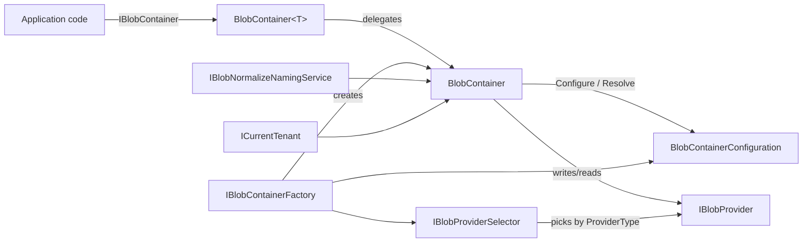
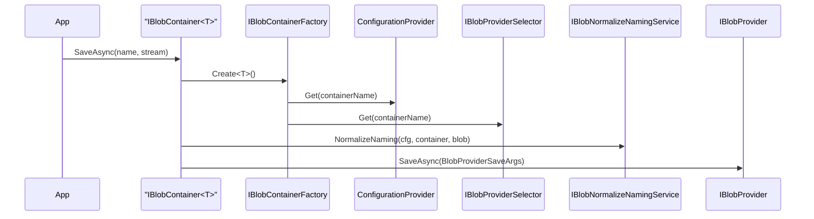

The BLOB Storing system gives applications a uniform API for reading and writing binary objects without binding to a specific backend. A **container** is a logical bucket (think "profile pictures" or "invoice PDFs"), an **`IBlobProvider`** is the actual store (S3, Azure Blob, local disk, in-memory…), and a **selector** chooses the provider for each container based on configuration. Multi-tenancy and naming normalization are baked in.

## Module shape

`Volo.Abp.BlobStoring` exposes the container/provider abstractions plus a default implementation; provider packages such as `Volo.Abp.BlobStoring.Azure` register their own `IBlobProvider`. You wire it all up through `AbpBlobStoringOptions`:

```csharp framework/src/Volo.Abp.BlobStoring/Volo/Abp/BlobStoring/AbpBlobStoringOptions.cs
public class AbpBlobStoringOptions
{
    public BlobContainerConfigurations Containers { get; }
}
```

`BlobContainerConfigurations` always seeds a `default` container (see [`DefaultContainer`](#default-container)) and lets you add named containers that inherit from it.

## Core types



| Type | Role | File |
| --- | --- | --- |
| `IBlobContainer` / `IBlobContainer<T>` | Public API: `SaveAsync`, `GetAsync`, `DeleteAsync`, `ExistsAsync`, `GetOrNullAsync` | `Volo.Abp.BlobStoring/IBlobContainer.cs` |
| `BlobContainer` | Default implementation that normalizes names, applies multi-tenancy, and forwards to a provider | `Volo.Abp.BlobStoring/BlobContainer.cs` |
| `IBlobContainerFactory` / `BlobContainerFactory` | Resolves configuration + provider for a container name | `Volo.Abp.BlobStoring/BlobContainerFactory.cs` |
| `IBlobProvider` | Backend contract (`SaveAsync`/`GetOrNullAsync`/`DeleteAsync`/`ExistsAsync`) | `Volo.Abp.BlobStoring/IBlobProvider.cs` |
| `IBlobProviderSelector` / `DefaultBlobProviderSelector` | Maps a container to a concrete provider based on `ProviderType` | `Volo.Abp.BlobStoring/DefaultBlobProviderSelector.cs` |
| `BlobContainerConfiguration` | Per-container settings; supports fallback to default | `Volo.Abp.BlobStoring/BlobContainerConfiguration.cs` |
| `IBlobNormalizeNamingService` | Runs naming normalizers configured on the container | `Volo.Abp.BlobStoring/BlobNormalizeNamingService.cs` |

## IBlobContainer surface

`IBlobContainer` is intentionally tiny — five async operations and no concept of folders, ACLs, or metadata. Streaming is preferred:

```csharp framework/src/Volo.Abp.BlobStoring/Volo/Abp/BlobStoring/IBlobContainer.cs
public interface IBlobContainer
{
    Task SaveAsync(string name, Stream stream, bool overrideExisting = false,
        CancellationToken cancellationToken = default);

    Task<bool> DeleteAsync(string name, CancellationToken cancellationToken = default);
    Task<bool> ExistsAsync(string name, CancellationToken cancellationToken = default);
    Task<Stream> GetAsync(string name, CancellationToken cancellationToken = default);
    Task<Stream?> GetOrNullAsync(string name, CancellationToken cancellationToken = default);
}
```

`GetAsync` throws an `AbpException` when the blob is missing; `GetOrNullAsync` returns null. Extension methods in `BlobContainerExtensions.cs` add byte-array and string convenience overloads.

## Strongly-typed containers

Defining a marker class lets callers depend on `IBlobContainer<TContainer>` rather than ad-hoc strings:

```csharp framework/src/Volo.Abp.BlobStoring/Volo/Abp/BlobStoring/BlobContainer.cs
public class BlobContainer<TContainer> : IBlobContainer<TContainer>
    where TContainer : class
{
    public BlobContainer(IBlobContainerFactory blobContainerFactory)
    {
        Container = blobContainerFactory.Create<TContainer>();
    }
    // delegates every method to the inner IBlobContainer
}
```

The container name is the type's full name unless decorated with `[BlobContainerName]`:

```csharp framework/src/Volo.Abp.BlobStoring/Volo/Abp/BlobStoring/BlobContainerNameAttribute.cs
public static string GetContainerName(Type type)
{
    var nameAttribute = type.GetCustomAttribute<BlobContainerNameAttribute>();
    return nameAttribute == null ? type.FullName! : nameAttribute.GetName(type);
}
```

## Default container

The framework reserves a built-in `default` container so providers and code that don't want a typed marker still work out of the box:

```csharp framework/src/Volo.Abp.BlobStoring/Volo/Abp/BlobStoring/DefaultContainer.cs
[BlobContainerName(Name)]
public class DefaultContainer
{
    public const string Name = "default";
}
```

When you `Configure<AbpBlobStoringOptions>(o => o.Containers.ConfigureDefault(...))` you are mutating the configuration of this container; every other container that does not override a setting inherits from it.

## BlobContainerConfiguration

A container's configuration carries:

- **`ProviderType`** — the concrete `IBlobProvider` to dispatch through. Falls back to the default container if unset.
- **`IsMultiTenant`** — when `true` the active tenant is preserved and propagated to the provider; when `false` every tenant shares the underlying store.
- **`NamingNormalizers`** — an ordered list of `IBlobNamingNormalizer` types applied to both container and blob names.
- **Free-form properties** — provider-specific keys (e.g., Azure connection string, S3 bucket name) set through `SetConfiguration("key", value)` and read via `GetConfigurationOrDefault<T>`.

```csharp framework/src/Volo.Abp.BlobStoring/Volo/Abp/BlobStoring/BlobContainerConfiguration.cs
public Type? ProviderType
{
    get => _providerType ?? _fallbackConfiguration?.ProviderType;
    set => _providerType = value;
}

public bool IsMultiTenant { get; set; } = true;
public ITypeList<IBlobNamingNormalizer> NamingNormalizers { get; }
```

The fallback chain is created by `BlobContainerConfigurations.Configure` — every named container's constructor receives the `default` container as its fallback so settings cascade.

## Provider selection

`DefaultBlobProviderSelector` enumerates the registered `IBlobProvider` instances and picks the first whose unproxied type is assignable to `ProviderType`. Misconfiguration throws:

```csharp framework/src/Volo.Abp.BlobStoring/Volo/Abp/BlobStoring/DefaultBlobProviderSelector.cs
if (!BlobProviders.Any())
    throw new AbpException("No BLOB Storage provider was registered!");

if (configuration.ProviderType == null)
    throw new AbpException("No BLOB Storage provider was used!");
```

This means provider packages register their `IBlobProvider` implementation in DI; you opt-in per container by setting `ProviderType` (the package usually ships an extension method that does both — e.g., `UseAzure(...)`, `UseAws(...)`).

## Save/get flow



`BlobContainer.SaveAsync` opens an `ICurrentTenant.Change(...)` scope before delegating, so the provider sees the tenant scoped from the container settings:

```csharp framework/src/Volo.Abp.BlobStoring/Volo/Abp/BlobStoring/BlobContainer.cs
using (CurrentTenant.Change(GetTenantIdOrNull()))
{
    var blobNormalizeNaming =
        BlobNormalizeNamingService.NormalizeNaming(Configuration, ContainerName, name);

    await Provider.SaveAsync(new BlobProviderSaveArgs(
        blobNormalizeNaming.ContainerName!, Configuration,
        blobNormalizeNaming.BlobName!, stream, overrideExisting,
        CancellationTokenProvider.FallbackToProvider(cancellationToken)));
}
```

`GetTenantIdOrNull` returns null when `IsMultiTenant == false`, ensuring shared containers ignore the current tenant.

## Naming normalization

Some providers impose naming restrictions (Azure: lowercase, dashes only; AWS: bucket DNS rules). `IBlobNamingNormalizer` lets each provider expose its rules, and `BlobNormalizeNamingService` chains them in order:

```csharp framework/src/Volo.Abp.BlobStoring/Volo/Abp/BlobStoring/BlobNormalizeNamingService.cs
foreach (var normalizerType in normalizerTypes)
{
    var normalizer = scope.ServiceProvider
        .GetRequiredService(normalizerType)
        .As<IBlobNamingNormalizer>();

    containerName = normalizer.NormalizeContainerName(containerName!);
    blobName = normalizer.NormalizeBlobName(blobName!);
}
```

Provider modules register their normalizer for the configured container automatically; you only touch this API when writing a custom provider.

## Multi-container example

```csharp Example
Configure<AbpBlobStoringOptions>(options =>
{
    // Inherits ProviderType from the default container
    options.Containers.Configure<ProfilePicturesContainer>(c =>
    {
        c.IsMultiTenant = true;
        c.SetConfiguration("MyProvider.Bucket", "profile-pictures");
    });

    // Cross-tenant shared container
    options.Containers.Configure<TemplatesContainer>(c =>
    {
        c.IsMultiTenant = false;
        c.SetConfiguration("MyProvider.Bucket", "shared-templates");
    });

    options.Containers.ConfigureDefault(c =>
    {
        // applied to every container that doesn't override
    });
});
```

In code:

```csharp Usage
public class AvatarService
{
    private readonly IBlobContainer<ProfilePicturesContainer> _avatars;

    public AvatarService(IBlobContainer<ProfilePicturesContainer> avatars)
        => _avatars = avatars;

    public async Task UploadAsync(Guid userId, Stream stream)
        => await _avatars.SaveAsync(userId.ToString(), stream, overrideExisting: true);
}
```

## See also

<CardGroup cols={2}>
  <Card title="Providers Reference" icon="database" href="/framework/blob-storing/providers" />
</CardGroup>
