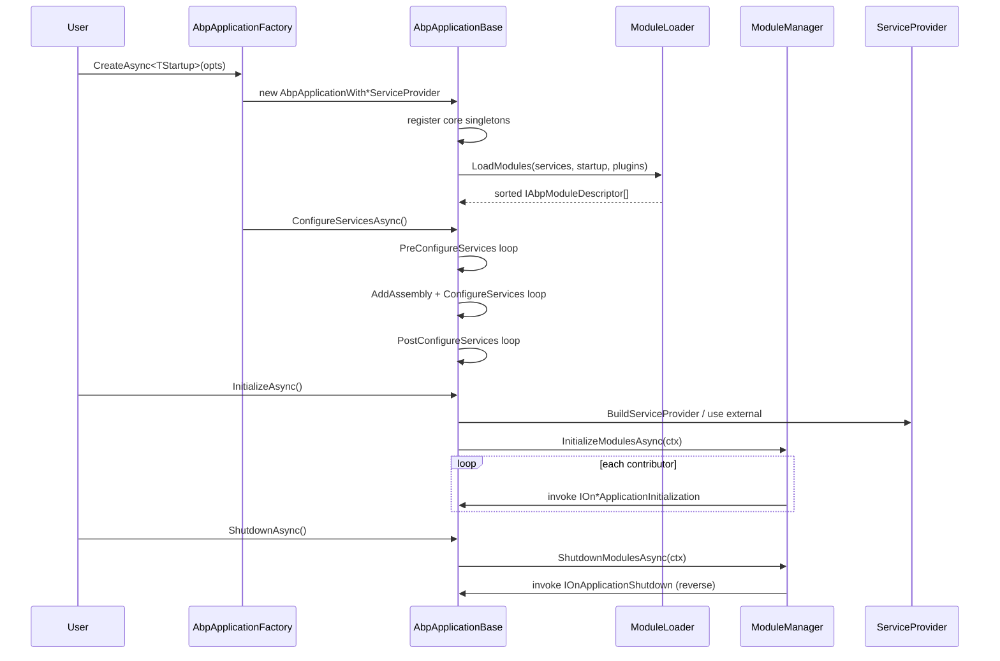

`AbpApplication` is the orchestrator that turns a startup module type into a configured, initialised host. Whether you are writing a console runner, an ASP.NET Core Web API, a worker service or a Blazor Server app, the same `AbpApplicationBase` runs the four lifecycle phases against the same `ServiceConfigurationContext`. The only thing that differs is **who owns the `IServiceProvider`** — ABP itself in the *internal* mode, or the generic host in the *external* mode.

## Source Map

| File | Role |
| --- | --- |
| `framework/src/Volo.Abp.Core/Volo/Abp/AbpApplicationFactory.cs` | Static façade with 8 overloads of `Create` / `CreateAsync`. |
| `framework/src/Volo.Abp.Core/Volo/Abp/AbpApplicationBase.cs` | Abstract base that owns module loading and the three configure passes. |
| `framework/src/Volo.Abp.Core/Volo/Abp/AbpApplicationWithInternalServiceProvider.cs` | Builds and disposes its own `IServiceScope`. |
| `framework/src/Volo.Abp.Core/Volo/Abp/AbpApplicationWithExternalServiceProvider.cs` | Accepts an externally-built `IServiceProvider`. |
| `framework/src/Volo.Abp.Core/Volo/Abp/AbpApplicationCreationOptions.cs` | Options bag: `Services`, `PlugInSources`, `Configuration`, `SkipConfigureServices`, `ApplicationName`, `Environment`. |
| `framework/src/Volo.Abp.Core/Volo/Abp/ApplicationInitializationContext.cs` | Carries scoped `IServiceProvider` into `IOn*ApplicationInitialization` hooks. |
| `framework/src/Volo.Abp.Core/Volo/Abp/ApplicationShutdownContext.cs` | Counterpart used during `Shutdown`. |
| `framework/src/Volo.Abp.Core/Volo/Abp/IAbpApplication.cs` | Public contract — exposes `Services`, `ServiceProvider`, `Modules`, `Shutdown(Async)`. |
| `framework/src/Volo.Abp.Core/Volo/Abp/IAbpApplicationWithInternalServiceProvider.cs` | Adds `CreateServiceProvider()` and `Initialize(Async)`. |
| `framework/src/Volo.Abp.Core/Volo/Abp/IAbpApplicationWithExternalServiceProvider.cs` | Adds `SetServiceProvider` and `Initialize(IServiceProvider)`. |

## Factory Entry

```csharp
// AbpApplicationFactory.cs
public async static Task<IAbpApplicationWithInternalServiceProvider> CreateAsync<TStartupModule>(
    Action<AbpApplicationCreationOptions>? optionsAction = null)
    where TStartupModule : IAbpModule
{
    var app = Create(typeof(TStartupModule), options =>
    {
        options.SkipConfigureServices = true;
        optionsAction?.Invoke(options);
    });
    await app.ConfigureServicesAsync();
    return app;
}
```

The async overloads always set `SkipConfigureServices = true` so the synchronous `ConfigureServices` pass is *not* run inside the constructor; the factory then calls the async `ConfigureServicesAsync` explicitly. The synchronous overloads (`Create<TStartupModule>`) skip that step — the constructor runs `ConfigureServices` itself.

`Create` exists in four shapes:

| Overload | Mode | Returns |
| --- | --- | --- |
| `Create<TStartup>(opts)` | internal | `IAbpApplicationWithInternalServiceProvider` |
| `Create(Type startupModule, opts)` | internal | `IAbpApplicationWithInternalServiceProvider` |
| `Create<TStartup>(IServiceCollection, opts)` | external | `IAbpApplicationWithExternalServiceProvider` |
| `Create(Type startupModule, IServiceCollection, opts)` | external | `IAbpApplicationWithExternalServiceProvider` |

Each overload also has a `CreateAsync` twin.

## Creation Modes

### Internal Service Provider

Used for console hosts, unit tests, or any place where ABP owns the DI container end-to-end. The class is `internal` — you obtain it via the factory.

```csharp
// AbpApplicationWithInternalServiceProvider.cs
public AbpApplicationWithInternalServiceProvider(Type startupModuleType,
    Action<AbpApplicationCreationOptions>? optionsAction)
    : this(startupModuleType, new ServiceCollection(), optionsAction) { }

public IServiceProvider CreateServiceProvider()
{
    if (ServiceProvider != null) return ServiceProvider;
    ServiceScope = Services.BuildServiceProviderFromFactory().CreateScope();
    SetServiceProvider(ServiceScope.ServiceProvider);
    return ServiceProvider!;
}

public async Task InitializeAsync()
{
    CreateServiceProvider();
    await InitializeModulesAsync();
    await SetupTelemetryTrackingAsync();
}
```

Key behaviour:

- Allocates its own `new ServiceCollection()`.
- `BuildServiceProviderFromFactory` checks for an `IServiceProviderFactory<TContainerBuilder>` registration (e.g. Autofac) and uses it when present — see `ServiceCollectionCommonExtensions.BuildServiceProviderFromFactory`.
- Owns the root `IServiceScope`; `Dispose` disposes that scope, releasing every scoped/singleton it created.
- `CreateServiceProvider` is idempotent — the second call returns the cached provider.

### External Service Provider

Used in ASP.NET Core where `WebApplicationBuilder`/`HostBuilder` owns the container. ABP only configures services and observes the lifecycle.

```csharp
// AbpApplicationWithExternalServiceProvider.cs
public async Task InitializeAsync(IServiceProvider serviceProvider)
{
    Check.NotNull(serviceProvider, nameof(serviceProvider));
    SetServiceProvider(serviceProvider);
    await InitializeModulesAsync();
    await SetupTelemetryTrackingAsync();
}
```

Constraints:

- The caller must pass the **same** `IServiceProvider` if they previously called `SetServiceProvider` — otherwise the implementation throws `AbpException("Service provider was already set before to another service provider instance.")`.
- `Dispose` disposes the external provider only if it implements `IDisposable`. The host normally manages lifetime.

## Lifecycle Phases

### Phase 1 — `LoadModules`

Inside `AbpApplicationBase`'s constructor:

```csharp
Modules = LoadModules(services, options); // returns IReadOnlyList<IAbpModuleDescriptor>
```

`LoadModules` delegates to `IModuleLoader` (`ModuleLoader.LoadModules`). It walks the `DependsOn` graph starting from `StartupModuleType`, appends modules contributed by `options.PlugInSources`, sets dependencies on each `AbpModuleDescriptor`, then topologically sorts so the startup module is last. See [Modularity](/framework/core/modularity).

### Phase 2 — `ConfigureServices`

`AbpApplicationBase.ConfigureServices(Async)` runs three sub-passes against a shared `ServiceConfigurationContext`:

1. **PreConfigureServices** — every module implementing `IPreConfigureServices`. This is where modules register `IConventionalRegistrar`s, `OnRegistered` callbacks, or feed shared state via `context.Items`.
2. **ConfigureServices** — every module. Before calling each module, `AbpApplicationBase` runs `Services.AddAssembly(assembly)` for each of the module's `AllAssemblies` (unless `SkipAutoServiceRegistration` is true). This triggers convention scanning for `ITransientDependency`/`IScopedDependency`/`ISingletonDependency`.
3. **PostConfigureServices** — every module implementing `IPostConfigureServices`. Used to finalise options that depend on what other modules registered.

After the three passes complete, each `AbpModule.ServiceConfigurationContext` reference is set back to `null` to prevent leaks.

`CheckMultipleConfigureServices` rejects a second call:

```csharp
if (_configuredServices)
    throw new AbpInitializationException(
        "Services have already been configured! If you call ConfigureServicesAsync method, " +
        "you must have set AbpApplicationCreationOptions.SkipConfigureServices to true before.");
```

### Phase 3 — `Initialize`

Both internal and external implementations delegate to `AbpApplicationBase.InitializeModules(Async)`:

```csharp
protected virtual async Task InitializeModulesAsync()
{
    using (var scope = ServiceProvider.CreateScope())
    {
        WriteInitLogs(scope.ServiceProvider);
        await scope.ServiceProvider.GetRequiredService<IModuleManager>()
            .InitializeModulesAsync(new ApplicationInitializationContext(scope.ServiceProvider));
    }
}
```

`ModuleManager` then iterates the four lifecycle contributors registered by `InternalServiceCollectionExtensions.AddCoreAbpServices`:

| Contributor (registration order) | Calls |
| --- | --- |
| `OnPreApplicationInitializationModuleLifecycleContributor` | `IOnPreApplicationInitialization.OnPreApplicationInitialization(Async)` |
| `OnApplicationInitializationModuleLifecycleContributor` | `IOnApplicationInitialization.OnApplicationInitialization(Async)` |
| `OnPostApplicationInitializationModuleLifecycleContributor` | `IOnPostApplicationInitialization.OnPostApplicationInitialization(Async)` |
| `OnApplicationShutdownModuleLifecycleContributor` | (used by `ShutdownModules`) |

For each contributor, `ModuleManager` walks modules in the dependency-sorted order so a module always initialises after its dependencies.

`WriteInitLogs` drains the `IInitLoggerFactory` buffer into the real `ILoggerFactory` — this is how messages produced during module loading (before the real logger existed) are flushed to the configured providers.

### Phase 4 — `Shutdown`

```csharp
public virtual async Task ShutdownAsync()
{
    using (var scope = ServiceProvider.CreateScope())
    {
        await scope.ServiceProvider.GetRequiredService<IModuleManager>()
            .ShutdownModulesAsync(new ApplicationShutdownContext(scope.ServiceProvider));
    }
}
```

`ModuleManager.ShutdownModulesAsync` reverses the module list (`_moduleContainer.Modules.Reverse()`) before running every lifecycle contributor again. This guarantees the startup module shuts down **first** and its dependencies shut down **last**, mirroring init order.

## Sequence



## `AbpApplicationCreationOptions`

```csharp
public class AbpApplicationCreationOptions
{
    public IServiceCollection Services { get; }
    public PlugInSourceList PlugInSources { get; }
    public AbpConfigurationBuilderOptions Configuration { get; }
    public bool SkipConfigureServices { get; set; }
    public string? ApplicationName { get; set; }
    public string? Environment { get; set; }
}
```

- `Services` is the same collection passed in (or freshly created). You can register pre-existing services here before module discovery happens.
- `PlugInSources` is a `PlugInSourceList` (folder/file/type sources) consumed by `ModuleLoader.FillModules`.
- `Configuration` is consulted **only** if no `IConfiguration` is already registered on the `IServiceCollection`. Otherwise the existing configuration wins. `ApplicationName` defaults to `configuration["ApplicationName"]`, then `Assembly.GetEntryAssembly().GetName().Name`.
- `Environment` populates `IAbpHostEnvironment.EnvironmentName`. If left blank it defaults to `Production` via `TryToSetEnvironment`.

## `Configure<TOptions>` Extension

`AbpModule` exposes a typed alias for the standard options system so module code reads like:

```csharp
// framework/src/Volo.Abp.Core/Volo/Abp/Modularity/AbpModule.cs
protected void Configure<TOptions>(Action<TOptions> configureOptions) where TOptions : class
    => ServiceConfigurationContext.Services.Configure(configureOptions);

protected void PreConfigure<TOptions>(Action<TOptions> configureOptions) where TOptions : class
    => ServiceConfigurationContext.Services.PreConfigure(configureOptions);

protected void PostConfigure<TOptions>(Action<TOptions> configureOptions) where TOptions : class
    => ServiceConfigurationContext.Services.PostConfigure(configureOptions);
```

`PreConfigure` and `PostConfigure` route through `ServiceCollectionPreConfigureExtensions.cs`, which captures actions in an `AbpPreConfigureActionList<TOptions>` invoked when the options instance is materialised. This is the mechanism that lets, for example, `AbpAuditingModule` add resources to `AbpLocalizationOptions` *after* the localization module configured them.

## Invariants and Gotchas

- **One configure pass.** Calling `ConfigureServices` twice throws — even mixing sync and async forms. Always pair `CreateAsync` with `ConfigureServicesAsync` (the factory does this for you), never call `ConfigureServices()` afterwards.
- **`ServiceConfigurationContext` is transient.** After `ConfigureServices` returns, the framework sets every module's `ServiceConfigurationContext` to `null!`. Accessing it from `OnApplicationInitialization` raises `AbpException`.
- **`StartupModuleType` is sorted last.** The startup module's `OnApplicationInitialization` runs after every dependency — useful when wiring middleware or seeding.
- **Internal mode disposes the scope.** `AbpApplicationWithInternalServiceProvider.Dispose` calls `ServiceScope?.Dispose()` which disposes every scoped singleton. Don't share the provider after `Dispose`.
- **External mode never disposes a non-disposable provider.** Disposal is delegated to the generic host.
- **`InstanceId`** is a `Guid` generated per `AbpApplicationBase` instance — useful for tracing.

See also: [Modularity](/framework/core/modularity) for `ModuleLoader` internals and lifecycle contributors, and [Dependency Injection](/framework/core/dependency-injection) for `BuildServiceProviderFromFactory` and Autofac integration.
