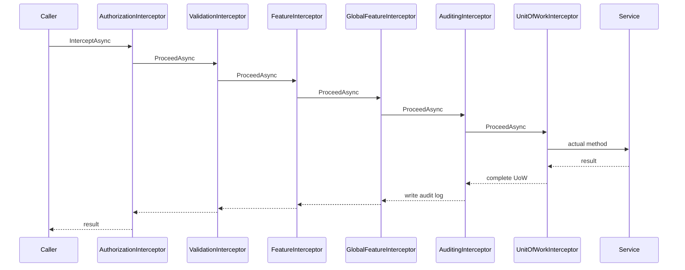

ABP keeps cross-cutting concerns — auditing, unit of work, authorisation, validation, feature checks, entity change tracking — out of your business code by routing every service call through a chain of interceptors. The abstraction lives in `framework/src/Volo.Abp.Core/Volo/Abp/DynamicProxy/` and `framework/src/Volo.Abp.Core/Volo/Abp/Aspects/`; the actual proxying is delegated to Castle DynamicProxy via the adapter in `framework/src/Volo.Abp.Castle.Core/`. This page traces the contracts, the registrar pattern that opts services in, and the four canonical interceptors shipped with the framework.

## Source Inventory

| File | Role |
| --- | --- |
| `Volo.Abp.Core/Volo/Abp/DynamicProxy/IAbpInterceptor.cs` | One-method contract: `Task InterceptAsync(IAbpMethodInvocation invocation)`. |
| `Volo.Abp.Core/Volo/Abp/DynamicProxy/AbpInterceptor.cs` | Abstract base — exists so every interceptor has the same shape. |
| `Volo.Abp.Core/Volo/Abp/DynamicProxy/IAbpMethodInvocation.cs` | Invocation context: `Arguments`, `ArgumentsDictionary`, `Method`, `TargetObject`, `ReturnValue`, `ProceedAsync()`. |
| `Volo.Abp.Core/Volo/Abp/DynamicProxy/ProxyHelper.cs` | Strips proxy wrappers when reflecting back to the real type. |
| `Volo.Abp.Core/Volo/Abp/DynamicProxy/DynamicProxyIgnoreTypes.cs` | Static list of types that should never be proxied. |
| `Volo.Abp.Core/Volo/Abp/Aspects/AbpCrossCuttingConcerns.cs` | Concern-name constants + `AddApplied`/`IsApplied`/`Applying` helpers to avoid double-running an aspect. |
| `Volo.Abp.Core/Volo/Abp/Aspects/IAvoidDuplicateCrossCuttingConcerns.cs` | Marker interface a target class implements to own a per-instance `AppliedCrossCuttingConcerns` list. |
| `Volo.Abp.Castle.Core/Volo/Abp/Castle/DynamicProxy/AbpAsyncDeterminationInterceptor.cs` | Generic Castle interceptor that wraps an `IAbpInterceptor` and bridges sync/async correctly. |
| `Volo.Abp.Castle.Core/Volo/Abp/Castle/DynamicProxy/CastleAsyncAbpInterceptorAdapter.cs` | Translates Castle's `IInvocation` ↔ ABP's `IAbpMethodInvocation`. |
| `Volo.Abp.Castle.Core/Volo/Abp/Castle/DynamicProxy/CastleAbpMethodInvocationAdapter.cs` | Concrete `IAbpMethodInvocation` over a Castle `IInvocation`. |

## The `IAbpInterceptor` Contract

```csharp
// framework/src/Volo.Abp.Core/Volo/Abp/DynamicProxy/IAbpInterceptor.cs
public interface IAbpInterceptor
{
    Task InterceptAsync(IAbpMethodInvocation invocation);
}

// framework/src/Volo.Abp.Core/Volo/Abp/DynamicProxy/AbpInterceptor.cs
public abstract class AbpInterceptor : IAbpInterceptor
{
    public abstract Task InterceptAsync(IAbpMethodInvocation invocation);
}
```

An interceptor's job is to wrap `invocation.ProceedAsync()` with whatever cross-cutting behaviour it owns. The `IAbpMethodInvocation` surface lets it inspect arguments, generic parameters, the target object, the `MethodInfo`, and even mutate `ReturnValue`:

```csharp
// framework/src/Volo.Abp.Core/Volo/Abp/DynamicProxy/IAbpMethodInvocation.cs
public interface IAbpMethodInvocation
{
    object?[] Arguments { get; }
    IReadOnlyDictionary<string, object?> ArgumentsDictionary { get; }
    Type[]? GenericArguments { get; }
    object? TargetObject { get; }
    MethodInfo Method { get; }
    object ReturnValue { get; set; }
    Task ProceedAsync();
}
```

## Avoiding Duplicate Application

When a single call walks through multiple proxies — e.g. an application service calling another application service in-process — naively applying auditing twice would create duplicate audit log entries. The `Aspects` namespace provides constants and helpers to gate behaviour:

```csharp
// framework/src/Volo.Abp.Core/Volo/Abp/Aspects/AbpCrossCuttingConcerns.cs
public const string Auditing            = "AbpAuditing";
public const string UnitOfWork          = "AbpUnitOfWork";
public const string FeatureChecking     = "AbpFeatureChecking";
public const string GlobalFeatureChecking = "AbpGlobalFeatureChecking";

public static IDisposable Applying(object obj, params string[] concerns)
{
    AddApplied(obj, concerns);
    return new DisposeAction<(object, string[])>(static (state) =>
    {
        var (obj, concerns) = state;
        RemoveApplied(obj, concerns);
    }, (obj, concerns));
}
```

Any target that implements `IAvoidDuplicateCrossCuttingConcerns` owns a `List<string> AppliedCrossCuttingConcerns` — `ApplicationService` is one such target. Interceptors check `AbpCrossCuttingConcerns.IsApplied(target, "AbpAuditing")` before doing work and short-circuit when the concern is already in flight.

## The Registrar Pattern

Interceptors are not attached eagerly. Each module that owns an aspect publishes a static `*InterceptorRegistrar` and registers it through `services.OnRegistered(...)` during `PreConfigureServices`. The registrar inspects the implementation type and, if applicable, calls `context.Interceptors.TryAdd<TInterceptor>()`:

```csharp
// framework/src/Volo.Abp.Auditing/Volo/Abp/Auditing/AuditingInterceptorRegistrar.cs
public static void RegisterIfNeeded(IOnServiceRegistredContext context)
{
    if (ShouldIntercept(context.ImplementationType))
        context.Interceptors.TryAdd<AuditingInterceptor>();
}

private static bool ShouldIntercept(Type type)
{
    if (DynamicProxyIgnoreTypes.Contains(type)) return false;
    if (ShouldAuditTypeByDefaultOrNull(type, ignoreIntegrationServiceAttribute: true) == true) return true;
    if (type.GetMethods().Any(m => m.IsDefined(typeof(AuditedAttribute), true))) return true;
    return false;
}
```

The full set of registrars shipped in the framework:

| Registrar | File |
| --- | --- |
| `AuditingInterceptorRegistrar` | `framework/src/Volo.Abp.Auditing/Volo/Abp/Auditing/AuditingInterceptorRegistrar.cs` |
| `AuthorizationInterceptorRegistrar` | `framework/src/Volo.Abp.Authorization/Volo/Abp/Authorization/AuthorizationInterceptorRegistrar.cs` |
| `UnitOfWorkInterceptorRegistrar` | `framework/src/Volo.Abp.Uow/Volo/Abp/Uow/UnitOfWorkInterceptorRegistrar.cs` |
| `ValidationInterceptorRegistrar` | `framework/src/Volo.Abp.Validation/Volo/Abp/Validation/ValidationInterceptorRegistrar.cs` |
| `FeatureInterceptorRegistrar` | `framework/src/Volo.Abp.Features/Volo/Abp/Features/FeatureInterceptorRegistrar.cs` |
| `GlobalFeatureInterceptorRegistrar` | `framework/src/Volo.Abp.GlobalFeatures/Volo/Abp/GlobalFeatures/GlobalFeatureInterceptorRegistrar.cs` |
| `ChangeTrackingInterceptorRegistrar` | `framework/src/Volo.Abp.Ddd.Domain/Volo/Abp/Domain/ChangeTracking/ChangeTrackingInterceptorRegistrar.cs` |

Modules wire them up in the same `PreConfigureServices` block (see e.g. `AbpDddDomainModule` which registers `ChangeTrackingInterceptorRegistrar.RegisterIfNeeded`).

## Ordering

`context.Interceptors` is an `ITypeList<IAbpInterceptor>` — registrars `TryAdd` in the order their owning modules are initialised. The de facto order for an application service is therefore:



Because modules can be loaded in any order, the exact runtime order depends on the dependency graph; what matters is that each interceptor is idempotent (gated by `AbpCrossCuttingConcerns.IsApplied`) and that the unit-of-work interceptor is closest to the service so the UoW commits inside the audit scope.

## Canonical Interceptors

### `AuditingInterceptor`

Wraps the method in an audit-log scope managed by `IAuditingManager`:

```csharp
// framework/src/Volo.Abp.Auditing/Volo/Abp/Auditing/AuditingInterceptor.cs
public override async Task InterceptAsync(IAbpMethodInvocation invocation)
{
    using (var serviceScope = _serviceScopeFactory.CreateScope())
    {
        var auditingHelper  = serviceScope.ServiceProvider.GetRequiredService<IAuditingHelper>();
        var auditingOptions = serviceScope.ServiceProvider.GetRequiredService<IOptions<AbpAuditingOptions>>().Value;

        if (!ShouldIntercept(invocation, auditingOptions, auditingHelper)) {
            await invocation.ProceedAsync(); return;
        }

        var auditingManager = serviceScope.ServiceProvider.GetRequiredService<IAuditingManager>();
        if (auditingManager.Current != null)
            await ProceedByLoggingAsync(invocation, auditingOptions, auditingHelper, auditingManager.Current);
        else
            await ProcessWithNewAuditingScopeAsync(/*…*/);
    }
}
```

Note the use of `IAuditingManager.Current` to detect nesting; when a scope already exists, the interceptor logs into it instead of opening a new one.

### `AuthorizationInterceptor`

A clean two-liner that delegates to `IMethodInvocationAuthorizationService`:

```csharp
// framework/src/Volo.Abp.Authorization/Volo/Abp/Authorization/AuthorizationInterceptor.cs
public override async Task InterceptAsync(IAbpMethodInvocation invocation)
{
    await AuthorizeAsync(invocation);
    await invocation.ProceedAsync();
}

protected virtual async Task AuthorizeAsync(IAbpMethodInvocation invocation)
{
    await _methodInvocationAuthorizationService.CheckAsync(
        new MethodInvocationAuthorizationContext(invocation.Method));
}
```

The check inspects `[Authorize]` / `[AllowAnonymous]` attributes on the method or class and calls `IAuthorizationService`.

### `UnitOfWorkInterceptor`

Opens a `IUnitOfWork` if the method is decorated (or implicitly UoW-enabled via `IUnitOfWorkEnabled`) and completes it on success:

```csharp
// framework/src/Volo.Abp.Uow/Volo/Abp/Uow/UnitOfWorkInterceptor.cs
public override async Task InterceptAsync(IAbpMethodInvocation invocation)
{
    if (!UnitOfWorkHelper.IsUnitOfWorkMethod(invocation.Method, out var unitOfWorkAttribute))
    {
        await invocation.ProceedAsync();
        return;
    }

    using (var scope = _serviceScopeFactory.CreateScope())
    {
        var options = CreateOptions(scope.ServiceProvider, invocation, unitOfWorkAttribute);
        var unitOfWorkManager = scope.ServiceProvider.GetRequiredService<IUnitOfWorkManager>();

        if (unitOfWorkManager.TryBeginReserved(UnitOfWork.UnitOfWorkReservationName, options))
        {
            await invocation.ProceedAsync();
            if (unitOfWorkManager.Current != null)
                await unitOfWorkManager.Current.SaveChangesAsync();
            return;
        }

        using (var uow = unitOfWorkManager.Begin(options))
        {
            await invocation.ProceedAsync();
            await uow.CompleteAsync();
        }
    }
}
```

The `TryBeginReserved` branch is how the ASP.NET Core middleware reserves a UoW per HTTP request before any application service runs.

### `ValidationInterceptor`

Runs FluentValidation + DataAnnotations + custom validators registered with `IMethodInvocationValidator`:

```csharp
// framework/src/Volo.Abp.Validation/Volo/Abp/Validation/ValidationInterceptor.cs
public override async Task InterceptAsync(IAbpMethodInvocation invocation)
{
    await ValidateAsync(invocation);
    await invocation.ProceedAsync();
}

protected virtual async Task ValidateAsync(IAbpMethodInvocation invocation)
{
    await _methodInvocationValidator.ValidateAsync(
        new MethodInvocationValidationContext(
            invocation.TargetObject, invocation.Method, invocation.Arguments));
}
```

If any argument is invalid the validator throws `AbpValidationException`, which the ASP.NET Core middleware converts to a 400 response.

## Castle DynamicProxy Bridge

The Castle adapter is a thin generic shim:

```csharp
// framework/src/Volo.Abp.Castle.Core/Volo/Abp/Castle/DynamicProxy/AbpAsyncDeterminationInterceptor.cs
public class AbpAsyncDeterminationInterceptor<TInterceptor> : AsyncDeterminationInterceptor
    where TInterceptor : IAbpInterceptor
{
    public AbpAsyncDeterminationInterceptor(TInterceptor abpInterceptor)
        : base(new CastleAsyncAbpInterceptorAdapter<TInterceptor>(abpInterceptor))
    {
    }
}
```

It subclasses Castle's `AsyncDeterminationInterceptor` (which figures out whether the intercepted method is `Task`, `Task<T>` or synchronous) and forwards work to a `CastleAsyncAbpInterceptorAdapter`, which in turn wraps Castle's `IInvocation` in a `CastleAbpMethodInvocationAdapter` so the ABP interceptor sees a uniform `IAbpMethodInvocation`. With the Autofac integration enabled, Autofac registers proxies for any service whose registered interceptors are non-empty.

## Disabling Interception

For a specific type implementing markers but where you do not want proxying, add it to `DynamicProxyIgnoreTypes` or use `services.DisableAbpClassInterceptors(NamedTypeSelector)` (defined in `ServiceCollectionRegistrationActionExtensions.cs`).

## Related Pages

<CardGroup cols={2}>
  <Card title="Dependency Injection" icon="syringe" href="/framework/core/dependency-injection">
    The `OnRegistered` pipeline that places interceptors on each service.
  </Card>
  <Card title="Exception Handling" icon="triangle-exclamation" href="/framework/core/exception-handling">
    What happens when an interceptor (or the wrapped method) throws.
  </Card>
  <Card title="Application Services" icon="cogs" href="/framework/ddd/application-services">
    The primary target of these interceptors at runtime.
  </Card>
  <Card title="Glossary" icon="book" href="/overview/glossary">
    Names and source files for every interceptor and aspect.
  </Card>
</CardGroup>
