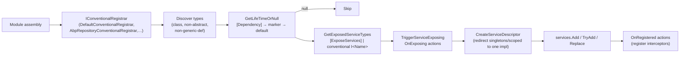

ABP builds its DI story on top of `Microsoft.Extensions.DependencyInjection` without forking it. The runtime walks every module assembly with a chain of `IConventionalRegistrar` scanners, decides each class's lifetime from marker interfaces (`ITransientDependency`, `IScopedDependency`, `ISingletonDependency`) or a `[Dependency]` override, looks up its public contracts via `[ExposeServices]`, then fires a fan-out of `OnRegistered` callbacks so cross-cutting modules (auditing, UoW, validation, authorisation) can attach interceptors. This page traces that pipeline through the real types in `framework/src/Volo.Abp.Core/Volo/Abp/DependencyInjection/`, then describes the optional Autofac host that turns property injection on.

## Pipeline at a Glance



## Source Inventory

| File | Role |
| --- | --- |
| `ITransientDependency.cs` | Marker → `ServiceLifetime.Transient`. |
| `IScopedDependency.cs` | Marker → `ServiceLifetime.Scoped`. |
| `ISingletonDependency.cs` | Marker → `ServiceLifetime.Singleton`. |
| `DependencyAttribute.cs` | Class attribute that overrides lifetime and toggles `TryRegister`/`ReplaceServices`. |
| `ExposeServicesAttribute.cs` | Declares the contracts a class is exposed as, with `IncludeDefaults`/`IncludeSelf` switches. |
| `IConventionalRegistrar.cs` | Scanner contract: `AddAssembly`, `AddTypes`, `AddType`. |
| `ConventionalRegistrarBase.cs` | Base scanner; filters types, fires exposing actions, builds `ServiceDescriptor`s. |
| `DefaultConventionalRegistrar.cs` | Built-in registrar applied to every assembly. |
| `ExposedServiceExplorer.cs` | Looks up `[ExposeServices]` providers and assembles the final type list. |
| `OnServiceRegistredContext.cs` | Argument passed to `OnRegistered` callbacks; carries `Interceptors`, `ImplementationType`, `ServiceKey`. |
| `OnServiceExposingContext.cs` | Argument passed to `OnExposing` callbacks. |
| `ObjectAccessor.cs` | Late-bound singleton holder used to publish state from `ConfigureServices` to runtime. |
| `Microsoft/Extensions/DependencyInjection/ServiceCollectionConventionalRegistrationExtensions.cs` | `AddConventionalRegistrar` + `AddAssembly` / `AddTypes` helpers. |
| `Microsoft/Extensions/DependencyInjection/ServiceCollectionRegistrationActionExtensions.cs` | `OnRegistered`, `OnExposing`, `DisableAbpClassInterceptors`. |

## Marker Interfaces

The three lifetime markers are deliberately empty so they cost nothing to implement:

```csharp
// framework/src/Volo.Abp.Core/Volo/Abp/DependencyInjection/ITransientDependency.cs
namespace Volo.Abp.DependencyInjection;

public interface ITransientDependency
{
}
```

`IScopedDependency` and `ISingletonDependency` are identical in shape. `ConventionalRegistrarBase.GetServiceLifetimeFromClassHierarchy` resolves them top-down (transient wins over singleton wins over scoped if you implement multiple, which you should not):

```csharp
// framework/src/Volo.Abp.Core/Volo/Abp/DependencyInjection/ConventionalRegistrarBase.cs
protected virtual ServiceLifetime? GetServiceLifetimeFromClassHierarchy(Type type)
{
    if (typeof(ITransientDependency).GetTypeInfo().IsAssignableFrom(type))
        return ServiceLifetime.Transient;
    if (typeof(ISingletonDependency).GetTypeInfo().IsAssignableFrom(type))
        return ServiceLifetime.Singleton;
    if (typeof(IScopedDependency).GetTypeInfo().IsAssignableFrom(type))
        return ServiceLifetime.Scoped;
    return null;
}
```

If a type implements no marker and carries no `[Dependency]`, `DefaultConventionalRegistrar` returns `null` and skips it — that is what allows POCO entities, DTOs and helper classes to live in the same assembly without polluting the container.

## `[Dependency]` Attribute

`DependencyAttribute` is the explicit override:

```csharp
// framework/src/Volo.Abp.Core/Volo/Abp/DependencyInjection/DependencyAttribute.cs
public class DependencyAttribute : Attribute
{
    public virtual ServiceLifetime? Lifetime { get; set; }
    public virtual bool TryRegister { get; set; }
    public virtual bool ReplaceServices { get; set; }
    public DependencyAttribute() { }
    public DependencyAttribute(ServiceLifetime lifetime) { Lifetime = lifetime; }
}
```

Three knobs:

- `Lifetime` — beats marker-interface inheritance (`GetLifeTimeOrNull` looks at the attribute first).
- `TryRegister = true` — routes the descriptor through `IServiceCollection.TryAdd` so an already-registered service wins.
- `ReplaceServices = true` — routes through `Replace`, evicting any previous registration. Used for swapping in mocks/customisations.

## `[ExposeServices]` & Default Discovery

By default ABP exposes a class as itself plus every interface whose name (minus the leading `I`) matches the class name suffix. The logic lives in `ExposeServicesAttribute.GetDefaultServices`:

```csharp
// framework/src/Volo.Abp.Core/Volo/Abp/DependencyInjection/ExposeServicesAttribute.cs
foreach (var interfaceType in type.GetTypeInfo().GetInterfaces())
{
    var interfaceName = interfaceType.Name;
    if (interfaceType.IsGenericType)
        interfaceName = interfaceType.Name.Left(interfaceType.Name.IndexOf('`'));
    if (interfaceName.StartsWith("I"))
        interfaceName = interfaceName.Right(interfaceName.Length - 1);
    if (type.Name.EndsWith(interfaceName, StringComparison.OrdinalIgnoreCase))
        serviceTypes.Add(interfaceType);
}
```

So `class UserAppService : IUserAppService` is automatically exposed as `IUserAppService` — but `class SmtpEmailSender : IEmailSender, IDisposable` is only exposed as `IEmailSender` (name match), and not `IDisposable`. To force a specific list, decorate the class:

```csharp
[ExposeServices(typeof(IEmailSender), typeof(ISmtpEmailSender), IncludeSelf = true)]
public class SmtpEmailSender : IEmailSender, ISmtpEmailSender, ITransientDependency { }
```

`AmbientUnitOfWork` in `framework/src/Volo.Abp.Uow/Volo/Abp/Uow/AmbientUnitOfWork.cs` is a real example:

```csharp
[ExposeServices(typeof(IAmbientUnitOfWork), typeof(IUnitOfWorkAccessor))]
public class AmbientUnitOfWork : IAmbientUnitOfWork, ISingletonDependency { /* … */ }
```

## `DefaultConventionalRegistrar`

This is the registrar that runs on every assembly added through `services.AddAssembly(...)`:

```csharp
// framework/src/Volo.Abp.Core/Volo/Abp/DependencyInjection/DefaultConventionalRegistrar.cs
public class DefaultConventionalRegistrar : ConventionalRegistrarBase
{
    public override void AddType(IServiceCollection services, Type type)
    {
        if (IsConventionalRegistrationDisabled(type)) return;

        var dependencyAttribute = GetDependencyAttributeOrNull(type);
        var lifeTime = GetLifeTimeOrNull(type, dependencyAttribute);
        if (lifeTime == null) return;

        var exposedServiceAndKeyedServiceTypes =
            GetExposedKeyedServiceTypes(type)
                .Concat(GetExposedServiceTypes(type).Select(t => new ServiceIdentifier(t)))
                .ToList();

        TriggerServiceExposing(services, type, exposedServiceAndKeyedServiceTypes);

        foreach (var exposedServiceType in exposedServiceAndKeyedServiceTypes)
        {
            var serviceDescriptor = CreateServiceDescriptor(
                type, exposedServiceType.ServiceKey, exposedServiceType.ServiceType,
                /* allExposingServiceTypes */ ..., lifeTime.Value);

            if (dependencyAttribute?.ReplaceServices == true)      services.Replace(serviceDescriptor);
            else if (dependencyAttribute?.TryRegister == true)     services.TryAdd(serviceDescriptor);
            else                                                   services.Add(serviceDescriptor);
        }
    }
}
```

Three important details:

1. `[DisableConventionalRegistration]` (`DisableConventionalRegistrationAttribute.cs`) skips the type entirely — useful for hand-registered services.
2. `CreateServiceDescriptor` (in `ConventionalRegistrarBase`) detects when a class is exposed as **multiple** services at `Singleton` or `Scoped` lifetime, and redirects extra service descriptors to a single underlying implementation via `provider.GetService(redirectedType)`. Without this, you'd accidentally get two separate singletons for one class implementing two interfaces.
3. Keyed services are first-class: `ExposeKeyedServiceAttribute` lives next to `ExposeServicesAttribute` and feeds the same descriptor pipeline.

## Adding Custom Registrars

A module wires extra scanners during `PreConfigureServices`. For instance the DDD domain module adds a repository-aware registrar:

```csharp
// framework/src/Volo.Abp.Ddd.Domain/Volo/Abp/Domain/AbpDddDomainModule.cs
public override void PreConfigureServices(ServiceConfigurationContext context)
{
    context.Services.AddConventionalRegistrar(new AbpRepositoryConventionalRegistrar());
    context.Services.OnRegistered(ChangeTrackingInterceptorRegistrar.RegisterIfNeeded);
}
```

`AddConventionalRegistrar` lives in `Microsoft/Extensions/DependencyInjection/ServiceCollectionConventionalRegistrationExtensions.cs`. It seeds the registrar list with `DefaultConventionalRegistrar` on first call and appends yours:

```csharp
private static ConventionalRegistrarList GetOrCreateRegistrarList(IServiceCollection services)
{
    var conventionalRegistrars = services
        .GetSingletonInstanceOrNull<IObjectAccessor<ConventionalRegistrarList>>()?.Value;
    if (conventionalRegistrars == null)
    {
        conventionalRegistrars = new ConventionalRegistrarList { new DefaultConventionalRegistrar() };
        services.AddObjectAccessor(conventionalRegistrars);
    }
    return conventionalRegistrars;
}
```

`AbpApplicationBase` then invokes `services.AddAssembly(moduleAssembly)` for every loaded module, which iterates `GetConventionalRegistrars()` and calls `AddAssembly` on each.

## OnRegistered Pipeline

`OnRegistered` is how cross-cutting modules silently attach interceptors. Whenever `ConventionalRegistrarBase.CreateServiceDescriptor` produces a descriptor, ABP calls every registered action with an `IOnServiceRegistredContext`:

```csharp
// framework/src/Volo.Abp.Core/Volo/Abp/DependencyInjection/IOnServiceRegistredContext.cs
public interface IOnServiceRegistredContext
{
    ITypeList<IAbpInterceptor> Interceptors { get; }
    Type ImplementationType { get; }
    object? ServiceKey { get; }
}
```

A registrar inspects the type and `Interceptors.TryAdd<…>()` the relevant interceptor:

```csharp
// framework/src/Volo.Abp.Auditing/Volo/Abp/Auditing/AuditingInterceptorRegistrar.cs
public static void RegisterIfNeeded(IOnServiceRegistredContext context)
{
    if (ShouldIntercept(context.ImplementationType))
        context.Interceptors.TryAdd<AuditingInterceptor>();
}
```

Modules subscribe via `services.OnRegistered(AuditingInterceptorRegistrar.RegisterIfNeeded)` in their `PreConfigureServices`. The collected interceptors are later realised by the Castle DynamicProxy adapter (see [Aspects & Interceptors](/framework/core/aspects-and-interceptors)).

## OnExposing Pipeline

`OnExposing` runs **before** the descriptor is built. Use it to rewrite or filter the exposed service list — for example, hiding integration services from the public API surface. The plumbing is symmetric to `OnRegistered` and lives in the same `ServiceCollectionRegistrationActionExtensions.cs`.

## `IObjectAccessor<T>`

`ObjectAccessor<T>` is the bridge for state that is known at `ConfigureServices` time but consumed at runtime:

```csharp
// framework/src/Volo.Abp.Core/Volo/Abp/DependencyInjection/ObjectAccessor.cs
public class ObjectAccessor<T> : IObjectAccessor<T>
{
    public T? Value { get; set; }
    public ObjectAccessor() { }
    public ObjectAccessor(T? obj) { Value = obj; }
}
```

`services.AddObjectAccessor(instance)` registers it as a singleton; the framework later mutates `Value` once the real object exists. The conventional-registrar list itself is stored this way (see snippet above).

## Hybrid Autofac

`Microsoft.Extensions.DependencyInjection` does not support property injection. ABP keeps `IServiceCollection` as the canonical registration API but lets you swap the **container** for Autofac, which honours property injection on opt-in interfaces and supports interception natively. The integration lives in `framework/src/Volo.Abp.Autofac/`:

| File | Purpose |
| --- | --- |
| `Volo/Abp/Autofac/AbpAutofacServiceProviderFactory.cs` | `IServiceProviderFactory<ContainerBuilder>` that Host.Builder calls in place of the default factory. |
| `Volo/Abp/Autofac/AbpAutofacModule.cs` | Hooks property selectors and the `IInjectPropertiesService` implementation. |
| `Volo/Abp/Autofac/AbpPropertySelector.cs` | Selects which properties Autofac will set (skipping read-only / `[Inject]`-less properties as configured). |
| `Volo/Abp/Autofac/AutoFacInjectPropertiesService.cs` | Implements `IInjectPropertiesService` used by `RootServiceProvider`. |
| `Autofac/Extensions/DependencyInjection/AutofacRegistration.cs` | Bridges `ServiceDescriptor`s into `ContainerBuilder`. |

Standard wiring in a host program:

```csharp
Host.CreateDefaultBuilder(args)
    .UseAutofac()                       // from Volo.Abp.Autofac
    .ConfigureServices((ctx, services) =>
    {
        services.AddApplicationAsync<MyHostModule>();
    });
```

With Autofac in place, every `protected` property typed against an ABP service (e.g. `protected ILogger<T> Logger { get; set; }` in `ApplicationService`) is auto-populated — that is why most ABP base classes use property injection for ambient dependencies and constructor injection only for required ones.

## Related Pages

<CardGroup cols={2}>
  <Card title="Modularity" icon="cube" href="/framework/core/modularity">
    Module lifecycle (`PreConfigureServices` → `ConfigureServices` → init).
  </Card>
  <Card title="Aspects & Interceptors" icon="layer-group" href="/framework/core/aspects-and-interceptors">
    What the `OnRegistered` interceptors actually do at call time.
  </Card>
  <Card title="ABP Application" icon="play" href="/framework/core/abp-application">
    `IAbpApplication`, `AbpApplicationFactory`, internal vs external SP.
  </Card>
  <Card title="Glossary" icon="book" href="/overview/glossary">
    One-line definitions of every DI marker and helper.
  </Card>
</CardGroup>
