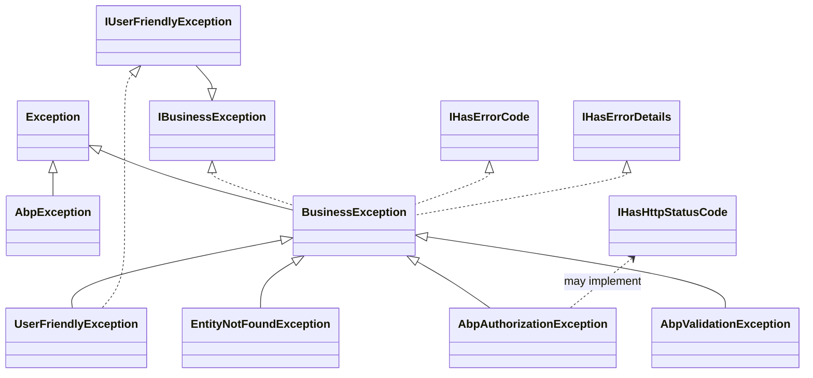

ABP turns exceptions into a typed, localisable response contract. The runtime classifies every exception via marker interfaces (`IBusinessException`, `IUserFriendlyException`, `IHasErrorCode`, `IHasHttpStatusCode`), notifies any `IExceptionSubscriber`, then — in an HTTP host — serialises a `RemoteServiceErrorInfo` JSON envelope and chooses an HTTP status code. This page maps the pieces, all rooted in `framework/src/Volo.Abp.Core/Volo/Abp/ExceptionHandling/`, `framework/src/Volo.Abp.ExceptionHandling/` and `framework/src/Volo.Abp.AspNetCore/Volo/Abp/AspNetCore/ExceptionHandling/`.

## Layered Source Inventory

### Core abstractions — `Volo.Abp.Core`

| File | Purpose |
| --- | --- |
| `Volo/Abp/IBusinessException.cs` | Marker — exceptions a sane user could provoke (not bugs). |
| `Volo/Abp/IUserFriendlyException.cs` | Marker that **extends** `IBusinessException`; the message can be shown directly to the user. |
| `Volo/Abp/BusinessException.cs` | Default `Exception` subclass with `Code`, `Details`, `LogLevel`, `WithData(...)`. |
| `Volo/Abp/UserFriendlyException.cs` | `BusinessException` + `IUserFriendlyException`. |
| `Volo/Abp/AbpException.cs` | Generic framework exception (programmer error). |
| `Volo/Abp/ExceptionHandling/IHasErrorCode.cs` | Exposes a stable `Code` string (e.g. `"Volo.Identity:010001"`). |
| `Volo/Abp/ExceptionHandling/IHasErrorDetails.cs` | Adds a long-form `Details` blob. |
| `Volo/Abp/ExceptionHandling/IHasHttpStatusCode.cs` | Adds an integer `HttpStatusCode` that overrides the default mapping. |
| `Volo/Abp/ExceptionHandling/ILocalizeErrorMessage.cs` | Opts the exception into localisation. |
| `Volo/Abp/ExceptionHandling/IExceptionNotifier.cs` | Fan-out: `NotifyAsync(ExceptionNotificationContext)`. |
| `Volo/Abp/ExceptionHandling/IExceptionSubscriber.cs` | One-shot subscriber: `HandleAsync(ExceptionNotificationContext)`. |
| `Volo/Abp/ExceptionHandling/ExceptionNotificationContext.cs` | Carries `Exception`, `LogLevel`, `Handled`. |
| `Volo/Abp/ExceptionHandling/ExceptionNotifier.cs` | Default implementation that resolves and invokes every `IExceptionSubscriber` inside a fresh scope. |
| `Volo/Abp/ExceptionHandling/ExceptionSubscriber.cs` | Abstract base for subscribers. |
| `Volo/Abp/ExceptionHandling/NullExceptionNotifier.cs` | No-op default. |

### Wiring module — `Volo.Abp.ExceptionHandling`

| File | Purpose |
| --- | --- |
| `Volo/Abp/ExceptionHandling/AbpExceptionHandlingModule.cs` | Registers the localisation resource and virtual JSON file set; depends on `AbpLocalizationModule` + `AbpDataModule`. |
| `Volo/Abp/ExceptionHandling/AbpExceptionHandlingConsts.cs` | Constants: `Unauthorized`, `InvalidToken`, `SessionExpired`. |
| `Volo/Abp/ExceptionHandling/Localization/AbpExceptionHandlingResource.cs` | Localisation resource pulling `Localization/*.json`. |
| `Volo/Abp/Domain/Entities/EntityNotFoundException.cs` | DDD-specific 404 exception (carries entity type + key). |
| `Volo/Abp/AspNetCore/ExceptionHandling/AbpExceptionHandlingOptions.cs` | Options bag — `SendExceptionsDetailsToClients`, `SendStackTraceToClients`. |
| `Volo/Abp/AspNetCore/ExceptionHandling/IExceptionToErrorInfoConverter.cs` | Maps an `Exception` to a `RemoteServiceErrorInfo`. |
| `Volo/Abp/AspNetCore/ExceptionHandling/DefaultExceptionToErrorInfoConverter.cs` | Production converter — handles auth, validation, EFCore, remote errors. |
| `Volo/Abp/Http/Client/AbpRemoteCallException.cs` | Exception raised when a typed HTTP client receives a non-2xx with a `RemoteServiceErrorInfo` payload. |

### ASP.NET Core integration — `Volo.Abp.AspNetCore`

| File | Purpose |
| --- | --- |
| `Volo/Abp/AspNetCore/ExceptionHandling/AbpExceptionHandlingMiddleware.cs` | Catches unhandled exceptions, writes the JSON envelope, clears caching headers. |
| `Volo/Abp/AspNetCore/ExceptionHandling/IHttpExceptionStatusCodeFinder.cs` | Maps `Exception → HttpStatusCode`. |
| `Volo/Abp/AspNetCore/ExceptionHandling/DefaultHttpExceptionStatusCodeFinder.cs` | Default mapping (see table below). |
| `Volo/Abp/AspNetCore/ExceptionHandling/AbpExceptionHttpStatusCodeOptions.cs` | Lets modules map their own error codes to HTTP statuses. |
| `Volo/Abp/AspNetCore/ExceptionHandling/IAbpAuthorizationExceptionHandler.cs` | Hook for redirect/return-401 behaviour on auth failures. |
| `Volo/Abp/AspNetCore/ExceptionHandling/DefaultAbpAuthorizationExceptionHandler.cs` | Implementation backed by `AbpAuthorizationExceptionHandlerOptions`. |

## Exception Taxonomy



The two markers are deliberately empty interfaces — they are pattern-matched everywhere from middleware to the SignalR hub filter:

```csharp
// framework/src/Volo.Abp.Core/Volo/Abp/IBusinessException.cs
public interface IBusinessException { }

// framework/src/Volo.Abp.Core/Volo/Abp/IUserFriendlyException.cs
public interface IUserFriendlyException : IBusinessException { }
```

`BusinessException` itself is rich:

```csharp
// framework/src/Volo.Abp.Core/Volo/Abp/BusinessException.cs
public class BusinessException : Exception,
    IBusinessException, IHasErrorCode, IHasErrorDetails, IHasLogLevel
{
    public string? Code     { get; set; }
    public string? Details  { get; set; }
    public LogLevel LogLevel { get; set; }

    public BusinessException(
        string? code = null, string? message = null, string? details = null,
        Exception? innerException = null, LogLevel logLevel = LogLevel.Warning)
        : base(message, innerException)
    {
        Code = code; Details = details; LogLevel = logLevel;
    }

    public BusinessException WithData(string name, object value)
    {
        Data[name] = value;
        return this;
    }
}
```

## Notification Fan-Out

`IExceptionNotifier` is the single entry point used by middleware and interceptors. The default implementation spins up a fresh DI scope and invokes every registered subscriber, swallowing per-subscriber failures so one buggy handler cannot break observability:

```csharp
// framework/src/Volo.Abp.Core/Volo/Abp/ExceptionHandling/ExceptionNotifier.cs
public virtual async Task NotifyAsync([NotNull] ExceptionNotificationContext context)
{
    Check.NotNull(context, nameof(context));

    using (var scope = ServiceScopeFactory.CreateScope())
    {
        var exceptionSubscribers = scope.ServiceProvider.GetServices<IExceptionSubscriber>();
        foreach (var exceptionSubscriber in exceptionSubscribers)
        {
            try { await exceptionSubscriber.HandleAsync(context); }
            catch (Exception e)
            {
                Logger.LogWarning($"Exception subscriber of type {exceptionSubscriber.GetType().AssemblyQualifiedName} has thrown an exception!");
                Logger.LogException(e, LogLevel.Warning);
            }
        }
    }
}
```

`ExceptionNotificationContext` carries the exception, the resolved `LogLevel` (defaulting to `exception.GetLogLevel()`), and a `Handled` flag — set to `false` if the exception escaped middleware so subscribers can distinguish fatal from recovered failures.

To plug into the pipeline, implement `IExceptionSubscriber` (or extend `ExceptionSubscriber`). The class is auto-registered through conventional DI because subscribers are exposed as themselves:

```csharp
public class SentryExceptionSubscriber : ExceptionSubscriber, ITransientDependency
{
    public override Task HandleAsync(ExceptionNotificationContext context) { /* … */ }
}
```

## ASP.NET Core Pipeline

`AbpExceptionHandlingMiddleware` is registered by `Volo.Abp.AspNetCore` and sits near the top of the ASP.NET Core pipeline:

```csharp
// framework/src/Volo.Abp.AspNetCore/Volo/Abp/AspNetCore/ExceptionHandling/AbpExceptionHandlingMiddleware.cs
public class AbpExceptionHandlingMiddleware : AbpMiddlewareBase, ITransientDependency
{
    public AbpExceptionHandlingMiddleware(ILogger<AbpExceptionHandlingMiddleware> logger)
    {
        _logger = logger;
        _clearCacheHeadersDelegate = ClearCacheHeaders;
    }
    // …Invoke(): catches, calls IExceptionNotifier, IExceptionToErrorInfoConverter, IHttpExceptionStatusCodeFinder, writes JSON
}
```

The middleware orchestrates three collaborators:

1. **`IExceptionToErrorInfoConverter`** turns the exception into a `RemoteServiceErrorInfo` (code, message, details, validation errors, data dictionary). The default converter inspects `IHasErrorCode`, validation exceptions, EF concurrency exceptions, and `AbpRemoteCallException` (errors received from another service) so that propagating an error keeps its code and shape.
2. **`IHttpExceptionStatusCodeFinder`** chooses the HTTP status (see next section).
3. **`IExceptionNotifier`** notifies subscribers in parallel with the response being written.

## HTTP Status Code Mapping

The default finder gives a precedence-ordered translation:

```csharp
// framework/src/Volo.Abp.AspNetCore/Volo/Abp/AspNetCore/ExceptionHandling/DefaultHttpExceptionStatusCodeFinder.cs
public virtual HttpStatusCode GetStatusCode(HttpContext httpContext, Exception exception)
{
    if (exception is IHasHttpStatusCode hashttp && hashttp.HttpStatusCode > 0)
        return (HttpStatusCode)hashttp.HttpStatusCode;

    if (exception is IHasErrorCode hasCode && !hasCode.Code.IsNullOrWhiteSpace()
        && Options.ErrorCodeToHttpStatusCodeMappings.TryGetValue(hasCode.Code!, out var status))
        return status;

    if (exception is AbpAuthorizationException)
        return httpContext.User.Identity!.IsAuthenticated ? HttpStatusCode.Forbidden : HttpStatusCode.Unauthorized;

    if (exception is AbpValidationException)  return HttpStatusCode.BadRequest;
    if (exception is EntityNotFoundException) return HttpStatusCode.NotFound;
    if (exception is AbpDbConcurrencyException) return HttpStatusCode.Conflict;
    if (exception is NotImplementedException)   return HttpStatusCode.NotImplemented;
    if (exception is IBusinessException)        return HttpStatusCode.Forbidden;
    return HttpStatusCode.InternalServerError;
}
```

| Exception | HTTP status |
| --- | --- |
| Implements `IHasHttpStatusCode` (value > 0) | as specified |
| Has `IHasErrorCode.Code` matched in `ErrorCodeToHttpStatusCodeMappings` | as configured |
| `AbpAuthorizationException`, authenticated user | 403 Forbidden |
| `AbpAuthorizationException`, anonymous | 401 Unauthorized |
| `AbpValidationException` | 400 BadRequest |
| `EntityNotFoundException` | 404 NotFound |
| `AbpDbConcurrencyException` | 409 Conflict |
| `NotImplementedException` | 501 NotImplemented |
| Any other `IBusinessException` | 403 Forbidden |
| Anything else | 500 InternalServerError |

To register custom codes, configure `AbpExceptionHttpStatusCodeOptions`:

```csharp
// In your module's ConfigureServices
Configure<AbpExceptionHttpStatusCodeOptions>(o =>
{
    o.Map("Volo.MyModule:RateLimited", HttpStatusCode.TooManyRequests);
});
```

The options object is defined in `framework/src/Volo.Abp.AspNetCore/Volo/Abp/AspNetCore/ExceptionHandling/AbpExceptionHttpStatusCodeOptions.cs`:

```csharp
public class AbpExceptionHttpStatusCodeOptions
{
    public IDictionary<string, HttpStatusCode> ErrorCodeToHttpStatusCodeMappings { get; }
    public void Map(string errorCode, HttpStatusCode httpStatusCode) =>
        ErrorCodeToHttpStatusCodeMappings[errorCode] = httpStatusCode;
}
```

## Authorization Failures

ASP.NET Core normally converts `[Authorize]` failures into a redirect (for cookie auth) or 401 (for JWT). `IAbpAuthorizationExceptionHandler` lets ABP modules express the same intent in a host-agnostic way:

- `IAbpAuthorizationExceptionHandler` — `Handle(HttpContext, AbpAuthorizationException)`.
- `DefaultAbpAuthorizationExceptionHandler` — reads `AbpAuthorizationExceptionHandlerOptions` for redirect targets.
- `AbpAuthorizationExceptionHandlerOptions` — configurable login / access-denied URLs.

`AbpExceptionHandlingMiddleware` consults this handler before falling through to the JSON path, so MVC views and APIs share the same exception classification but get different responses.

## Constants

```csharp
// framework/src/Volo.Abp.ExceptionHandling/Volo/Abp/ExceptionHandling/AbpExceptionHandlingConsts.cs
public static class AbpExceptionHandlingConsts
{
    public const string Unauthorized   = "Unauthorized";
    public const string InvalidToken   = "invalid_token";
    public const string SessionExpired = "SessionExpired";
}
```

These literal codes are emitted on the WWW-Authenticate header / response envelope so SPAs can branch on them.

## Related Pages

<CardGroup cols={2}>
  <Card title="Aspects & Interceptors" icon="layer-group" href="/framework/core/aspects-and-interceptors">
    Interceptors catch and notify via the same `IExceptionNotifier`.
  </Card>
  <Card title="Application Services" icon="cogs" href="/framework/ddd/application-services">
    Where most `BusinessException`s and validation exceptions are thrown.
  </Card>
  <Card title="Modularity" icon="cube" href="/framework/core/modularity">
    `AbpExceptionHandlingModule` and how it plugs into your module graph.
  </Card>
  <Card title="Glossary" icon="book" href="/overview/glossary">
    `IBusinessException`, `IUserFriendlyException`, ETO and others.
  </Card>
</CardGroup>
