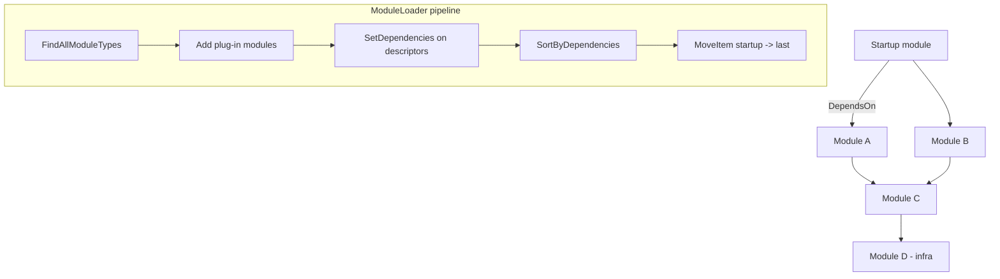

ABP composes large applications out of *modules* — types that derive from `AbpModule`, declare what they depend on through `[DependsOn]`, and contribute services through `ConfigureServices`. The module system is intentionally small: a topological sort over the dependency graph, a list of lifecycle contributors, and a context object that exposes the underlying `IServiceCollection`. Everything else — Auditing, EF Core, AspNetCore — is just a module that hooks into the seams.

## Source Map

| File | Role |
| --- | --- |
| `framework/src/Volo.Abp.Core/Volo/Abp/Modularity/IAbpModule.cs` | Minimal contract (`ConfigureServices(Async)`). |
| `framework/src/Volo.Abp.Core/Volo/Abp/Modularity/AbpModule.cs` | Abstract base implementing every lifecycle interface as a no-op + the typed `Configure<TOptions>` helpers. |
| `framework/src/Volo.Abp.Core/Volo/Abp/Modularity/DependsOnAttribute.cs` | Attribute → `IDependedTypesProvider`. |
| `framework/src/Volo.Abp.Core/Volo/Abp/Modularity/AdditionalAssemblyAttribute.cs` | Adds extra assemblies for convention scanning. |
| `framework/src/Volo.Abp.Core/Volo/Abp/Modularity/AbpModuleHelper.cs` | Walks `DependsOn` recursively to flatten the graph. |
| `framework/src/Volo.Abp.Core/Volo/Abp/Modularity/IModuleLoader.cs` / `ModuleLoader.cs` | Discovery + topological sort, with startup module pinned last. |
| `framework/src/Volo.Abp.Core/Volo/Abp/Modularity/IModuleManager.cs` / `ModuleManager.cs` | Runs lifecycle contributors at initialise / shutdown. |
| `framework/src/Volo.Abp.Core/Volo/Abp/Modularity/AbpModuleDescriptor.cs` | Runtime record per module (type, instance, assemblies, dependencies, plug-in flag). |
| `framework/src/Volo.Abp.Core/Volo/Abp/Modularity/AbpModuleLifecycleOptions.cs` | List of `IModuleLifecycleContributor` types invoked by `ModuleManager`. |
| `framework/src/Volo.Abp.Core/Volo/Abp/Modularity/DefaultModuleLifecycleContributor.cs` | Four contributors: pre-init, init, post-init, shutdown. |
| `framework/src/Volo.Abp.Core/Volo/Abp/Modularity/ModuleLifecycleContributorBase.cs` | Base implementation that no-ops both methods unless overridden. |
| `framework/src/Volo.Abp.Core/Volo/Abp/Modularity/IPreConfigureServices.cs` / `IPostConfigureServices.cs` | Bracketing hooks around the main `ConfigureServices` pass. |
| `framework/src/Volo.Abp.Core/Volo/Abp/Modularity/IOnPreApplicationInitialization.cs` / `IOnApplicationInitialization.cs` (in `Volo.Abp`) / `IOnPostApplicationInitialization.cs` | Three init hooks. |
| `framework/src/Volo.Abp.Core/Volo/Abp/IOnApplicationShutdown.cs` | Shutdown hook (note: lives in `Volo.Abp`, not `Modularity`). |
| `framework/src/Volo.Abp.Core/Volo/Abp/Modularity/ServiceConfigurationContext.cs` | Bag passed to all configure passes (`Services`, `Configuration`, `Items`). |
| `framework/src/Volo.Abp.Core/Volo/Abp/Modularity/PlugIns/*` | `IPlugInSource`, `FolderPlugInSource`, `FilePlugInSource`, `TypePlugInSource`, `PlugInSourceList`. |

## `AbpModule` Anatomy

`AbpModule` implements *all six* lifecycle interfaces with virtual no-ops, so a module only overrides what it needs:

```csharp
// AbpModule.cs (excerpt)
public abstract class AbpModule :
    IAbpModule,
    IOnPreApplicationInitialization,
    IOnApplicationInitialization,
    IOnPostApplicationInitialization,
    IOnApplicationShutdown,
    IPreConfigureServices,
    IPostConfigureServices
{
    protected internal bool SkipAutoServiceRegistration { get; protected set; }

    protected internal ServiceConfigurationContext ServiceConfigurationContext { /* throws if null */ }

    public virtual void ConfigureServices(ServiceConfigurationContext context) { }
    public virtual void OnApplicationInitialization(ApplicationInitializationContext context) { }
    public virtual void OnApplicationShutdown(ApplicationShutdownContext context) { }
    // ... async siblings forward to sync by default
}
```

Both sync and async overloads exist; the base implementation forwards the async form to the sync one. Modules can override either side — `AbpApplicationBase` picks whichever path the framework is on.

### `IAbpModule` is minimal

```csharp
public interface IAbpModule
{
    Task ConfigureServicesAsync(ServiceConfigurationContext context);
    void ConfigureServices(ServiceConfigurationContext context);
}
```

Everything else is opt-in via marker interfaces — so `ModuleManager` uses `is IOnApplicationInitialization` checks before invoking each.

### Lifecycle Interfaces (Enumerated)

| Interface | When | File |
| --- | --- | --- |
| `IPreConfigureServices` | Before any module's `ConfigureServices` runs | `Modularity/IPreConfigureServices.cs` |
| `IAbpModule.ConfigureServices` | Main service-registration pass | `Modularity/IAbpModule.cs` |
| `IPostConfigureServices` | After all modules registered services | `Modularity/IPostConfigureServices.cs` |
| `IOnPreApplicationInitialization` | First initialise contributor — before main init | `Modularity/IOnPreApplicationInitialization.cs` |
| `IOnApplicationInitialization` | Main init — runs `app.UseRouting()` etc. | `Volo/Abp/IOnApplicationInitialization.cs` |
| `IOnPostApplicationInitialization` | After main init — e.g. background services | `Modularity/IOnPostApplicationInitialization.cs` |
| `IOnApplicationShutdown` | During `ShutdownAsync` (reverse module order) | `Volo/Abp/IOnApplicationShutdown.cs` |

`AbpModuleLifecycleOptions.Contributors` is wired during `AddCoreAbpServices`:

```csharp
// InternalServiceCollectionExtensions.cs (excerpt)
options.Contributors.Add<OnPreApplicationInitializationModuleLifecycleContributor>();
options.Contributors.Add<OnApplicationInitializationModuleLifecycleContributor>();
options.Contributors.Add<OnPostApplicationInitializationModuleLifecycleContributor>();
options.Contributors.Add<OnApplicationShutdownModuleLifecycleContributor>();
```

A custom contributor — say, to wrap each initialization with a stopwatch — is just another entry in this list.

## Declaring Dependencies

```csharp
[AttributeUsage(AttributeTargets.Class, AllowMultiple = true)]
public class DependsOnAttribute : Attribute, IDependedTypesProvider
{
    public Type[] DependedTypes { get; }
    public DependsOnAttribute(params Type[]? dependedTypes)
    {
        DependedTypes = dependedTypes ?? Type.EmptyTypes;
    }
    public virtual Type[] GetDependedTypes() => DependedTypes;
}
```

A module looks like:

```csharp
[DependsOn(
    typeof(AbpAuditingModule),
    typeof(AbpDataModule),
    typeof(AbpEventBusModule),
    typeof(AbpSpecificationsModule),
    typeof(AbpDddDomainSharedModule))]
public class AbpDddDomainModule : AbpModule
{
    public override void PreConfigureServices(ServiceConfigurationContext context)
    {
        context.Services.AddConventionalRegistrar(new AbpRepositoryConventionalRegistrar());
        context.Services.OnRegistered(ChangeTrackingInterceptorRegistrar.RegisterIfNeeded);
    }
}
```

The attribute is `AllowMultiple = true` so a module can split its dependencies across several attribute applications, and `IDependedTypesProvider` is the contract used by `AbpModuleHelper` — anything else that implements it (rare in practice) participates in resolution.

## Module Loading & Dependency Resolution

```csharp
// ModuleLoader.cs
public IAbpModuleDescriptor[] LoadModules(IServiceCollection services,
    Type startupModuleType, PlugInSourceList plugInSources)
{
    var modules = GetDescriptors(services, startupModuleType, plugInSources);
    modules = SortByDependency(modules, startupModuleType);
    return modules.ToArray();
}
```

`GetDescriptors`:

1. `AbpModuleHelper.FindAllModuleTypes(startupModuleType, logger)` walks `DependsOn` transitively, returning every module type reachable from the startup module.
2. Plug-in modules from `plugInSources.GetAllModules(logger)` are appended (deduplicated against step 1) with `isLoadedAsPlugIn: true`.
3. Each type is instantiated via `Activator.CreateInstance(moduleType)` in `CreateAndRegisterModule`, the instance is registered as a singleton keyed by its concrete type, and wrapped in `AbpModuleDescriptor`.
4. `SetDependencies` walks `AbpModuleHelper.FindDependedModuleTypes(module.Type)` and connects each module to its resolved dependencies — throwing if any dependency was not loaded.

`SortByDependency`:

```csharp
var sortedModules = modules.SortByDependencies(m => m.Dependencies);
sortedModules.MoveItem(m => m.Type == startupModuleType, modules.Count - 1);
```

The generic `SortByDependencies` produces a stable topological order; the explicit `MoveItem` guarantees the startup module is **always** last so it can rely on every dependency being initialised. Shutdown traverses the reverse list (`ModuleManager.ShutdownModulesAsync`).



`AbpModuleDescriptor` carries:

```csharp
public class AbpModuleDescriptor : IAbpModuleDescriptor
{
    public Type Type { get; }
    public Assembly Assembly { get; }
    public Assembly[] AllAssemblies { get; }
    public IAbpModule Instance { get; }
    public bool IsLoadedAsPlugIn { get; }
    public IReadOnlyList<IAbpModuleDescriptor> Dependencies { get; }
}
```

`AllAssemblies` includes any extra assemblies brought in via `[AdditionalAssembly]` so a module can contribute conventionally-registered types from sister assemblies it doesn't itself live in.

## `ServiceConfigurationContext`

```csharp
public class ServiceConfigurationContext
{
    public IServiceCollection Services { get; }
    public IConfiguration Configuration => _configuration ??= Services.GetConfiguration();
    public IDictionary<string, object?> Items { get; }
    public object? this[string key] { get => Items.GetOrDefault(key); set => Items[key] = value; }
}
```

A single instance is shared across all three configure passes. `Items` is the canonical place for cross-module configuration handoff — e.g. `AbpAspNetCoreMvcModule` puts model-binding metadata into `Items` and other modules read it from their `PostConfigureServices`. After all passes complete, `AbpApplicationBase` clears `AbpModule.ServiceConfigurationContext` back to `null` to prevent stale references being held by long-lived module instances.

## Plug-In Sources

Plug-in sources let a host load modules that the startup module doesn't statically know about — useful for dynamically extending an application.

| Source | File | Behaviour |
| --- | --- | --- |
| `TypePlugInSource` | `PlugIns/TypePlugInSource.cs` | Wraps an explicit `Type[]` of module types. |
| `FilePlugInSource` | `PlugIns/FilePlugInSource.cs` | Loads each path via `AssemblyLoadContext.Default.LoadFromAssemblyPath` and scans for `AbpModule` types. |
| `FolderPlugInSource` | `PlugIns/FolderPlugInSource.cs` | Scans a folder (`TopDirectoryOnly` or `AllDirectories`) with an optional `Filter` predicate. |
| `PlugInSourceList` | `PlugIns/PlugInSourceList.cs` | Concrete `List<IPlugInSource>` used by `AbpApplicationCreationOptions.PlugInSources`. |

```csharp
public class TypePlugInSource : IPlugInSource
{
    private readonly Type[] _moduleTypes;
    public TypePlugInSource(params Type[]? moduleTypes) { _moduleTypes = moduleTypes ?? new Type[0]; }
    public Type[] GetModules() => _moduleTypes;
}
```

Usage:

```csharp
var app = await AbpApplicationFactory.CreateAsync<MyStartupModule>(options =>
{
    options.PlugInSources.AddFolder(@"/srv/plugins");
    options.PlugInSources.AddTypes(typeof(MyOptionalModule));
});
```

Plug-in modules are flagged `IsLoadedAsPlugIn = true` on their descriptor, but otherwise participate in dependency resolution exactly like statically-referenced modules.

## `ModuleManager`

```csharp
public class ModuleManager : IModuleManager, ISingletonDependency
{
    public ModuleManager(IModuleContainer container, ILogger<ModuleManager> logger,
        IOptions<AbpModuleLifecycleOptions> options, IServiceProvider sp)
    {
        _lifecycleContributors = options.Value.Contributors
            .Select(sp.GetRequiredService).Cast<IModuleLifecycleContributor>().ToArray();
    }

    public virtual async Task InitializeModulesAsync(ApplicationInitializationContext context)
    {
        foreach (var contributor in _lifecycleContributors)
            foreach (var module in _moduleContainer.Modules)
                await contributor.InitializeAsync(context, module.Instance);
    }
}
```

Note the order: **for each contributor**, then **for each module**. Concretely this means every module's `OnPreApplicationInitialization` runs before any module's `OnApplicationInitialization`. The shutdown form reverses module order:

```csharp
var modules = _moduleContainer.Modules.Reverse().ToList();
foreach (var contributor in _lifecycleContributors)
    foreach (var module in modules)
        await contributor.ShutdownAsync(context, module.Instance);
```

Exceptions are wrapped in `AbpInitializationException` / `AbpShutdownException` with the offending module's `AssemblyQualifiedName` for triage.

## Invariants

- **Single instance per module type.** `ModuleLoader.CreateAndRegisterModule` registers each module as a singleton — resolving the module type returns the same instance you see in `_moduleContainer.Modules`.
- **Configure runs once.** `AbpApplicationBase.CheckMultipleConfigureServices` throws on the second call. Mix sync/async by setting `SkipConfigureServices` and choosing one explicitly.
- **`ServiceConfigurationContext` is only valid during configure passes.** `AbpModule` throws if you read it outside of `PreConfigureServices`/`ConfigureServices`/`PostConfigureServices`.
- **Startup module is pinned last.** Both `LoadModules` and the dependency sort guarantee this; relying on the order is supported.
- **Plug-in failures are loud.** `FilePlugInSource`/`FolderPlugInSource` raise `AbpException` if `assembly.GetTypes()` fails — there is no silent skipping.

## Cross-References

<CardGroup cols={2}>
<Card title="ABP Application" href="/framework/core/abp-application">The phases that drive these hooks.</Card>
<Card title="Dependency Injection" href="/framework/core/dependency-injection">Conventional registrars consumed during `ConfigureServices`.</Card>
<Card title="Aspects" href="/framework/core/aspects-and-interceptors">`OnRegistered` callbacks live on `ServiceConfigurationContext.Services`.</Card>
<Card title="Exception Handling" href="/framework/core/exception-handling">`AbpInitializationException` and `AbpShutdownException` propagate module failures.</Card>
</CardGroup>
