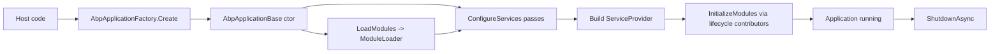

`Volo.Abp.Core` is the smallest assembly in the framework and the one every other package depends on. It defines the `IAbpApplication` abstraction that owns the lifecycle of an ABP host, the module system (`AbpModule`, `DependsOn`, `ModuleManager`), the convention-based DI registrar that scans assemblies for `ITransientDependency`/`IScopedDependency`/`ISingletonDependency`, the cross-cutting aspect infrastructure (`AbpInterceptor`, `IAbpMethodInvocation`), and the exception abstractions (`IBusinessException`, `IUserFriendlyException`, `IHasErrorCode`). Everything above this layer — Auditing, Authorization, UoW, EF Core, AspNetCore integration — plugs into the seams declared here.

This page is the map. Each subsystem has its own deep page; the links below point to them.

## File Inventory (Top-Level)

The root namespace is `Volo.Abp`. Files directly under `framework/src/Volo.Abp.Core/Volo/Abp/` include:

| File | Role |
| --- | --- |
| `AbpApplicationBase.cs` | Abstract base that owns `Services`, `Modules`, `ServiceProvider` and runs the configure/initialize/shutdown phases. |
| `AbpApplicationFactory.cs` | Static façade with `Create`/`CreateAsync` overloads for internal vs external service-provider modes. |
| `AbpApplicationCreationOptions.cs` | Mutable bag passed to `optionsAction`: `PlugInSources`, `Configuration`, `SkipConfigureServices`, `ApplicationName`, `Environment`. |
| `AbpApplicationWithInternalServiceProvider.cs` | Internal-provider implementation that builds its own `ServiceCollection`+scope. |
| `AbpApplicationWithExternalServiceProvider.cs` | External-provider implementation used by the AspNetCore generic host. |
| `IAbpApplication.cs` / `IAbpApplicationWithInternal*` / `IAbpApplicationWithExternal*` | The three public application contracts. |
| `ApplicationInitializationContext.cs` / `ApplicationShutdownContext.cs` | Carry the scoped `IServiceProvider` into lifecycle callbacks. |
| `AbpException.cs`, `AbpInitializationException.cs`, `AbpShutdownException.cs`, `BusinessException.cs`, `UserFriendlyException.cs` | Framework exception hierarchy. |
| `IBusinessException.cs`, `IUserFriendlyException.cs`, `IRemoteService.cs`, `ISoftDelete.cs` | Marker interfaces used by interceptors and conventions. |
| `AbpHostEnvironment.cs`, `IAbpHostEnvironment.cs` | Lightweight host-environment surrogate when `IHostEnvironment` is absent. |
| `Check.cs`, `ObjectHelper.cs`, `RandomHelper.cs`, `DisposeAction.cs` | Static helpers used everywhere. |

## Top-Level Namespaces

| Namespace (under `Volo.Abp`) | Purpose |
| --- | --- |
| `Volo.Abp` | Application object, base exceptions, business-exception interfaces, host environment. |
| `Volo.Abp.Modularity` | `AbpModule`, `DependsOn`, `ModuleLoader`, `ModuleManager`, lifecycle contributors, plug-in sources. |
| `Volo.Abp.Modularity.PlugIns` | `FolderPlugInSource`, `FilePlugInSource`, `TypePlugInSource`, `PlugInSourceList`. |
| `Volo.Abp.DependencyInjection` | Lifetime markers, `DefaultConventionalRegistrar`, `ExposeServices`, `ObjectAccessor`, `IAbpLazyServiceProvider`, `CachedServiceProvider`. |
| `Volo.Abp.Aspects` | `AbpCrossCuttingConcerns`, `IAvoidDuplicateCrossCuttingConcerns` — the de-duplication protocol shared by interceptors and base classes. |
| `Volo.Abp.DynamicProxy` | `AbpInterceptor`, `IAbpInterceptor`, `IAbpMethodInvocation`, `ProxyHelper`, `DynamicProxyIgnoreTypes` — the proxy-agnostic interception model. |
| `Volo.Abp.ExceptionHandling` | `IExceptionNotifier`, `IExceptionSubscriber`, `IHasErrorCode`, `IHasErrorDetails`, `IHasHttpStatusCode`, `ILocalizeErrorMessage`. |
| `Volo.Abp.Threading` | `AsyncHelper`, `InternalAsyncHelper`, `KeyedLock`, `OneTimeRunner`, `SemaphoreSlimExtensions`. |
| `Volo.Abp.Logging` | `IInitLoggerFactory`, init-time log buffering and replay. |
| `Volo.Abp.Options` | `AbpConfigurationBuilderOptions` and configuration helpers used during bootstrap. |
| `Volo.Abp.Reflection` | `ITypeFinder`, `ReflectionHelper`, `TypeHelper`. |
| `Volo.Abp.Validation` | Marker interfaces (`IValidationEnabled`) — full validation lives in `Volo.Abp.Validation`. |
| `Volo.Abp.Collections` | `ITypeList`, `TypeList<T>`, `IHybridDictionary`. |
| `Volo.Abp.Localization`, `Volo.Abp.Bundling`, `Volo.Abp.IO`, `Volo.Abp.Content`, `Volo.Abp.Text`, `Volo.Abp.Tracing` | Lightweight abstractions used by upper layers. |

## How a Host Starts

1. **Factory call** — `AbpApplicationFactory.Create<TStartupModule>(...)` builds an `AbpApplicationWithInternalServiceProvider` or `…WithExternalServiceProvider` and runs its constructor (`AbpApplicationFactory.cs`).
2. **Constructor work** (`AbpApplicationBase.cs`) — registers `IAbpApplication`, `IApplicationInfoAccessor`, `IModuleContainer`, `IAbpHostEnvironment` as singletons, then calls `LoadModules` and (unless `SkipConfigureServices`) `ConfigureServices`.
3. **`LoadModules`** delegates to `IModuleLoader` (`Modularity/ModuleLoader.cs`) which walks `DependsOn` attributes via `AbpModuleHelper`, appends plug-in module types from `PlugInSources`, and topologically sorts them with the startup module pinned last.
4. **`ConfigureServices`** iterates modules in three passes — `IPreConfigureServices`, `IAbpModule.ConfigureServices`, `IPostConfigureServices` — feeding each a shared `ServiceConfigurationContext`.
5. **Service-provider build** — internal mode calls `Services.BuildServiceProviderFromFactory().CreateScope()` (`AbpApplicationWithInternalServiceProvider.cs`); external mode receives one from the generic host.
6. **`Initialize` / `InitializeAsync`** runs the four lifecycle contributors registered in `InternalServiceCollectionExtensions.cs`: `OnPreApplicationInitialization`, `OnApplicationInitialization`, `OnPostApplicationInitialization`, then `OnApplicationShutdown` (used on the reverse order during `Shutdown`).



## Module System

The module system is a topological-sort engine over types that implement `IAbpModule` and declare dependencies through `[DependsOn(typeof(OtherModule))]`. `ModuleLoader.SortByDependencies` produces a deterministic startup order; `ModuleManager.ShutdownModulesAsync` runs the reverse order. See [Modularity](/framework/core/modularity) for `AbpModule`, lifecycle hooks, and plug-in sources.

```csharp
// framework/src/Volo.Abp.Core/Volo/Abp/Modularity/ModuleLoader.cs
protected virtual List<IAbpModuleDescriptor> SortByDependency(
    List<IAbpModuleDescriptor> modules, Type startupModuleType)
{
    var sortedModules = modules.SortByDependencies(m => m.Dependencies);
    sortedModules.MoveItem(m => m.Type == startupModuleType, modules.Count - 1);
    return sortedModules;
}
```

Modules also opt into more fine-grained hooks (`IPreConfigureServices`, `IPostConfigureServices`, `IOnApplicationInitialization`, etc.). `AbpApplicationBase.ConfigureServices` invokes them in three explicit phases:

```csharp
// framework/src/Volo.Abp.Core/Volo/Abp/AbpApplicationBase.cs (excerpt)
foreach (var module in Modules.Where(m => m.Instance is IPreConfigureServices))
    ((IPreConfigureServices)module.Instance).PreConfigureServices(context);

foreach (var module in Modules)
    module.Instance.ConfigureServices(context);

foreach (var module in Modules.Where(m => m.Instance is IPostConfigureServices))
    ((IPostConfigureServices)module.Instance).PostConfigureServices(context);
```

## Dependency Injection Subsystem

`Volo.Abp.DependencyInjection` adds three things on top of `Microsoft.Extensions.DependencyInjection`:

- **Conventional registration.** `DefaultConventionalRegistrar.AddType` inspects each type for `[Dependency]`, `[ExposeServices]`, lifetime markers and adds matching `ServiceDescriptor`s — including keyed services via `ExposeKeyedServiceAttribute`. `ServiceCollectionConventionalRegistrationExtensions.AddAssembly` runs every registered `IConventionalRegistrar` (default list: `[DefaultConventionalRegistrar]`).
- **Registration callbacks.** `OnRegistered` and `OnExposing` let modules observe each registration to attach interceptors (used by `AuditingInterceptorRegistrar`, `UnitOfWorkInterceptorRegistrar`, etc.) — see `ServiceCollectionRegistrationActionExtensions.cs`.
- **Lazy / cached accessors.** `IAbpLazyServiceProvider`, `ICachedServiceProvider` and `ObjectAccessor<T>` keep services discoverable from base classes without flooding constructors. `BasicRepositoryBase`, `ApplicationService` and `DomainService` all consume them.

See [Dependency Injection](/framework/core/dependency-injection) for the full story.

## Aspects and Interceptors

Cross-cutting concerns sit behind a tiny abstraction:

```csharp
// framework/src/Volo.Abp.Core/Volo/Abp/DynamicProxy/AbpInterceptor.cs
public abstract class AbpInterceptor : IAbpInterceptor
{
    public abstract Task InterceptAsync(IAbpMethodInvocation invocation);
}
```

Interceptors are registered via `ServiceRegistrationActionList` (`OnRegistered`) so that Auditing, Authorization, UoW, Validation, FeatureChecker and GlobalFeature can attach without modules editing each other. The Castle Windsor adapter (`Volo.Abp.Castle.Core`) provides the actual proxy generation. `AbpCrossCuttingConcerns` (`Aspects/AbpCrossCuttingConcerns.cs`) carries constants (`Auditing`, `UnitOfWork`, …) and a static `IsApplied`/`AddApplied` protocol so a base class and an interceptor never double-invoke. See [Aspects and Interceptors](/framework/core/aspects-and-interceptors).

## Exception Handling Foundations

`Volo.Abp.Core` ships only the abstractions: `IBusinessException`, `IUserFriendlyException`, `BusinessException`, `IHasErrorCode`, `IHasErrorDetails`, `IHasHttpStatusCode`, `ILocalizeErrorMessage`, plus `IExceptionNotifier`/`IExceptionSubscriber` for the publish/subscribe channel. `Volo.Abp.ExceptionHandling` (separate package) provides the localization bundle, while `Volo.Abp.AspNetCore` ships `AbpExceptionHandlingMiddleware` and `DefaultHttpExceptionStatusCodeFinder` to translate exceptions into HTTP status codes. See [Exception Handling](/framework/core/exception-handling).

## Virtual File System Foundation

`Volo.Abp.Core` does not ship the VFS implementation, but `AbpApplicationBase` wires the option type `AbpVirtualFileSystemOptions` indirectly — modules call `Configure<AbpVirtualFileSystemOptions>(o => o.FileSets.AddEmbedded<TModule>())` in their `ConfigureServices`. The `AbpVirtualFileSystemModule` in `framework/src/Volo.Abp.VirtualFileSystem/` provides `IVirtualFileProvider`, `DynamicFileProvider` and the embedded-resource composition layer used by Localization, MVC views and razor components.

## Threading Helpers

`Volo.Abp.Core` provides `AsyncHelper.RunSync` (used by `SetupTelemetryTracking`) and `InternalAsyncHelper` for safely awaiting through dispose chains. `Volo.Abp.Threading` adds `IAmbientScopeProvider<T>`, `ICancellationTokenProvider`, and `AbpAsyncTimer`/`AbpTimer`. See [Threading](/framework/core/threading).

## Cross-References

<CardGroup cols={2}>
<Card title="ABP Application" href="/framework/core/abp-application">Factory, lifecycle phases, internal vs external service provider.</Card>
<Card title="Modularity" href="/framework/core/modularity">DependsOn, ModuleLoader, plug-in sources, lifecycle contributors.</Card>
<Card title="Dependency Injection" href="/framework/core/dependency-injection">Conventional registrar, ExposeServices, ObjectAccessor.</Card>
<Card title="Aspects & Interceptors" href="/framework/core/aspects-and-interceptors">AbpInterceptor model and the registrar pattern.</Card>
<Card title="Exception Handling" href="/framework/core/exception-handling">Business/user-friendly exceptions and HTTP mapping.</Card>
<Card title="Threading" href="/framework/core/threading">AsyncHelper, ambient scopes, cancellation tokens.</Card>
</CardGroup>

## Invariants

- The startup module is always the **last** to be initialized and the **first** to be shut down (see `ModuleLoader.SortByDependency` and `ModuleManager.ShutdownModulesAsync`).
- `ServiceConfigurationContext` is only valid during the three `ConfigureServices` passes — `AbpModule` throws if you touch it from `OnApplicationInitialization` (`AbpModule.cs`).
- `AbpApplicationBase.ConfigureServices` may run only once; `CheckMultipleConfigureServices` throws `AbpInitializationException` on the second call. To call `ConfigureServicesAsync` yourself, set `options.SkipConfigureServices = true`.
- Module instances are constructed eagerly with `Activator.CreateInstance` and registered as singletons via the module's own type, so they can be resolved during configuration.
