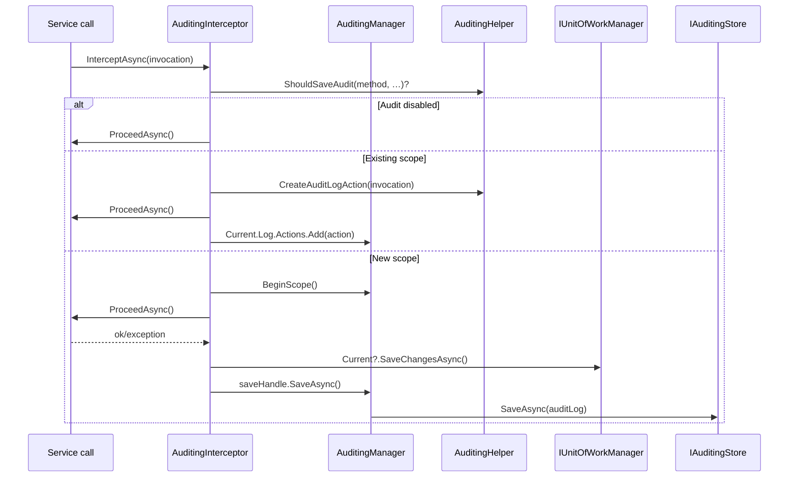

ABP's audit log is a per-request artefact that fans out across the entire call stack. A scope is opened once (typically by the middleware or interceptor that hits a service first), every nested call writes an `AuditLogActionInfo` to that scope's `AuditLogInfo`, `AbpDbContext.SaveChangesAsync` contributes `EntityChangeInfo`s, and finally a save handle persists everything atomically when the scope disposes. This page traces that lifecycle end-to-end and enumerates the contributor and storage seams.

## Module pieces

| File | Responsibility |
| --- | --- |
| `framework/src/Volo.Abp.Auditing/Volo/Abp/Auditing/AuditingManager.cs` | Owns the ambient scope and the save pipeline. |
| `…/Auditing/AuditingHelper.cs` | `IAuditingHelper` — builds `AuditLogInfo` / `AuditLogActionInfo`, decides whether to audit a method. |
| `…/Auditing/AuditingInterceptor.cs` | DynamicProxy interceptor — opens scopes around service calls. |
| `…/Auditing/AuditLogInfo.cs` | The per-scope record. |
| `…/Auditing/AuditLogActionInfo.cs` | Per-method invocation record (method name, args, duration). |
| `…/Auditing/EntityChangeInfo.cs` | Per-entity change record assembled by EF Core / Mongo integrations. |
| `…/Auditing/IAuditLogScope.cs` / `IAuditLogSaveHandle.cs` | Lightweight contracts ambient code and the save handle implement. |
| `…/Auditing/IAuditingStore.cs` | `SaveAsync(AuditLogInfo)` — the persistence sink. |
| `…/Auditing/SimpleLogAuditingStore.cs` | Default: writes audit logs to `ILogger` (no DB). |
| `…/Auditing/AbpAuditingOptions.cs` | Toggles, selectors, contributors, ignored types. |

## `AbpAuditingOptions`

Configured during `ConfigureServices`; reasonable defaults are set in the constructor (`AbpAuditingOptions.cs`):

| Property | Default | Notes |
| --- | --- | --- |
| `IsEnabled` | `true` | Master switch. |
| `IsEnabledForAnonymousUsers` | `true` | When false, unauthenticated calls skip auditing. |
| `IsEnabledForGetRequests` | `false` | Skips HTTP GETs by default to keep logs noise-free. |
| `IsEnabledForIntegrationServices` | `false` | Set true to include `[IntegrationService]`-decorated classes. |
| `AlwaysLogOnException` | `true` | Forces a log even when filters would skip the call. |
| `HideErrors` | `true` | Swallows errors raised by the store/contributors. |
| `SaveEntityHistoryWhenNavigationChanges` | `true` | Causes EF aggregate-root changes to record entity history. |
| `DisableLogActionInfo` | `false` | Set true to skip per-method `AuditLogActionInfo` records. |
| `ApplicationName` | `null` | Stamped onto every `AuditLogInfo.ApplicationName`. |
| `AlwaysLogSelectors` | `[]` | `List<Func<AuditLogInfo, Task<bool>>>` — return true to force-save. |
| `Contributors` | `[]` | `List<AuditLogContributor>` — invoked once per scope before save. |
| `EntityHistorySelectors` | `IEntityHistorySelectorList` | Predicates that opt entities into history capture. |
| `IgnoredTypes` | `Stream, Expression, CancellationToken` | Argument types skipped when serialising method parameters. |

## The scope-based collection model

The scope is an `AsyncLocal` value held by `IAmbientScopeProvider<IAuditLogScope>`. Opening a scope returns an `IAuditLogSaveHandle` that *both* unwinds the scope and writes the log:

```csharp
// AuditingManager.cs
public IAuditLogScope? Current => _ambientScopeProvider.GetValue(AmbientContextKey);

public IAuditLogSaveHandle BeginScope()
{
    var ambientScope = _ambientScopeProvider.BeginScope(
        AmbientContextKey,
        new AuditLogScope(_auditingHelper.CreateAuditLogInfo()));
    return new DisposableSaveHandle(this, ambientScope, Current!.Log, Stopwatch.StartNew());
}
```

`AuditingHelper.CreateAuditLogInfo()` fills the log with `ICurrentUser`, `ICurrentTenant`, `ICurrentClient`, `ICorrelationIdProvider`, `IClock.Now`, and `Options.ApplicationName`. Nested service calls only *add* to the existing log; the outermost owner saves.

## Interceptor lifecycle

`AuditingInterceptor` (`AuditingInterceptor.cs`) is registered on application services through `AuditingInterceptorRegistrar`. Its behaviour branches on whether a scope already exists:



The "new scope" path (`ProcessWithNewAuditingScopeAsync`) also flushes the active unit of work *before* the save handle persists, so any entity changes that need to land in `AuditLog.EntityChanges` are committed first. Exceptions are appended to `AuditLogInfo.Exceptions` and re-thrown, then `ShouldWriteAuditLogAsync` consults `AlwaysLogOnException` and `AlwaysLogSelectors` to decide whether to persist.

`AuditingHelper.ShouldSaveAudit(methodInfo)` is the central allow/deny decision:

- Honours `[Audited]` / `[DisableAuditing]` attributes on the method or its declaring type.
- Skips when the declaring type is in `Options.IgnoredTypes`.
- Skips when the method is `[IntegrationService]` and `IsEnabledForIntegrationServices == false`.
- Skips when `CurrentUser.IsAuthenticated == false` and `IsEnabledForAnonymousUsers == false`.
- Honours the ambient `AuditingDisabledState` provider, which `using (AbpCrossCuttingConcerns.Applying(this, AbpCrossCuttingConcerns.Auditing))` toggles.

## `AuditLogInfo` and `AuditLogActionInfo`

`AuditLogInfo` (`AuditLogInfo.cs`) is `[Serializable]` and captures everything the audit pipeline knows about a unit of work:

```csharp
public string? ApplicationName { get; set; }
public Guid? UserId, TenantId, ImpersonatorUserId, ImpersonatorTenantId;
public string? UserName, TenantName, ClientId, CorrelationId, ClientIpAddress, BrowserInfo;
public DateTime ExecutionTime;
public int ExecutionDuration; // milliseconds
public string? HttpMethod, Url; public int? HttpStatusCode;
public List<AuditLogActionInfo> Actions { get; set; }
public List<EntityChangeInfo> EntityChanges { get; }
public List<Exception> Exceptions { get; }
public ExtraPropertyDictionary ExtraProperties { get; }
public List<string> Comments { get; set; }
```

`AuditLogActionInfo` records one method invocation — service & method name, JSON-serialised arguments, return value/exception, and duration. The ASP.NET Core auditing middleware additionally writes HTTP metadata back onto the parent `AuditLogInfo` so HTTP route, status code, and IP travel with the log.

`EntityChangeInfo` (`EntityChangeInfo.cs`) is appended by the data-layer integration (`AbpDbContext.SaveChangesAsync` calls `EntityHistoryHelper.CreateChangeList(...)` — see [EF Core](/framework/data/entity-framework-core)). Each carries a `ChangeType` (`Created`/`Updated`/`Deleted`), the entity's full type name, a serialised PK, the per-tenant ID, and a list of `EntityPropertyChangeInfo` (`property`, `old`, `new`). Multiple `Updated` rows for the same entity are merged by `AuditingManager.MergeEntityChanges` so the saved log holds one consolidated row per modified aggregate.

## The save handle

`AuditingManager.DisposableSaveHandle` is what `using (var sh = auditingManager.BeginScope())` returns. It captures the `Stopwatch` started at scope creation and exposes `SaveAsync`:

```csharp
protected virtual void BeforeSave(DisposableSaveHandle saveHandle)
{
    saveHandle.StopWatch.Stop();
    saveHandle.AuditLog.ExecutionDuration =
        Convert.ToInt32(saveHandle.StopWatch.Elapsed.TotalMilliseconds);
    ExecutePostContributors(saveHandle.AuditLog);
    MergeEntityChanges(saveHandle.AuditLog);
}

protected virtual async Task SaveAsync(DisposableSaveHandle saveHandle)
{
    BeforeSave(saveHandle);
    await _auditingStore.SaveAsync(saveHandle.AuditLog);
}
```

The contributor hook (`ExecutePostContributors`) walks `AbpAuditingOptions.Contributors`, each of which receives an `AuditLogContributionContext` (`AuditLogContributionContext.cs`) and may mutate the log — typical use cases are decorating the log with HTTP-context-derived fields or scrubbing sensitive arguments. Contributor exceptions are logged at `Warning` and swallowed because the audit log must never fail the caller.

`IAuditingStore` (`IAuditingStore.cs`) is the one-method contract that lands the log somewhere durable:

```csharp
public interface IAuditingStore { Task SaveAsync(AuditLogInfo auditInfo); }
```

The default `SimpleLogAuditingStore` writes JSON to `ILogger`. The `Volo.Abp.AuditLogging.*` packages bind their EF-Core/MongoDB stores into this interface to persist into the audit-log entities.

## Entity history toggles

`EntityHistorySelectorList` (`EntityHistorySelectorList.cs`) is exposed through `AbpAuditingOptions.EntityHistorySelectors`. Selectors are predicates over `Type` — return true to opt that entity into history capture:

```csharp
Configure<AbpAuditingOptions>(o =>
{
    o.EntityHistorySelectors.AddAllEntities();           // record every IEntity
    // or
    o.EntityHistorySelectors.Add(new NamedTypeSelector(
        "BookStore.Books",
        type => typeof(Book).IsAssignableFrom(type)));
});
```

Selectors are consulted by `EntityHistoryHelper` *before* serialising property values, so unmatched entities never pay the reflection cost. The `[DisableAuditing]` attribute on a property removes it from `PropertyChanges`; the same attribute on a class removes the whole entity from history.

## Practical patterns

- **Suspending auditing locally.** Wrap a call in `using (auditingManager.BeginScope())` plus an `AuditingDisabledState` push (via the `IAmbientScopeProvider<AuditingDisabledState>` ambient) to prevent contributors from logging it.
- **Adding free-form data.** `auditingManager.Current?.Log.Comments.Add("Bulk import")` is the safe way to attach narrative; `ExtraProperties` accept arbitrary key/value pairs for structured fields.
- **Failing fast on store errors.** Set `Options.HideErrors = false` in dev to see the store's exception instead of having it swallowed.
- **Selective HTTP coverage.** Set `IsEnabledForGetRequests = true` only for the apps where read auditing matters; most teams keep it off to bound log volume.

## Related pages

<CardGroup cols={2}>
  <Card title="Authorization" href="/framework/cross-cutting/authorization" />
  <Card title="EF Core save pipeline" href="/framework/data/entity-framework-core" />
  <Card title="Validation" href="/framework/cross-cutting/validation" />
  <Card title="Security & current user" href="/framework/cross-cutting/security" />
</CardGroup>
