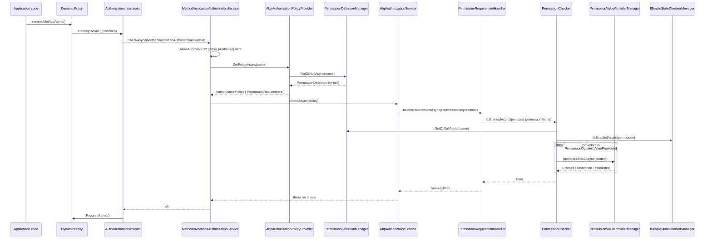

ABP layers a permission system on top of `Microsoft.AspNetCore.Authorization` without forking it. The pivot is a custom `IAuthorizationPolicyProvider` that converts every permission name into an ad-hoc policy, plus a DynamicProxy interceptor that runs the same checks on POCO application services where MVC's `[Authorize]` filter doesn't apply. This page walks the runtime sequence from `[Authorize("MyPermission")]` to `PermissionChecker`, then enumerates the definition stores and value providers.

## Module surface

```csharp
// framework/src/Volo.Abp.Authorization/Volo/Abp/Authorization/AbpAuthorizationModule.cs
[DependsOn(typeof(AbpAuthorizationAbstractionsModule), typeof(AbpSecurityModule),
           typeof(AbpLocalizationModule), typeof(AbpMultiTenancyModule))]
public class AbpAuthorizationModule : AbpModule
{
    public override void PreConfigureServices(ServiceConfigurationContext context)
    {
        context.Services.OnRegistered(AuthorizationInterceptorRegistrar.RegisterIfNeeded);
        AutoAddDefinitionProviders(context.Services);
    }

    public override void ConfigureServices(ServiceConfigurationContext context)
    {
        context.Services.AddAuthorizationCore();
        context.Services.AddKeyedObjectResourcePermissionAuthorization();
        context.Services.AddSingleton<IAuthorizationHandler, PermissionRequirementHandler>();
        context.Services.AddSingleton<IAuthorizationHandler, PermissionsRequirementHandler>();
        context.Services.TryAddTransient<DefaultAuthorizationPolicyProvider>();

        Configure<AbpPermissionOptions>(options =>
        {
            options.ValueProviders.Add<UserPermissionValueProvider>();
            options.ValueProviders.Add<RolePermissionValueProvider>();
            options.ValueProviders.Add<ClientPermissionValueProvider>();
            // ResourceValueProviders.Add<User/Role/ClientResourcePermissionValueProvider>()
        });
    }
}
```

`AuthorizationInterceptorRegistrar` (`Volo/Abp/Authorization/AuthorizationInterceptorRegistrar.cs`) decides whether a freshly-registered service needs the interceptor: any class carrying `[Authorize]` / `[AllowAnonymous]` on the class or any public method, or any implementor of `IAvoidDuplicateCrossCuttingConcerns`-eligible types like application services, gets `AuthorizationInterceptor` attached via the DynamicProxy module. `AutoAddDefinitionProviders` collects every `IPermissionDefinitionProvider` discovered by `OnRegistered` callbacks so module authors only need `class MyPermissionDefinitionProvider : PermissionDefinitionProvider`.

## End-to-end call sequence



### The `[Authorize]` interceptor

For ASP.NET Core controllers the MVC authorization filter still runs first. For *plain* application service methods invoked outside MVC, `AuthorizationInterceptor` is the gate (`framework/src/Volo.Abp.Authorization/Volo/Abp/Authorization/AuthorizationInterceptor.cs`):

```csharp
public override async Task InterceptAsync(IAbpMethodInvocation invocation)
{
    await AuthorizeAsync(invocation);
    await invocation.ProceedAsync();
}

protected virtual Task AuthorizeAsync(IAbpMethodInvocation invocation)
    => _methodInvocationAuthorizationService.CheckAsync(new MethodInvocationAuthorizationContext(invocation.Method));
```

`MethodInvocationAuthorizationService.CheckAsync` (`MethodInvocationAuthorizationService.cs`) bails when `[AllowAnonymous]` is on the method, otherwise collects every `IAuthorizeData` attribute from the method and its declaring type, composes them via `AuthorizationPolicy.CombineAsync(policyProvider, attrs)`, and calls `IAbpAuthorizationService.CheckAsync(policy)` (which throws `AbpAuthorizationException` on failure).

### The policy provider

`AbpAuthorizationPolicyProvider` (`AbpAuthorizationPolicyProvider.cs`) extends ASP.NET's `DefaultAuthorizationPolicyProvider`. Whenever `GetPolicyAsync(policyName)` falls through to the dynamic branch, it queries `IPermissionDefinitionManager` and emits an `AuthorizationPolicy` carrying either a `PermissionRequirement` or a `ResourcePermissionRequirement`. This is how `[Authorize("Books.Create")]` resolves without an explicitly-registered policy:

```csharp
var permission = await _permissionDefinitionManager.GetOrNullAsync(policyName);
if (permission != null)
{
    var b = new AuthorizationPolicyBuilder(Array.Empty<string>());
    b.Requirements.Add(new PermissionRequirement(policyName));
    return b.Build();
}
```

### `AbpAuthorizationService`

`AbpAuthorizationService` (`AbpAuthorizationService.cs`) is registered with `[Dependency(ReplaceServices = true)]` so it overrides ASP.NET's `DefaultAuthorizationService`. The only behaviour it adds is sourcing the `ClaimsPrincipal` from `ICurrentPrincipalAccessor` instead of `HttpContext.User`, which is what makes background jobs, hosted services, and CLI tools share the same check pipeline:

```csharp
public ClaimsPrincipal CurrentPrincipal => _currentPrincipalAccessor.Principal;
```

## `PermissionChecker` and the value-provider chain

`PermissionChecker.IsGrantedAsync` (`Permissions/PermissionChecker.cs`) is the place all paths converge:

```csharp
var permission = await PermissionDefinitionManager.GetOrNullAsync(name);
if (permission == null || !permission.IsEnabled) return false;
if (!await StateCheckerManager.IsEnabledAsync(permission)) return false;

var multiTenancySide = claimsPrincipal?.GetMultiTenancySide() ?? CurrentTenant.GetMultiTenancySide();
if (!permission.MultiTenancySide.HasFlag(multiTenancySide)) return false;

var isGranted = false;
var context = new PermissionValueCheckContext(permission, claimsPrincipal);
foreach (var provider in PermissionValueProviderManager.ValueProviders)
{
    if (context.Permission.Providers.Any() && !context.Permission.Providers.Contains(provider.Name)) continue;
    var result = await provider.CheckAsync(context);
    if (result == PermissionGrantResult.Granted) isGranted = true;
    else if (result == PermissionGrantResult.Prohibited) return false;
}
return isGranted;
```

Walk-through:

1. **Definition lookup.** `GetOrNullAsync` consults the static then the dynamic store (see below); unknown permissions are denied.
2. **Simple state checks.** `ISimpleStateCheckerManager<PermissionDefinition>` evaluates any state checkers attached via `PermissionSimpleStateCheckerExtensions` — e.g. `RequireAuthenticatedSimpleStateChecker` (force-login) and `RequirePermissionsSimpleStateChecker` (`Permissions/RequireAuthenticatedSimpleStateChecker.cs`, `RequirePermissionsSimpleStateChecker.cs`).
3. **Multi-tenancy side guard.** Permissions can be flagged `Host`, `Tenant`, or both; the current side must satisfy the mask.
4. **Provider chain.** The ordered providers in `AbpPermissionOptions.ValueProviders` are consulted in turn. Any `Prohibited` is final; `Granted` short-circuits to true on the *next* check unless a later provider returns `Prohibited`.

The shipped providers (`UserPermissionValueProvider`, `RolePermissionValueProvider`, `ClientPermissionValueProvider`) all extend `PermissionValueProvider` and read from `IPermissionStore` keyed by the provider's short name:

| Provider | `Name` | Source claim |
| --- | --- | --- |
| `UserPermissionValueProvider` | `"U"` | `AbpClaimTypes.UserId` |
| `RolePermissionValueProvider` | `"R"` | `AbpClaimTypes.Role` (multi-value) |
| `ClientPermissionValueProvider` | `"C"` | `AbpClaimTypes.ClientId` |

The batched `IsGrantedAsync(string[])` overload returns a `MultiplePermissionGrantResult` and groups state-checking into one call (`StateCheckerManager.IsEnabledAsync(pendingStateCheck.ToArray())`) so MVC's batch authorization filter does not pay N round-trips.

## Permission definitions

### Static definitions

Modules publish permissions through `PermissionDefinitionProvider`:

```csharp
public class BookStorePermissions : PermissionDefinitionProvider
{
    public override void Define(IPermissionDefinitionContext context)
    {
        var books = context.AddGroup("BookStore");
        var create = books.AddPermission("BookStore.Books.Create");
        create.AddChild("BookStore.Books.Create.Pdf");
    }
}
```

`StaticPermissionDefinitionStore` (`Permissions/StaticPermissionDefinitionStore.cs`) caches the flattened tree on first access and raises `StaticPermissionDefinitionChangedEvent` when reloaded so other nodes can refresh their dynamic store.

### Dynamic definitions

`IDynamicPermissionDefinitionStore` (`Permissions/IDynamicPermissionDefinitionStore.cs`) is the seam for admin-UI-editable permissions. The default implementation is `NullDynamicPermissionDefinitionStore`; the `Volo.Abp.PermissionManagement` modules ship a concrete one backed by their store and bind it through the standard DI replacement.

`PermissionDefinitionManager` merges both stores with the static set taking precedence (see `Permissions/PermissionDefinitionManager.cs`):

```csharp
return staticPermissions.Concat(
    dynamicPermissions.Where(d => !staticPermissionNames.Contains(d.Name))
).ToImmutableList();
```

## Practical attribute usage

- `[Authorize]` (parameterless) → "authenticated user required"; works on controllers *and* POCO services through the interceptor.
- `[Authorize("Books.Create")]` → dynamic policy → `PermissionRequirement` → `PermissionChecker`.
- `[Authorize(Roles = "admin,editor")]` → standard ASP.NET roles requirement; no permission lookup.
- `[AllowAnonymous]` on a method opts out of the interceptor even when the class is `[Authorize]`'d (`MethodInvocationAuthorizationService.AllowAnonymous`).
- `IAuthorizationService.AuthorizeAsync(obj, requirement)` flows through `KeyedObjectResourcePermissionAuthorization` and uses `ResourcePermissionRequirement` for object-scoped permission checks.

## File map

| File | Role |
| --- | --- |
| `Volo/Abp/Authorization/AbpAuthorizationModule.cs` | Module composition, options, definition-provider scan. |
| `Volo/Abp/Authorization/AbpAuthorizationService.cs` | DI replacement for `DefaultAuthorizationService`. |
| `Volo/Abp/Authorization/AbpAuthorizationPolicyProvider.cs` | Synthesises policies from permission definitions. |
| `Volo/Abp/Authorization/AuthorizationInterceptor.cs` | DynamicProxy interceptor for non-MVC services. |
| `Volo/Abp/Authorization/AuthorizationInterceptorRegistrar.cs` | Decides which services receive the interceptor. |
| `Volo/Abp/Authorization/MethodInvocationAuthorizationService.cs` | Composes `[Authorize]` attributes into policies. |
| `Volo/Abp/Authorization/Permissions/PermissionChecker.cs` | Resolves a permission against the provider chain. |
| `Volo/Abp/Authorization/Permissions/PermissionDefinitionManager.cs` | Merges static + dynamic stores. |
| `Volo/Abp/Authorization/Permissions/PermissionValueProviderManager.cs` | Lazy, de-duped list of `IPermissionValueProvider`. |
| `Volo/Abp/Authorization/Permissions/UserPermissionValueProvider.cs` | User-claim provider (`"U"`). |
| `Volo/Abp/Authorization/Permissions/RolePermissionValueProvider.cs` | Role-claim provider (`"R"`). |
| `Volo/Abp/Authorization/Permissions/ClientPermissionValueProvider.cs` | Client/M2M provider (`"C"`). |
| `Volo/Abp/Authorization/Permissions/RequirePermissionsSimpleStateChecker.cs` | State-checker used by feature/permission gating. |
| `Volo/Abp/Authorization/Permissions/StaticPermissionDefinitionStore.cs` | In-memory cache for `PermissionDefinitionProvider` output. |
| `Volo/Abp/Authorization/Permissions/IDynamicPermissionDefinitionStore.cs` | Hook for admin-UI-managed permissions. |

## Related pages

<CardGroup cols={2}>
  <Card title="Auditing" href="/framework/cross-cutting/auditing" />
  <Card title="Features" href="/framework/cross-cutting/features" />
  <Card title="Security" href="/framework/cross-cutting/security" />
  <Card title="Settings" href="/framework/cross-cutting/settings" />
</CardGroup>
