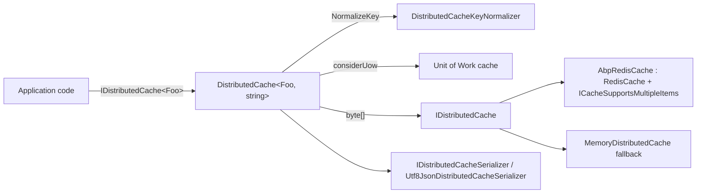

`Volo.Abp.Caching` wraps `Microsoft.Extensions.Caching.Distributed` with a strongly-typed, tenant-aware, batch-capable, UoW-aware façade. Every consumer that wants type-safe access to a cache asks for `IDistributedCache<TCacheItem>` and never touches `byte[]` directly. Behind the scenes a `DistributedCacheKeyNormalizer` prefixes every key with the cache name and tenant ID, and an optional `AbpRedisCache` overlay adds true bulk `MGET`/`MSET` round-trips on top of `Microsoft.Extensions.Caching.StackExchangeRedis`.

## Layered design



## `IDistributedCache<T>` and `IDistributedCache<T, TKey>`

The single-generic overload (`DistributedCache<TCacheItem>` in `framework/src/Volo.Abp.Caching/Volo/Abp/Caching/DistributedCache.cs`) is a wrapper that forwards every call to the two-generic implementation with `TCacheKey = string`. That keeps the common case ergonomic while still allowing custom key types:

```csharp
public class DistributedCache<TCacheItem> : IDistributedCache<TCacheItem> where TCacheItem : class
{
    public IDistributedCache<TCacheItem, string> InternalCache { get; }
    public DistributedCache(IDistributedCache<TCacheItem, string> internalCache) => InternalCache = internalCache;
    // … Get / GetMany / Set / SetMany / Refresh / Remove all delegate
}
```

The full type-parameterised class exposes the surface you actually consume:

| Method group | Members |
| --- | --- |
| Singletons | `Get`, `GetAsync`, `Set`, `SetAsync`, `Remove`, `RemoveAsync`, `Refresh`, `RefreshAsync`. |
| Bulk | `GetMany(Async)`, `SetMany(Async)`, `RemoveMany(Async)`, `RefreshMany(Async)`. |
| Combined | `GetOrAdd(Async)`, `GetOrAddMany(Async)` — read-through with `Func<...>` factory. |
| UoW | every method accepts `bool considerUow = false`. |
| Error handling | every method accepts `bool? hideErrors = null`. |

`SetDefaultOptions()` derives the cache name from `[CacheName]` on `TCacheItem` (falling back to type name) and reads `[IgnoreMultiTenancy]` to opt out of tenant prefixes. It also runs the registered `CacheConfigurators` in `AbpDistributedCacheOptions.CacheConfigurators` to pick a per-cache `DistributedCacheEntryOptions`:

```csharp
protected virtual void SetDefaultOptions()
{
    CacheName = CacheNameAttribute.GetCacheName(typeof(TCacheItem));
    IgnoreMultiTenancy = typeof(TCacheItem).IsDefined(typeof(IgnoreMultiTenancyAttribute), true);
    DefaultCacheOptions = GetDefaultCacheEntryOptions();
}
```

## Key normalisation: tenant + cache name + prefix

`DistributedCacheKeyNormalizer` (`DistributedCacheKeyNormalizer.cs`, registered as `ITransientDependency`) is invoked for every key:

```csharp
public virtual string NormalizeKey(DistributedCacheKeyNormalizeArgs args)
{
    var normalizedKey = $"c:{args.CacheName},k:{DistributedCacheOptions.KeyPrefix}{args.Key}";
    if (!args.IgnoreMultiTenancy && CurrentTenant.Id.HasValue)
        normalizedKey = $"t:{CurrentTenant.Id.Value},{normalizedKey}";
    return normalizedKey;
}
```

Resulting keys look like `t:f6c0…,c:Product,k:MyApp_123`. Three knobs control the layout:

- `AbpDistributedCacheOptions.KeyPrefix` — global prefix, set to your service / app name in production so multiple apps can share a Redis instance.
- `CacheNameAttribute` on `TCacheItem` — pick a stable cache name even when classes are renamed (`[CacheName("Books")] class BookCacheItem`).
- `[IgnoreMultiTenancyAttribute]` — caches whose contents are not tenant-scoped (e.g. host configuration) drop the `t:` segment.

Because the normaliser is the *only* place keys are built, every cache operation including `GetMany` and `RemoveMany` honours the same layout, which is what makes tenant invalidation safe.

## Bulk operations and `ICacheSupportsMultipleItems`

`ICacheSupportsMultipleItems` (`ICacheSupportsMultipleItems.cs`) is the marker for cache backends that expose true bulk APIs. `DistributedCache<,>` probes the underlying `IDistributedCache` at runtime:

```csharp
var cacheSupportsMultipleItems = Cache as ICacheSupportsMultipleItems;
if (cacheSupportsMultipleItems == null)
    return GetManyFallback(keys, hideErrors, considerUow);
// …
cachedBytes = cacheSupportsMultipleItems.GetMany(readKeys.Select(NormalizeKey));
```

The fallback (`GetManyFallback`) issues N sequential `Cache.Get(key)` calls; on Redis, `AbpRedisCache` provides batched commands so one network round-trip can hydrate dozens of entries.

`SetMany`, `RemoveMany`, and `RefreshMany` follow the same pattern.

## Unit-of-work integration

When a caller passes `considerUow: true`, `DistributedCache` stages writes in the active UoW's items dictionary (keyed by `UowCacheName = "AbpDistributedCache"`) and only flushes them to the backing cache when the UoW completes. This keeps the cache and the database in sync — if a SQL rollback happens, the staged cache mutations never make it to Redis.

`GetUnitOfWorkCache()` lazily creates a `Dictionary<TCacheKey, UnitOfWorkCacheItem<TCacheItem>>` per UoW; `UnRemovedValueOrNull` lets the read path serve the value the same UoW just wrote even before the flush.

## Serialiser

`IDistributedCacheSerializer` (`IDistributedCacheSerializer.cs`) is the abstraction; `Utf8JsonDistributedCacheSerializer` (`Utf8JsonDistributedCacheSerializer.cs`) is the default. Swap it via DI to plug in MessagePack or System.Text.Json source generators when you care about throughput.

## `AbpDistributedCacheOptions`

| Property | Purpose |
| --- | --- |
| `HideErrors` (default `true`) | Swallow exceptions from `IDistributedCache.Get/Set` so cache outages do not break requests. |
| `KeyPrefix` | Multi-tenant Redis sharing across apps. |
| `GlobalCacheEntryOptions` | Fallback expiration applied to every cache. |
| `CacheConfigurators` | `List<Func<string, DistributedCacheEntryOptions?>>` — return options for a specific cache name. |
| `ConfigureCache<TCacheItem>(options)` | Helper that pushes a configurator for one cache type. |

## Redis provider — `AbpRedisCache`

`Volo.Abp.Caching.StackExchangeRedis` (`framework/src/Volo.Abp.Caching.StackExchangeRedis/Volo/Abp/Caching/StackExchangeRedis/AbpRedisCache.cs`) extends `Microsoft.Extensions.Caching.StackExchangeRedis.RedisCache` and implements `ICacheSupportsMultipleItems`. Because the upstream `RedisCache` keeps its connection logic private, the class uses reflection to access the inner `RedisDatabase` field and its helpers (`ConnectMethod`, `MapMetadataMethod`, `GetAbsoluteExpirationMethod`, `GetExpirationInSecondsMethod`, …). The end result is `GetMany`/`SetMany` that batch into a Redis pipeline using `HMGET`/`HMSET` against the same hash layout `RedisCache` writes for singletons.

Module wiring:

```csharp
// AbpCachingStackExchangeRedisModule.cs
public override void ConfigureServices(ServiceConfigurationContext context)
{
    var configuration = context.Services.GetConfiguration();
    var redisEnabled = configuration["Redis:IsEnabled"];
    if (string.IsNullOrEmpty(redisEnabled) || bool.Parse(redisEnabled))
    {
        context.Services.AddStackExchangeRedisCache(options =>
        {
            var redisConfiguration = configuration["Redis:Configuration"];
            if (!redisConfiguration.IsNullOrEmpty()) options.Configuration = redisConfiguration;
        });
        context.Services.Replace(ServiceDescriptor.Singleton<IDistributedCache, AbpRedisCache>());
    }
}
```

`Redis:IsEnabled = false` in configuration makes the module a no-op so tests can fall back to the in-memory cache without adding more modules.

## Hybrid cache (`IHybridCache<T>`)

For .NET 9's two-tier cache, ABP ships `Volo.Abp.Caching/Volo/Abp/Caching/Hybrid/`:

- `IHybridCache<TCacheItem>` — typed surface analogous to `IDistributedCache<TCacheItem>`.
- `AbpHybridCache<TCacheItem, TCacheKey>` — wraps Microsoft's `HybridCache`, applies the same `DistributedCacheKeyNormalizer`, integrates with `IDistributedCache` for the second tier, and supports `considerUow`.
- `AbpHybridCacheJsonSerializer` / `AbpHybridCacheJsonSerializerFactory` — JSON serialiser plug-ins.
- `AbpHybridCacheOptions` — configure tagging, expiration, and serialisation modes.

The hybrid cache uses an in-process memory layer for hot keys and Redis for distribution; ABP's wrapper keeps the same multi-tenant key prefix so an in-memory hit and a Redis miss reference the same entry.

## File map

| File | Role |
| --- | --- |
| `Volo/Abp/Caching/AbpCachingModule.cs` | Registers `IDistributedCache<,>` open generic, key normaliser, JSON serialiser. |
| `Volo/Abp/Caching/DistributedCache.cs` | Typed wrapper, UoW integration, bulk-op probing. |
| `Volo/Abp/Caching/IDistributedCache.cs` | Single- and two-generic `IDistributedCache<TCacheItem[, TCacheKey]>` interfaces. |
| `Volo/Abp/Caching/ICacheSupportsMultipleItems.cs` | Optional bulk-capable contract probed at runtime. |
| `Volo/Abp/Caching/DistributedCacheKeyNormalizer.cs` | Builds `t:..,c:..,k:..` keys. |
| `Volo/Abp/Caching/AbpDistributedCacheOptions.cs` | Global cache prefix, configurators, `HideErrors`. |
| `Volo/Abp/Caching/UnitOfWorkCacheItem.cs` | Per-UoW write buffer. |
| `Volo/Abp/Caching/Utf8JsonDistributedCacheSerializer.cs` | Default serialiser. |
| `Volo/Abp/Caching/Hybrid/AbpHybridCache.cs` | .NET 9 `HybridCache` integration. |
| `framework/src/Volo.Abp.Caching.StackExchangeRedis/.../AbpRedisCache.cs` | Bulk-capable `RedisCache` subclass. |
| `framework/src/Volo.Abp.Caching.StackExchangeRedis/.../AbpCachingStackExchangeRedisModule.cs` | Replaces `IDistributedCache` with `AbpRedisCache` when `Redis:IsEnabled` ≠ false. |

## Related pages

<CardGroup cols={2}>
  <Card title="Settings" href="/framework/cross-cutting/settings" />
  <Card title="EF Core save pipeline" href="/framework/data/entity-framework-core" />
  <Card title="JSON serialization" href="/framework/cross-cutting/json-serialization" />
</CardGroup>
