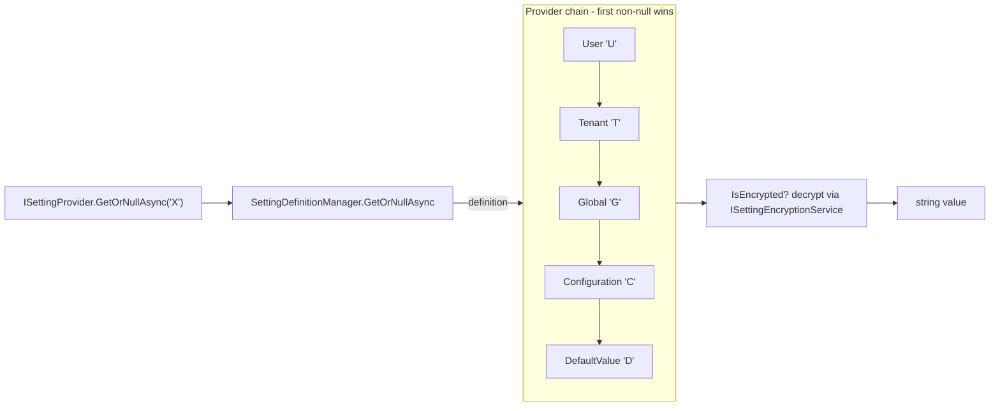

`Volo.Abp.Settings` is the configuration story for *runtime-editable* application settings, separate from `IConfiguration`. Setting *definitions* are declared statically by modules; *values* come from a layered chain of providers that the framework consults in a deterministic order, with the most specific provider winning. Encryption is opt-in per setting, applied transparently when reading or writing.

## Module wiring

```csharp
// framework/src/Volo.Abp.Settings/Volo/Abp/Settings/AbpSettingsModule.cs
[DependsOn(typeof(AbpLocalizationAbstractionsModule), typeof(AbpSecurityModule), typeof(AbpDataModule))]
public class AbpSettingsModule : AbpModule
{
    public override void ConfigureServices(ServiceConfigurationContext context)
    {
        Configure<AbpSettingOptions>(options =>
        {
            options.ValueProviders.Add<DefaultValueSettingValueProvider>();    // "D"
            options.ValueProviders.Add<ConfigurationSettingValueProvider>();   // "C"
            options.ValueProviders.Add<GlobalSettingValueProvider>();          // "G"
            options.ValueProviders.Add<UserSettingValueProvider>();            // "U"
        });
    }
}
```

`AbpMultiTenancyModule` adds the tenant provider (`TenantSettingValueProvider`, `"T"`) so a multi-tenant app's final chain is **`D → C → G → T → U`**.

`AbpSettingsModule.PreConfigureServices` scans the container for `ISettingDefinitionProvider` implementations and adds them to `AbpSettingOptions.DefinitionProviders`.

## Defining settings

A module declares settings by subclassing `SettingDefinitionProvider`:

```csharp
public class BookStoreSettings : SettingDefinitionProvider
{
    public override void Define(ISettingDefinitionContext context)
    {
        context.Add(
            new SettingDefinition("BookStore.MaxRentalDays", defaultValue: "14",
                displayName: L("BookStore.MaxRentalDays"))
            { IsEncrypted = false, Providers = { "T", "U" } } // restrict provider chain
        );
    }
}
```

`SettingDefinition` (`SettingDefinition.cs`) carries the name, default value, optional `Providers` whitelist, `IsEncrypted` flag, `IsVisibleToClients`, and `IsInherited` flag (currently advisory — see TODO in `SettingProvider.GetOrNullAsync`). `StaticSettingDefinitionStore` caches them and raises `StaticSettingDefinitionChangedEvent` so the optional `IDynamicSettingDefinitionStore` (used by admin UIs) can react.

`SettingDefinitionManager` merges static and dynamic definitions on lookup, similar to `PermissionDefinitionManager`.

## `ISettingProvider`

```csharp
public interface ISettingProvider
{
    Task<string?> GetOrNullAsync(string name);
    Task<List<SettingValue>> GetAllAsync(string[] names);
    Task<List<SettingValue>> GetAllAsync();
}
```

`SettingProvider` (`SettingProvider.cs`) is the concrete implementation. The resolution algorithm walks `ISettingValueProviderManager.Providers` *in reverse*, returning the first non-null value:

```csharp
var providers = Enumerable.Reverse(SettingValueProviderManager.Providers);
if (setting.Providers.Any())
    providers = providers.Where(p => setting.Providers.Contains(p.Name));

var value = await GetOrNullValueFromProvidersAsync(providers, setting);
if (value != null && setting.IsEncrypted)
    value = SettingEncryptionService.Decrypt(setting, value);
return value;
```

The reversed iteration is what makes the chain "most specific wins": `UserSettingValueProvider` is added last in DI, so it is queried first when reading.

## The value-provider chain

| Order (read) | Provider | `Name` | Source | File |
| --- | --- | --- | --- | --- |
| 1 | `UserSettingValueProvider` | `"U"` | `ISettingStore` keyed by `AbpClaimTypes.UserId` from `ICurrentPrincipalAccessor`. | `Volo/Abp/Settings/UserSettingValueProvider.cs` |
| 2 | `TenantSettingValueProvider` *(MultiTenancy)* | `"T"` | `ISettingStore` keyed by `ICurrentTenant.Id`. | `framework/src/Volo.Abp.MultiTenancy/Volo/Abp/MultiTenancy/TenantSettingValueProvider.cs` |
| 3 | `GlobalSettingValueProvider` | `"G"` | `ISettingStore` for the host scope (no user/tenant). | `Volo/Abp/Settings/GlobalSettingValueProvider.cs` |
| 4 | `ConfigurationSettingValueProvider` | `"C"` | `IConfiguration["Settings:<Name>"]` — typically `appsettings.json`. | `Volo/Abp/Settings/ConfigurationSettingValueProvider.cs` |
| 5 | `DefaultValueSettingValueProvider` | `"D"` | `SettingDefinition.DefaultValue`. | `Volo/Abp/Settings/DefaultValueSettingValueProvider.cs` |

`ISettingStore` (`Volo/Abp/Settings/ISettingStore.cs`) is the abstraction backed by `Volo.Abp.SettingManagement` for the U / T / G providers. The default `NullSettingStore` returns nulls so a fresh app falls through to configuration / defaults.

`SettingDefinition.Providers` is a whitelist — set `Providers = { "G", "T" }` to forbid users from overriding a setting.

## Resolution flow



## Encryption

`ISettingEncryptionService` (`ISettingEncryptionService.cs`) is the contract; `SettingEncryptionService` (`SettingEncryptionService.cs`) is the AES-based implementation that ABP ships. When `SettingDefinition.IsEncrypted == true`:

- `SettingProvider.GetOrNullAsync` decrypts the value after resolution.
- `SettingProvider.GetAllAsync` decrypts every value as it merges provider responses.
- The setting management UI / API encrypts before writing to `ISettingStore`.

`AbpSettingOptions.ReturnOriginalValueIfDecryptFailed` (default `true`) keeps the raw stored value when decryption throws — useful when toggling `IsEncrypted` to `true` on an existing setting without losing the old plaintext on first read.

## Bulk reads

`GetAllAsync(string[] names)` walks providers in the same reversed order but populates a dictionary keyed by name. Once a provider returns a non-null value, the corresponding definition is removed from the working list so later providers do not re-emit it:

```csharp
foreach (var provider in Enumerable.Reverse(SettingValueProviderManager.Providers))
{
    var settingValues = await provider.GetAllAsync(settingDefinitions.ToArray());
    foreach (var sv in settingValues.Where(x => x.Value != null))
        if (result[sv.Name].Value == null) result[sv.Name].Value = sv.Value;
    settingDefinitions.RemoveAll(x => …);
}
```

That ordering keeps the same "most-specific wins" semantics for the bulk API.

## Writing values

ABP exposes `ISettingManager` (in `Volo.Abp.SettingManagement`) for writes. It calls into the appropriate `ISettingStore` keyed by provider/key and triggers any dynamic-store cache invalidation. The settings module itself is read-only — write paths live in the SettingManagement module so abstract apps can swap in their own persistence.

## Extending the chain

Add a custom provider by inheriting `SettingValueProvider` and registering it:

```csharp
public class FeatureFlagSettingValueProvider : SettingValueProvider
{
    public override string Name => "F";   // unique short code
    public override Task<string?> GetOrNullAsync(SettingDefinition setting) => …;
}
Configure<AbpSettingOptions>(o => o.ValueProviders.Add<FeatureFlagSettingValueProvider>());
```

Because new providers are added at the *end* of `ValueProviders` and the chain is iterated in reverse, your provider becomes the highest-priority source.

## Related pages

<CardGroup cols={2}>
  <Card title="Features" href="/framework/cross-cutting/features" />
  <Card title="Authorization" href="/framework/cross-cutting/authorization" />
  <Card title="Localization" href="/framework/cross-cutting/localization" />
</CardGroup>
