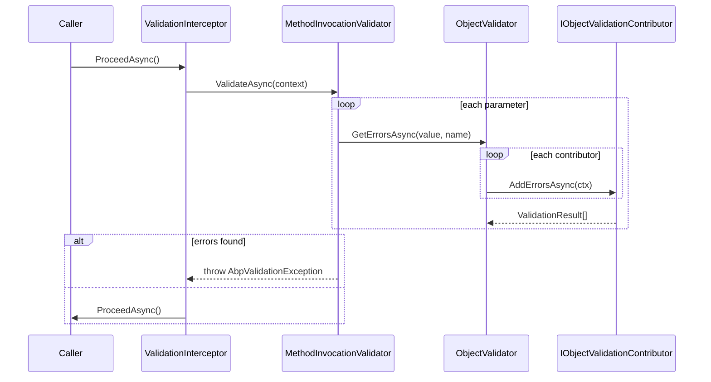

`Volo.Abp.Validation` adds a two-tier validation pipeline on top of `System.ComponentModel.DataAnnotations`. The lower tier is a contributor-based `IObjectValidator` that anyone can call; the upper tier is a DynamicProxy interceptor that automatically validates every public method's parameters on application services. Both fail with `AbpValidationException`, which ABP's MVC layer converts to RFC 7807 problem details.

## Module bootstrap

```csharp
// framework/src/Volo.Abp.Validation/Volo/Abp/Validation/AbpValidationModule.cs
[DependsOn(typeof(AbpValidationAbstractionsModule), typeof(AbpLocalizationModule))]
public class AbpValidationModule : AbpModule
{
    public override void PreConfigureServices(ServiceConfigurationContext context)
    {
        context.Services.OnRegistered(ValidationInterceptorRegistrar.RegisterIfNeeded);
        AutoAddObjectValidationContributors(context.Services);
    }
}
```

`ValidationInterceptorRegistrar` attaches `ValidationInterceptor` to any class whose declaring type implements `IValidationEnabled` (the marker for application services). `AutoAddObjectValidationContributors` scans the DI container for every `IObjectValidationContributor` and registers it into `AbpValidationOptions.ObjectValidationContributors`.

## `IObjectValidator`

```csharp
// framework/src/Volo.Abp.Validation/Volo/Abp/Validation/IObjectValidator.cs (abstract layer)
public interface IObjectValidator
{
    Task ValidateAsync(object? validatingObject, string? name = null, bool allowNull = false);
    Task<List<ValidationResult>> GetErrorsAsync(object? validatingObject, string? name = null, bool allowNull = false);
}
```

`ObjectValidator` (`ObjectValidator.cs`) creates an `IServiceScope`, instantiates each contributor type, and asks it to fill an `ObjectValidationContext.Errors` list. If any errors remain at the end, `ValidateAsync` throws `AbpValidationException`:

```csharp
var context = new ObjectValidationContext(validatingObject);
foreach (var contributorType in Options.ObjectValidationContributors)
{
    var contributor = (IObjectValidationContributor)scope.ServiceProvider.GetRequiredService(contributorType);
    await contributor.AddErrorsAsync(context);
}
if (context.Errors.Any())
    throw new AbpValidationException("Object state is not valid! See ValidationErrors for details.", context.Errors);
```

`allowNull` lets callers permit a null payload (used by application service methods whose parameter is `[CanBeNull]`).

## Built-in contributor: data annotations

`DataAnnotationObjectValidationContributor` (`DataAnnotationObjectValidationContributor.cs`) is the always-registered contributor that mirrors MVC's data-annotations behaviour and adds two ABP-specific behaviours:

- **Recursive traversal** of complex graphs up to `MaxRecursiveParameterValidationDepth = 8`, walking enumerables and visiting non-primitive properties. Properties decorated with `[DisableValidation]` are skipped; types listed in `Options.IgnoredTypes` halt recursion.
- **`IValidatableObject` invocation** — after attribute-driven property checks, if the object implements `IValidatableObject`, its `Validate(ValidationContext)` is also invoked.

`IAttributeValidationResultProvider` is the seam used to call each `ValidationAttribute`; modules can register a custom one to inject localisation or override default error messages (the default `DefaultAttributeValidationResultProvider` uses ASP.NET's behaviour).

## `MethodInvocationValidator`

```csharp
// MethodInvocationValidator.cs
public virtual async Task ValidateAsync(MethodInvocationValidationContext context)
{
    if (context.Parameters.IsNullOrEmpty()) return;
    if (!context.Method.IsPublic) return;
    if (IsValidationDisabled(context)) return;
    if (context.Parameters.Length != context.ParameterValues.Length)
        throw new Exception("Method parameter count does not match with argument count!");

    await AddMethodParameterValidationErrorsAsync(context);
    if (context.Errors.Any()) ThrowValidationError(context);
}

protected virtual bool IsValidationDisabled(MethodInvocationValidationContext context)
{
    if (context.Method.IsDefined(typeof(EnableValidationAttribute), true)) return false;
    return ReflectionHelper.GetSingleAttributeOfMemberOrDeclaringTypeOrDefault<DisableValidationAttribute>(context.Method) != null;
}
```

The interceptor (`ValidationInterceptor.cs`) builds a `MethodInvocationValidationContext` from `IAbpMethodInvocation` arguments and parameters, calls the validator, and only then proceeds. `[DisableValidation]` opt-outs work either on the method or its declaring type; `[EnableValidation]` overrides a type-level disable for a specific method.

`AddMethodParameterValidationErrorsAsync` loops parameters and calls `_objectValidator.GetErrorsAsync(value, parameter.Name, allowNull: parameter.HasDefaultValue)`. The pipeline therefore reuses the same contributor chain whether the caller is the interceptor or hand-written code (`await _objectValidator.ValidateAsync(input)`).

## `AbpValidationException`

`AbpValidationException` (in the abstractions module) wraps a `List<ValidationResult>` accessible via `ValidationErrors`. It implements `IUserFriendlyException` so the default exception subscriber returns a 400 with the localised messages, and `IHasErrorCode` for clients that read RFC 7807 codes. Throw it manually from domain services to surface custom rules:

```csharp
throw new AbpValidationException("Invalid book payload",
    new List<ValidationResult> { new ValidationResult("Title is required", new[] { "Title" }) });
```

## `AbpValidationOptions`

```csharp
// AbpValidationOptions.cs
public class AbpValidationOptions
{
    public List<Type> IgnoredTypes { get; }                            // recursion stop-list
    public ITypeList<IObjectValidationContributor> ObjectValidationContributors { get; set; }
}
```

Add `IgnoredTypes.Add(typeof(MyValueObject))` to skip third-party types you cannot annotate. Push extra contributors with `ObjectValidationContributors.Add<MyFluentValidationContributor>()`; the `Volo.Abp.FluentValidation` package ships a contributor of that shape that delegates to FluentValidation's `IValidator<T>`.

## Sequence



## Practical recipes

- **Opt a service out.** `[DisableValidation]` on the class — useful for low-level repositories.
- **Validate inside domain code.** Inject `IObjectValidator` and call `await _validator.ValidateAsync(dto)`; the same data-annotation rules run.
- **Combine FluentValidation.** Add `Volo.Abp.FluentValidation`; `FluentValidationObjectValidationContributor` joins the chain after data annotations so both contribute errors to the same `AbpValidationException`.

## Related pages

<CardGroup cols={2}>
  <Card title="Authorization" href="/framework/cross-cutting/authorization" />
  <Card title="Localization" href="/framework/cross-cutting/localization" />
</CardGroup>
