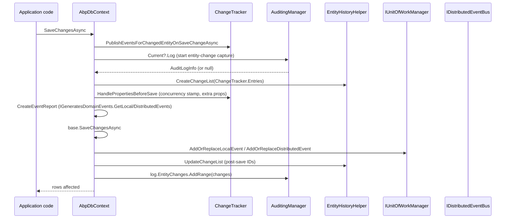

`Volo.Abp.EntityFrameworkCore` wraps `Microsoft.EntityFrameworkCore.DbContext` with an opinionated `AbpDbContext<TDbContext>` that owns the entire save lifecycle. It is the seam where ABP's repositories, unit-of-work, multi-tenancy, soft delete, auditing, entity-history and distributed-event outbox all interlock. This page walks the save pipeline, the conventions injected during model creation, and enumerates the seven provider integration modules ABP ships.

## AbpDbContext anatomy

`AbpDbContext<TDbContext>` (`framework/src/Volo.Abp.EntityFrameworkCore/Volo/Abp/EntityFrameworkCore/AbpDbContext.cs`) is `abstract`, registered as `ITransientDependency`, and implements `IAbpEfCoreDbContext` plus `IAbpEfCoreDbFunctionContext`. Rather than constructor-inject every collaborator, it relies on `IAbpLazyServiceProvider` so derived contexts do not need to forward dependencies:

```csharp
public IAbpLazyServiceProvider LazyServiceProvider { get; set; } = default!;
public ICurrentTenant CurrentTenant => LazyServiceProvider.LazyGetRequiredService<ICurrentTenant>();
public IDataFilter DataFilter => LazyServiceProvider.LazyGetRequiredService<IDataFilter>();
public IAuditPropertySetter AuditPropertySetter => LazyServiceProvider.LazyGetRequiredService<IAuditPropertySetter>();
public IEntityHistoryHelper EntityHistoryHelper =>
    LazyServiceProvider.LazyGetService<IEntityHistoryHelper>(NullEntityHistoryHelper.Instance);
public IDistributedEventBus DistributedEventBus => LazyServiceProvider.LazyGetRequiredService<IDistributedEventBus>();
public IUnitOfWorkManager UnitOfWorkManager => LazyServiceProvider.LazyGetRequiredService<IUnitOfWorkManager>();
```

The lazy accessors mean a `DbContext` constructed by `dotnet ef` design-time tools (where `LazyServiceProvider` is null) still works for migrations; runtime code guards on `LazyServiceProvider == null`.

`Initialize(AbpEfCoreDbContextInitializationContext)` is called by `UnitOfWorkDbContextProvider` when the context is materialised. It applies the UoW command timeout to relational providers, forces `ChangeTracker.CascadeDeleteTiming = CascadeTiming.OnSaveChanges`, and subscribes `ChangeTracker.Tracked` / `ChangeTracker.StateChanged` events so the ABP concepts (ID generation, audit timestamps, navigation tracking, extra-property hydration) are applied immediately when EF marks an entity Added/Modified rather than only at `SaveChangesAsync`.

## Model conventions

`OnModelCreating` walks every `IMutableEntityType` and invokes three reflected helpers (`ConfigureBaseProperties`, `ConfigureValueConverter`, `ConfigureValueGenerated`) per entity:

- **`ConfigureBaseProperties<TEntity>`** skips owned types and non-`IEntity` types, calls `entityTypeBuilder.ConfigureByConvention()` (from `Volo.Abp.EntityFrameworkCore.Modeling`), then wires global filters.
- **`ConfigureValueConverter<TEntity>`** attaches `AbpDateTimeValueConverter` / `AbpNullableDateTimeValueConverter` to every `DateTime` property so the configured `Clock.Kind` (typically UTC) is enforced on read/write. Properties or types decorated with `[DisableDateTimeNormalization]` opt out.
- **`ConfigureValueGenerated<TEntity>`** disables EF's value generation for `IEntity<Guid>.Id` (calls `ValueGeneratedNever()`) unless the property is decorated with `[DatabaseGenerated]`, so the ABP `IGuidGenerator` controls primary-key creation.

`OnConfiguring` and `ConfigureConventions` also fan out to per-DbContext callbacks registered via `AbpDbContextOptions` (`Configure<AbpDbContextOptions>(...)`), enabling modules like `Volo.Abp.AuditLogging.EntityFrameworkCore` to inject mappings without subclassing the host's `DbContext`.

## SaveChangesAsync pipeline

The override of `SaveChangesAsync(bool, CancellationToken)` is the heart of the integration. It runs in a strict order so audit, events, and concurrency stamps stay consistent:



Key methods that drive that sequence (all virtual, all in `AbpDbContext.cs`):

| Method | Role |
| --- | --- |
| `PublishEventsForChangedEntityOnSaveChangeAsync` | Walks `AbpEfCoreNavigationHelper.GetChangedEntityEntries()` and publishes `EntityUpdatedEvent`/`EntityDeletedEvent` for aggregate roots whose navigations changed, honouring `AbpEntityChangeOptions.IgnoredNavigationEntitySelectors`. |
| `HandlePropertiesBeforeSave` | Calls `HandleExtraPropertiesOnSave` (mirrors `ExtraProperties` into entity-extension columns) and `UpdateConcurrencyStamp` for `IHasConcurrencyStamp`. |
| `CreateEventReport` | Drains `IGeneratesDomainEvents.GetLocalEvents()` / `GetDistributedEvents()` into an `EntityEventReport`. |
| `PublishEntityEvents` | Pushes each event into `UnitOfWorkManager.Current` as a `UnitOfWorkEventRecord` so the bus only fires on UoW completion. |
| `ApplyAbpConceptsForAddedEntity` | Calls `CheckAndSetId`, `SetConcurrencyStampIfNull`, and `SetCreationAuditProperties`. |
| `ApplyAbpConceptsForModifiedEntity` | Increments entity version, sets modification audit, and applies deletion audit when soft delete is toggled. |
| `ApplyAbpConceptsForDeletedEntity` | Detects hard-delete (`UnitOfWorkItemNames.HardDeletedEntities`), otherwise reloads the entry, sets `IsDeleted = true`, and writes deletion audit. |

Concurrency exceptions are translated: a `DbUpdateConcurrencyException` is re-thrown as `AbpDbConcurrencyException` after logging which entries collided. The `finally` block also restores `AutoDetectChangesEnabled`, resets the navigation tracker, and registers `AbpEfCoreNavigationHelper.Clear()` to run on UoW completion.

For scenarios that need raw EF behaviour (bypassing all of the above), `SaveChangesOnDbContextAsync` calls `base.SaveChangesAsync` directly.

## Global query filters

`ConfigureGlobalFilters<TEntity>` only attaches a filter when the entity implements `IMultiTenant` or `ISoftDelete`. The expression is composed in `CreateFilterExpression<TEntity>`:

```csharp
if (typeof(ISoftDelete).IsAssignableFrom(typeof(TEntity)))
{
    expression = e => !IsSoftDeleteFilterEnabled || !EF.Property<bool>(e, "IsDeleted");
}
if (typeof(IMultiTenant).IsAssignableFrom(typeof(TEntity)))
{
    Expression<Func<TEntity, bool>> tenant =
        e => !IsMultiTenantFilterEnabled || EF.Property<Guid>(e, "TenantId") == CurrentTenantId;
    expression = expression == null ? tenant : QueryFilterExpressionHelper.CombineExpressions(expression, tenant);
}
```

`IsSoftDeleteFilterEnabled` and `IsMultiTenantFilterEnabled` are read from `IDataFilter` per-request, so calls like `DataFilter.Disable<ISoftDelete>()` (see [data seeding & filtering](/framework/data/data-seeding-and-filtering)) flip the predicate immediately — the compiled query cache key, returned by `GetCompiledQueryCacheKey()`, embeds both flags plus `CurrentTenantId` so EF re-translates when state changes:

```csharp
public virtual string GetCompiledQueryCacheKey()
    => $"{CurrentTenantId?.ToString() ?? "Null"}:{IsSoftDeleteFilterEnabled}:{IsMultiTenantFilterEnabled}";
```

When `AbpEfCoreGlobalFilterOptions.UseDbFunction` is true and the model is built with `AbpDbContextOptionsExtension`, the LINQ predicate is replaced with calls into `AbpEfCoreDataFilterDbFunctionMethods.SoftDeleteFilter` / `MultiTenantFilter`. `AbpEfCoreCurrentDbContext` carries the resolved `AbpDbContext` into the DB-function so the function can read `IsSoftDeleteFilterEnabled` and `CurrentTenantId`. Files involved live in `framework/src/Volo.Abp.EntityFrameworkCore/Volo/Abp/EntityFrameworkCore/GlobalFilters/`:

- `AbpEfCoreGlobalFilterOptions.cs` — `UseDbFunction` toggle.
- `AbpEfCoreDataFilterDbFunctionMethods.cs` — registered DB function bodies.
- `AbpCompiledQueryCacheKeyGenerator.cs` + `IAbpEfCoreCompiledQueryCacheKeyProvider.cs` — append the filter key to EF's compiled-query cache so two tenants don't share a translated query.

## Auditing hooks and entity history

`AbpDbContext` does not call `IAuditingStore` directly. It reads `AuditingManager.Current?.Log` (the ambient `AuditLogInfo` set up by [`AuditingInterceptor`](/framework/cross-cutting/auditing)) and appends `EntityChangeInfo` instances produced by `EntityHistoryHelper`:

```csharp
var auditLog = AuditingManager?.Current?.Log;
List<EntityChangeInfo>? entityChangeList = null;
if (auditLog != null)
{
    EntityHistoryHelper.InitializeNavigationHelper(AbpEfCoreNavigationHelper);
    entityChangeList = EntityHistoryHelper.CreateChangeList(ChangeTracker.Entries().ToList());
}
// ... base.SaveChangesAsync ...
if (entityChangeList != null)
{
    EntityHistoryHelper.UpdateChangeList(entityChangeList);
    auditLog!.EntityChanges.AddRange(entityChangeList);
}
```

`EntityHistoryHelper` (`framework/src/Volo.Abp.EntityFrameworkCore/Volo/Abp/EntityFrameworkCore/EntityHistory/EntityHistoryHelper.cs`) consults `AbpAuditingOptions.EntityHistorySelectors` plus `[Audited]` / `[DisableAuditing]` attributes (via `IAuditingHelper`) to decide which entities and properties to capture, serialises before/after values with `IJsonSerializer`, and calls `AbpEfCoreNavigationHelper` to detect modified navigations. The companion `NullEntityHistoryHelper` is bound when no `IEntityHistoryHelper` is registered.

Audit-property writes for individual entries are performed by `IAuditPropertySetter` inside `ApplyAbpConceptsFor*Entity`:

- `SetCreationAuditProperties` writes `CreationTime`, `CreatorId`.
- `SetModificationAuditProperties` writes `LastModificationTime`, `LastModifierId` and increments `EntityVersion`.
- `SetDeletionAuditProperties` writes `IsDeleted`, `DeletionTime`, `DeleterId`.

`AbpEfCoreNavigationHelper` (`ChangeTrackers/AbpEfCoreNavigationHelper.cs`) tracks which navigations on an aggregate root mutated during the lifecycle of an entry so the framework can publish `EntityUpdatedEvent` for the *root* when only a child collection changed — controlled by `AbpEntityChangeOptions.UpdateAggregateRootWhenNavigationChanges`.

## Distributed events: inbox and outbox

When an `AbpDbContext` implements `IHasEventOutbox` and/or `IHasEventInbox` (`DistributedEvents/IHasEventOutbox.cs`, `IHasEventInbox.cs`), the EF Core module exposes outbox/inbox tables via:

- `DbContextEventOutbox<TDbContext>` — `EnqueueAsync(OutgoingEventInfo)` writes to the `OutgoingEvents` `DbSet<OutgoingEventRecord>`; `GetWaitingEventsAsync` / `DeleteOldEventsAsync` are the worker-facing methods.
- `DbContextEventInbox<TDbContext>` — mirror for incoming events with idempotency.
- `EventOutboxDbContextModelBuilderExtensions.ConfigureEventOutbox()` and `EventInboxDbContextModelBuilderExtensions.ConfigureEventInbox()` register the EF mappings, indexes, and tenant column.
- `EfCoreOutboxConfigExtensions` / `EfCoreInboxConfigExtensions` plug the EF stores into `AbpDistributedEventBusOptions` so the background outbox processor picks them up.

Because `AbpDbContext.PublishEntityEvents` defers events to the active UoW via `AddOrReplaceDistributedEvent`, the distributed event bus only commits to the outbox once the SQL transaction wrapping the unit of work succeeds — the standard transactional-outbox pattern.

## `AbpDbContextOptions` and provider replacement

`AbpDbContextOptions` (`framework/src/Volo.Abp.EntityFrameworkCore/Volo/Abp/EntityFrameworkCore/AbpDbContextOptions.cs`) is configured during module `ConfigureServices`. It holds:

| Member | Purpose |
| --- | --- |
| `PreConfigure(action)` / `PreConfigure<TDbContext>(action)` | Run before any provider-specific configuration. |
| `Configure(action)` / `Configure<TDbContext>(action)` | Apply provider configuration (e.g. `context.UseSqlServer()`). |
| `DbContextReplacements` | `MultiTenantDbContextType → ImplementationType` map populated by `IAbpDbContextRegistrationOptionsBuilder.ReplaceDbContext<T>()` so a generic module DbContext can be swapped for a project-specific one. |
| `ConfigureConventions<TDbContext>(action)` / `DefaultConventionAction` | Wired into `ConfigureConventions(ModelConfigurationBuilder)`. |
| `OnModelCreatingActions` / `DefaultOnModelCreatingAction` | Per-context callbacks invoked from `OnModelCreating`. |
| `OnConfiguringActions` / `DefaultOnConfiguringAction` | Per-context callbacks invoked from `OnConfiguring`. |

The DI plumbing lives in `framework/src/Volo.Abp.EntityFrameworkCore/Volo/Abp/EntityFrameworkCore/DependencyInjection/`. `AbpDbContextRegistrationOptions` is the registration DSL exposed by `services.AddAbpDbContext<TDbContext>(...)`, `DbContextOptionsFactory.Create<TDbContext>(IServiceProvider)` materialises a fully-configured `DbContextOptions<TDbContext>` per UoW, and `EfCoreRepositoryRegistrar` wires up `IRepository<TEntity>` implementations for every registered entity.

## Provider modules

ABP ships one NuGet module per supported EF Core provider. Each module depends on `AbpEntityFrameworkCoreModule`, adds the provider package, registers a `UseXxx` extension on `AbpDbContextConfigurationContext`, and supplies an `IConnectionStringChecker` used by the `Volo.Abp.Data` migration tooling.

| Provider | Module class | Configuration extension | Connection-string checker |
| --- | --- | --- | --- |
| SQL Server | `framework/src/Volo.Abp.EntityFrameworkCore.SqlServer/Volo/Abp/EntityFrameworkCore/SqlServer/AbpEntityFrameworkCoreSqlServerModule.cs` | `Volo/Abp/EntityFrameworkCore/AbpDbContextConfigurationContextSqlServerExtensions.cs` (`UseSqlServer`) | `ConnectionStrings/SqlServerConnectionStringChecker.cs` |
| PostgreSQL | `framework/src/Volo.Abp.EntityFrameworkCore.PostgreSql/Volo/Abp/EntityFrameworkCore/PostgreSql/AbpEntityFrameworkCorePostgreSqlModule.cs` | `Volo/Abp/EntityFrameworkCore/AbpDbContextConfigurationContextPostgreSqlExtensions.cs` (`UseNpgsql`) | `ConnectionStrings/NpgsqlConnectionStringChecker.cs` |
| MySQL (official) | `framework/src/Volo.Abp.EntityFrameworkCore.MySQL/Volo/Abp/EntityFrameworkCore/MySQL/AbpEntityFrameworkCoreMySQLModule.cs` | `Volo/Abp/EntityFrameworkCore/AbpDbContextConfigurationContextMySQLExtensions.cs` (`UseMySQL`) | `ConnectionStrings/MySQLConnectionStringChecker.cs` |
| MySQL (Pomelo) | `framework/src/Volo.Abp.EntityFrameworkCore.MySQL.Pomelo/Volo/Abp/EntityFrameworkCore/MySQL/AbpEntityFrameworkCoreMySQLPomeloModule.cs` | `Volo/Abp/EntityFrameworkCore/AbpDbContextConfigurationContextMySQLExtensions.cs` (`UseMySql` with `ServerVersion`) | `ConnectionStrings/PomeloMySQLConnectionStringChecker.cs` |
| Oracle (ODP.NET) | `framework/src/Volo.Abp.EntityFrameworkCore.Oracle/Volo/Abp/EntityFrameworkCore/Oracle/AbpEntityFrameworkCoreOracleModule.cs` | `Volo/Abp/EntityFrameworkCore/AbpDbContextConfigurationContextOracleExtensions.cs` (`UseOracle`) | `ConnectionStrings/OracleConnectionStringChecker.cs` |
| Oracle (Devart) | `framework/src/Volo.Abp.EntityFrameworkCore.Oracle.Devart/Volo/Abp/EntityFrameworkCore/Oracle/Devart/AbpEntityFrameworkCoreOracleDevartModule.cs` | `Volo/Abp/EntityFrameworkCore/AbpDbContextConfigurationContextOracleDevartExtensions.cs` (`UseOracle`) | `ConnectionStrings/OracleDevartConnectionStringChecker.cs` |
| SQLite | `framework/src/Volo.Abp.EntityFrameworkCore.Sqlite/Volo/Abp/EntityFrameworkCore/Sqlite/AbpEntityFrameworkCoreSqliteModule.cs` | `Volo/Abp/EntityFrameworkCore/AbpDbContextConfigurationContextSqliteExtensions.cs` (`UseSqlite`) | `ConnectionStrings/SqliteConnectionStringChecker.cs` |

The two MySQL modules cannot be combined — pick `MySQL` (Oracle's MySql.EntityFrameworkCore) or `MySQL.Pomelo` (`Pomelo.EntityFrameworkCore.MySql`) per app. Likewise `Oracle` (ODP.NET-based) and `Oracle.Devart` are mutually exclusive. The SQLite module additionally registers `SqliteBusyTimeoutSaveChangesInterceptor` (`Interceptors/SqliteBusyTimeoutSaveChangesInterceptor.cs`) and exposes `AbpSqliteOptions.BusyTimeout` so high-contention tests get the EF-recommended retry behaviour. `AbpUnitTestSqliteConnection` is a convenience for in-memory test fixtures.

## Related pages

<CardGroup cols={2}>
  <Card title="MongoDB integration" href="/framework/data/mongodb" />
  <Card title="Data seeding & filtering" href="/framework/data/data-seeding-and-filtering" />
  <Card title="Dapper repositories" href="/framework/data/dapper" />
  <Card title="Auditing internals" href="/framework/cross-cutting/auditing" />
</CardGroup>
