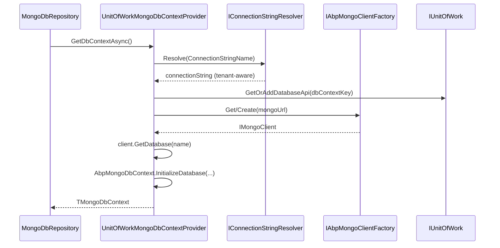

`Volo.Abp.MongoDB` mirrors the EF Core integration but adapts the patterns to the official MongoDB .NET driver. Instead of a `DbContext` that owns its tables, ABP's `AbpMongoDbContext` is a thin shell over `IMongoDatabase`; ABP repositories layer auditing, multi-tenancy, soft delete, and domain-event publication on top of plain `IMongoCollection<T>` access.

## AbpMongoDbContext

`AbpMongoDbContext` (`framework/src/Volo.Abp.MongoDB/Volo/Abp/MongoDB/AbpMongoDbContext.cs`) is `abstract`, registered as `ITransientDependency`, and exposes three pieces of state:

```csharp
public IMongoClient Client { get; private set; } = default!;
public IMongoDatabase Database { get; private set; } = default!;
public IClientSessionHandle? SessionHandle { get; private set; }

public virtual IMongoCollection<T> Collection<T>()
    => Database.GetCollection<T>(GetCollectionName<T>());
```

The context is *populated* by the UoW provider — derived classes never call `MongoClient.GetDatabase` themselves. Two hooks let you customise it:

- `protected internal virtual void CreateModel(IMongoModelBuilder modelBuilder)` — invoked by `IMongoModelSource` during first use to register `IMongoEntityModel` entries (collection names, BSON class maps, index definitions). Use `modelBuilder.Entity<T>().CollectionName(...).BsonMap(...)` here. The default model source caches per-context.
- `GetCollectionName<T>()` resolves the collection name via the model so `[MongoCollection]` attributes or fluent overrides flow through.

`AbpMongoModelBuilderConfigurationOptions`, `MongoEntityModelBuilder`, and `MongoModelBuilder` (all under `Volo/Abp/MongoDB/`) are the fluent surface for `CreateModel`.

## MongoDbRepository

`MongoDbRepository<TMongoDbContext, TEntity>` (`framework/src/Volo.Abp.MongoDB/Volo/Abp/Domain/Repositories/MongoDB/MongoDbRepository.cs`) is the runtime implementation registered for every `IRepository<TEntity>` discovered in a module. It inherits from `RepositoryBase<TEntity>` and obtains the active context through `IMongoDbContextProvider<TMongoDbContext>`:

```csharp
public class MongoDbRepository<TMongoDbContext, TEntity>
    : RepositoryBase<TEntity>, IMongoDbRepository<TEntity>
    where TMongoDbContext : IAbpMongoDbContext
    where TEntity : class, IEntity
{
    public virtual async Task<IMongoCollection<TEntity>> GetCollectionAsync(CancellationToken ct = default)
        => (await GetDbContextAsync(GetCancellationToken(ct))).Collection<TEntity>();

    protected Task<TMongoDbContext> GetDbContextAsync(CancellationToken ct = default)
    {
        if (!EntityHelper.IsMultiTenant<TEntity>())
        {
            using (CurrentTenant.Change(null))
                return DbContextProvider.GetDbContextAsync(ct);
        }
        return DbContextProvider.GetDbContextAsync(ct);
    }
}
```

Crucially the repository forces non-`IMultiTenant` entities through the *host* connection by calling `CurrentTenant.Change(null)` before resolving the context — this stops shared collections from being scoped to a tenant-specific Mongo database. Filtering for soft-delete and multi-tenancy on read paths is delegated to `MongoDbRepositoryFilterer` (`Volo/Abp/Domain/Repositories/MongoDB/MongoDbRepositoryFilterer.cs`), which composes a `FilterDefinition<T>` honouring `IDataFilter.IsEnabled<ISoftDelete>()` and `IDataFilter.IsEnabled<IMultiTenant>()`.

CRUD methods (`InsertAsync`, `UpdateAsync`, `DeleteAsync`, …) apply the same ABP concepts as the EF Core variant: GUID generation through `IGuidGenerator`, audit timestamps via `IAuditPropertySetter`, soft-delete by flipping `ISoftDelete.IsDeleted` instead of issuing `DeleteOne`, and event publishing via `EntityChangeEventHelper` / `IGeneratesDomainEvents` queues. Bulk methods can be accelerated by registering an `IMongoDbBulkOperationProvider` (`Volo/Abp/Domain/Repositories/MongoDB/IMongoDbBulkOperationProvider.cs`).

## UnitOfWorkMongoDbContextProvider and multi-tenant connections

`UnitOfWorkMongoDbContextProvider<TMongoDbContext>` (`framework/src/Volo.Abp.MongoDB/Volo/Abp/Uow/MongoDB/UnitOfWorkMongoDbContextProvider.cs`) is the bridge between `IUnitOfWork` and the Mongo driver:



Highlights from the source:

- `IConnectionStringResolver` is invoked per request, so `ICurrentTenant` flows into the connection string — different tenants can target different MongoDB databases or clusters via `AbpDbConnectionOptions`.
- `dbContextKey = $"{targetDbContextType.FullName}_{connectionString}"` ensures every distinct connection string gets its own `MongoDbDatabaseApi` in the UoW so transactions stay isolated.
- The database name is taken from `MongoUrl.DatabaseName`, falling back to `ConnectionStringNameAttribute.GetConnStringName(targetDbContextType)`.
- `IAbpMongoClientFactory` (`Volo/Abp/MongoDB/Clients/AbpMongoClientFactory.cs`) is a singleton cache so the same `MongoClient` (and its connection pool) is shared across UoWs.
- When the underlying server supports it, the provider opens an `IClientSessionHandle` and joins it to the UoW transaction; otherwise it logs `TransactionsNotSupportedWarningMessage` and falls back to non-transactional writes.

`MongoDbContextHelper` and `IMongoDbContextTypeProvider` allow modules to substitute their abstract `AbpMongoDbContext` subclass with a host-application override (analogous to EF Core's `ReplaceDbContext`).

## Distributed events on Mongo

Mongo contexts opt into the transactional outbox by implementing the same `IHasEventInbox` / `IHasEventOutbox` interfaces used by EF Core. Implementations live under `framework/src/Volo.Abp.MongoDB/Volo/Abp/MongoDB/DistributedEvents/`. Because Mongo transactions require a replica set, the outbox writes piggy-back on the UoW's `IClientSessionHandle` and roll back together with domain writes.

## Module bootstrap

`AbpMongoDbModule` depends on `AbpDddDomainModule` and registers the conventional services through `MongoDbRepositoryRegistrar` (`Volo/Abp/MongoDB/DependencyInjection/MongoDbRepositoryRegistrar.cs`). Applications wire a context with:

```csharp
context.Services.AddMongoDbContext<MyMongoDbContext>(options =>
{
    options.AddDefaultRepositories(includeAllEntities: true);
});
```

`AbpBsonClassMapExtensions`, `AbpBsonSerializer`, and `AbpMongoDbDateTimeSerializer` install BSON serialisers that honour ABP's `IClock` kind, GUID conventions, and extra-property dictionaries.

## Related pages

<CardGroup cols={2}>
  <Card title="Entity Framework Core" href="/framework/data/entity-framework-core" />
  <Card title="Data seeding & filtering" href="/framework/data/data-seeding-and-filtering" />
  <Card title="Memory DB (tests)" href="/framework/data/memory-db" />
  <Card title="Auditing" href="/framework/cross-cutting/auditing" />
</CardGroup>
