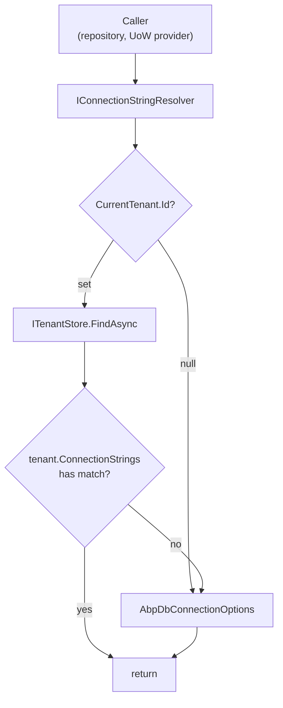

The `Volo.Abp.Data` module sits underneath every persistence story in ABP — EF Core, MongoDB, Dapper, and the in‑memory provider all depend on it for connection-string resolution, the soft‑delete / multi-tenant data filter, and the data-seed contributor pipeline. This page enumerates the core abstractions, where they live in the source tree, and how the module wires them up via [`AbpDataModule`](#abpdatamodule).

The implementation lives in `framework/src/Volo.Abp.Data/Volo/Abp/Data/`. The module depends on `AbpObjectExtendingModule`, `AbpUnitOfWorkModule`, and `AbpEventBusAbstractionsModule` — declared on `AbpDataModule.cs`.

## Module responsibilities

`AbpDataModule.cs` does three things in its lifecycle:

```csharp
[DependsOn(
    typeof(AbpObjectExtendingModule),
    typeof(AbpUnitOfWorkModule),
    typeof(AbpEventBusAbstractionsModule)
)]
public class AbpDataModule : AbpModule
{
    public override void PreConfigureServices(ServiceConfigurationContext context)
    {
        AutoAddDataSeedContributors(context.Services);
    }

    public override void ConfigureServices(ServiceConfigurationContext context)
    {
        var configuration = context.Services.GetConfiguration();

        Configure<AbpDbConnectionOptions>(configuration);

        context.Services.AddSingleton(typeof(IDataFilter<>), typeof(DataFilter<>));
    }

    public override void PostConfigureServices(ServiceConfigurationContext context)
    {
        Configure<AbpDbConnectionOptions>(options =>
        {
            options.Databases.RefreshIndexes();
        });
    }
    // ...
}
```

In `PreConfigureServices` it scans all registered services and adds every `IDataSeedContributor` implementation into `AbpDataSeedOptions.Contributors`. In `ConfigureServices` it binds `AbpDbConnectionOptions` from the application's `IConfiguration` (so the `ConnectionStrings` JSON section flows directly into the options) and registers the open generic `IDataFilter<>` as a singleton. The `PostConfigureServices` call refreshes the database mapping indexes after all modules have registered their database type mappings.

## Key services

| Service | File | Lifetime | Purpose |
| --- | --- | --- | --- |
| `IConnectionStringResolver` | `IConnectionStringResolver.cs` | Transient | Async resolution of the connection string for a given name. |
| `DefaultConnectionStringResolver` | `DefaultConnectionStringResolver.cs` | Transient | Reads from `AbpDbConnectionOptions` and falls back to the `Default` slot. |
| `MultiTenantConnectionStringResolver` | `framework/src/Volo.Abp.MultiTenancy/Volo/Abp/MultiTenancy/MultiTenantConnectionStringResolver.cs` | Transient (replaces default) | Looks up tenant‑scoped connection strings via `ICurrentTenant` + `ITenantStore`. |
| `AbpDbConnectionOptions` | `AbpDbConnectionOptions.cs` | Options | Holds `ConnectionStrings` + named `Databases` mappings. |
| `ConnectionStrings` | `ConnectionStrings.cs` | POCO | `Dictionary<string,string>` with a `Default` shortcut. |
| `ConnectionStringNameAttribute` | `ConnectionStringNameAttribute.cs` | Attribute | Attaches a connection string name to a DbContext type. |
| `IDataFilter` / `IDataFilter<TFilter>` | `IDataFilter.cs`, `DataFilter.cs` | Singleton | Toggles soft-delete / multi-tenant filters within an `AsyncLocal` scope. |
| `IDataSeeder` | `IDataSeeder.cs`, `DataSeeder.cs` | Transient | Runs all `IDataSeedContributor` implementations in order. |
| `IDataSeedContributor` | `IDataSeedContributor.cs` | Transient | Single `SeedAsync(DataSeedContext)` extension point. |
| `DataSeedContext` | `DataSeedContext.cs` | POCO | Carries `TenantId` and a `Properties` bag through the seeders. |
| `AbpDataSeedOptions` | `AbpDataSeedOptions.cs` | Options | `TypeList` of registered contributor types. |
| `AbpDataFilterOptions` | `AbpDataFilterOptions.cs` | Options | Default enabled/disabled state per filter type. |

## Connection string resolution

`IConnectionStringResolver` is intentionally minimal:

```csharp
public interface IConnectionStringResolver
{
    [Obsolete("Use ResolveAsync method.")]
    string Resolve(string? connectionStringName = null);

    Task<string> ResolveAsync(string? connectionStringName = null);
}
```

`DefaultConnectionStringResolver` resolves by calling `AbpDbConnectionOptions.GetConnectionStringOrNull(...)` which performs a three‑step lookup:

1. Direct match on `ConnectionStrings[name]`.
2. If `fallbackToDatabaseMappings` is true, finds a `DatabaseInfo` mapped to the name and uses that database's connection string.
3. Falls back to `ConnectionStrings.Default` when `fallbackToDefault` is true.

The `ConnectionStringNameAttribute` is what binds a DbContext / Mongo context type to a logical name:

```csharp
public static string GetConnStringName(Type type)
{
    var nameAttribute = type.GetTypeInfo().GetCustomAttribute<ConnectionStringNameAttribute>();
    return nameAttribute == null ? type.FullName! : nameAttribute.Name;
}
```

### Multi-tenant resolution

`MultiTenantConnectionStringResolver` is annotated `[Dependency(ReplaceServices = true)]` and lives in the multi-tenancy module. When `ICurrentTenant.Id` is set it loads `TenantConfiguration` via `ITenantStore` and walks a fallback ladder:

1. Tenant's named connection string (`tenant.ConnectionStrings[name]`).
2. Tenant‑level database mapping (only if `database.IsUsedByTenants`).
3. Tenant's default connection string.
4. Host's default — `base.ResolveAsync(...)`.

If the tenant has no connection strings defined at all, the resolver short-circuits to the host (so single-DB deployments still work).



## Data filters

`IDataFilter<TFilter>` is the typed façade and `IDataFilter` is the untyped switchboard:

```csharp
public interface IDataFilter<TFilter> where TFilter : class
{
    IDisposable Enable();
    IDisposable Disable();
    bool IsEnabled { get; }
}
```

`DataFilter<TFilter>` keeps state in an `AsyncLocal<DataFilterState>`. Calls to `Enable()` / `Disable()` flip `_filter.Value!.IsEnabled` and return a `DisposeAction` that restores the previous state on dispose. The initial state comes from `AbpDataFilterOptions.DefaultStates` (or `true` if no default is configured) — see `DataFilter.cs`. EF Core consumes this via `AbpDbContext.IsSoftDeleteFilterEnabled` and `IsMultiTenantFilterEnabled` to build global query filters; see [Entity Framework Core](/framework/data/entity-framework-core).

Two filter marker interfaces wired by default:

- `Volo.Abp.Domain.Entities.ISoftDelete` — controls `IsDeleted = true` exclusion.
- `Volo.Abp.MultiTenancy.IMultiTenant` — restricts rows to `CurrentTenant.Id`.

## Data seeding

`IDataSeeder` orchestrates contributors:

```csharp
[UnitOfWork]
public virtual async Task SeedAsync(DataSeedContext context)
{
    using (var scope = ServiceScopeFactory.CreateScope())
    {
        foreach (var contributorType in Options.Contributors)
        {
            var contributor = (IDataSeedContributor)
                scope.ServiceProvider.GetRequiredService(contributorType);
            await contributor.SeedAsync(context);
        }
    }
}
```

The default implementation runs every contributor in a single ambient unit of work. Setting `context.Properties[DataSeederExtensions.SeedInSeparateUow] = true` switches to a per-contributor UoW so that one failing seeder does not roll back the rest. The full mechanics live in [Data Seeding and Filtering](/framework/data/data-seeding-and-filtering).

## Cross-links

<CardGroup cols={2}>
  <Card title="Unit of Work" href="/framework/data/unit-of-work">Lifecycle, transactional API and distributed-event ordering.</Card>
  <Card title="Entity Framework Core" href="/framework/data/entity-framework-core">AbpDbContext save pipeline, global filters, entity history.</Card>
  <Card title="MongoDB" href="/framework/data/mongodb">AbpMongoDbContext and tenant-aware database routing.</Card>
  <Card title="Data Seeding and Filtering" href="/framework/data/data-seeding-and-filtering">Contributors, `IDataFilter` scopes, global filter wiring.</Card>
</CardGroup>
