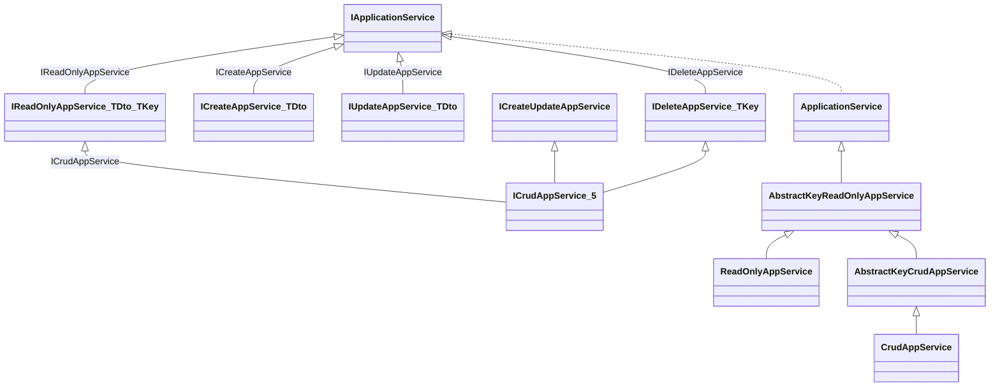

ABP's application services are where a request meets the domain. They are the natural target of the cross-cutting interceptors (`AuthorizationInterceptor`, `ValidationInterceptor`, `UnitOfWorkInterceptor`, `AuditingInterceptor`), the source of dynamic HTTP controllers (`Volo.Abp.AspNetCore.Mvc.Conventions`), and the seed of generated TypeScript / C# proxies in `ng-packs` and `Volo.Abp.Http.Client`. This page walks the base class, the generic CRUD ladder, the DTO toolkit, and how the pieces fit together. All sources are under `framework/src/Volo.Abp.Ddd.Application/Volo/Abp/Application/Services/` and `framework/src/Volo.Abp.Ddd.Application.Contracts/Volo/Abp/Application/`.

## Source Inventory

| File | Role |
| --- | --- |
| `Volo.Abp.Ddd.Application.Contracts/Volo/Abp/Application/Services/IApplicationService.cs` | Marker contract — extends `IRemoteService`. |
| `Volo.Abp.Ddd.Application.Contracts/Volo/Abp/Application/Services/IReadOnlyAppService.cs` | `GetAsync(id)`, `GetListAsync(input)`. |
| `Volo.Abp.Ddd.Application.Contracts/Volo/Abp/Application/Services/ICreateAppService.cs` | `CreateAsync(input)`. |
| `Volo.Abp.Ddd.Application.Contracts/Volo/Abp/Application/Services/IUpdateAppService.cs` | `UpdateAsync(id, input)`. |
| `Volo.Abp.Ddd.Application.Contracts/Volo/Abp/Application/Services/ICreateUpdateAppService.cs` | Composes the two above. |
| `Volo.Abp.Ddd.Application.Contracts/Volo/Abp/Application/Services/IDeleteAppService.cs` | `DeleteAsync(id)`. |
| `Volo.Abp.Ddd.Application.Contracts/Volo/Abp/Application/Services/ICrudAppService.cs` | Five overloads composing the contracts above. |
| `Volo.Abp.Ddd.Application/Volo/Abp/Application/Services/ApplicationService.cs` | The base class — lazy ambient services + policy/localiser helpers. |
| `Volo.Abp.Ddd.Application/Volo/Abp/Application/Services/AbstractKeyReadOnlyAppService.cs` | Provider-agnostic `Get`/`GetList` skeleton. |
| `Volo.Abp.Ddd.Application/Volo/Abp/Application/Services/ReadOnlyAppService.cs` | Pins `AbstractKey…` to `IReadOnlyRepository<TEntity, TKey>`. |
| `Volo.Abp.Ddd.Application/Volo/Abp/Application/Services/AbstractKeyCrudAppService.cs` | CRUD skeleton with mapping hooks (`MapToEntity`, `MapToGetOutputDto`, …). |
| `Volo.Abp.Ddd.Application/Volo/Abp/Application/Services/CrudAppService.cs` | Pins `AbstractKeyCrudAppService` to `IRepository<TEntity, TKey>`. |
| `Volo.Abp.Ddd.Application/Volo/Abp/Application/Services/AbpDynamicSortingGuard.cs` | Hardens `ApplyDefaultSorting` against injection. |
| `Volo.Abp.Ddd.Application.Contracts/Volo/Abp/Application/Dtos/` | 28 DTO base classes / interfaces (table below). |

## Class Hierarchy



## `IApplicationService`

```csharp
// framework/src/Volo.Abp.Ddd.Application.Contracts/Volo/Abp/Application/Services/IApplicationService.cs
public interface IApplicationService : IRemoteService
{
}
```

A marker that extends `IRemoteService` (which itself is empty). It is used everywhere the framework wants to identify "this is exposed to the outside world":

- The dynamic-controller convention turns implementations into `/api/<module>/<service>/<method>` controllers.
- `Volo.Abp.Http.Client` generates HTTP proxies for them.
- `AbpDddApplicationModule.ConfigureServices` adds it to `AbpApiDescriptionModelOptions.IgnoredInterfaces` so it does not show up in the public OpenAPI shape.

## `ApplicationService` Base

```csharp
// framework/src/Volo.Abp.Ddd.Application/Volo/Abp/Application/Services/ApplicationService.cs
public abstract class ApplicationService :
    IApplicationService,
    IAvoidDuplicateCrossCuttingConcerns,
    IValidationEnabled,
    IUnitOfWorkEnabled,
    IAuditingEnabled,
    IGlobalFeatureCheckingEnabled,
    ITransientDependency
{
    public IAbpLazyServiceProvider LazyServiceProvider { get; set; } = default!;
    public static string[] CommonPostfixes { get; set; } = { "AppService", "ApplicationService", "Service" };
    public List<string> AppliedCrossCuttingConcerns { get; } = new();

    protected IUnitOfWorkManager      UnitOfWorkManager     => LazyServiceProvider.LazyGetRequiredService<IUnitOfWorkManager>();
    protected IAsyncQueryableExecuter AsyncExecuter         => LazyServiceProvider.LazyGetRequiredService<IAsyncQueryableExecuter>();
    protected IObjectMapper           ObjectMapper          => /* keyed via ObjectMapperContext */;
    protected IGuidGenerator          GuidGenerator         => LazyServiceProvider.LazyGetService<IGuidGenerator>(SimpleGuidGenerator.Instance);
    protected ILoggerFactory          LoggerFactory         => LazyServiceProvider.LazyGetRequiredService<ILoggerFactory>();
    protected ICurrentTenant          CurrentTenant         => LazyServiceProvider.LazyGetRequiredService<ICurrentTenant>();
    protected IDataFilter             DataFilter            => LazyServiceProvider.LazyGetRequiredService<IDataFilter>();
    protected ICurrentUser            CurrentUser           => LazyServiceProvider.LazyGetRequiredService<ICurrentUser>();
    protected ISettingProvider        SettingProvider       => LazyServiceProvider.LazyGetRequiredService<ISettingProvider>();
    protected IClock                  Clock                 => LazyServiceProvider.LazyGetRequiredService<IClock>();
    protected IAuthorizationService   AuthorizationService  => LazyServiceProvider.LazyGetRequiredService<IAuthorizationService>();
    protected IFeatureChecker         FeatureChecker        => LazyServiceProvider.LazyGetRequiredService<IFeatureChecker>();
    protected IStringLocalizerFactory StringLocalizerFactory => LazyServiceProvider.LazyGetRequiredService<IStringLocalizerFactory>();
    protected IStringLocalizer L { /* lazy from LocalizationResource */ }
    protected IUnitOfWork? CurrentUnitOfWork => UnitOfWorkManager?.Current;

    protected virtual async Task CheckPolicyAsync(string? policyName)
    {
        if (string.IsNullOrEmpty(policyName)) return;
        await AuthorizationService.CheckAsync(policyName!);
    }
}
```

Notable facets:

- **Multiple marker interfaces** — `IValidationEnabled`, `IUnitOfWorkEnabled`, `IAuditingEnabled`, `IGlobalFeatureCheckingEnabled` are how the corresponding interceptor registrars decide to attach. Every application service inherits the full interceptor stack by default.
- **`IAvoidDuplicateCrossCuttingConcerns`** owns the `AppliedCrossCuttingConcerns` list used by `AbpCrossCuttingConcerns.IsApplied`; see [Aspects & Interceptors](/framework/core/aspects-and-interceptors).
- **`ITransientDependency`** means every service is registered with transient lifetime — no shared mutable state across requests.
- **`CommonPostfixes`** drives `IApplicationService` discovery in the dynamic-controller convention. A class named `UserAppService` is exposed as the controller `User`.
- **`LocalizationResource`** is a per-instance `Type` that drives `L["Key"]` lookups; set it in a derived class (`LocalizationResource = typeof(MyModuleResource);`).
- **`CheckPolicyAsync`** throws `AbpAuthorizationException` on failure, which is converted to 403/401 by the [exception handling pipeline](/framework/core/exception-handling).

## `AbstractKeyReadOnlyAppService<TEntity, TGetOutputDto, TGetListOutputDto, TKey, TGetListInput>`

This is the *generic skeleton* you override when your repository is `IReadOnlyBasicRepository` (e.g. MongoDB without `IQueryable`):

- `protected abstract Task<TEntity> GetEntityByIdAsync(TKey id);`
- `protected abstract IQueryable<TEntity> CreateFilteredQuery(TGetListInput input);`
- `protected abstract Task<TEntityDto> MapToGetOutputDtoAsync(TEntity entity);`
- `protected abstract Task<TGetListOutputDto> MapToGetListOutputDtoAsync(TEntity entity);`
- `protected abstract IQueryable<TEntity> ApplyDefaultSorting(IQueryable<TEntity> query);`
- Authorization policy properties: `GetPolicyName`, `GetListPolicyName`.

`ReadOnlyAppService` pins the abstract template to the queryable repository:

```csharp
// framework/src/Volo.Abp.Ddd.Application/Volo/Abp/Application/Services/ReadOnlyAppService.cs
public abstract class ReadOnlyAppService<TEntity, TGetOutputDto, TGetListOutputDto, TKey, TGetListInput>
    : AbstractKeyReadOnlyAppService<TEntity, TGetOutputDto, TGetListOutputDto, TKey, TGetListInput>
    where TEntity : class, IEntity<TKey>
{
    protected IReadOnlyRepository<TEntity, TKey> Repository { get; }

    protected ReadOnlyAppService(IReadOnlyRepository<TEntity, TKey> repository) : base(repository)
        => Repository = repository;

    protected override async Task<TEntity> GetEntityByIdAsync(TKey id) => await Repository.GetAsync(id);

    protected override IQueryable<TEntity> ApplyDefaultSorting(IQueryable<TEntity> query)
    {
        if (typeof(TEntity).IsAssignableTo<ICreationAuditedObject>())
            return query.OrderByDescending(e => ((ICreationAuditedObject)e).CreationTime);
        return query.OrderByDescending(e => e.Id);
    }
}
```

So you get sensible defaults: `GetAsync(id)` throws `EntityNotFoundException` → 404, and the list is sorted newest-first by `CreationTime` if the entity is audited.

## `CrudAppService` Ladder

`CrudAppService` is delivered as a stack of 5 nested classes, each closing one more generic parameter. Constructors only need to accept the repository; the inner overloads default `TGetListInput = PagedAndSortedResultRequestDto` and `TCreateInput = TUpdateInput = TEntityDto`:

```csharp
// framework/src/Volo.Abp.Ddd.Application/Volo/Abp/Application/Services/CrudAppService.cs
public abstract class CrudAppService<TEntity, TEntityDto, TKey>
    : CrudAppService<TEntity, TEntityDto, TKey, PagedAndSortedResultRequestDto> { /* …delegates */ }

public abstract class CrudAppService<TEntity, TEntityDto, TKey, TGetListInput>
    : CrudAppService<TEntity, TEntityDto, TKey, TGetListInput, TEntityDto> { /* … */ }

public abstract class CrudAppService<TEntity, TEntityDto, TKey, TGetListInput, TCreateInput>
    : CrudAppService<TEntity, TEntityDto, TKey, TGetListInput, TCreateInput, TCreateInput> { /* … */ }

public abstract class CrudAppService<TEntity, TEntityDto, TKey, TGetListInput, TCreateInput, TUpdateInput>
    : CrudAppService<TEntity, TEntityDto, TEntityDto, TKey, TGetListInput, TCreateInput, TUpdateInput>
{
    protected override Task<TEntityDto> MapToGetListOutputDtoAsync(TEntity entity)
        => MapToGetOutputDtoAsync(entity);
}

public abstract class CrudAppService<TEntity, TGetOutputDto, TGetListOutputDto, TKey,
                                     TGetListInput, TCreateInput, TUpdateInput>
    : AbstractKeyCrudAppService<TEntity, TGetOutputDto, TGetListOutputDto, TKey,
                                TGetListInput, TCreateInput, TUpdateInput>
    where TEntity : class, IEntity<TKey>
{
    protected new IRepository<TEntity, TKey> Repository { get; }

    protected CrudAppService(IRepository<TEntity, TKey> repository) : base(repository)
        => Repository = repository;

    protected override async Task DeleteByIdAsync(TKey id)              => await Repository.DeleteAsync(id);
    protected override async Task<TEntity> GetEntityByIdAsync(TKey id)  => await Repository.GetAsync(id);

    protected override void MapToEntity(TUpdateInput updateInput, TEntity entity)
    {
        if (updateInput is IEntityDto<TKey> entityDto)
            entityDto.Id = entity.Id;
        base.MapToEntity(updateInput, entity);
    }
}
```

For a typical aggregate you write:

```csharp
public class OrderAppService :
    CrudAppService<Order, OrderDto, Guid, GetOrdersInput, CreateUpdateOrderDto>,
    IOrderAppService
{
    public OrderAppService(IRepository<Order, Guid> repo) : base(repo)
    {
        GetPolicyName        = MyModulePermissions.Orders.Default;
        GetListPolicyName    = MyModulePermissions.Orders.Default;
        CreatePolicyName     = MyModulePermissions.Orders.Create;
        UpdatePolicyName     = MyModulePermissions.Orders.Update;
        DeletePolicyName     = MyModulePermissions.Orders.Delete;
    }

    protected override IQueryable<Order> CreateFilteredQuery(GetOrdersInput input) =>
        Repository.Where(x => !input.Status.HasValue || x.Status == input.Status);
}
```

`MapToEntity`, `MapToGetOutputDto*`, `ApplyDefaultSorting` are virtual hooks — override them if you need bespoke mapping (e.g. AutoMapper vs hand-rolled).

## DTO Toolkit

The contracts assembly ships a complete DTO set so consumers do not need their own. All under `framework/src/Volo.Abp.Ddd.Application.Contracts/Volo/Abp/Application/Dtos/`:

| Type | Purpose |
| --- | --- |
| `EntityDto` / `EntityDto<TKey>` | DTO with `Id`. |
| `ExtensibleEntityDto` / `ExtensibleEntityDto<TKey>` | Same + `ExtraProperties`. |
| `CreationAuditedEntityDto<TKey>` | + `CreationTime`, `CreatorId`. |
| `AuditedEntityDto<TKey>` | + `LastModificationTime`, `LastModifierId`. |
| `FullAuditedEntityDto<TKey>` | + soft-delete columns. |
| `*WithUserDto` variants | Add `Creator`, `LastModifier`, `Deleter` user DTOs. |
| `ListResultDto<T>` | `{ Items: IReadOnlyList<T> }`. |
| `PagedResultDto<T>` | `ListResultDto<T>` + `long TotalCount`. |
| `LimitedResultRequestDto` | `MaxResultCount` with `[Range]`. |
| `PagedAndSortedResultRequestDto` | `SkipCount`, `MaxResultCount`, `Sorting`. |
| Interfaces: `IEntityDto<TKey>`, `IListResult<T>`, `IPagedResult<T>`, `IHasTotalCount`, `ISortedResultRequest`, `IPagedResultRequest`, `IPagedAndSortedResultRequest`, `ILimitedResultRequest`. |

`PagedResultDto` itself is delightfully boring:

```csharp
// framework/src/Volo.Abp.Ddd.Application.Contracts/Volo/Abp/Application/Dtos/PagedResultDto.cs
public class PagedResultDto<T> : ListResultDto<T>, IPagedResult<T>
{
    public long TotalCount { get; set; }
    public PagedResultDto() { }
    public PagedResultDto(long totalCount, IReadOnlyList<T> items) : base(items) { TotalCount = totalCount; }
}
```

## Interceptor Stack at the Boundary

Because `ApplicationService` implements the four `*Enabled` marker interfaces and inherits `ITransientDependency`, every method call on a derived class is wrapped by:

1. `AuthorizationInterceptor` — reads `[Authorize]` / `[AllowAnonymous]` on the method or class.
2. `ValidationInterceptor` — DataAnnotations + FluentValidation for input DTOs.
3. `FeatureInterceptor` — `[RequiresFeature]` opt-in.
4. `GlobalFeatureInterceptor` — global feature toggle gates.
5. `AuditingInterceptor` — opens an audit-log scope.
6. `UnitOfWorkInterceptor` — opens / completes the UoW (or attaches to a reserved one when running under ASP.NET Core middleware).

The exact order depends on module load order, but each interceptor is idempotent so nested calls do not double-up.

## Localisation in App Services

The `L` property exposes an `IStringLocalizer` for the resource type assigned to `LocalizationResource`:

```csharp
public class OrderAppService : ApplicationService, IOrderAppService
{
    public OrderAppService() { LocalizationResource = typeof(OrderingResource); }

    public Task<string> WelcomeAsync() => Task.FromResult(L["WelcomeMessage"].Value);
}
```

If neither `LocalizationResource` nor `AbpLocalizationOptions.DefaultResourceType` is configured, accessing `L` throws — by design — so missing-resource bugs surface immediately.

## Sorting Hardening

`AbpDynamicSortingGuard.Install()` (called from `AbpDddApplicationModule.PreConfigureServices`) installs the global `IQueryable` extension safety net used by `ApplyDefaultSorting` and the dynamic `Sorting` string handler so user-provided sort columns cannot trigger arbitrary expression compilation. The implementation lives at `framework/src/Volo.Abp.Ddd.Application/Volo/Abp/Application/Services/AbpDynamicSortingGuard.cs`.

## Related Pages

<CardGroup cols={2}>
  <Card title="Repositories" icon="database" href="/framework/ddd/repositories">
    The `IRepository<TEntity, TKey>` consumed by `CrudAppService`.
  </Card>
  <Card title="Aspects & Interceptors" icon="layer-group" href="/framework/core/aspects-and-interceptors">
    Which interceptors wrap every application-service call.
  </Card>
  <Card title="Object Extending" icon="puzzle-piece" href="/framework/ddd/object-extending">
    Adding properties to `ExtensibleEntityDto` from another module.
  </Card>
  <Card title="DDD Overview" icon="diagram-project" href="/framework/ddd/overview">
    Where these services live in the four-layer module graph.
  </Card>
</CardGroup>
