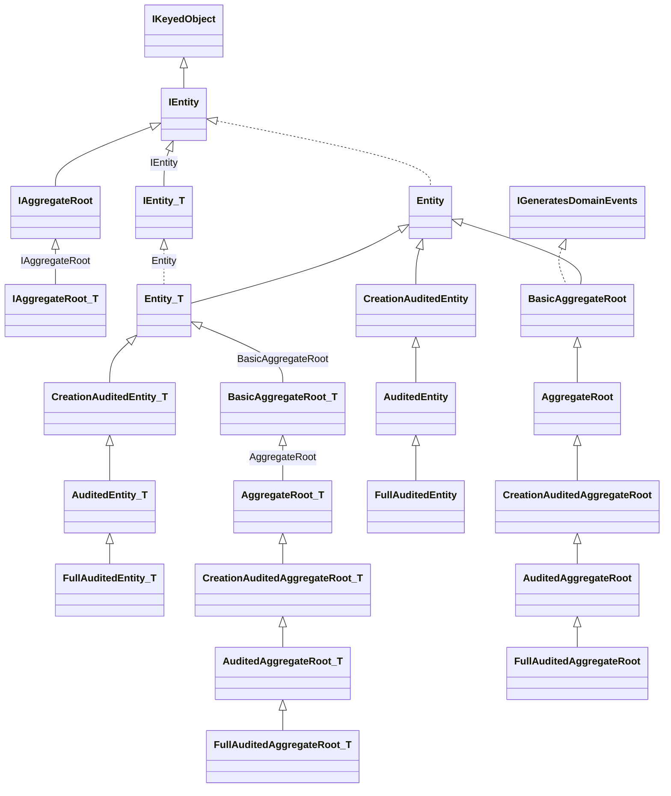

ABP ships an explicit hierarchy of entity base classes so a domain model can opt into exactly the features it needs — id type, audit columns, soft delete, optimistic concurrency, dynamic properties, domain events. Everything lives under `framework/src/Volo.Abp.Ddd.Domain/Volo/Abp/Domain/Entities/` and is built up from a single root interface, `IEntity`. This page maps the interfaces, the 14 concrete base classes (across `Entity`/`AggregateRoot`/`BasicAggregateRoot` plus audited and `WithUser` flavours), the cross-cutting properties (`ConcurrencyStamp`, `ExtraProperties`), and the `AddLocalEvent`/`AddDistributedEvent` plumbing.

## Inheritance Map



## Root Interfaces

```csharp
// framework/src/Volo.Abp.Ddd.Domain/Volo/Abp/Domain/Entities/IEntity.cs
public interface IEntity : IKeyedObject
{
    object?[] GetKeys();
}

public interface IEntity<TKey> : IEntity
{
    TKey Id { get; }
}
```

```csharp
// framework/src/Volo.Abp.Ddd.Domain/Volo/Abp/Domain/Entities/IAggregateRoot.cs
public interface IAggregateRoot : IEntity { }
public interface IAggregateRoot<TKey> : IEntity<TKey>, IAggregateRoot { }
```

```csharp
// framework/src/Volo.Abp.Ddd.Domain/Volo/Abp/Domain/Entities/IGeneratesDomainEvents.cs
public interface IGeneratesDomainEvents
{
    IEnumerable<DomainEventRecord> GetLocalEvents();
    IEnumerable<DomainEventRecord> GetDistributedEvents();
    void ClearLocalEvents();
    void ClearDistributedEvents();
}
```

`IEntity` deliberately allows composite keys via `GetKeys()`; the generic overload `IEntity<TKey>` is the one repositories prefer because it admits `GetAsync(id)`.

## `Entity` and `Entity<TKey>`

```csharp
// framework/src/Volo.Abp.Ddd.Domain/Volo/Abp/Domain/Entities/Entity.cs
public abstract class Entity : IEntity
{
    protected Entity() { EntityHelper.TrySetTenantId(this); }

    public override string ToString() => $"[ENTITY: {GetType().Name}] Keys = {GetKeys().JoinAsString(", ")}";

    public virtual string? GetObjectKey()
    {
        var keys = GetKeys();
        return keys.Length switch {
            0 => null,
            1 when keys[0] != null => keys[0]?.ToString(),
            _ => KeyedObjectHelper.EncodeCompositeKey(keys)
        };
    }

    public abstract object?[] GetKeys();
    public bool EntityEquals(IEntity other) => EntityHelper.EntityEquals(this, other);
}

public abstract class Entity<TKey> : Entity, IEntity<TKey>
{
    public virtual TKey Id { get; protected set; } = default!;

    protected Entity() { }
    protected Entity(TKey id) { Id = id; }

    public override object?[] GetKeys() => [Id];
}
```

Notable:

- `EntityHelper.TrySetTenantId` runs in the parameterless ctor — if the entity implements `IMultiTenant`, the current tenant id is captured at construction time.
- `Id` has a `protected set` — repositories cannot push an id onto an existing entity from outside its assembly; you assign in the constructor.
- Composite-key entities override `GetKeys()` (e.g. `IdentityUserRole.GetKeys() => [UserId, RoleId]`).

## `BasicAggregateRoot` & `AggregateRoot`

`BasicAggregateRoot` adds the *bare* aggregate semantics — identity + domain events, no audit columns, no `ExtraProperties`:

```csharp
// framework/src/Volo.Abp.Ddd.Domain/Volo/Abp/Domain/Entities/BasicAggregateRoot.cs
public abstract class BasicAggregateRoot : Entity, IAggregateRoot, IGeneratesDomainEvents
{
    private ICollection<DomainEventRecord>? _distributedEvents;
    private ICollection<DomainEventRecord>? _localEvents;

    public virtual IEnumerable<DomainEventRecord> GetLocalEvents()      => _localEvents ?? Array.Empty<DomainEventRecord>();
    public virtual IEnumerable<DomainEventRecord> GetDistributedEvents() => _distributedEvents ?? Array.Empty<DomainEventRecord>();
    public virtual void ClearLocalEvents()       => _localEvents?.Clear();
    public virtual void ClearDistributedEvents() => _distributedEvents?.Clear();

    protected virtual void AddLocalEvent(object eventData)
    {
        _localEvents ??= new Collection<DomainEventRecord>();
        _localEvents.Add(new DomainEventRecord(eventData, EventOrderGenerator.GetNext()));
    }

    protected virtual void AddDistributedEvent(object eventData)
    {
        _distributedEvents ??= new Collection<DomainEventRecord>();
        _distributedEvents.Add(new DomainEventRecord(eventData, EventOrderGenerator.GetNext()));
    }
}
```

`AggregateRoot` layers two cross-cutting concerns on top:

```csharp
// framework/src/Volo.Abp.Ddd.Domain/Volo/Abp/Domain/Entities/AggregateRoot.cs
public abstract class AggregateRoot : BasicAggregateRoot, IHasExtraProperties, IHasConcurrencyStamp
{
    public virtual ExtraPropertyDictionary ExtraProperties { get; protected set; }

    [DisableAuditing]
    public virtual string ConcurrencyStamp { get; set; }

    protected AggregateRoot()
    {
        ConcurrencyStamp = Guid.NewGuid().ToString("N");
        ExtraProperties = new ExtraPropertyDictionary();
        this.SetDefaultsForExtraProperties();
    }

    public virtual IEnumerable<ValidationResult> Validate(ValidationContext validationContext) =>
        ExtensibleObjectValidator.GetValidationErrors(this, validationContext);
}
```

The `[DisableAuditing]` attribute keeps the concurrency stamp out of audit-log diffs (it changes on every save and would otherwise dominate the log). `ConcurrencyStampConsts.MaxLength = 40` (see `ConcurrencyStampConsts.cs`) — EF Core uses this length on the column.

`ExtraProperties` is a `Dictionary<string, object?>`-shaped collection persisted by EF Core as a JSON column; see [Object Extending](/framework/ddd/object-extending) for how new properties are declared at module-load time.

## Complete Base Class Matrix

| Class | Generic | Adds | Inherits | File |
| --- | --- | --- | --- | --- |
| `Entity` | – | `GetKeys()`, equality | `IEntity` | `Entities/Entity.cs` |
| `Entity<TKey>` | ✔ | `Id` | `Entity` | `Entities/Entity.cs` |
| `BasicAggregateRoot` | – | domain events | `Entity`, `IAggregateRoot`, `IGeneratesDomainEvents` | `Entities/BasicAggregateRoot.cs` |
| `BasicAggregateRoot<TKey>` | ✔ | – | `Entity<TKey>`, `IAggregateRoot<TKey>` | `Entities/BasicAggregateRoot.cs` |
| `AggregateRoot` | – | `ExtraProperties`, `ConcurrencyStamp`, `Validate` | `BasicAggregateRoot`, `IHasExtraProperties`, `IHasConcurrencyStamp` | `Entities/AggregateRoot.cs` |
| `AggregateRoot<TKey>` | ✔ | – | `BasicAggregateRoot<TKey>` + same mixins | `Entities/AggregateRoot.cs` |
| `CreationAuditedEntity` | – | `CreationTime`, `CreatorId` | `Entity`, `ICreationAuditedObject` | `Entities/Auditing/CreationAuditedEntity.cs` |
| `CreationAuditedEntity<TKey>` | ✔ | – | `Entity<TKey>` + same | `Entities/Auditing/CreationAuditedEntity.cs` |
| `AuditedEntity` | – | `LastModificationTime`, `LastModifierId` | `CreationAuditedEntity`, `IAuditedObject` | `Entities/Auditing/AuditedEntity.cs` |
| `AuditedEntity<TKey>` | ✔ | – | `CreationAuditedEntity<TKey>` + same | `Entities/Auditing/AuditedEntity.cs` |
| `FullAuditedEntity` | – | `IsDeleted`, `DeleterId`, `DeletionTime` | `AuditedEntity`, `IFullAuditedObject` (incl. `ISoftDelete`) | `Entities/Auditing/FullAuditedEntity.cs` |
| `FullAuditedEntity<TKey>` | ✔ | – | `AuditedEntity<TKey>` + same | `Entities/Auditing/FullAuditedEntity.cs` |
| `CreationAuditedAggregateRoot` | – | `CreationTime`, `CreatorId` | `AggregateRoot`, `ICreationAuditedObject` | `Entities/Auditing/CreationAuditedAggregateRoot.cs` |
| `CreationAuditedAggregateRoot<TKey>` | ✔ | – | `AggregateRoot<TKey>` + same | `Entities/Auditing/CreationAuditedAggregateRoot.cs` |
| `AuditedAggregateRoot` | – | `LastModificationTime`, `LastModifierId` | `CreationAuditedAggregateRoot`, `IAuditedObject` | `Entities/Auditing/AuditedAggregateRoot.cs` |
| `AuditedAggregateRoot<TKey>` | ✔ | – | `CreationAuditedAggregateRoot<TKey>` + same | `Entities/Auditing/AuditedAggregateRoot.cs` |
| `FullAuditedAggregateRoot` | – | `IsDeleted`, `DeleterId`, `DeletionTime` | `AuditedAggregateRoot`, `IFullAuditedObject` | `Entities/Auditing/FullAuditedAggregateRoot.cs` |
| `FullAuditedAggregateRoot<TKey>` | ✔ | – | `AuditedAggregateRoot<TKey>` + same | `Entities/Auditing/FullAuditedAggregateRoot.cs` |
| `CreationAuditedEntityWithUser<TUser>` | – | `Creator` (nav) | `CreationAuditedEntity` | `Entities/Auditing/CreationAuditedEntityWithUser.cs` |
| `CreationAuditedEntityWithUser<TKey, TUser>` | ✔ | – | `CreationAuditedEntity<TKey>` | `Entities/Auditing/CreationAuditedEntityWithUser.cs` |
| `AuditedEntityWithUser<TUser>` | – | `Creator`, `LastModifier` (nav) | `AuditedEntity` | `Entities/Auditing/AuditedEntityWithUser.cs` |
| `AuditedEntityWithUser<TKey, TUser>` | ✔ | – | `AuditedEntity<TKey>` | `Entities/Auditing/AuditedEntityWithUser.cs` |
| `FullAuditedEntityWithUser<TUser>` | – | `Creator`, `LastModifier`, `Deleter` (nav) | `FullAuditedEntity` | `Entities/Auditing/FullAuditedEntityWithUser.cs` |
| `FullAuditedEntityWithUser<TKey, TUser>` | ✔ | – | `FullAuditedEntity<TKey>` | `Entities/Auditing/FullAuditedEntityWithUser.cs` |
| `CreationAuditedAggregateRootWithUser<TUser>` | – | `Creator` (nav) | `CreationAuditedAggregateRoot` | `Entities/Auditing/CreationAuditedAggregateRootWithUser.cs` |
| `CreationAuditedAggregateRootWithUser<TKey, TUser>` | ✔ | – | `CreationAuditedAggregateRoot<TKey>` | `Entities/Auditing/CreationAuditedAggregateRootWithUser.cs` |
| `AuditedAggregateRootWithUser<TUser>` | – | `Creator`, `LastModifier` (nav) | `AuditedAggregateRoot` | `Entities/Auditing/AuditedAggregateRootWithUser.cs` |
| `AuditedAggregateRootWithUser<TKey, TUser>` | ✔ | – | `AuditedAggregateRoot<TKey>` | `Entities/Auditing/AuditedAggregateRootWithUser.cs` |
| `FullAuditedAggregateRootWithUser<TUser>` | – | `Creator`, `LastModifier`, `Deleter` (nav) | `FullAuditedAggregateRoot` | `Entities/Auditing/FullAuditedAggregateRoot.cs` |
| `FullAuditedAggregateRootWithUser<TKey, TUser>` | ✔ | – | `FullAuditedAggregateRoot<TKey>` | `Entities/Auditing/FullAuditedAggregateRootWithUser.cs` |

### Audit Marker Interfaces

The audit columns are not on the entity base classes for show — they implement contracts defined in `Volo.Abp.Auditing.Contracts`:

| Interface | Source | Properties |
| --- | --- | --- |
| `ICreationAuditedObject` | `Volo.Abp.Auditing.Contracts/Volo/Abp/Auditing/ICreationAuditedObject.cs` | `CreationTime`, `CreatorId` |
| `IAuditedObject` | `Volo.Abp.Auditing.Contracts/Volo/Abp/Auditing/IAuditedObject.cs` | + `LastModificationTime`, `LastModifierId` |
| `IFullAuditedObject` | `Volo.Abp.Auditing.Contracts/Volo/Abp/Auditing/IFullAuditedObject.cs` | + `IsDeleted`, `DeleterId`, `DeletionTime` (also `ISoftDelete`) |

The auditing interceptor and EF Core save-changes filters look for these interfaces (not concrete classes), so anything implementing `IFullAuditedObject` participates regardless of base class.

### `WithUser` Variants

`*WithUser<TUser>` add navigation properties (`Creator`, `LastModifier`, `Deleter`) of type `TUser : IEntity<Guid>`. Example:

```csharp
// framework/src/Volo.Abp.Ddd.Domain/Volo/Abp/Domain/Entities/Auditing/FullAuditedAggregateRootWithUser.cs
public abstract class FullAuditedAggregateRootWithUser<TUser>
    : FullAuditedAggregateRoot, IFullAuditedObject<TUser>
    where TUser : IEntity<Guid>
{
    public virtual TUser? Deleter      { get; set; }
    public virtual TUser? Creator      { get; protected set; }
    public virtual TUser? LastModifier { get; set; }
}
```

Use them only when you intend EF Core to load the user navigation graph eagerly; otherwise the lighter `*Audited*` classes are preferred.

## Domain Events: Local vs Distributed

`BasicAggregateRoot.AddLocalEvent` and `AddDistributedEvent` are the only sanctioned channel for emitting events from a domain class:

- **Local events** flow through `ILocalEventBus` and execute *in-process, inside the same UoW transaction.* They are intended for tightly-coupled side effects (e.g. recompute a derived field on another aggregate).
- **Distributed events** flow through `IDistributedEventBus`. ABP's outbox writes them after the UoW commits, so they survive process crashes and can travel to other services.

Both lists are collected by ABP's `UnitOfWorkEventPublisher` when the UoW saves changes; aggregates remain pure C# objects that simply record their intent.

```csharp
public class Order : AggregateRoot<Guid>
{
    public OrderStatus Status { get; private set; }

    public void Cancel(string reason)
    {
        Status = OrderStatus.Cancelled;
        AddLocalEvent(new OrderCancelledEvent(Id, reason));
        AddDistributedEvent(new OrderCancelledEto(Id, reason));
    }
}
```

`EventOrderGenerator.GetNext()` (a static monotonic counter) tags each `DomainEventRecord` so the publisher can preserve ordering across aggregates touched in the same UoW.

## `ConcurrencyStamp` Semantics

A new GUID is assigned in the `AggregateRoot` constructor; EF Core marks the column as concurrency token (via the EF Core integration's convention). On update, EF Core matches the stamp on the row and throws `DbUpdateConcurrencyException`, which ABP rewraps as `AbpDbConcurrencyException` and the exception middleware maps to HTTP 409 (see [Exception Handling](/framework/core/exception-handling)).

## `ExtraProperties`

`ExtraProperties` is the canonical way to attach properties to an aggregate without subclassing it. The dictionary is an `ExtraPropertyDictionary` (`framework/src/Volo.Abp.ObjectExtending/Volo/Abp/Data/ExtraPropertyDictionary.cs`), serialised to JSON in the database. `ObjectExtensionManager` declares the schema (type, default, validators) at startup; see [Object Extending](/framework/ddd/object-extending).

## Related Pages

<CardGroup cols={2}>
  <Card title="Repositories" icon="database" href="/framework/ddd/repositories">
    How `IRepository<TEntity>` works against any of these base classes.
  </Card>
  <Card title="DDD Overview" icon="diagram-project" href="/framework/ddd/overview">
    Layer map showing where these classes live in the dependency graph.
  </Card>
  <Card title="Object Extending" icon="puzzle-piece" href="/framework/ddd/object-extending">
    Adding properties to `ExtraProperties` from another module.
  </Card>
  <Card title="Glossary" icon="book" href="/overview/glossary">
    `AggregateRoot`, `BasicAggregateRoot`, ETO and related terms.
  </Card>
</CardGroup>
