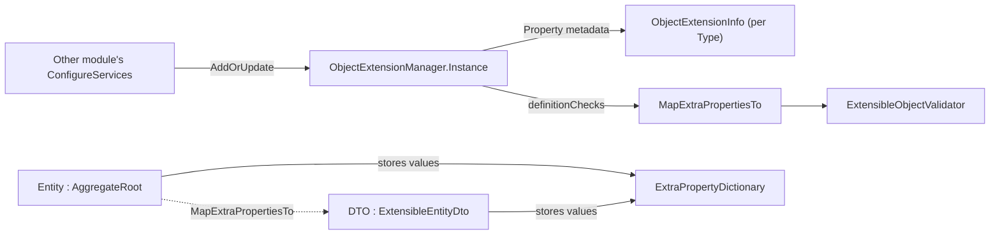

ABP's object-extending system solves a recurring problem in modular applications: how do you add a property (say `TaxId` on `IdentityUser`) without forking the source module or subclassing every DTO downstream? The answer is `ObjectExtensionManager` — a runtime registry, populated during `ConfigureServices`, that declares additional properties keyed by `Type + Name`. Any class implementing `IHasExtraProperties` then carries those values in an `ExtraPropertyDictionary`, persisted by EF Core as JSON, and `MapExtraPropertiesTo` copies them across the entity ↔ DTO boundary. Source: `framework/src/Volo.Abp.ObjectExtending/`.

## Source Inventory

| File | Role |
| --- | --- |
| `Volo/Abp/Data/IHasExtraProperties.cs` | Marker interface: `ExtraPropertyDictionary ExtraProperties { get; }`. |
| `Volo/Abp/Data/ExtraPropertyDictionary.cs` | `Dictionary<string, object?>` subclass; the actual storage. |
| `Volo/Abp/ObjectExtending/ObjectExtensionManager.cs` | Process-wide registry, singleton `Instance`. |
| `Volo/Abp/ObjectExtending/ObjectExtensionInfo.cs` | Per-type record: properties dictionary, configuration bag, validators. |
| `Volo/Abp/ObjectExtending/ObjectExtensionPropertyInfo.cs` | Per-property metadata: type, default value, lookups, validators, UI hints. |
| `Volo/Abp/ObjectExtending/ObjectExtensionPropertyInfoExtensions.cs` | Fluent setup (`WithDefaultValue`, `WithLookupActionApi`, `MapForAutoMapper`). |
| `Volo/Abp/ObjectExtending/ExtensibleObject.cs` | Convenience base class implementing `IHasExtraProperties` + JSON-shaped getters/setters. |
| `Volo/Abp/ObjectExtending/ExtensibleObjectMapper.cs` | `MapExtraPropertiesTo<TSource, TDestination>` — the main mapping API. |
| `Volo/Abp/ObjectExtending/HasExtraPropertiesObjectExtendingExtensions.cs` | Extension method facade for the mapper. |
| `Volo/Abp/ObjectExtending/ExtensibleObjectValidator.cs` | Runs DataAnnotations + module validators against the extra-properties bag. |
| `Volo/Abp/ObjectExtending/ObjectExtensionManagerExtensions.cs` | Convenience: `AddOrUpdateProperty<TType, TProp>("Name")`. |
| `Volo/Abp/ObjectExtending/ModuleObjectExtensionManagerExtensions.cs` | Module-graph aware bulk extending (e.g. "extend both `User` and `UserDto`"). |
| `Volo/Abp/ObjectExtending/MappingPropertyDefinitionChecks.cs` | Enum controlling whether extras must be declared in `ObjectExtensionManager` to be mapped. |
| `Volo/Abp/ObjectExtending/AbpObjectExtendingModule.cs` | The `AbpModule`; depends on localisation + validation abstractions. |

## Pieces Working Together



## `IHasExtraProperties`

```csharp
// framework/src/Volo.Abp.ObjectExtending/Volo/Abp/Data/IHasExtraProperties.cs
public interface IHasExtraProperties
{
    ExtraPropertyDictionary ExtraProperties { get; }
}

// framework/src/Volo.Abp.ObjectExtending/Volo/Abp/Data/ExtraPropertyDictionary.cs
[Serializable]
public class ExtraPropertyDictionary : Dictionary<string, object?>
{
    public ExtraPropertyDictionary() { }
    public ExtraPropertyDictionary(IDictionary<string, object?> dictionary) : base(dictionary) { }
}
```

Every `AggregateRoot` (see [Entities & Aggregates](/framework/ddd/entities-and-aggregates)) implements this interface; so do `ExtensibleEntityDto` and friends in the application-contracts layer. The dictionary is freeform on purpose — the *schema* lives in `ObjectExtensionManager`.

## `ObjectExtensionManager`

```csharp
// framework/src/Volo.Abp.ObjectExtending/Volo/Abp/ObjectExtending/ObjectExtensionManager.cs
public class ObjectExtensionManager
{
    public static ObjectExtensionManager Instance { get; protected set; } = new ObjectExtensionManager();
    public ConcurrentDictionary<object, object> Configuration { get; }
    protected ConcurrentDictionary<Type, ObjectExtensionInfo> ObjectsExtensions { get; }

    public virtual ObjectExtensionManager AddOrUpdate<TObject>(Action<ObjectExtensionInfo>? configureAction = null)
        => AddOrUpdate(typeof(TObject), configureAction);

    public virtual ObjectExtensionManager AddOrUpdate(Type type, Action<ObjectExtensionInfo>? configureAction = null)
    {
        var extensionInfo = ObjectsExtensions.GetOrAdd(type, _ => new ObjectExtensionInfo(type));
        configureAction?.Invoke(extensionInfo);
        return this;
    }

    public virtual ObjectExtensionInfo? GetOrNull(Type type) => ObjectsExtensions.GetOrDefault(type);
    public virtual ImmutableList<ObjectExtensionInfo> GetExtendedObjects()
        => ObjectsExtensions.Values.ToImmutableList();
}
```

It is a **process-wide singleton** (`Instance`) rather than a DI service because property declarations must be visible to EF Core's model builder *before* the DI container is built. Modules call `ObjectExtensionManager.Instance.AddOrUpdate<...>(...)` in `ConfigureServices` (or in a static initialiser if needed earlier).

## Declaring a Property

```csharp
public override void ConfigureServices(ServiceConfigurationContext context)
{
    ObjectExtensionManager.Instance
        .AddOrUpdate<IdentityUser>(user =>
        {
            user.AddOrUpdateProperty<string>("TaxId", prop =>
            {
                prop.Attributes.Add(new RequiredAttribute());
                prop.Attributes.Add(new StringLengthAttribute(20));
                prop.DefaultValue = string.Empty;
            });
        })
        .AddOrUpdate<IdentityUserDto>(dto =>
        {
            dto.AddOrUpdateProperty<string>("TaxId");
        });
}
```

The DataAnnotations attributes are honoured by `ExtensibleObjectValidator`, so the value is validated whenever the entity or DTO is saved.

## `MapExtraPropertiesTo`

When the entity is updated from a DTO, you need the *extra* properties to flow across. The contract:

```csharp
// framework/src/Volo.Abp.ObjectExtending/Volo/Abp/ObjectExtending/HasExtraPropertiesObjectExtendingExtensions.cs
public static void MapExtraPropertiesTo<TSource, TDestination>(
    this TSource source,
    TDestination destination,
    MappingPropertyDefinitionChecks? definitionChecks = null,
    string[]? ignoredProperties = null)
    where TSource : IHasExtraProperties
    where TDestination : IHasExtraProperties
{
    ExtensibleObjectMapper.MapExtraPropertiesTo(source, destination, definitionChecks, ignoredProperties);
}
```

`MappingPropertyDefinitionChecks` is the safety net:

| Value | Effect |
| --- | --- |
| `Source` | Only copy properties declared on the source type's extension info. |
| `Destination` | Only copy properties declared on the destination type's extension info. |
| `Both` | Property must be declared on both — the default for `Entity ↔ DTO`. |
| `None` | Copy every key blindly (dangerous; used only inside the framework). |

A typical CRUD service uses the mapper twice:

```csharp
protected override async Task MapToEntityAsync(CreateUpdateUserDto input, IdentityUser user)
{
    await base.MapToEntityAsync(input, user);
    input.MapExtraPropertiesTo(user);
}

protected override async Task<IdentityUserDto> MapToGetOutputDtoAsync(IdentityUser user)
{
    var dto = await base.MapToGetOutputDtoAsync(user);
    user.MapExtraPropertiesTo(dto);
    return dto;
}
```

If you use AutoMapper, the static `MapExtraProperties()` configuration on the AutoMapper profile (see `ObjectExtensionPropertyInfo.cs`) takes care of the same flow automatically — extras travel with every mapped value.

## Validation

`AggregateRoot.Validate(ValidationContext)` already delegates to `ExtensibleObjectValidator.GetValidationErrors(this, validationContext)`. The validator iterates `ObjectExtensionManager.GetOrNull(GetType())?.Properties`, picks up each `ObjectExtensionPropertyInfo`, and runs:

- The DataAnnotations attributes attached via `prop.Attributes.Add(...)`.
- Any custom `Action<ObjectExtensionValidationContext>` registered through `prop.Validators`.
- The type-level validators in `ObjectExtensionInfo.Validators`.

So a missing required extra property fails the same validation pipeline that owns the rest of the entity.

## Where to Persist

The EF Core integration's `ConfigureExtraProperties()` extension serialises `ExtraPropertyDictionary` to a single `nvarchar(MAX)` JSON column named `ExtraProperties`. The MongoDB integration stores it as an embedded BSON document. From the application code's point of view the storage is opaque — you call `entity.GetProperty<T>(name)` / `entity.SetProperty(name, value)` (extensions over `IHasExtraProperties`) and the framework handles the rest.

## Related Pages

<CardGroup cols={2}>
  <Card title="Entities & Aggregates" icon="boxes-stacked" href="/framework/ddd/entities-and-aggregates">
    `AggregateRoot.ExtraProperties` and the `IHasExtraProperties` mixin.
  </Card>
  <Card title="Application Services" icon="cogs" href="/framework/ddd/application-services">
    Where `MapExtraPropertiesTo` is called on the DTO boundary.
  </Card>
  <Card title="DDD Overview" icon="diagram-project" href="/framework/ddd/overview">
    Where `Volo.Abp.ObjectExtending` lives in the module graph.
  </Card>
</CardGroup>
