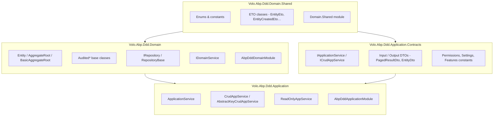
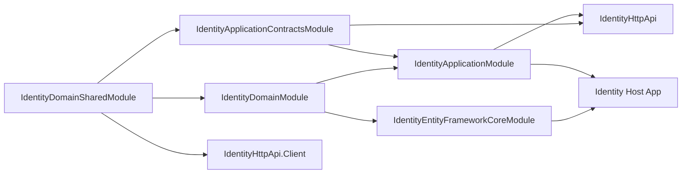
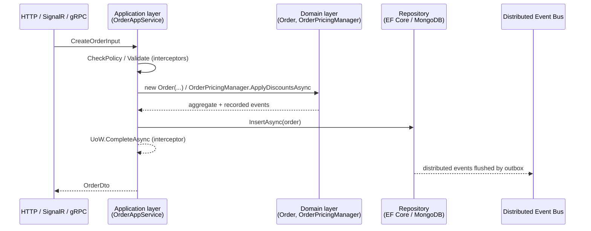

ABP's Domain-Driven Design support is shipped as four small NuGet-shaped packages that together describe a single bounded context. Each layer is an `AbpModule` and each upper layer depends on the layer beneath it via `[DependsOn]`, giving you a strict, compiler-enforced layering you cannot accidentally bypass. This page is the map of those layers and the runtime wiring that connects them. The two pivotal modules are `framework/src/Volo.Abp.Ddd.Domain/Volo/Abp/Domain/AbpDddDomainModule.cs` and `framework/src/Volo.Abp.Ddd.Application/Volo/Abp/Application/AbpDddApplicationModule.cs`.

## The Four Layers



Concretely the dependency graph is:

| Module | DependsOn |
| --- | --- |
| `AbpDddDomainSharedModule` | nothing DDD-specific. |
| `AbpDddDomainModule` | `AbpDddDomainSharedModule`, `AbpAuditingModule`, `AbpDataModule`, `AbpEventBusModule`, `AbpGuidsModule`, `AbpTimingModule`, `AbpObjectMappingModule`, `AbpExceptionHandlingModule`, `AbpSpecificationsModule`, `AbpCachingModule`. |
| `AbpDddApplicationContractsModule` | `AbpDddDomainSharedModule` + auth/validation contracts. |
| `AbpDddApplicationModule` | `AbpDddDomainModule`, `AbpDddApplicationContractsModule`, `AbpSecurityModule`, `AbpObjectMappingModule`, `AbpValidationModule`, `AbpAuthorizationModule`, `AbpHttpAbstractionsModule`, `AbpSettingsModule`, `AbpFeaturesModule`, `AbpGlobalFeaturesModule`. |

## What Lives Where

### `Volo.Abp.Ddd.Domain.Shared` (`framework/src/Volo.Abp.Ddd.Domain.Shared/`)

The bottom layer is intentionally tiny. It holds types that **both** the Domain and the Contracts layer need to reference but that contain no behaviour:

- **ETOs** — `Volo/Abp/Domain/Entities/Events/Distributed/EntityEto.cs`, `EntityCreatedEto.cs`, `EntityUpdatedEto.cs`, `EntityDeletedEto.cs`, `IEntityEto.cs`. They are serialisable payloads safe to ship over a message bus.
- **Module marker** — `Volo/Abp/Domain/AbpDddDomainSharedModule.cs`.

Per-bounded-context wikis put `enum`s, error codes, and shared DTOs *not tied to a transport* into this layer.

### `Volo.Abp.Ddd.Domain` (`framework/src/Volo.Abp.Ddd.Domain/`)

The domain layer holds the behaviour-bearing types:

- **Entity hierarchy** — `Volo/Abp/Domain/Entities/Entity.cs`, `AggregateRoot.cs`, `BasicAggregateRoot.cs`, `IEntity.cs`, `IAggregateRoot.cs`, `IGeneratesDomainEvents.cs`.
- **Audited base classes** — `Volo/Abp/Domain/Entities/Auditing/{Creation,,Full}Audited{Entity,AggregateRoot}{,WithUser}.cs` (12 files; see [Entities & Aggregates](/framework/ddd/entities-and-aggregates) for the table).
- **Domain services** — `Volo/Abp/Domain/Services/IDomainService.cs` + `DomainService.cs`.
- **Repository contracts and bases** — `Volo/Abp/Domain/Repositories/IRepository.cs`, `IBasicRepository.cs`, `IReadOnlyRepository.cs`, `RepositoryBase.cs`, `BasicRepositoryBase.cs`, `AbpRepositoryConventionalRegistrar.cs`.
- **Change tracking** — `Volo/Abp/Domain/ChangeTracking/ChangeTrackingInterceptorRegistrar.cs` plus `IEntityChangeTrackingProvider`.

The module's `PreConfigureServices` adds the repository scanner and the change-tracking interceptor:

```csharp
// framework/src/Volo.Abp.Ddd.Domain/Volo/Abp/Domain/AbpDddDomainModule.cs
public override void PreConfigureServices(ServiceConfigurationContext context)
{
    context.Services.AddConventionalRegistrar(new AbpRepositoryConventionalRegistrar());
    context.Services.OnRegistered(ChangeTrackingInterceptorRegistrar.RegisterIfNeeded);
}
```

### `Volo.Abp.Ddd.Application.Contracts` (`framework/src/Volo.Abp.Ddd.Application.Contracts/`)

The contracts layer is the **public** surface of an application service:

- **Service interfaces** — `Volo/Abp/Application/Services/IApplicationService.cs`, `ICrudAppService.cs`, `IReadOnlyAppService.cs`, `ICreateAppService.cs`, `IUpdateAppService.cs`, `IDeleteAppService.cs`, `ICreateUpdateAppService.cs`.
- **DTOs** — `Volo/Abp/Application/Dtos/` (28 files): `EntityDto`, `ExtensibleEntityDto`, `AuditedEntityDto`/`CreationAuditedEntityDto`/`FullAuditedEntityDto` variants, `PagedResultDto`, `ListResultDto`, `PagedAndSortedResultRequestDto`, `LimitedResultRequestDto`, and the interfaces `IPagedResult`, `IListResult`, `ISortedResultRequest`, `ILimitedResultRequest`.
- **Localization resource** — `Volo/Abp/Application/Localization/AbpDddApplicationContractsResource.cs`.

This layer is the one a client-side or service-to-service consumer references: no domain types leak through it.

### `Volo.Abp.Ddd.Application` (`framework/src/Volo.Abp.Ddd.Application/`)

The application layer wires the implementations:

- **Service bases** — `Volo/Abp/Application/Services/ApplicationService.cs`, `ReadOnlyAppService.cs`, `CrudAppService.cs`, `AbstractKeyCrudAppService.cs`, `AbstractKeyReadOnlyAppService.cs`.
- **Sorting guard** — `Volo/Abp/Application/Services/AbpDynamicSortingGuard.cs`.
- **Module marker** — `Volo/Abp/Application/AbpDddApplicationModule.cs`.

`AbpDddApplicationModule.ConfigureServices` declares the framework interfaces that should not be exposed by auto-generated dynamic API definitions:

```csharp
// framework/src/Volo.Abp.Ddd.Application/Volo/Abp/Application/AbpDddApplicationModule.cs
Configure<AbpApiDescriptionModelOptions>(options =>
{
    options.IgnoredInterfaces.AddIfNotContains(typeof(IRemoteService));
    options.IgnoredInterfaces.AddIfNotContains(typeof(IApplicationService));
    options.IgnoredInterfaces.AddIfNotContains(typeof(IUnitOfWorkEnabled));
    options.IgnoredInterfaces.AddIfNotContains(typeof(IAuditingEnabled));
    options.IgnoredInterfaces.AddIfNotContains(typeof(IValidationEnabled));
    options.IgnoredInterfaces.AddIfNotContains(typeof(IGlobalFeatureCheckingEnabled));
});
```

## Why Four Modules?

Each split has a deliberate runtime consequence:

1. **`Domain.Shared` vs `Domain`** — Lets you publish ETOs and enums to consumers without forcing them to take a dependency on EF / repositories. A microservice consuming `UserCreatedEto` only adds `Volo.Abp.Ddd.Domain.Shared` to its csproj.
2. **`Application.Contracts` vs `Application`** — Lets you generate clients (HTTP, gRPC, Blazor proxies) from the contracts without referencing your domain implementation. The contracts assembly is what the **dynamic HTTP client** (`Volo.Abp.Http.Client`) scans for `IApplicationService` interfaces.
3. **`Domain` vs `Application`** — Encourages all cross-cutting wiring (auth, validation, UoW interceptors) to attach at the application layer where it is needed, not in pure domain logic.

## Typical Module Graph in a Solution

A real bounded context (say `Identity`) instantiates the pattern five times — one DDD layer plus EF Core:



Each rectangle on the right is a project referencing the corresponding ABP layer through `[DependsOn]` — there is nothing magical about how the framework discovers them, the dependency graph is plain C# class references.

## Layer Responsibilities in Practice

When a request lands on, say, `OrderAppService.CreateAsync(input)`, this is the call path through the layers:



Two design observations:

- The **application layer never reaches into the database directly** — it goes through `IRepository<TEntity, TKey>` and the queryable executor, both abstractions exposed by the domain layer.
- The **domain layer never publishes events itself** — it *records* them on the aggregate (`AddDistributedEvent` / `AddLocalEvent`). The unit-of-work publisher reads them post-commit, which is how the outbox pattern stays consistent without polluting domain code with infrastructure.

## What You Reference Where

| Audience | csproj reference | Why |
| --- | --- | --- |
| External microservice consuming events | `Volo.Abp.Ddd.Domain.Shared` only | Needs ETOs + enums, not domain logic. |
| Dynamic HTTP client / Blazor proxy | `…Application.Contracts` only | Needs service interfaces + DTOs, not implementations. |
| EF Core / MongoDB provider module | `…Domain` | Repositories implemented per provider. |
| Host (web/api) | `…Application` (+ provider, + HTTP API) | The fully wired runtime. |

## Related Pages

<CardGroup cols={2}>
  <Card title="Entities & Aggregates" icon="boxes-stacked" href="/framework/ddd/entities-and-aggregates">
    Full inheritance table and feature matrix.
  </Card>
  <Card title="Repositories" icon="database" href="/framework/ddd/repositories">
    Repository contracts and how they integrate with the UoW.
  </Card>
  <Card title="Application Services" icon="cogs" href="/framework/ddd/application-services">
    `ApplicationService`, `CrudAppService` and the DTO toolkit.
  </Card>
  <Card title="Domain Services" icon="hammer" href="/framework/ddd/domain-services">
    When to write a domain service rather than an aggregate method.
  </Card>
  <Card title="Specifications" icon="filter" href="/framework/ddd/specifications">
    Composable predicates over your entities.
  </Card>
  <Card title="Object Extending" icon="puzzle-piece" href="/framework/ddd/object-extending">
    Add properties to base ABP entities without subclassing.
  </Card>
</CardGroup>
