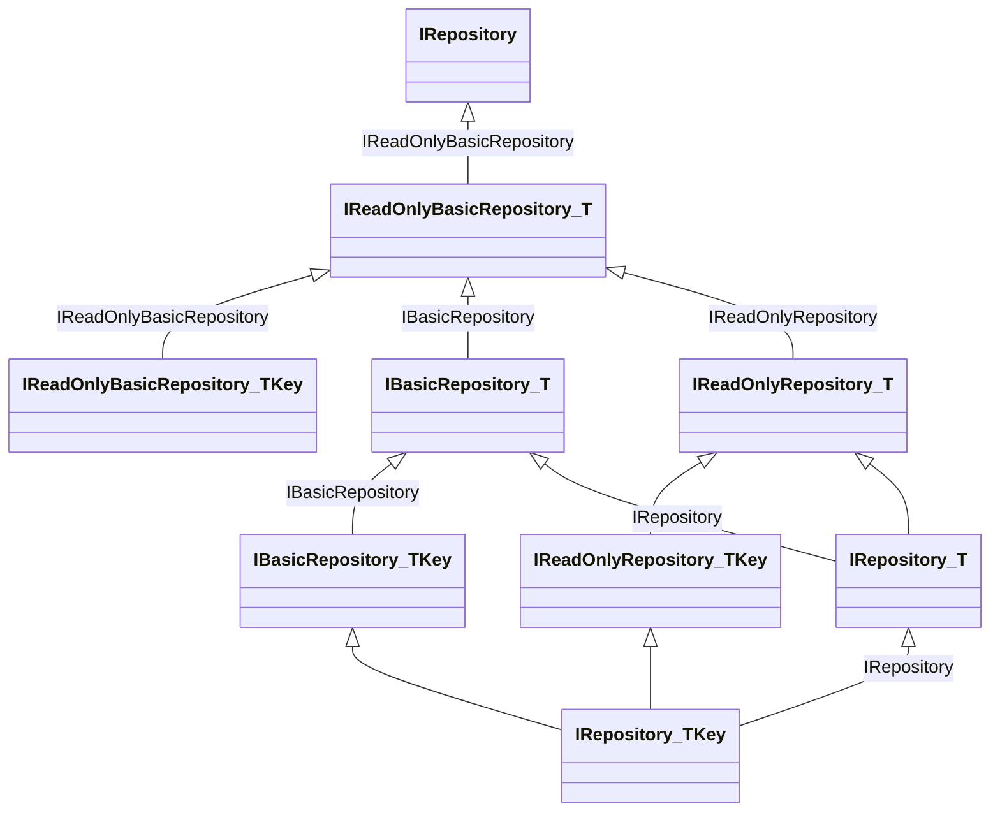
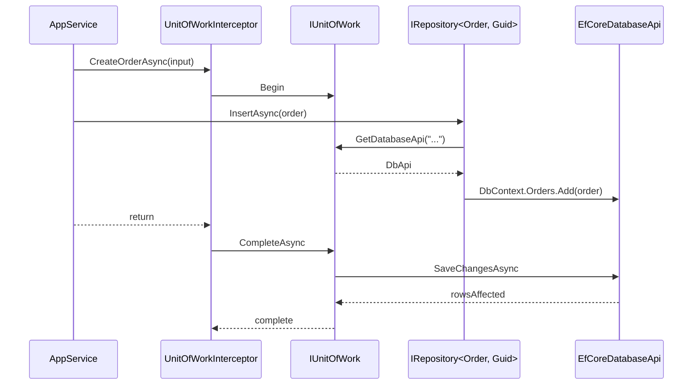

ABP's repository is a *thin* persistence façade: it owns no caching, no domain logic, and no eventing — those live in the aggregate, the unit-of-work, and the event bus. What it does own is a uniform API across EF Core, MongoDB and Dapper providers, with `IQueryable<TEntity>` for read paths and explicit `Insert/Update/Delete` for writes. This page walks the contract hierarchy under `framework/src/Volo.Abp.Ddd.Domain/Volo/Abp/Domain/Repositories/`, the base implementations, the repository conventional registrar, and how repositories integrate with the unit of work and the change-tracking interceptor.

## Source Inventory

| File | Role |
| --- | --- |
| `IRepository.cs` | Top-level marker (`IsChangeTrackingEnabled`, `EntityName`, `ProviderName`) plus the generic `IRepository<TEntity>` / `IRepository<TEntity, TKey>` hierarchy. |
| `IBasicRepository.cs` | Insert/Update/Delete contracts; `IBasicRepository<TEntity, TKey>` adds `DeleteAsync(id)` and `DeleteManyAsync(ids)`. |
| `IReadOnlyRepository.cs` | Adds `AsyncExecuter`, `GetQueryableAsync`, `WithDetailsAsync(...)`. |
| `IReadOnlyBasicRepository.cs` | Lightweight read API: `GetListAsync`, `GetPagedListAsync`, `GetCountAsync`, `GetAsync(id)`, `FindAsync(id)`. |
| `RepositoryBase.cs` | Base for full repositories — implements queryable helpers. |
| `BasicRepositoryBase.cs` | Base for "basic" repositories — resolves `IDataFilter`, `ICurrentTenant`, `IAsyncQueryableExecuter`, `IUnitOfWorkManager`, `ICancellationTokenProvider`, `ILoggerFactory` from the lazy SP. |
| `RepositoryAsyncExtensions.cs` | Async LINQ extensions (`FirstOrDefaultAsync`, `ToListAsync`, `CountAsync`…) that dispatch through `IAsyncQueryableExecuter`. |
| `RepositoryExtensions.cs` | Convenience overloads (`HardDeleteAsync`, `WithDetailsAsync` chained calls). |
| `AbpRepositoryConventionalRegistrar.cs` | Custom `IConventionalRegistrar` that exposes repositories by interface (not class). |
| `RepositoryRegistrarBase.cs` | Base used by EF Core / MongoDB integrations to map `Repository<TEntity>` to per-DbContext implementations. |
| `EntityChangeTrackingProvider.cs` | `AsyncLocal<bool?>`-backed toggle for the change-tracking interceptor. |
| `IEntityChangeTrackingProvider.cs` | Contract for the above. |
| `ISupportsExplicitLoading.cs` | Optional contract for providers that can load navigation properties on demand. |
| `UnitOfWorkItemNames.cs` | Constants used as keys in `IUnitOfWork.Items` (`HardDeletedEntities`). |

## Interface Hierarchy



The "basic" tier exists for **MongoDB-shaped** stores where there is no `IQueryable`. The "full" tier (`IRepository<TEntity>`) extends it with LINQ access and predicate-based queries. The two-parameter overloads layer on id-keyed `GetAsync/FindAsync/DeleteAsync` and require the entity to implement `IEntity<TKey>`.

## The Top-Level `IRepository` Marker

```csharp
// framework/src/Volo.Abp.Ddd.Domain/Volo/Abp/Domain/Repositories/IRepository.cs
public interface IRepository
{
    bool? IsChangeTrackingEnabled { get; }
    string? EntityName { get; set; }
    string ProviderName { get; }
}
```

`ProviderName` lets consumers branch on `"EntityFrameworkCore"` / `"MongoDB"` / `"Dapper"`. `IsChangeTrackingEnabled` reports the **effective** state — combining the provider default with any override pushed via `IEntityChangeTrackingProvider`. `EntityName` is filled in by the registrar for diagnostics and audit logs.

## `IBasicRepository<TEntity>`

```csharp
// framework/src/Volo.Abp.Ddd.Domain/Volo/Abp/Domain/Repositories/IBasicRepository.cs
public interface IBasicRepository<TEntity> : IReadOnlyBasicRepository<TEntity>
    where TEntity : class, IEntity
{
    Task<TEntity> InsertAsync(TEntity entity, bool autoSave = false, CancellationToken ct = default);
    Task InsertManyAsync(IEnumerable<TEntity> entities, bool autoSave = false, CancellationToken ct = default);

    Task<TEntity> UpdateAsync(TEntity entity, bool autoSave = false, CancellationToken ct = default);
    Task UpdateManyAsync(IEnumerable<TEntity> entities, bool autoSave = false, CancellationToken ct = default);

    Task DeleteAsync(TEntity entity, bool autoSave = false, CancellationToken ct = default);
    Task DeleteManyAsync(IEnumerable<TEntity> entities, bool autoSave = false, CancellationToken ct = default);
}

public interface IBasicRepository<TEntity, TKey> : IBasicRepository<TEntity>, IReadOnlyBasicRepository<TEntity, TKey>
    where TEntity : class, IEntity<TKey>
{
    Task DeleteAsync(TKey id, bool autoSave = false, CancellationToken ct = default);
    Task DeleteManyAsync(IEnumerable<TKey> ids, bool autoSave = false, CancellationToken ct = default);
}
```

Every method takes `autoSave` and `CancellationToken`. The default `autoSave = false` defers persistence to the surrounding unit of work — set it to `true` only when you need the change visible *before* the UoW completes (e.g. to read it back through `IQueryable` in the same scope).

`IReadOnlyBasicRepository<TEntity>` exposes the LINQ-free read API:

```csharp
// framework/src/Volo.Abp.Ddd.Domain/Volo/Abp/Domain/Repositories/IReadOnlyBasicRepository.cs
public interface IReadOnlyBasicRepository<TEntity> : IRepository where TEntity : class, IEntity
{
    Task<List<TEntity>> GetListAsync(bool includeDetails = false, CancellationToken ct = default);
    Task<long> GetCountAsync(CancellationToken ct = default);
    Task<List<TEntity>> GetPagedListAsync(int skipCount, int maxResultCount, string sorting,
        bool includeDetails = false, CancellationToken ct = default);
}

public interface IReadOnlyBasicRepository<TEntity, TKey> : IReadOnlyBasicRepository<TEntity>
    where TEntity : class, IEntity<TKey>
{
    Task<TEntity>  GetAsync (TKey id, bool includeDetails = true, CancellationToken ct = default);
    Task<TEntity?> FindAsync(TKey id, bool includeDetails = true, CancellationToken ct = default);
}
```

`GetAsync(id)` throws `EntityNotFoundException` (which the exception middleware maps to 404); `FindAsync(id)` returns `null`. `includeDetails = true` is the default for single-entity reads because they are usually paired with edits and you want navigations populated.

## `IRepository<TEntity>`

The "full" tier adds predicate-based queries and `IQueryable` access:

```csharp
// framework/src/Volo.Abp.Ddd.Domain/Volo/Abp/Domain/Repositories/IRepository.cs
public interface IRepository<TEntity> : IReadOnlyRepository<TEntity>, IBasicRepository<TEntity>
    where TEntity : class, IEntity
{
    Task<TEntity?> FindAsync(Expression<Func<TEntity, bool>> predicate,
        bool includeDetails = true, CancellationToken ct = default);

    Task<TEntity> GetAsync(Expression<Func<TEntity, bool>> predicate,
        bool includeDetails = true, CancellationToken ct = default);

    Task DeleteAsync(Expression<Func<TEntity, bool>> predicate,
        bool autoSave = false, CancellationToken ct = default);

    /// Deletes directly without fetching. Soft-delete/multi-tenancy/audit do NOT apply.
    Task DeleteDirectAsync(Expression<Func<TEntity, bool>> predicate,
        CancellationToken ct = default);
}
```

`DeleteDirectAsync` is the escape hatch for bulk deletes: it bypasses ABP's filters, so call it only when you understand the consequences (no soft-delete row preservation, no tenant guard, no per-entity audit log).

`IReadOnlyRepository<TEntity>` is where the LINQ surface lives:

```csharp
// framework/src/Volo.Abp.Ddd.Domain/Volo/Abp/Domain/Repositories/IReadOnlyRepository.cs
public interface IReadOnlyRepository<TEntity> : IReadOnlyBasicRepository<TEntity>
    where TEntity : class, IEntity
{
    IAsyncQueryableExecuter AsyncExecuter { get; }

    Task<IQueryable<TEntity>> WithDetailsAsync();
    Task<IQueryable<TEntity>> WithDetailsAsync(params Expression<Func<TEntity, object>>[] propertySelectors);
    Task<IQueryable<TEntity>> GetQueryableAsync();

    Task<List<TEntity>> GetListAsync(Expression<Func<TEntity, bool>> predicate,
        bool includeDetails = false, CancellationToken ct = default);
}
```

`AsyncExecuter` is the bridge that lets you call `await repo.AsyncExecuter.ToListAsync(query.Where(...))` from the application layer **without** taking a dependency on `Microsoft.EntityFrameworkCore` — the executor is provider-specific but resolved via DI. `RepositoryAsyncExtensions` defines the canonical extension methods (`FirstOrDefaultAsync`, `CountAsync`, `AnyAsync`, …) over `IQueryable<T>` so call-sites read like normal async LINQ.

## `BasicRepositoryBase<TEntity>`

The base class lazily resolves every ambient dependency through `IAbpLazyServiceProvider` so derived providers (EF Core, MongoDB) only have to implement the data-specific bits:

```csharp
// framework/src/Volo.Abp.Ddd.Domain/Volo/Abp/Domain/Repositories/BasicRepositoryBase.cs
public abstract class BasicRepositoryBase<TEntity> : IBasicRepository<TEntity>,
    IServiceProviderAccessor, IUnitOfWorkEnabled
    where TEntity : class, IEntity
{
    public IAbpLazyServiceProvider LazyServiceProvider { get; set; } = default!;
    public IServiceProvider ServiceProvider { get; set; } = default!;

    public IDataFilter             DataFilter            => LazyServiceProvider.LazyGetRequiredService<IDataFilter>();
    public ICurrentTenant          CurrentTenant         => LazyServiceProvider.LazyGetRequiredService<ICurrentTenant>();
    public IAsyncQueryableExecuter AsyncExecuter         => LazyServiceProvider.LazyGetRequiredService<IAsyncQueryableExecuter>();
    public IUnitOfWorkManager      UnitOfWorkManager     => LazyServiceProvider.LazyGetRequiredService<IUnitOfWorkManager>();
    public ICancellationTokenProvider CancellationTokenProvider =>
        LazyServiceProvider.LazyGetService<ICancellationTokenProvider>(NullCancellationTokenProvider.Instance);
    public ILoggerFactory? LoggerFactory => LazyServiceProvider.LazyGetService<ILoggerFactory>();
    // …
}
```

`IUnitOfWorkEnabled` is the marker that opts the repository into the UoW interceptor. `RepositoryBase<TEntity>` (the full-tier base) also implements `IUnitOfWorkManagerAccessor` so the EF Core integration can fetch the active DbContext from the current UoW.

## Conventional Registration

Repositories are **not** auto-registered by class (otherwise every database provider would clash on `MyEntityRepository`). The DDD domain module installs a specialised registrar:

```csharp
// framework/src/Volo.Abp.Ddd.Domain/Volo/Abp/Domain/Repositories/AbpRepositoryConventionalRegistrar.cs
public class AbpRepositoryConventionalRegistrar : DefaultConventionalRegistrar
{
    public static bool ExposeRepositoryClasses { get; set; }

    protected override bool IsConventionalRegistrationDisabled(Type type)
        => !typeof(IRepository).IsAssignableFrom(type) || base.IsConventionalRegistrationDisabled(type);

    protected override List<Type> GetExposedServiceTypes(Type type)
    {
        if (ExposeRepositoryClasses) return base.GetExposedServiceTypes(type);
        return base.GetExposedServiceTypes(type).Where(x => x.IsInterface).ToList();
    }
}
```

Two effects: only classes implementing `IRepository` are scanned, and they are exposed **only as interfaces** unless `ExposeRepositoryClasses` is set globally. Provider modules then call `RepositoryRegistrarBase.AddDefaultRepositories(...)` for each `IRepository<TEntity, TKey>` they want to back with a concrete `EfCoreRepository<TDbContext, TEntity, TKey>` (or similar). The wiring is done in `Volo.Abp.EntityFrameworkCore.AbpDbContextRegistrationOptions`.

## Unit of Work Integration

The repository never opens a transaction itself; the `UnitOfWorkInterceptor` does (see [Aspects & Interceptors](/framework/core/aspects-and-interceptors)). Inside the UoW, the repository:

1. Resolves the *current* `IUnitOfWork` from `IUnitOfWorkManager` (via `BasicRepositoryBase.UnitOfWorkManager`).
2. Looks up the provider-specific transaction (e.g. `IEfCoreDatabaseApi`).
3. Adds/Updates/Deletes through the provider's change tracker.
4. Saves on `autoSave = true` or defers to the UoW's `CompleteAsync()` for `false`.

`UnitOfWorkItemNames.HardDeletedEntities` (`"AbpHardDeletedEntities"`) is the key used by the EF Core integration to record entity IDs that should bypass soft delete in the current UoW.

### Soft Delete & `IDataFilter`

Entities implementing `ISoftDelete` are filtered out of every query by default. `BasicRepositoryBase.DataFilter` lets a caller flip the switch:

```csharp
using (DataFilter.Disable<ISoftDelete>())
{
    var withDeleted = await repository.GetListAsync();
}
```

The same mechanism toggles `IMultiTenant` for cross-tenant reads.

## Change Tracking Toggle

The change-tracking interceptor (`framework/src/Volo.Abp.Ddd.Domain/Volo/Abp/Domain/ChangeTracking/ChangeTrackingInterceptorRegistrar.cs`) reads `IEntityChangeTrackingProvider` to decide whether the EF Core DbContext should attach loaded entities. The provider is an `AsyncLocal` toggle so you can scope it tightly:

```csharp
// framework/src/Volo.Abp.Ddd.Domain/Volo/Abp/Domain/Repositories/EntityChangeTrackingProvider.cs
public class EntityChangeTrackingProvider : IEntityChangeTrackingProvider, ISingletonDependency
{
    public bool? Enabled => _current.Value;
    private readonly AsyncLocal<bool?> _current = new AsyncLocal<bool?>();

    public IDisposable Change(bool? enabled)
    {
        var previousValue = Enabled;
        _current.Value = enabled;
        return new DisposeAction(() => _current.Value = previousValue);
    }
}
```

The interceptor flips EF Core's tracking on the DbContext for the duration of the method, then restores it. The end result: read-only queries that disable tracking gain a substantial perf win without polluting business code.

## Async LINQ Extensions

```csharp
// Usage pattern across the codebase
var queryable = await repository.GetQueryableAsync();
var pending   = await repository.AsyncExecuter.ToListAsync(
    queryable.Where(x => x.Status == OrderStatus.Pending)
             .OrderBy(x => x.CreationTime));
```

`AsyncExecuter` is provided by `IAsyncQueryableExecuter` — EF Core's implementation calls `Microsoft.EntityFrameworkCore.EntityFrameworkQueryableExtensions.ToListAsync`; MongoDB's uses `IMongoQueryable.ToListAsync`; Dapper has its own. Application code is provider-blind.

For one-liner use, `RepositoryAsyncExtensions` provides:

| Extension | Calls |
| --- | --- |
| `repo.ToListAsync(q)` | `AsyncExecuter.ToListAsync(q)` |
| `repo.CountAsync(q)` | `AsyncExecuter.CountAsync(q)` |
| `repo.FirstOrDefaultAsync(q)` | `AsyncExecuter.FirstOrDefaultAsync(q)` |
| `repo.AnyAsync(q)` | `AsyncExecuter.AnyAsync(q)` |
| `repo.SumAsync` / `MaxAsync` / `MinAsync` / `AverageAsync` | provider executor |

## End-to-End Sequence



## Related Pages

<CardGroup cols={2}>
  <Card title="Entities & Aggregates" icon="boxes-stacked" href="/framework/ddd/entities-and-aggregates">
    The types that flow through these repositories.
  </Card>
  <Card title="Application Services" icon="cogs" href="/framework/ddd/application-services">
    Where repositories are consumed and where the UoW is opened.
  </Card>
  <Card title="Aspects & Interceptors" icon="layer-group" href="/framework/core/aspects-and-interceptors">
    The unit-of-work and change-tracking interceptors.
  </Card>
  <Card title="Specifications" icon="filter" href="/framework/ddd/specifications">
    Reusable predicates composable with `IQueryable` access.
  </Card>
</CardGroup>
