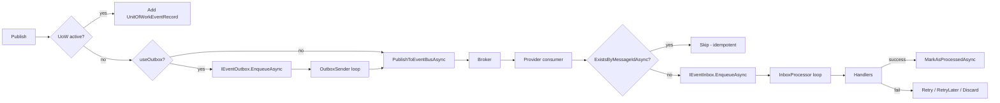

`IDistributedEventBus` is ABP's cross-service publish/subscribe surface. It piggy-backs on a broker provider (RabbitMQ, Kafka, Azure Service Bus, Dapr, Rebus) but adds three things the brokers do not provide on their own: transactional outbox persistence, idempotent inbox processing, and handler-type/event-type exclusion rules. The framework default, when no provider is registered, is `LocalDistributedEventBus` — which routes events through the in-process `ILocalEventBus` so multi-host deployments behave like single hosts.

## Interface and base class

`IDistributedEventBus` (`framework/src/Volo.Abp.EventBus.Abstractions/Volo/Abp/EventBus/Distributed/IDistributedEventBus.cs`) extends `IEventBus` with a `useOutbox` flag on every `PublishAsync` overload (default `true`). Implementations derive from `DistributedEventBusBase` (`framework/src/Volo.Abp.EventBus/Volo/Abp/EventBus/Distributed/DistributedEventBusBase.cs`), which adds:

- `IGuidGenerator` for `MessageId` allocation.
- `ICorrelationIdProvider` for tracing.
- `ILocalEventBus` for cross-bus duplication (handlers that implement both interfaces fire locally too).
- `AbpDistributedEventBusOptions` for handler/outbox/inbox configuration.

`DistributedEventBusBase.PublishAsync` checks the unit of work first; if absent or `onUnitOfWorkComplete: false`, it routes to the outbox (when `useOutbox: true` and a matching `OutboxConfig` covers the event type) or directly to the broker via the provider-specific `PublishToEventBusAsync` override.

## The outbox

`AbpDistributedEventBusOptions.Outboxes` is an `OutboxConfigDictionary` of named `OutboxConfig` entries. Each entry has:

| Property | Purpose |
| --- | --- |
| `Name` | Logical key, used for selectors. |
| `DatabaseName` | Backing database alias — also drives the distributed-lock name `AbpOutbox_{DatabaseName}`. |
| `ImplementationType` | Concrete `IEventOutbox` resolved per-config (e.g. EF Core or MongoDB outbox). |
| `Selector` | Optional `Func<Type,bool>` to send only matching event types through this outbox. |
| `IsSendingEnabled` | Disable a sender host without removing config. |

`IEventOutbox` (`framework/src/Volo.Abp.EventBus.Abstractions/Volo/Abp/EventBus/Distributed/IEventOutbox.cs`) is intentionally small:

```csharp
Task EnqueueAsync(OutgoingEventInfo outgoingEvent);
Task<List<OutgoingEventInfo>> GetWaitingEventsAsync(int maxCount, Expression<Func<IOutgoingEventInfo, bool>>? filter, CancellationToken ct);
Task DeleteAsync(Guid id);
Task DeleteManyAsync(IEnumerable<Guid> ids);
```

`OutboxSenderManager` (an `IBackgroundWorker` started by `AbpEventBusModule.OnApplicationInitializationAsync`) creates one `OutboxSender` per enabled config. Each sender:

1. Acquires `IAbpDistributedLock` under `AbpOutbox_{DatabaseName}` so only one host drains a database at a time.
2. Calls `GetWaitingEventsAsync(OutboxWaitingEventMaxCount, OutboxProcessorFilter)`.
3. Publishes via `IDistributedEventBus.PublishFromOutboxAsync` (batched when `AbpEventBusBoxesOptions.BatchPublishOutboxEvents` is `true`) and deletes successful rows.

The timer period is `AbpEventBusBoxesOptions.PeriodTimeSpan` (default 2 s).

## The inbox

`AbpDistributedEventBusOptions.Inboxes` is an `InboxConfigDictionary` of `InboxConfig` entries:

| Property | Purpose |
| --- | --- |
| `Name` | Logical key. |
| `DatabaseName` | Drives lock name `AbpInbox_{DatabaseName}` and dedup scope. |
| `ImplementationType` | Concrete `IEventInbox`. |
| `EventSelector` | Filter incoming event *types*. |
| `HandlerSelector` | Filter handler types — used to split routing between modules. |
| `IsProcessingEnabled` | Disable inbox processing without removing config. |

`IEventInbox` adds idempotency primitives:

```csharp
Task EnqueueAsync(IncomingEventInfo incomingEvent);
Task<bool> ExistsByMessageIdAsync(string messageId);
Task MarkAsProcessedAsync(Guid id);
Task RetryLaterAsync(Guid id, int retryCount, DateTime? nextRetryTime);
Task MarkAsDiscardAsync(Guid id);
Task DeleteOldEventsAsync();
```

When a provider receives a message, it calls `IEventInbox.ExistsByMessageIdAsync` before enqueueing. `InboxProcessManager` then spawns one `InboxProcessor` per enabled config; each one locks `AbpInbox_{DatabaseName}`, fetches up to `InboxWaitingEventMaxCount` events filtered by `InboxProcessorFilter`, dispatches them to handlers, and applies the configured failure policy.

## Failure policies

`AbpEventBusBoxesOptions.InboxProcessorFailurePolicy` is one of:

- `Retry` (default) — re-tries on the next loop iteration; relies on at-least-once delivery.
- `RetryLater` — exponential backoff: `delay = InboxProcessorRetryBackoffFactor × 2^retryCount`. Discards after `InboxProcessorMaxRetryCount` (default 10) attempts.
- `Discard` — logs and drops the event.



## Exclusion rules

ABP applies exclusion at two layers:

- **Per outbox**, `OutboxConfig.Selector` decides whether an outgoing event is owned by that outbox. The first matching config wins.
- **Per inbox**, `InboxConfig.EventSelector` filters incoming events and `InboxConfig.HandlerSelector` filters which handler types execute against that inbox.

A common pattern is "module owns the events that originate inside it":

```csharp
Configure<AbpDistributedEventBusOptions>(options =>
{
    options.Outboxes.Configure("Identity", x =>
    {
        x.UseDbContext<IdentityDbContext>();
        x.Selector = type => type.Namespace?.StartsWith("Volo.Abp.Identity") == true;
    });
});
```

The `InboxOutboxFilterExpressionTransformer` rewrites filter expressions so the same `Expression<Func<IOutgoingEventInfo, bool>>` you supply at publish time can be re-targeted at provider-specific entity types when the EF Core / MongoDB providers query the store.

## Idempotent handlers

The framework gives you idempotency via inbox dedup, but handlers must still tolerate at-least-once delivery for the no-inbox / non-transactional path. Practical rules:

- Carry an immutable identifier (aggregate id or `MessageId`) in the ETO.
- Make the side-effect commutative or guard it with a uniqueness constraint.
- Avoid throwing on duplicates — log and return success so `MarkAsProcessedAsync` runs.

## Default implementation

When no provider module is referenced, ABP registers `LocalDistributedEventBus` (`Volo.Abp.EventBus/Volo/Abp/EventBus/Distributed/LocalDistributedEventBus.cs`) with `[Dependency(TryRegister = true)]`. It subscribes the same handler list and forwards every publish to the in-process `ILocalEventBus`. Adding a provider package replaces the registration via `[Dependency(ReplaceServices = true)]`.

## Tuning

`AbpEventBusBoxesOptions` controls the box workers:

```csharp
Configure<AbpEventBusBoxesOptions>(options =>
{
    options.PeriodTimeSpan = TimeSpan.FromSeconds(2);
    options.BatchPublishOutboxEvents = true;
    options.OutboxWaitingEventMaxCount = 1000;
    options.InboxWaitingEventMaxCount = 1000;
    options.InboxProcessorFailurePolicy = InboxProcessorFailurePolicy.RetryLater;
    options.InboxProcessorMaxRetryCount = 10;
    options.WaitTimeToDeleteProcessedInboxEvents = TimeSpan.FromHours(2);
    options.CleanOldEventTimeIntervalSpan = TimeSpan.FromHours(6);
});
```

## Related

<CardGroup cols={3}>
  <Card title="RabbitMQ" href="/framework/event-bus/rabbitmq" icon="rabbit" />
  <Card title="Kafka" href="/framework/event-bus/kafka" icon="stream" />
  <Card title="Azure Service Bus" href="/framework/event-bus/azure-service-bus" icon="cloud" />
  <Card title="Dapr" href="/framework/event-bus/dapr" icon="cube" />
  <Card title="Rebus" href="/framework/event-bus/rebus" icon="recycle" />
  <Card title="Overview" href="/framework/event-bus/overview" icon="diagram-project" />
</CardGroup>
