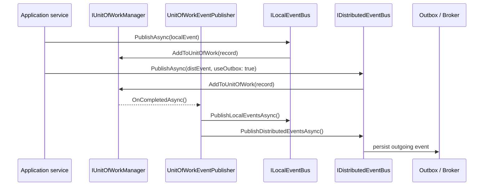

ABP ships a publish/subscribe abstraction layered on a generic `IEventBus` contract with two concrete pillars: an in-process [`ILocalEventBus`](/framework/event-bus/local-event-bus) for synchronous domain notifications and an [`IDistributedEventBus`](/framework/event-bus/distributed-event-bus) for cross-service messaging over message brokers. Both buses share the same handler discovery model, the same unit‑of‑work integration, and the same reflection-cached invoker, so application code can move events between scopes without rewriting handlers.

## The shared contract

`IEventBus` (`framework/src/Volo.Abp.EventBus.Abstractions/Volo/Abp/EventBus/IEventBus.cs`) defines three publish overloads — by generic type, by `Type`, and by string name — plus a family of `Subscribe`/`Unsubscribe` methods. Every overload accepts an `onUnitOfWorkComplete` flag (default `true`) that delays delivery until the surrounding unit of work succeeds.

`EventBusBase` (`framework/src/Volo.Abp.EventBus/Volo/Abp/EventBus/EventBusBase.cs`) implements common behaviour:

- Wraps subscriptions in `IEventHandlerFactory` (`SingleInstanceHandlerFactory`, `TransientEventHandlerFactory`, or `IocEventHandlerFactory`).
- Resolves and invokes handlers through `IEventHandlerInvoker`.
- Switches `ICurrentTenant` based on `IEventDataMayHaveTenantId` before calling each handler.

Handler types are marked by `ILocalEventHandler<TEvent>` or `IDistributedEventHandler<TEvent>` — both inherit the empty marker `IEventHandler` (`IEventHandler.cs`). The framework discovers them via `IServiceCollection.OnRegistered` in `AbpEventBusModule.PreConfigureServices`, which adds every implementation to `AbpLocalEventBusOptions.Handlers` and `AbpDistributedEventBusOptions.Handlers`:

```csharp
// AbpEventBusModule.cs
services.OnRegistered(context =>
{
    if (ReflectionHelper.IsAssignableToGenericType(context.ImplementationType, typeof(ILocalEventHandler<>)))
        localHandlers.Add(context.ImplementationType);
    if (ReflectionHelper.IsAssignableToGenericType(context.ImplementationType, typeof(IDistributedEventHandler<>)))
        distributedHandlers.Add(context.ImplementationType);
});
```

## Handler invocation

`EventHandlerInvoker` caches one `EventHandlerInvokerCacheItem` per `(handler type, event type)` pair. The cache is built lazily by reflecting whether the handler implements `ILocalEventHandler<T>`, `IDistributedEventHandler<T>`, or both, and stores precompiled `IEventHandlerMethodExecutor` delegates. At call time it executes whichever executors are populated and throws `AbpException` if neither matched — guaranteeing that an unrelated object cannot be subscribed by accident.

Resolution uses `IocEventHandlerFactory`, which opens an `IServiceScope` per invocation so that scoped dependencies (current user, current tenant, DbContext) are isolated. The scope is disposed by `EventHandlerDisposeWrapper`.

## Transactional ordering

To prevent "ghost" notifications, every publish first checks `IUnitOfWorkManager.Current`. If a unit of work is active and `onUnitOfWorkComplete` is `true`, the event is captured as a `UnitOfWorkEventRecord` (with a monotonically increasing order from `EventOrderGenerator.GetNext()`) and dispatched only when the UoW commits. `UnitOfWorkEventPublisher` is the dependency that the UoW calls back into:

```csharp
// UnitOfWorkEventPublisher.cs
public async Task PublishDistributedEventsAsync(IEnumerable<UnitOfWorkEventRecord> distributedEvents)
{
    foreach (var distributedEvent in distributedEvents)
    {
        await _distributedEventBus.PublishAsync(
            distributedEvent.EventType,
            distributedEvent.EventData,
            onUnitOfWorkComplete: false,
            useOutbox: distributedEvent.UseOutbox);
    }
}
```

Local events fire in-process at this point. Distributed events flow through the outbox when `useOutbox` is `true`, otherwise they go directly to the broker — see the [Distributed Event Bus](/framework/event-bus/distributed-event-bus) page for the full pipeline.



## Handler patterns

<CardGroup cols={2}>
  <Card title="Local handler" icon="bolt">
    Implement `ILocalEventHandler<TEvent>` plus `ITransientDependency` for in-process side effects inside the same process boundary.
  </Card>
  <Card title="Distributed handler" icon="network-wired">
    Implement `IDistributedEventHandler<TEvent>` for cross-service messaging; the same class may implement both interfaces.
  </Card>
  <Card title="Inline action" icon="code">
    Use `eventBus.Subscribe<T>(async e => ...)` — `ActionEventHandler<T>` adapts the delegate to the handler interface.
  </Card>
  <Card title="Dynamic by name" icon="font">
    Tag events with `[EventName("user.created")]` to enable string-keyed publish for cross-language scenarios.
  </Card>
</CardGroup>

## Where to go next

<CardGroup cols={3}>
  <Card title="Local bus" href="/framework/event-bus/local-event-bus" icon="bolt" />
  <Card title="Distributed bus" href="/framework/event-bus/distributed-event-bus" icon="network-wired" />
  <Card title="RabbitMQ" href="/framework/event-bus/rabbitmq" icon="rabbit" />
  <Card title="Kafka" href="/framework/event-bus/kafka" icon="stream" />
  <Card title="Azure Service Bus" href="/framework/event-bus/azure-service-bus" icon="cloud" />
  <Card title="Unit of work" href="/framework/data/unit-of-work" icon="database" />
</CardGroup>
