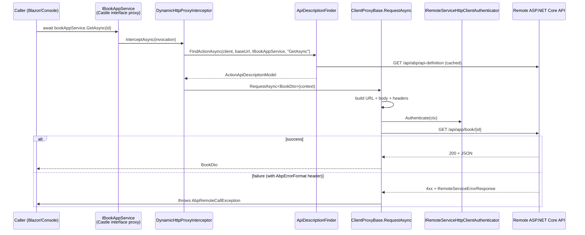

The dynamic HTTP client proxy lets a client project depend on `IBookAppService` and call `await bookAppService.GetAsync(id)` as if it were local — even though, at runtime, every call is being shipped over HTTP to a remote ASP.NET Core host. There is no code generation step: a `Castle.DynamicProxy.ProxyGenerator` builds an interface proxy at registration time, and a single interceptor (`DynamicHttpProxyInterceptor<TService>`) translates every method invocation into an HTTP request by consulting the live `ApplicationApiDescriptionModel` published by the server.

Source: `framework/src/Volo.Abp.Http.Client/Volo/Abp/Http/Client/DynamicProxying/` plus the shared `ClientProxying/` infrastructure.

## Registration: `AddHttpClientProxies`

`framework/src/Volo.Abp.Http.Client/Microsoft/Extensions/DependencyInjection/ServiceCollectionHttpClientProxyExtensions.cs` exposes both assembly-wide and per-type entry points:

```csharp
public static IServiceCollection AddHttpClientProxies(
    this IServiceCollection services,
    Assembly assembly,
    string remoteServiceConfigurationName = RemoteServiceConfigurationDictionary.DefaultName,
    bool asDefaultServices = true,
    ApplicationServiceTypes applicationServiceTypes = ApplicationServiceTypes.All)
```

It scans `assembly` for public interfaces extending `IRemoteService` (a marker on `IApplicationService`) and calls `AddHttpClientProxy` for each. The per-type method does the real work:

```csharp
services.Configure<AbpHttpClientOptions>(options =>
{
    options.HttpClientProxies[type] = new HttpClientProxyConfig(type, remoteServiceConfigurationName);
});

var interceptorType = typeof(DynamicHttpProxyInterceptor<>).MakeGenericType(type);
services.AddTransient(interceptorType);

services.AddTransient(
    type,
    sp => ProxyGeneratorInstance.CreateInterfaceProxyWithoutTarget(
        type,
        (IInterceptor)sp.GetRequiredService(validationInterceptorAdapterType),
        (IInterceptor)sp.GetRequiredService(interceptorAdapterType)
    )
);
```

Two facts to anchor on:

- `HttpClientProxyConfig(type, remoteServiceConfigurationName)` ties the interface to a *named* `RemoteServiceConfiguration` (see [Remote Services](/framework/http/remote-services)). One application can talk to half a dozen back-ends by giving each interface a different name.
- The proxy is registered as the *default* implementation when `asDefaultServices: true`. Anything that injects `IBookAppService` resolves the dynamic proxy without code changes — the same constructor works against a local AppService in the API host and against an HTTP-shipped proxy in a Blazor WASM host.

A `ValidationInterceptor` runs *before* the HTTP interceptor so client-side `[Required]`/`[Range]` validation throws `AbpValidationException` without a round trip.

## The interceptor: from MethodInfo to ActionApiDescriptionModel

`DynamicProxying/DynamicHttpProxyInterceptor.cs` translates a `IAbpMethodInvocation` into a `ClientProxyRequestContext`:

```csharp
public override async Task InterceptAsync(IAbpMethodInvocation invocation)
{
    var context = new ClientProxyRequestContext(
        await GetActionApiDescriptionModel(invocation),
        invocation.ArgumentsDictionary,
        typeof(TService));

    if (invocation.Method.ReturnType.GenericTypeArguments.IsNullOrEmpty())
    {
        using (await InterceptorClientProxy.CallRequestAsync(context)) { }
    }
    else
    {
        var returnType = invocation.Method.ReturnType.GenericTypeArguments[0];
        var result = (Task)CallRequestAsyncMethod.MakeGenericMethod(returnType)
                                                  .Invoke(this, new object[] { context })!;
        invocation.ReturnValue = await GetResultAsync(result, returnType);
    }
}
```

`GetActionApiDescriptionModel` resolves the remote service base URL, gets a typed `HttpClient` from `IProxyHttpClientFactory`, and delegates to `IApiDescriptionFinder.FindActionAsync`. That finder (`DynamicProxying/ApiDescriptionFinder.cs`) walks the cached `ApplicationApiDescriptionModel` (`IApiDescriptionCache`) looking for an action whose `Name` matches `MethodInfo.Name` and whose `ParametersOnMethod` line up by type with the actual `MethodInfo` parameters. The match is cached so a second invocation skips the lookup.

`InterceptorClientProxy` is a `DynamicHttpProxyInterceptorClientProxy<TService>` — a thin subclass of `ClientProxyBase<TService>` that exposes the protected request methods for the interceptor's use. From here, both dynamic and static proxies funnel through the same `ClientProxyBase<TService>` (shared with [Static Client Proxy](/framework/http/static-client-proxy)).

## Building the request: ClientProxyBase

`ClientProxying/ClientProxyBase.cs` is where the heavy lifting happens. The relevant pipeline inside `RequestAsync(ClientProxyRequestContext)`:

1. **Resolve config** — `AbpHttpClientOptions.HttpClientProxies[serviceType]` gives the `RemoteServiceName`; `IRemoteServiceConfigurationProvider` returns the matching `RemoteServiceConfiguration` (base URL, version).
2. **Get HttpClient** — `IProxyHttpClientFactory.Create(remoteServiceName)`. Default implementation `DefaultProxyHttpClientFactory` calls `IHttpClientFactory.CreateClient(remoteServiceName)`, so all standard delegating handlers (Polly, logging, tenant headers) layer on transparently.
3. **API version** — `GetApiVersionInfoAsync` consults `ICurrentApiVersionInfo` (see [API Versioning](/framework/aspnetcore/api-versioning)). If unset, it picks the highest version listed in `action.SupportedVersions` that matches the configured `RemoteServiceConfiguration.Version`.
4. **URL** — `ClientProxyUrlBuilder.GenerateUrlWithParametersAsync` substitutes route segments, then walks parameters whose `BindingSourceId == ParameterBindingSources.Query` (or `Path`) through `IObjectToQueryString` / `IObjectToPath`. The result is `baseUrl + "api/app/book/{id}?..."` with everything filled in.
5. **Body** — `ClientProxyRequestPayloadBuilder.BuildContentAsync` packages `Body`-bound parameters as JSON (`IJsonSerializer`, system.text.json by default) or as `multipart/form-data` when `IFormFile`/`IRemoteStreamContent` parameters are present.
6. **Headers** — `AddHeaders` writes the correlation ID (`AbpCorrelationIdOptions`), the `X-Requested-With: XMLHttpRequest`, the `Accept-Language` from `CultureInfo.CurrentUICulture`, and the timezone from `ICurrentTimezoneProvider`. `AbpHttpClientBuilderOptions.ProxyClientBuildActions` lets a module add more.
7. **Authentication** — unless `action.AllowAnonymous == true`, `IRemoteServiceHttpClientAuthenticator.Authenticate(...)` is invoked. The default `NullRemoteServiceHttpClientAuthenticator` is a no-op; `IdentityModelRemoteServiceHttpClientAuthenticator` (in [Identity Model](/framework/http/identity-model)) fetches a bearer token from the IdP.
8. **Pre-send actions** — `AbpHttpClientOptions.ProxyHttpClientPreSendActions` registered for this remote service name are invoked with the live `HttpRequestMessage`.
9. **Send** — `HttpClient.SendAsync(..., HttpCompletionOption.ResponseHeadersRead, cancellationToken)`. The cancellation token comes from a `CancellationToken` argument if the method has one.
10. **Error handling** — on a non-success status code, `ThrowExceptionForResponseAsync` parses the `WWW-Authenticate` header for OAuth error fields, publishes a `ClientProxyExceptionEventData` to `ILocalEventBus`, and — if the `AbpHttpConsts.AbpErrorFormat` header is present — deserialises a `RemoteServiceErrorResponse` and throws `AbpRemoteCallException(errorResponse.Error) { HttpStatusCode = ... }`.

## Deserialization

Returning `Task<T>`? `RequestAsync<T>` decides what to do based on `T`:

- `T = IRemoteStreamContent` or `RemoteStreamContent` → wraps the response stream so the caller controls disposal. No JSON parsing, no buffering.
- `T = string` → reads the body as text and calls `UnwrapStringResponse(body, contentType)` which strips JSON quotes when the response is `application/json` containing a quoted string.
- Empty body → returns `default(T)`.
- Otherwise → `JsonSerializer.Deserialize<T>(stringContent)`.

`RequestAsyncEnumerable<T>` is a special path that uses `System.Text.Json.JsonSerializer.DeserializeAsyncEnumerable<T>` on the raw response stream — letting a server-side `IAsyncEnumerable<T>` action stream into a client `IAsyncEnumerable<T>` without buffering the whole array.

## End-to-end flow



## When to use it

The dynamic proxy is the simplest option when:

- The client can fetch `/api/abp/api-definition` at startup. A Blazor Server, MVC server, or in-cluster .NET worker can do this trivially.
- You want zero generated code in version control and you accept the small startup hit of downloading the description model.

For an offline client (Blazor WebAssembly published to a CDN, MAUI app shipped to stores) you typically prefer the static proxy generator that bakes the routes into C# at design time — see [Static Client Proxy](/framework/http/static-client-proxy). The implementation surface is unified: static proxies extend the same `ClientProxyBase<TService>` and reuse `ClientProxyUrlBuilder`, `ClientProxyRequestPayloadBuilder`, and the error pipeline above. The only thing that changes is how `ClientProxyApiDescriptionFinder.FindAction(methodUniqueName)` resolves the action — from the live model versus a pre-built dictionary.

## Composition with other modules

- `Volo.Abp.Http.Client.Web` and `Volo.Abp.Http.Client.WebAssembly` plug context-aware `IRemoteServiceHttpClientAuthenticator`s into the pipeline so the cookie-based or PersistentComponentState-based access token flows are picked up automatically.
- `Volo.Abp.Http.Client.IdentityModel` adds `IdentityModelRemoteServiceHttpClientAuthenticator` for server-to-server calls (see [Identity Model](/framework/http/identity-model)).
- `Volo.Abp.AspNetCore.Mvc.Client` registers the dynamic proxy controller-replacement attribute so a Razor pages host can mount a proxy at the same route the API uses.

The interceptor is the boundary between "interface invocation" and "HTTP request"; everything outbound goes through `ClientProxyBase.RequestAsync`, and everything inbound goes through `ThrowExceptionForResponseAsync` or `RequestAsync<T>`. Keeping that boundary narrow is what makes the proxy stable across hosts.
