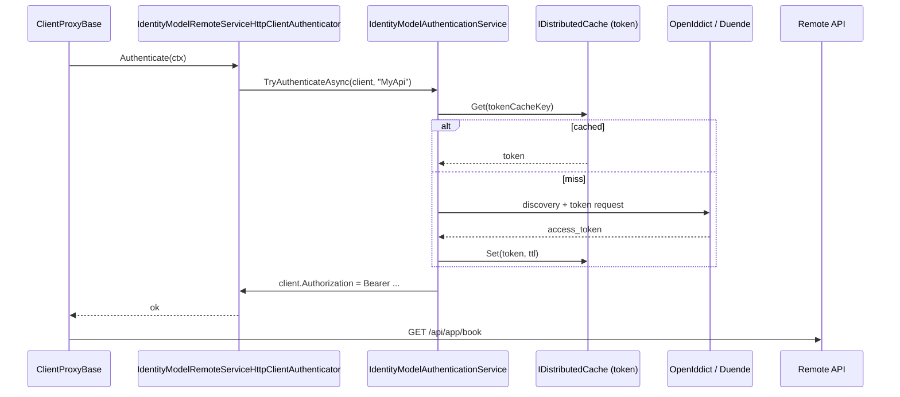

When a server-side host needs to call another ABP service that requires a bearer token — a backend-for-frontend talking to a microservice, a console worker talking to the API, a Blazor Server app proxying calls — it cannot reuse the user's interactive session. `Volo.Abp.IdentityModel` and `Volo.Abp.Http.Client.IdentityModel` work together to fetch and cache OAuth tokens via the Duende `IdentityModel` library and plug them into the HTTP client proxy pipeline.

## Two packages, two roles

- `Volo.Abp.IdentityModel` (`framework/src/Volo.Abp.IdentityModel/`) — the generic OAuth token acquirer. It does not know anything about ABP proxies; it can be used standalone to attach bearer tokens to any `HttpClient`.
- `Volo.Abp.Http.Client.IdentityModel` (`framework/src/Volo.Abp.Http.Client.IdentityModel/`) — a thin adapter that registers `IdentityModelRemoteServiceHttpClientAuthenticator` as the default `IRemoteServiceHttpClientAuthenticator` so dynamic/static client proxies pick up the token automatically.

## IIdentityModelAuthenticationService

`framework/src/Volo.Abp.IdentityModel/Volo/Abp/IdentityModel/IIdentityModelAuthenticationService.cs`:

```csharp
public interface IIdentityModelAuthenticationService
{
    Task<bool> TryAuthenticateAsync(HttpClient client, string? identityClientName = null);
    Task<string> GetAccessTokenAsync(IdentityClientConfiguration configuration);
}
```

`TryAuthenticateAsync` is the one downstream code typically calls — it sets `Authorization: Bearer <token>` on the client. `GetAccessTokenAsync` is exposed for code that wants to attach the token elsewhere (e.g. SignalR `HubConnectionBuilder.WithUrl(..., options => options.AccessTokenProvider = ...)`).

The default implementation `IdentityModelAuthenticationService` (`IdentityModelAuthenticationService.cs`) is the workhorse. Constructor dependencies:

- `IOptions<AbpIdentityClientOptions>` — named client configurations.
- `IHttpClientFactory` — to talk to the IdP.
- `ICurrentTenant` — for tenant-scoped client lookups (see below).
- `IDistributedCache<IdentityModelTokenCacheItem>` and `IDistributedCache<IdentityModelDiscoveryDocumentCacheItem>` — two caches: one for tokens, one for discovery metadata.
- `IOptions<IdentityModelHttpRequestMessageOptions>` — a hook for adding default headers / mTLS handlers to outbound IdP requests.

The class lives at the seam between Duende's `Duende.IdentityModel.Client` and ABP's caching/host abstractions.

## Named client configurations

`AbpIdentityClientOptions.cs` is a dictionary of `IdentityClientConfiguration` keyed by name:

```csharp
public class AbpIdentityClientOptions
{
    public IdentityClientConfigurationDictionary IdentityClients { get; set; }

    public IdentityClientConfiguration? GetClientConfiguration(ICurrentTenant currentTenant, string? identityClientName = null);
}
```

Each `IdentityClientConfiguration` (a `Dictionary<string,string?>` subclass for binding from `IConfiguration`) carries the OIDC client knobs:

- `GrantType` — `"client_credentials"` (default) or `"password"`.
- `ClientId`, `ClientSecret`.
- `Authority`, `Scope`.
- `UserName`, `UserPassword` (password grant only).
- `RequireHttps`, `ValidateIssuerName`, `ValidateEndpoints` for discovery hardening.
- `CacheAbsoluteExpiration` — token TTL in seconds.

`GetClientConfiguration(currentTenant, identityClientName)` resolves the right entry with tenant-aware lookups:

1. If `identityClientName` is null, treat it as `DefaultName`.
2. If a tenant is active, look up `"{identityClientName}.{TenantId}"`, then `"{identityClientName}.{TenantName}"`.
3. Fall back to the non-tenant `identityClientName`, then to `IdentityClients.Default`.

That makes it possible to have a per-tenant client id/secret without coupling the lookup into every caller.

Binding from `appsettings.json`:

```json
"IdentityClients": {
    "Default": {
        "GrantType": "client_credentials",
        "ClientId": "MyBackend",
        "ClientSecret": "1q2w3e*",
        "Authority": "https://auth.example",
        "Scope": "MyApi"
    },
    "MyApi": {
        "GrantType": "password",
        "ClientId": "MyApi_App",
        "UserName": "admin",
        "UserPassword": "1q2w3E*",
        "Authority": "https://auth.example",
        "Scope": "MyApi profile email"
    }
}
```

## Token acquisition with caching

`GetAccessTokenAsync` is what the rest of the framework calls:

```csharp
public virtual async Task<string> GetAccessTokenAsync(IdentityClientConfiguration configuration)
{
    var cacheKey = CalculateTokenCacheKey(configuration);
    var tokenCacheItem = await TokenCache.GetAsync(cacheKey);
    if (tokenCacheItem == null)
    {
        var tokenResponse = await GetTokenResponse(configuration);
        if (tokenResponse.IsError) { /* throw with details */ }
        tokenCacheItem = new IdentityModelTokenCacheItem(tokenResponse.AccessToken!);
        await TokenCache.SetAsync(cacheKey, tokenCacheItem, new DistributedCacheEntryOptions
        {
            AbsoluteExpirationRelativeToNow = AbpHostEnvironment.IsDevelopment()
                ? TimeSpan.FromSeconds(5)
                : TimeSpan.FromSeconds(configuration.CacheAbsoluteExpiration)
        });
    }
    return tokenCacheItem.AccessToken;
}
```

Key facts:

- The cache key is computed from the configuration's identifying properties (client id, grant type, scope, user name). Two callers that ask for the same logical client share a token.
- In `Development` the TTL is hard-clamped to 5 seconds — useful when you are rotating client secrets while debugging. In production it uses `CacheAbsoluteExpiration` from the configuration (default 1800s).
- Discovery is cached separately via `IdentityModelDiscoveryDocumentCacheItem` so `/.well-known/openid-configuration` is fetched once per authority.
- The cache is an `IDistributedCache<T>` — in a multi-node deployment, tokens are shared via Redis/SQL so only one node hits the IdP.

`GetTokenResponse` switches on `GrantType` and calls Duende's `httpClient.RequestClientCredentialsTokenAsync(...)` or `RequestPasswordTokenAsync(...)` against the discovery-resolved token endpoint. `SetAccessToken` writes the result to the `HttpClient.DefaultRequestHeaders.Authorization` as a `Bearer` header — the `//TODO` in source notes that the scheme name could be made configurable.

## Wiring into HTTP client proxies

`framework/src/Volo.Abp.Http.Client.IdentityModel/Volo/Abp/Http/Client/IdentityModel/IdentityModelRemoteServiceHttpClientAuthenticator.cs`:

```csharp
[Dependency(ReplaceServices = true)]
public class IdentityModelRemoteServiceHttpClientAuthenticator : IRemoteServiceHttpClientAuthenticator, ITransientDependency
{
    protected IIdentityModelAuthenticationService IdentityModelAuthenticationService { get; }

    public virtual async Task Authenticate(RemoteServiceHttpClientAuthenticateContext context)
    {
        await IdentityModelAuthenticationService.TryAuthenticateAsync(
            context.Client,
            context.RemoteService.GetIdentityClient() ?? context.RemoteServiceName
        );
    }
}
```

The `[Dependency(ReplaceServices = true)]` attribute means just *referencing* this assembly switches the proxy pipeline's authenticator from the no-op `NullRemoteServiceHttpClientAuthenticator` to the token-aware one. `context.RemoteServiceName` (e.g. `"MyApi"`) is what gets looked up in `IdentityClients` — so the naming convention "remote service name = identity client name" is the default. `RemoteServiceConfigurationExtensions.GetIdentityClient()` lets a `RemoteServiceConfiguration` override that by adding an explicit `IdentityClient` key.

The flow inside `ClientProxyBase.RequestAsync` (covered in [Dynamic Client Proxy](/framework/http/dynamic-client-proxy)) becomes:



## Sibling packages for browser/native hosts

`Volo.Abp.Http.Client.IdentityModel.Web` swaps in `HttpContextIdentityModelRemoteServiceHttpClientAuthenticator` which calls `HttpContext.GetTokenAsync("access_token")` first (forwarding the interactive user's token) and only falls back to client credentials. `Volo.Abp.Http.Client.IdentityModel.WebAssembly` (and the `MauiBlazor` variant) use `IAccessTokenProvider` — the Blazor primitive — instead of going to the IdP themselves. All three implement the same `IRemoteServiceHttpClientAuthenticator` interface so the proxy pipeline does not know the difference.

For the related host-side authentication schemes — `AddAbpJwtBearer`, `AddAbpOpenIdConnect` — see [Authentication](/framework/aspnetcore/authentication).
