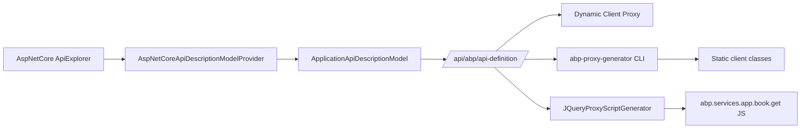

`Volo.Abp.Http` and `Volo.Abp.Http.Abstractions` are the lowest-level HTTP packages in the framework. They do not start a server, send a request, or pick a transport — they define the *data model* and *contracts* that every other HTTP-shaped integration (MVC, dynamic client proxies, static client proxies, Swagger generation, classic proxy-script clients) speaks. Keeping that data model in a tiny dependency-free assembly is what makes it possible for a Blazor WebAssembly app and an ASP.NET Core API to agree on the shape of an action description and an error payload.

## Abstractions: contracts only

`framework/src/Volo.Abp.Http.Abstractions/Volo/Abp/Http/`:

- `AbpHttpAbstractionsModule.cs` — module shell, depends on nothing.
- `ClientProxyExceptionEventData.cs` — local event published when a client proxy gets a non-success HTTP response. Carries `StatusCode`, `ReasonPhrase`, `Error`, `ErrorDescription`, `ErrorUri`.
- `Modeling/AbpApiDescriptionModelOptions.cs` — option bag that lets a module exclude marker interfaces (`ITransientDependency`, `IDisposable`, `IAvoidDuplicateCrossCuttingConcerns`) from generated proxies.

## RemoteServiceErrorInfo and AbpRemoteCallException

The error contract lives in `Volo.Abp.ExceptionHandling` (`framework/src/Volo.Abp.ExceptionHandling/Volo/Abp/Http/RemoteServiceErrorInfo.cs`) but it is the canonical shape all HTTP integrations exchange:

```csharp
[Serializable]
public class RemoteServiceErrorInfo
{
    public string? Code { get; set; }
    public string? Message { get; set; }
    public string? Details { get; set; }
    public IDictionary? Data { get; set; }
    public RemoteServiceValidationErrorInfo[]? ValidationErrors { get; set; }
}
```

Wrapped by `RemoteServiceErrorResponse { RemoteServiceErrorInfo Error }`, this is what `AbpExceptionFilter` writes when an MVC action throws, and what `ClientProxyBase.ThrowExceptionForResponseAsync` reads on the other end. The reverse direction — turning the deserialized payload back into a thrown exception — is `AbpRemoteCallException` (`Volo.Abp.Http.Client`), which carries the `HttpStatusCode` plus the round-tripped `RemoteServiceErrorInfo`.

The handshake hinges on the response header `AbpHttpConsts.AbpErrorFormat` (string constant `"_AbpErrorFormat"` defined in `framework/src/Volo.Abp.Http/Volo/Abp/Http/AbpHttpConsts.cs`). When present, the client knows the body is a `RemoteServiceErrorResponse` and parses accordingly; when absent, the client falls back to `WWW-Authenticate` parsing (for token-rejection cases) and surfaces a generic exception. That single header is how the framework keeps protocol detection cheap.

## ApiDescriptionModel: serialized API surface

`framework/src/Volo.Abp.Http/Volo/Abp/Http/Modeling/` defines the hierarchical model that flows from the API description controller to dynamic clients, code generators, and Swagger filters:

```
ApplicationApiDescriptionModel
└── Modules:        IDictionary<string, ModuleApiDescriptionModel>
    └── Controllers:IDictionary<string, ControllerApiDescriptionModel>
        └── Actions:IDictionary<string, ActionApiDescriptionModel>
            ├── UniqueName, Name, HttpMethod, Url
            ├── ParametersOnMethod: MethodParameterApiDescriptionModel[]
            ├── Parameters: ParameterApiDescriptionModel[]  (after MVC binding)
            ├── ReturnValue: ReturnValueApiDescriptionModel
            ├── SupportedVersions, AllowAnonymous
            └── ImplementFrom (interface that declared the action)
└── Types: IDictionary<string, TypeApiDescriptionModel>
```

`ActionApiDescriptionModel` carries everything a code generator needs:

```csharp
public string UniqueName { get; set; }                // "Acme.Books.IBookAppService.GetAsync.Guid"
public string Name { get; set; }                      // "GetAsync"
public string? HttpMethod { get; set; }               // "GET"
public string Url { get; set; }                       // "api/app/book/{id}"
public IList<string>? SupportedVersions { get; set; }
public IList<MethodParameterApiDescriptionModel> ParametersOnMethod { get; set; }
public IList<ParameterApiDescriptionModel> Parameters { get; set; }
public ReturnValueApiDescriptionModel ReturnValue { get; set; }
public bool? AllowAnonymous { get; set; }
```

`ParameterApiDescriptionModel.BindingSourceId` is one of the strings in `ParameterBindingSources` (`Path`, `Query`, `Header`, `Body`, `Form`, `FormFile`, `ModelBinding`) so clients can compose the request without reflecting over `[FromQuery]` attributes themselves. `TypeApiDescriptionModel` is referenced by name rather than embedded so the same DTO type is described once even if many actions return it.

`ApiTypeNameHelper.cs` is the central rule for what name a CLR type gets in the model — important to know when you want to align generated client code (TypeScript, Angular, Blazor) with the server contract.

The model is materialised by `IApiDescriptionModelProvider` (default implementation in MVC: `AspNetCoreApiDescriptionModelProvider`) and served by `AbpApiDefinitionController` at `/api/abp/api-definition` (see [MVC](/framework/aspnetcore/mvc)).



## ProxyScripting: the legacy JavaScript client

`framework/src/Volo.Abp.Http/Volo/Abp/Http/ProxyScripting/` is what powers the classic MVC UI's `abp.services.*` namespace. It is *not* the same thing as the dynamic C# client proxy.

Key pieces:

- `IProxyScriptManager` and `ProxyScriptManager` — fetch the `ApplicationApiDescriptionModel`, run it through the chosen `IProxyScriptGenerator`, and return JavaScript.
- `IProxyScriptManagerCache` and `ProxyScriptManagerCache` — wrap the manager with `IDistributedCache` so the script is generated once per build.
- `IProxyScriptGenerator` + `JQueryProxyScriptGenerator` — the only shipped generator. It emits `abp.services.<remoteServiceName>.<controller>.<action> = function(args)` against the `abp.ajax` helper.
- `DynamicJavaScriptProxyOptions` — toggles output style (camelCase, naming conventions, default headers).
- `ProxyScriptingHelper` / `ProxyScriptingJsFuncHelper` — small templating helpers shared by alternate generators.
- `AbpApiProxyScriptingOptions` / `AbpApiProxyScriptingConfiguration` — root options bag.

The MVC controller surface that delivers the script is `AbpServiceProxyScriptController` in `Volo.Abp.AspNetCore.Mvc`. The Razor tag helper for the script tag pulls the result via `IProxyScriptManagerCache`. New applications use the dynamic or static C# proxies instead (see [Dynamic Client Proxy](/framework/http/dynamic-client-proxy) and [Static Client Proxy](/framework/http/static-client-proxy)) but the JavaScript path is still maintained for the classic MVC theme.

## Module composition

`AbpHttpModule.cs` depends on nothing surprising (`AbpAuditingContractsModule`, `AbpExceptionHandlingModule`, `AbpAuthorizationAbstractionsModule`, `AbpJsonModule`, `AbpHttpAbstractionsModule`, `AbpApiVersioningAbstractionsModule`). It registers `ProxyScriptManager`, `ProxyScriptManagerCache`, the `JQueryProxyScriptGenerator`, and the API-description options. Every other HTTP integration in the framework (MVC, client proxies, identity-model authenticators, remote services, Swagger) takes a transitive dependency on this module so they share these contracts.

Read next: [Remote Services](/framework/http/remote-services) for the configuration that names and routes outbound calls, then [Dynamic Client Proxy](/framework/http/dynamic-client-proxy) for the C# interface-based invocation path that consumes the API description model above.
