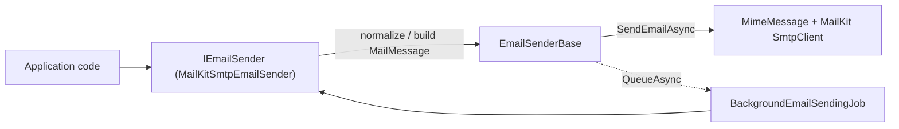

`Volo.Abp.Emailing` exposes `IEmailSender` — the single seam every other module uses to send mail — plus an `EmailSenderBase` that takes care of normalization and background queueing. `Volo.Abp.MailKit` swaps the framework's default SMTP sender for a MailKit-based one.

## IEmailSender

```csharp framework/src/Volo.Abp.Emailing/Volo/Abp/Emailing/IEmailSender.cs
public interface IEmailSender
{
    Task SendAsync(string to, string? subject, string? body,
        bool isBodyHtml = true,
        AdditionalEmailSendingArgs? additionalEmailSendingArgs = null);

    Task SendAsync(string from, string to, string? subject, string? body,
        bool isBodyHtml = true,
        AdditionalEmailSendingArgs? additionalEmailSendingArgs = null);

    Task SendAsync(MailMessage mail, bool normalize = true);

    Task QueueAsync(string to, string subject, string body,
        bool isBodyHtml = true,
        AdditionalEmailSendingArgs? additionalEmailSendingArgs = null);

    Task QueueAsync(string from, string to, string subject, string body,
        bool isBodyHtml = true,
        AdditionalEmailSendingArgs? additionalEmailSendingArgs = null);
}
```

`AdditionalEmailSendingArgs` carries optional attachments and CC addresses. `QueueAsync` defers the actual send to a background job.

## EmailSenderBase

Provider implementations extend `EmailSenderBase`, which builds the `MailMessage`, normalizes it, and dispatches via the abstract `SendEmailAsync(MailMessage)`:

```csharp framework/src/Volo.Abp.Emailing/Volo/Abp/Emailing/EmailSenderBase.cs
public virtual async Task SendAsync(MailMessage mail, bool normalize = true)
{
    if (normalize) await NormalizeMailAsync(mail);
    await SendEmailAsync(mail);
}

protected virtual async Task NormalizeMailAsync(MailMessage mail)
{
    if (mail.From == null || mail.From.Address.IsNullOrEmpty())
    {
        mail.From = new MailAddress(
            await Configuration.GetDefaultFromAddressAsync(),
            await Configuration.GetDefaultFromDisplayNameAsync(),
            Encoding.UTF8);
    }
    // sets HeadersEncoding/SubjectEncoding/BodyEncoding to UTF8 when null
}
```

`QueueAsync` validates the address, then either falls back to a direct `SendAsync` (if no background job manager is registered) or enqueues a `BackgroundEmailSendingJobArgs`:

```csharp framework/src/Volo.Abp.Emailing/Volo/Abp/Emailing/EmailSenderBase.cs
if (!BackgroundJobManager.IsAvailable())
{
    await SendAsync(to, subject, body, isBodyHtml, additionalEmailSendingArgs);
    return;
}

await BackgroundJobManager.EnqueueAsync(new BackgroundEmailSendingJobArgs
{
    TenantId = CurrentTenant.Id,
    To = to, Subject = subject, Body = body, IsBodyHtml = isBodyHtml,
    AdditionalEmailSendingArgs = additionalEmailSendingArgs
});
```

`BackgroundEmailSendingJob` resolves `IEmailSender` and calls the appropriate `SendAsync` overload (file: `framework/src/Volo.Abp.Emailing/Volo/Abp/Emailing/BackgroundEmailSendingJob.cs`).

## Settings

Mail-server credentials are stored in the ABP setting system, not in `appsettings.json` — this lets multi-tenant hosts override per tenant. Setting names live in `EmailSettingNames`:

```csharp framework/src/Volo.Abp.Emailing/Volo/Abp/Emailing/EmailSettingNames.cs
public const string DefaultFromAddress = "Abp.Mailing.DefaultFromAddress";
public const string DefaultFromDisplayName = "Abp.Mailing.DefaultFromDisplayName";

public static class Smtp
{
    public const string Host = "Abp.Mailing.Smtp.Host";
    public const string Port = "Abp.Mailing.Smtp.Port";
    public const string UserName = "Abp.Mailing.Smtp.UserName";
    public const string Password = "Abp.Mailing.Smtp.Password";
    public const string Domain = "Abp.Mailing.Smtp.Domain";
    public const string EnableSsl = "Abp.Mailing.Smtp.EnableSsl";
    public const string UseDefaultCredentials = "Abp.Mailing.Smtp.UseDefaultCredentials";
}
```

`SmtpEmailSenderConfiguration` reads these via `ISettingProvider` so changing a setting (through the admin UI or `ISettingManager`) takes effect immediately, with no restart.

## MailKit provider

The default `SmtpEmailSender` shipped in `Volo.Abp.Emailing` uses `System.Net.Mail.SmtpClient`. The `Volo.Abp.MailKit` package replaces it with `MailKitSmtpEmailSender`, which is registered with `[Dependency(ServiceLifetime.Transient, ReplaceServices = true)]`:

```csharp framework/src/Volo.Abp.MailKit/Volo/Abp/MailKit/MailKitSmtpEmailSender.cs
protected async override Task SendEmailAsync(MailMessage mail)
{
    using (var client = await BuildClientAsync())
    {
        var message = MimeMessage.CreateFromMailMessage(mail);
        message.MessageId = MimeUtils.GenerateMessageId();
        await client.SendAsync(message);
        await client.DisconnectAsync(true);
    }
}
```

`AbpMailKitOptions` lets you pin the secure-socket option; otherwise the sender derives it from the SSL setting:

```csharp framework/src/Volo.Abp.MailKit/Volo/Abp/MailKit/AbpMailKitOptions.cs
public class AbpMailKitOptions
{
    public SecureSocketOptions? SecureSocketOption { get; set; }
}
```

```csharp framework/src/Volo.Abp.MailKit/Volo/Abp/MailKit/MailKitSmtpEmailSender.cs
protected virtual async Task<SecureSocketOptions> GetSecureSocketOption()
{
    if (AbpMailKitOptions.SecureSocketOption.HasValue)
        return AbpMailKitOptions.SecureSocketOption.Value;

    return await SmtpConfiguration.GetEnableSslAsync()
        ? SecureSocketOptions.SslOnConnect
        : SecureSocketOptions.StartTlsWhenAvailable;
}
```

## Send flow



## See also

<CardGroup cols={2}>
  <Card title="SMS" icon="message" href="/framework/infra/sms" />
  <Card title="Background Jobs" icon="briefcase" href="/framework/background/background-jobs" />
</CardGroup>
