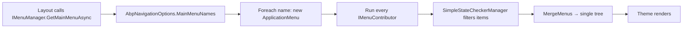

`Volo.Abp.UI.Navigation` defines the data model and contributor pattern for application menus. The pattern is identical across UI hosts — Razor pages, Blazor Server, Blazor WebAssembly, Angular all consume an `ApplicationMenu` produced by the same `IMenuManager` — which is why this assembly lives under `Volo.Abp.UI.*` rather than `Volo.Abp.AspNetCore.*`.

Source: `framework/src/Volo.Abp.UI.Navigation/Volo/Abp/Ui/Navigation/` and the sibling `Volo.Abp.UI` package for branding and layout hooks.

## The contracts

```csharp
public interface IMenuManager
{
    Task<ApplicationMenu> GetAsync(string name);
    Task<ApplicationMenu> GetMainMenuAsync();
}

public interface IMenuContributor
{
    Task ConfigureMenuAsync(MenuConfigurationContext context);
}
```

`StandardMenus.cs` enumerates the named menus the framework expects:

```csharp
public static class StandardMenus
{
    public const string Main     = "Main";
    public const string User     = "User";
    public const string Shortcut = "Shortcut";
}
```

`Main` is the application's left/top navigation. `User` is the dropdown next to the user avatar. `Shortcut` is for tenant or feature-specific quick actions.

## ApplicationMenu and ApplicationMenuItem

`ApplicationMenu.cs` is a tree root with a `Name`, `DisplayName`, and a list of `ApplicationMenuItem` children (`ApplicationMenuItemList.cs`). Each item carries:

- `Name` — unique identifier within its parent.
- `DisplayName` — localizable label.
- `Order` (default 1000) — sort key within siblings.
- `Url` — target route or external URL.
- `Icon` — CSS class for a font icon.
- `Target` — `_blank` / `_self`.
- `ElementId`, `CssClass` — for client-side hooks.
- `IsLeaf` — whether the item has children.
- `Items` — nested `ApplicationMenuItem` list.
- `RequiredPermissionName` — single-permission shortcut.
- `RequirePermissions` — bool that controls anonymous visibility.
- `IsDisabled` — render-but-hide flag.
- `CustomData` — arbitrary state for renderers.
- Implements `IHasSimpleStateCheckers<ApplicationMenuItem>` so contributors can attach `ISimpleStateChecker` instances (e.g. feature checks, multi-condition policies) via extension methods like `RequireFeatures(...)`, `RequirePermissions(...)`.

## Writing a contributor

A feature module declares one `IMenuContributor` per assembly and registers it via `AbpNavigationOptions`:

```csharp
public class BooksMenuContributor : IMenuContributor
{
    public async Task ConfigureMenuAsync(MenuConfigurationContext context)
    {
        if (context.Menu.Name != StandardMenus.Main) return;

        var l = context.GetLocalizer<BooksResource>();

        if (await context.IsGrantedAsync(BooksPermissions.Default))
        {
            context.Menu.AddItem(new ApplicationMenuItem(
                name: "BookStore.Books",
                displayName: l["Menu:Books"],
                url: "/Books",
                icon: "fa fa-book")
                .RequirePermissions(BooksPermissions.Default));
        }
    }
}

// Module:
Configure<AbpNavigationOptions>(options =>
{
    options.MenuContributors.Add(new BooksMenuContributor());
});
```

`MenuConfigurationContext` (`MenuConfigurationContext.cs`) exposes `IsGrantedAsync(policyName)`, `GetLocalizer<T>()`, and the in-progress `Menu` so the contributor can check the menu name before adding items — that pattern is what keeps a single module from spamming items into menus it does not own.

## MenuManager pipeline

`MenuManager.cs` (`IMenuManager` default implementation, `ITransientDependency`):

```csharp
public async Task<ApplicationMenu> GetMainMenuAsync()
    => await GetAsync(Options.MainMenuNames.ToArray());

protected virtual async Task<ApplicationMenu> GetAsync(params string[] menuNames)
{
    var menus = new List<ApplicationMenu>();
    foreach (var name in Options.MainMenuNames) menus.Add(await GetInternalAsync(name));
    return MergeMenus(menus);
}
```

`AbpNavigationOptions.MainMenuNames` defaults to `[ StandardMenus.Main ]` but can include additional names — useful when an enterprise host wants the main menu to be the union of multiple logical menus (Main + AdminToolbox + Shortcut).

`GetInternalAsync(name)` creates a fresh `ApplicationMenu(name)` and runs *every* registered `IMenuContributor.ConfigureMenuAsync(context)` against it inside a service scope. After contributors have populated the tree, `MenuManager` calls `SimpleStateCheckerManager<ApplicationMenuItem>` (from `Volo.Abp.SimpleStateChecking`) to drop items whose attached checkers fail — that is what implements the lazy `RequirePermissions` / `RequireFeatures` filtering for the current request.



The render step is owned by the theme — see [Themes](/framework/ui-mvc/themes). The basic theme's `MainNavbarMenuViewComponent.cs` (in `modules/basic-theme/src/Volo.Abp.AspNetCore.Mvc.UI.Theme.Basic/`) calls `IMenuManager.GetMainMenuAsync()` and walks the resulting tree.

## Related primitives in Volo.Abp.UI

`Volo.Abp.UI` (`framework/src/Volo.Abp.UI/`) ships two adjacent concepts the navigation layer often pairs with:

- `Branding/IBrandingProvider` — exposes the app's display name and logo URLs; the layout renders these next to the menu.
- `LayoutHooks/AbpLayoutHookOptions` — lets modules inject view components at named slots in the layout (`Head`, `BodyEnd`, etc.) without modifying the theme's `.cshtml`.

`Urls/AppUrlOptions` (`framework/src/Volo.Abp.UI.Navigation/Volo/Abp/Ui/Navigation/Urls/AppUrlOptions.cs`) is what binds front-end URL conventions (login URL, profile URL) so menu items can route to the right place across hosts.

For how the Blazor UIs consume the same model, see [Blazor Overview](/framework/blazor/overview).
