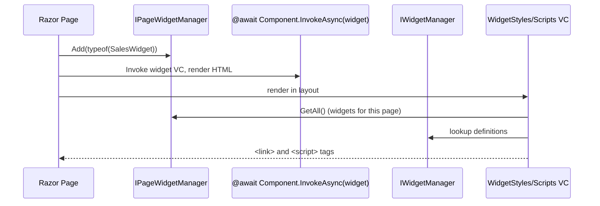

A *widget* in ABP is a `ViewComponent` plus metadata that lets it be discovered, listed, authorised, and rendered on a dashboard or any host page. `Volo.Abp.AspNetCore.Mvc.UI.Widgets` ships the registration model and the rendering helpers; concrete dashboards (host pages, the SaaS module, the audit-log dashboard) instantiate widgets at request time.

Source: `framework/src/Volo.Abp.AspNetCore.Mvc.UI.Widgets/Volo/Abp/AspNetCore/Mvc/UI/Widgets/`.

## Declaring a widget

A widget is any class that:

1. Inherits from `Microsoft.AspNetCore.Mvc.ViewComponent`.
2. Is decorated with `[Widget]` (`WidgetAttribute.cs`).

```csharp
[Widget(
    StyleFiles = new[] { "/Widgets/Sales/sales-widget.css" },
    ScriptFiles = new[] { "/Widgets/Sales/sales-widget.js" },
    RequiredPolicies = new[] { "Sales.Dashboard" },
    AutoInitialize = true,
    RefreshUrl = "/Widgets/SalesWidget")]
public class SalesWidgetViewComponent : ViewComponent
{
    public Task<IViewComponentResult> InvokeAsync()
        => Task.FromResult<IViewComponentResult>(View(new SalesViewModel { ... }));
}
```

`WidgetAttribute` properties:

| Property | Purpose |
| --- | --- |
| `StyleFiles` / `StyleTypes` | CSS files or `IBundleContributor` types to include when the widget renders. |
| `ScriptFiles` / `ScriptTypes` | JS files or contributors. |
| `DisplayName` / `DisplayNameResource` | Localizable name for selectors that list widgets. |
| `RequiredPolicies` | Policy names checked by `IAuthorizationService` before rendering. |
| `RequiresAuthentication` | Anonymous users are denied unless explicitly set. |
| `RefreshUrl` | Endpoint a client-side helper calls to refresh the widget's HTML. |
| `AutoInitialize` | Tells `abp.widgets` to wire up the JS class automatically. |

`WidgetAttribute.IsWidget(Type)` is the predicate that the framework's conventional scanner uses; any type that is both a `ViewComponent` subclass and `[Widget]`-decorated qualifies.

## WidgetDefinition

`WidgetDefinition.cs` is the registry entry. Constructed from a `Type viewComponentType`, it reads the attribute and exposes:

```csharp
public string Name { get; }                 // ViewComponentAttribute.Name ?? Type.Name minus "ViewComponent"
public WidgetAttribute WidgetAttribute { get; }
public ILocalizableString DisplayName { get; set; }
public Type ViewComponentType { get; }
public List<string> RequiredPolicies { get; }
public bool RequiresAuthentication { get; set; }
public List<WidgetResourceItem> Styles { get; }   // from StyleFiles + StyleTypes
public List<WidgetResourceItem> Scripts { get; }
public string? RefreshUrl { get; set; }
public bool AutoInitialize { get; set; }
```

`WidgetResourceItem` (`WidgetResourceItem.cs`) wraps either a file path or a bundle-contributor type, so the same widget can ship a literal `<script src="...">` or a contributor that gets composed into a shared bundle (see [Bundling](/framework/aspnetcore/bundling)).

Builder methods make programmatic tweaks easy: `WithRequiredPolicies(...)`, `WithRequiresAuthentication(...)`, `WithStyles(...)`, `WithScripts(...)`, `WithRefreshUrl(...)`. A module can therefore *override* a third-party widget's policies without owning its source.

## Registration: AbpWidgetOptions

`AbpWidgetOptions.cs` exposes:

```csharp
public class AbpWidgetOptions
{
    public WidgetDefinitionCollection Widgets { get; }
}
```

Two ways to register:

```csharp
// 1. By type — uses the [Widget] attribute as the source of truth
Configure<AbpWidgetOptions>(options =>
{
    options.Widgets.Add<SalesWidgetViewComponent>();
});

// 2. With ad-hoc overrides
options.Widgets.Add(new WidgetDefinition(typeof(SalesWidgetViewComponent))
    .WithRequiredPolicies("Sales.Admin"));
```

The conventional registrar in `AbpAspNetCoreMvcUiWidgetsModule.cs` does not auto-scan; widgets must be added explicitly. That is by design — dashboards are typically configured by the host, not by feature modules that happen to *contain* widgets.

## Resolving widgets at request time

`IWidgetManager` (default `WidgetManager.cs`):

- `GetAll()` returns every `WidgetDefinition`.
- `GetOrNull(name)` looks up a single widget.
- `CheckPermissionsAsync(IServiceProvider, ClaimsPrincipal, WidgetDefinition)` runs `RequiresAuthentication` and `RequiredPolicies` against `IAuthorizationService` so a UI can hide widgets the user cannot see.

`IPageWidgetManager` (`IPageWidgetManager.cs` / `PageWidgetManager.cs`) is the per-page accumulator. Inside a Razor view, `IPageWidgetManager.Add(widgetType)` records that a widget will appear on this page; the layout's `<vc:widget-styles />` and `<vc:widget-scripts />` view components (`Components/WidgetStyles/`, `Components/WidgetScripts/`) then emit the union of all registered widgets' resources at the right place in `<head>` and just before `</body>`.



`AbpViewComponentHelper.cs` adds an extension `@await Html.Component.InvokeWidgetAsync(name)` so a page can render a widget by string name without referencing its type directly — useful for tenant-configurable dashboards.

## WidgetDimensions

`WidgetDimensions.cs` is a small POCO for layout systems that want to record default width/height for a widget. The framework does not enforce it — it's consumed by dashboards that draw a grid (e.g. the audit-log dashboard, the SaaS edition usage dashboard).

## Where to read next

- [Bundling](/framework/aspnetcore/bundling) — how `Styles` / `Scripts` on `WidgetAttribute` compose into the shared bundle pipeline.
- [Themes](/framework/ui-mvc/themes) — the layout that hosts `<vc:widget-styles />` and `<vc:widget-scripts />`.
- The dashboard implementations under `modules/saas/src` and `modules/audit-logging/src` use this infrastructure as their canonical examples.
