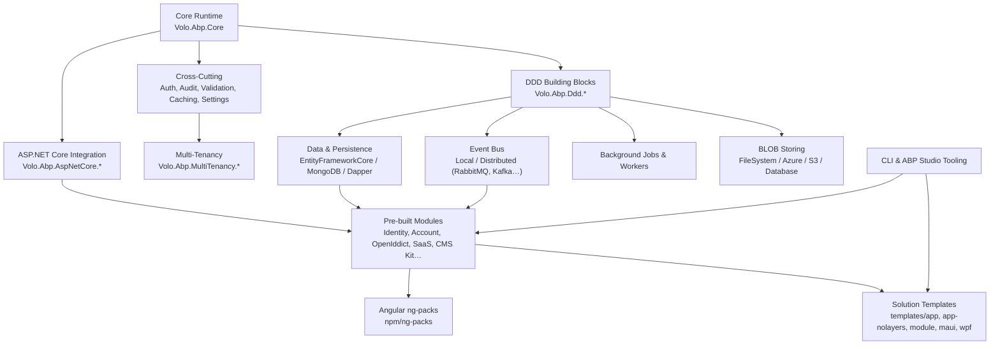

ABP is an opinionated, modular application framework built on top of ASP.NET Core. It provides a runtime kernel for module loading and dependency injection, a complete Domain-Driven Design (DDD) building-block library, infrastructure for data access, event bus, background jobs, blob storage, multi-tenancy and authorization, plus a large set of pre-built application modules (Identity, Account, OpenIddict, SaaS, CMS Kit…), Angular packages (ng-packs), npm UI assets, a CLI, and solution templates. This wiki is a code-grounded tour of the [`abpframework/abp`](https://github.com/abpframework/abp) monorepo — every page links back to real source under `framework/`, `modules/`, `npm/`, `templates/` and `tools/`.

## What ABP Provides

ABP sits between ASP.NET Core and your application code. The startup module type you pass to `AbpApplicationFactory` becomes the root of a dependency graph; ABP loads every transitively `[DependsOn]` module, runs three service-configuration phases (`PreConfigureServices` → `ConfigureServices` → `PostConfigureServices`), then three initialization phases (`OnPreApplicationInitialization` → `OnApplicationInitialization` → `OnPostApplicationInitialization`). See `framework/src/Volo.Abp.Core/Volo/Abp/AbpApplicationBase.cs` for the bootstrap and `framework/src/Volo.Abp.Core/Volo/Abp/Modularity/AbpModule.cs` for the lifecycle hooks every module overrides.

## Subsystem Map

<Info>
Every arrow corresponds to a real package dependency. The startup module of a generated solution (`MyCompanyName.MyProjectName.WebModule`) ultimately `[DependsOn]` the modules in each of these boxes — that is how ABP composes.
</Info>

## Repository Map

The repository is a monorepo: framework runtime, application modules, npm/Angular packages, templates and build tooling all live side by side and are released together.

| Directory | What lives here | Wiki page |
| --- | --- | --- |
| `framework/` | The ABP framework itself: `Volo.Abp.Core`, DDD layers, EF Core/MongoDB, ASP.NET Core integration, AspNetCore.Mvc.UI themes, Blazor, events, BG jobs, settings, auth, etc. | [Core overview](/framework/core/overview) |
| `modules/` | Pre-built application modules — Identity, Account, OpenIddict, OpenIddict.Pro replacement, SaaS-free building blocks, AuditLogging, BackgroundJobs, BlobStoring.Database, CmsKit, FeatureManagement, PermissionManagement, SettingManagement, TenantManagement, Users, VirtualFileExplorer, Blogging, IdentityServer, ClientSimulation. | [Modules](/modules/overview) |
| `templates/` | Solution templates the CLI scaffolds from: `app` (layered), `app-nolayers`, `module`, `console`, `maui`, `wpf`. | [Templates](/templates/overview) |
| `npm/` | The TypeScript / Angular and the MVC asset packs. `npm/ng-packs` is the Nx workspace for `@abp/ng.*`; `npm/packs` holds the MVC/jQuery asset libraries. | [ng-packs](/ng-packs/overview), [npm packs](/npm-packs/overview) |
| `tools/` | C# tools: `github-changelog-generator`, `localization-key-synchronizer`, NuGet helpers. | [CLI overview](/tooling/cli-overview) |
| `build/` | PowerShell scripts: `build-all.ps1`, `build-all-release.ps1`, `test-all.ps1`. | [Build overview](/build/overview) |
| `source-code/` | Aggregated `*.SourceCode` projects that re-publish module code for ABP Suite/Studio source-code customers. | [Source code](/source-code/overview) |
| `studio/` | ABP Studio source-code packs (`studio/source-codes`). | [Modules](/modules/overview) |
| `docs/` | The public documentation site content (Markdown, images, partials) — read-only reference here. | — |
| `apiSpec/` | API spec helper docs (e.g. `Microsoft_AspNetCore_Routing_AbpEndpointRouterOptions.md`). | — |
| `schemas/` | JSON schemas (`low-code/`) consumed by ABP Suite. | — |
| `deploy/` | PowerShell pipeline scripts: fetch, NuGet pack/push, NPM publish, GitHub release. | [Build overview](/build/overview) |
| `nupkg/` | NuGet packing helpers (`pack.ps1`, `push_packages.ps1`, MyGet nightly push). | [Build overview](/build/overview) |
| `test/` | Cross-cutting performance/integration test harness (`AbpPerfTest`). | — |
| `ai-rules/` | LLM rules / prompts (`common`, `data`, `template-specific`, `testing`, `ui`). | — |
| `abp_io/` | Localization data for abp.io (`AbpIoLocalization`). | — |
| `Directory.Build.props` / `Directory.Packages.props` | Central MSBuild defaults and centralized NuGet versions for the whole monorepo. | [Build overview](/build/overview) |
| `global.json` / `common.props` / `NuGet.Config` | .NET SDK pinning, shared MSBuild properties, NuGet feed configuration. | [Build overview](/build/overview) |

## Subsystems In Depth

<CardGroup cols={2}>
  <Card title="Architecture" icon="sitemap" href="/overview/architecture">
    Module bootstrap, layered solutions, DI conventions, interceptors.
  </Card>
  <Card title="Repository Layout" icon="folder-tree" href="/overview/repository-layout">
    Every top-level directory annotated with its purpose.
  </Card>
  <Card title="Solution Structure" icon="layer-group" href="/overview/solution-structure">
    The canonical Domain.Shared → Domain → Application.Contracts → Application → HttpApi → Web layering.
  </Card>
  <Card title="Glossary" icon="book" href="/overview/glossary">
    AbpModule, IUnitOfWork, IRepository, ETO, ICurrentTenant and friends.
  </Card>
  <Card title="Core Runtime" icon="microchip" href="/framework/core/overview">
    Modularity, DI conventions, `AbpApplicationBase`, options & contributors.
  </Card>
  <Card title="DDD Building Blocks" icon="cube" href="/framework/ddd/overview">
    Entities, AggregateRoot, Application Services, DTOs, domain events.
  </Card>
  <Card title="Data & Persistence" icon="database" href="/framework/data/overview">
    Repositories, Unit of Work, EF Core &amp; MongoDB providers, data filters.
  </Card>
  <Card title="Authorization" icon="shield-halved" href="/framework/cross-cutting/authorization">
    Permissions, features, settings, validation, exception handling.
  </Card>
  <Card title="Multi-Tenancy" icon="building" href="/framework/multi-tenancy/overview">
    `ICurrentTenant`, tenant resolvers, data isolation, MultiTenancySides.
  </Card>
  <Card title="ASP.NET Core" icon="globe" href="/framework/aspnetcore/overview">
    MVC, conventional routing, dynamic client proxies, model binding, UI themes.
  </Card>
  <Card title="HTTP API" icon="plug" href="/framework/http/overview">
    Dynamic API generation, HttpApi.Client proxies, remote services.
  </Card>
  <Card title="Event Bus" icon="bolt" href="/framework/event-bus/overview">
    Local + distributed bus, outbox/inbox, RabbitMQ/Kafka/Azure providers.
  </Card>
  <Card title="Background Jobs" icon="gears" href="/framework/background/overview">
    `IBackgroundJobManager`, workers, Quartz/Hangfire/RabbitMQ integrations.
  </Card>
  <Card title="BLOB Storing" icon="box-archive" href="/framework/blob-storing/overview">
    `IBlobContainer`, providers (FileSystem, Azure, S3, MinIO, AliyunOSS, Database).
  </Card>
  <Card title="Pre-built Modules" icon="puzzle-piece" href="/modules/overview">
    Identity, Account, OpenIddict, FeatureManagement, AuditLogging, CmsKit…
  </Card>
  <Card title="Angular ng-packs" icon="angular" href="/ng-packs/overview">
    Nx workspace of `@abp/ng.*` libraries consumed by the Angular UI.
  </Card>
  <Card title="MVC UI Theming" icon="paintbrush" href="/framework/ui-mvc/overview">
    Razor Pages bundling, Bootstrap themes, tag helpers.
  </Card>
  <Card title="Blazor UI" icon="bolt-lightning" href="/framework/blazor/overview">
    Server, WebAssembly, WebApp and MAUI Blazor variants with Theming.
  </Card>
  <Card title="CLI &amp; Tooling" icon="terminal" href="/tooling/cli-overview">
    C# tools, NuGet packers, changelog generator.
  </Card>
  <Card title="Templates" icon="file-code" href="/templates/overview">
    `app`, `app-nolayers`, `module`, `maui`, `wpf` solution templates.
  </Card>
  <Card title="Source Code packs" icon="code-branch" href="/source-code/overview">
    `Volo.*.SourceCode` projects that bundle the module source for source-code license customers.
  </Card>
  <Card title="Application Startup Flow" icon="diagram-project" href="/flows/application-startup">
    Step-by-step trace of `AbpApplicationFactory.CreateAsync` to `InitializeModulesAsync`.
  </Card>
</CardGroup>

<Tip>
**Where to start reading code.** Two files explain 80% of ABP's runtime model:

- `framework/src/Volo.Abp.Core/Volo/Abp/AbpApplicationBase.cs` — the application root that loads modules, runs the three `ConfigureServices` phases, owns `ServiceProvider`, and orchestrates initialization/shutdown.
- `framework/src/Volo.Abp.Core/Volo/Abp/Modularity/AbpModule.cs` — the abstract class every module derives from. It implements `IPreConfigureServices`, `IPostConfigureServices`, `IOnPreApplicationInitialization`, `IOnApplicationInitialization`, `IOnPostApplicationInitialization`, `IOnApplicationShutdown` — those six hooks are the entire module surface.

Open them side by side, then read [`/overview/architecture`](/overview/architecture).
</Tip>

## Conventions Used Across The Wiki

- Code paths are repo-relative under `abpframework/abp/` (e.g. `framework/src/Volo.Abp.Core/...`).
- Project names use the original casing (`Volo.Abp.Identity.Application.Contracts`).
- Generated/template projects are shown using the placeholder `MyCompanyName.MyProjectName.*` exactly as the templates ship under `templates/app/aspnet-core/src/`.
- Wiki cross-links use slugs without `.mdx` (e.g. `/overview/architecture`).
