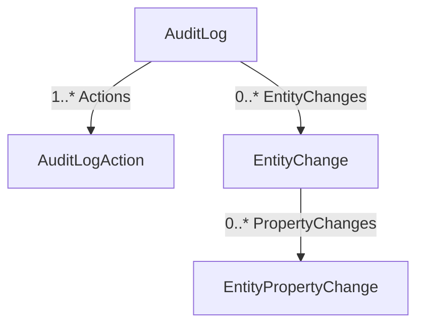

The Audit Logging module is the database-backed implementation of ABP's [auditing](/framework/cross-cutting/auditing) cross-cutting concern. It owns an `AuditLog` aggregate — one row per request or background operation — with child collections of `AuditLogAction` (the application service / controller methods that ran) and `EntityChange` (the aggregates that mutated, plus per-property before/after values). Source lives under `/home/daytona/repos/abpframework/abp/modules/audit-logging/src/Volo.Abp.AuditLogging.Domain/`.

## Aggregate model



| Type | File | Notes |
| --- | --- | --- |
| `AuditLog` | `AuditLog.cs` | `AggregateRoot<Guid>`, `IMultiTenant`, `[DisableAuditing]`. Carries user/impersonator, `ExecutionTime`, `ExecutionDuration`, HTTP context (`HttpMethod`, `Url`, `HttpStatusCode`, `ClientIpAddress`, `BrowserInfo`), `CorrelationId`, `ClientId`, exception text and the two child collections |
| `AuditLogAction` | `AuditLogAction.cs` | Per service-method invocation: `ServiceName`, `MethodName`, serialized `Parameters`, `ExecutionTime`, `ExecutionDuration`. Truncates over-long fields using `AuditLogActionConsts.Max*Length` |
| `EntityChange` | `EntityChange.cs` | Aggregate mutation: `ChangeType` (`Created`/`Updated`/`Deleted`), `EntityTypeFullName`, `EntityId`, optional `EntityTenantId`, plus `PropertyChanges` |
| `EntityPropertyChange` | `EntityPropertyChange.cs` | `PropertyName`, `PropertyTypeFullName`, `OriginalValue`, `NewValue` — all string-serialized and length-checked against `EntityPropertyChangeConsts` |

All four types carry `[DisableAuditing]` so saving the audit log does not itself produce audit log entries.

## IAuditingStore implementation

`AuditingStore` (`AuditingStore.cs`) is registered as `IAuditingStore` (the contract from the [auditing framework](/framework/cross-cutting/auditing)). It receives an `AuditLogInfo`, converts it via `IAuditLogInfoToAuditLogConverter` and inserts inside its own unit of work:

```csharp
public class AuditingStore : IAuditingStore, ITransientDependency
{
    public virtual async Task SaveAsync(AuditLogInfo auditInfo)
    {
        if (!Options.HideErrors) { await SaveLogAsync(auditInfo); return; }
        try { await SaveLogAsync(auditInfo); }
        catch (Exception ex) { Logger.LogWarning(...); Logger.LogException(ex, LogLevel.Error); }
    }

    protected virtual async Task SaveLogAsync(AuditLogInfo auditInfo)
    {
        using (var uow = UnitOfWorkManager.Begin(true))
        {
            await AuditLogRepository.InsertAsync(await Converter.ConvertAsync(auditInfo));
            await uow.CompleteAsync();
        }
    }
}
```

`AbpAuditingOptions.HideErrors` controls whether persistence failures are swallowed (default) or rethrown. `AuditLogInfoToAuditLogConverter` (`AuditLogInfoToAuditLogConverter.cs`) maps the in-memory info type — built by the audit interceptor — into the persistent aggregate, truncating strings against the `*Consts.Max*Length` values.

## Repository

`IAuditLogRepository : IRepository<AuditLog, Guid>` (`IAuditLogRepository.cs`) is what the management UI and the [audit logs app service](/framework/cross-cutting/auditing) query against. Its read API is the source of every filter you see in the admin screens:

```csharp
Task<List<AuditLog>> GetListAsync(
    string sorting = null, int maxResultCount = 50, int skipCount = 0,
    DateTime? startTime = null, DateTime? endTime = null,
    string httpMethod = null, string url = null, string clientId = null,
    Guid? userId = null, string userName = null,
    string applicationName = null, string clientIpAddress = null,
    string correlationId = null,
    int? maxExecutionDuration = null, int? minExecutionDuration = null,
    bool? hasException = null, HttpStatusCode? httpStatusCode = null,
    bool includeDetails = false, CancellationToken cancellationToken = default);

Task<long> GetCountAsync(/* same filters */);
Task<Dictionary<DateTime, double>> GetAverageExecutionDurationPerDayAsync(...);
Task<EntityChange> GetEntityChange(Guid entityChangeId, ...);
Task<List<EntityChange>> GetEntityChangeListAsync(...);
```

The `Get*EntityChange*` overloads back the "Entity History" screens — they let you pivot the same data by *which entity changed* instead of *which request ran*.

`IAuditLogExcelFileRepository` (`IAuditLogExcelFileRepository.cs`) is a small companion used by the export-to-Excel feature, and `AuditLogEntityTypeFullNameConverter` lets hosts rewrite full type names (e.g. after a refactor) so old logs still render.

## How it plugs into the framework

The auditing framework calls `IAuditingStore.SaveAsync` from `IAuditingManager.SaveAsync()` after each scope completes. This module's `AbpAuditLoggingDomainModule` registers `AuditingStore` and the EF/Mongo repository (provided by the matching `EntityFrameworkCore` / `MongoDB` package next to `Domain`).

See also: [/framework/cross-cutting/auditing](/framework/cross-cutting/auditing) for the interceptor pipeline that produces `AuditLogInfo`, and [/modules/identity](/modules/identity) which writes its own `IdentitySecurityLog` for security-specific events.
