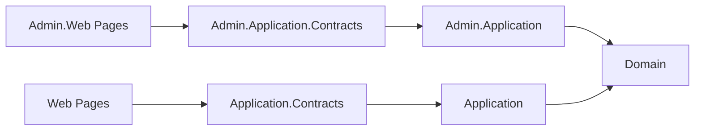

`Volo.Blogging` is ABP's standalone blog engine. Unlike the [CMS-Kit](/modules/cms-kit) `Blogs` feature (which shares its tagging/comments/reactions with other CMS entities), this module is a self-contained vertical: its own `Blog`, `Post`, `Comment`, `Tag` aggregates and its own users. Source lives under `/home/daytona/repos/abpframework/abp/modules/blogging/src/`.

## Package layout

The module follows the ABP standard layering, plus an `Admin` vs default (public) split for application and HTTP layers:

| Package | Role |
| --- | --- |
| `Volo.Blogging.Domain.Shared` / `Volo.Blogging.Domain` | Aggregates, repositories, domain services |
| `Volo.Blogging.Application.Contracts(.Shared)` / `Volo.Blogging.Application` | Public read API: list/read posts, comments |
| `Volo.Blogging.Admin.Application.Contracts` / `Volo.Blogging.Admin.Application` | Authoring API: create/edit/delete blogs and posts |
| `Volo.Blogging.HttpApi(.Client)` / `Volo.Blogging.Admin.HttpApi(.Client)` | Mirrored controllers and dynamic-proxy clients |
| `Volo.Blogging.Web` / `Volo.Blogging.Admin.Web` | Public Razor Pages and admin authoring UI |
| `Volo.Blogging.EntityFrameworkCore` / `Volo.Blogging.MongoDB` | Persistence |

## Aggregates

All aggregates derive from `FullAuditedAggregateRoot<Guid>`, files under `Volo.Blogging.Domain/Volo/Blogging/`:

| Aggregate | File | Key fields |
| --- | --- | --- |
| `Blog` | `Blogs/Blog.cs` | `Name`, `ShortName` (URL slug), optional `Description` |
| `Post` | `Posts/Post.cs` | `BlogId`, `Url`, `Title`, `CoverImage`, `Content`, `Description`, `ReadCount`, `Collection<PostTag> Tags` |
| `PostTag` | `Posts/PostTag.cs` | Many-to-many link `PostId` ↔ `TagId` |
| `Tag` | `Tagging/Tag.cs` | `BlogId`, `Name`, `Description`, `UsageCount` (with `IncreaseUsageCount` / `DecreaseUsageCount`) |
| `Comment` | `Comments/Comment.cs` | `PostId`, optional `RepliedCommentId` for threads, `Text` |
| `BlogUser` | `Users/BlogUser.cs` | Local projection implementing `IUser` + `IUpdateUserData`. Adds bio fields: `WebSite`, `Twitter`, `Github`, `Linkedin`, `Company`, `JobTitle` |

`PostCacheItem` / `PostCacheInvalidator` cache rendered post content; `PostChangedEvent` is the local domain event the cache invalidator subscribes to.

### User synchronization

`BlogUser` is **not** the host's identity user — it is a denormalized read-model. `BlogUserSynchronizer` (`Users/BlogUserSynchronizer.cs`) subscribes to the user-update ETOs from [`Volo.Abp.Users`](/modules/users) and upserts `BlogUser` via `IBlogUserRepository`. `IBlogUserLookupService` is the equivalent of `IUserLookupService<BlogUser>` for code that just needs to find an author.

## Admin vs Public split

The **public** side under `Volo.Blogging.Application` exposes read-mostly services consumed by the blog reader UI (`Volo.Blogging.Web`). The **admin** side under `Volo.Blogging.Admin.Application` exposes authoring services (CRUD on blogs, posts, tags, comment moderation) and is consumed by the admin authoring pages in `Volo.Blogging.Admin.Web`. Both layers depend on the same `Volo.Blogging.Domain` aggregates and repositories.

`Volo.Blogging.Application.Contracts.Shared` carries permission names and DTOs that need to be visible to *both* sides (e.g. tag list DTOs surfaced in both the reader and editor).

## Domain repositories

Each aggregate has a custom repository interface in `Volo.Blogging.Domain` so the application services can issue tuned queries:

| Interface | File | Notable methods |
| --- | --- | --- |
| `IBlogRepository` | `Blogs/IBlogRepository.cs` | `FindByShortNameAsync(shortName)` |
| `IPostRepository` | `Posts/IPostRepository.cs` | `GetPostsByBlogId(id)`, `GetPostByUrl(blogId, url)`, `IsPostUrlInUseAsync(...)`, `GetLatestBlogPostsAsync(blogId, count)` |
| `ICommentRepository` | `Comments/ICommentRepository.cs` | `GetListOfPostAsync(postId)`, `GetCommentCountOfPostAsync(postId)`, `GetRepliesOfComment(id)` |
| `ITagRepository` | `Tagging/ITagRepository.cs` | `GetListAsync(blogId)`, `FindByNameAsync(blogId, name)`, `DecreaseUsageCountOfTagsAsync(ids)` |
| `IBlogUserRepository` | `Users/IBlogUserRepository.cs` | Inherits `IUserRepository<BlogUser>`; adds `GetUsersAsync(maxCount, filter)` |

## Persistence

`Volo.Blogging.EntityFrameworkCore` configures the EF Core `DbSet`s for the five aggregates and the `PostTag` junction; `Volo.Blogging.MongoDB` provides parallel `IMongoCollection<T>` mappings via `BloggingDomainMappers` and its Mongo context. Both packages live next to the Domain project and are interchangeable — pick one per host.

## Caching

Post content is hot-path: `PostCacheItem` (`Posts/PostCacheItem.cs`) is the cached DTO, populated by the public application service and invalidated by `PostCacheInvalidator`, which listens for `PostChangedEvent` (`Posts/PostChangedEvent.cs`) — the same domain event that `Post` raises on every meaningful mutation.

## Relationship to CMS-Kit

[CMS-Kit](/modules/cms-kit) has its own newer `Blogs` feature (`Volo.CmsKit.Blogs`) with a different data model — multi-tenant `Blog` + `BlogPost` aggregates that share comments/tags/reactions with pages and other entities. If you are starting fresh you typically want CMS-Kit; this `Volo.Blogging` module remains for projects already invested in its schema and admin UI.

See also: [/modules/cms-kit](/modules/cms-kit) for the newer integrated blog feature, [/modules/users](/modules/users) for the shared user contracts, and [/framework/ddd/repositories](/framework/ddd/repositories) for the EF/Mongo repository pattern.
