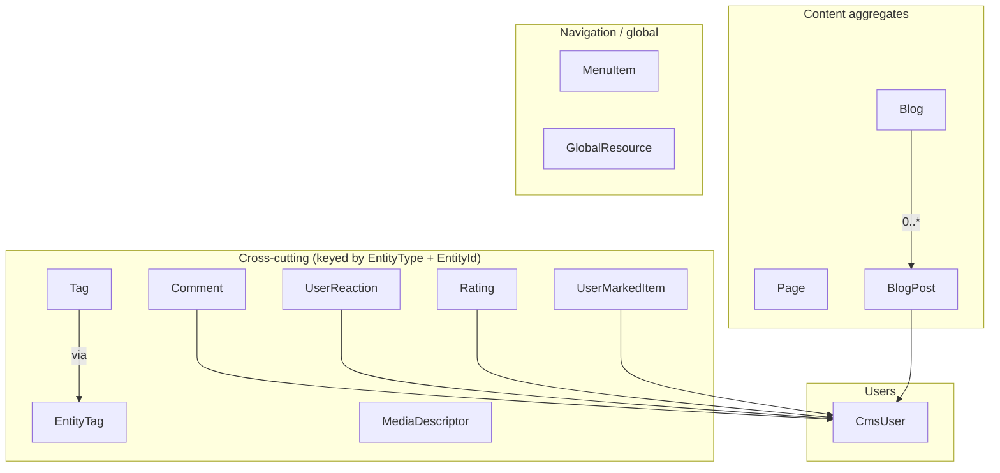
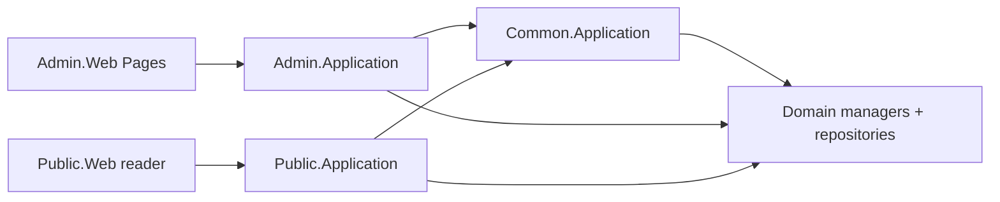

CMS-Kit is **not** a turnkey CMS — it is a tray of orthogonal CMS *features* that any entity in your application can opt in to. Each feature (`Comments`, `Tags`, `Reactions`, `Ratings`, `MarkedItems`, `MediaDescriptors`) is keyed by a string `EntityType` and an `EntityId`, so a product, a forum post and a help article can all be commentable, taggable and ratable without coupling. On top of those primitives the module also ships two first-class content aggregates — `Page` and `BlogPost` — plus dynamic `MenuItem`s and a `GlobalResource` key-value store. Source: `/home/daytona/repos/abpframework/abp/modules/cms-kit/src/Volo.CmsKit.Domain/Volo/CmsKit/`.

## Package layout

CMS-Kit uses a three-way split — **Admin** (authoring), **Public** (end-user consumption), **Common** (shared concerns like media and menus) — on top of the usual ABP layering. There is also a flat `Volo.CmsKit.Application`/`HttpApi`/`Web` set that aggregates all three sides for hosts that want a single endpoint surface.

| Package family | Layer | Contents |
| --- | --- | --- |
| `Volo.CmsKit.Domain.Shared` | Domain.Shared | Constants, error codes, status enums (`PageStatus`, `BlogPostStatus`) |
| `Volo.CmsKit.Domain` | Domain | Aggregates, repositories, managers, definition stores |
| `Volo.CmsKit.Admin.Application(.Contracts)` | App / Admin | Authoring app services: page/blog/tag/menu/global-resource CRUD, comment moderation |
| `Volo.CmsKit.Public.Application(.Contracts)` | App / Public | Reader app services: post + reactions + ratings + marked-items + global resources |
| `Volo.CmsKit.Common.Application(.Contracts)` | App / Common | Shared concerns: `TagAppService`, `MediaDescriptorAppService`, menu change handler, blog-feature handler |
| `Volo.CmsKit.Admin.HttpApi(.Client)` / `Volo.CmsKit.Public.HttpApi(.Client)` / `Volo.CmsKit.Common.HttpApi(.Client)` | HTTP | Mirrored controllers + dynamic-proxy clients |
| `Volo.CmsKit.Admin.Web` / `Volo.CmsKit.Public.Web` / `Volo.CmsKit.Common.Web` | UI | Razor Pages for admin authoring, public reader and shared widgets |
| `Volo.CmsKit.Application` / `Volo.CmsKit.HttpApi(.Client)` / `Volo.CmsKit.Web` | Umbrella | Aggregate modules that depend on Admin + Public + Common |
| `Volo.CmsKit.EntityFrameworkCore` / `Volo.CmsKit.MongoDB` | Persistence | EF Core and Mongo repositories for every aggregate |

`Volo.CmsKit.Installer` is the CLI installer.

## Aggregates and entities



| Folder | Aggregate / Entity | File | Notes |
| --- | --- | --- | --- |
| `Blogs/` | `Blog` | `Blog.cs` | `FullAuditedAggregateRoot<Guid>`, `IMultiTenant`; `Name`, `Slug` |
| `Blogs/` | `BlogPost` | `BlogPost.cs` | `FullAuditedAggregateRoot<Guid>`, `IHasEntityVersion`; `BlogId`, `Title`, `Slug`, `ShortDescription`, `Content`, `CoverImageMediaId`, `AuthorId`/`Author`, `Status` (`BlogPostStatus`) |
| `Blogs/` | `BlogFeature` | `BlogFeature.cs` | Per-blog flag table (enable comments, reactions, tags…) loaded via `IBlogFeatureRepository` |
| `Comments/` | `Comment` | `Comment.cs` | `AggregateRoot<Guid>`, `IMustHaveCreator`, `IMultiTenant`. Keyed by `EntityType`+`EntityId`. Optional `RepliedCommentId` (threads), `IsApproved`, `IdempotencyToken`, `Url` |
| `Pages/` | `Page` | `Page.cs` | `FullAuditedAggregateRoot<Guid>`, `IHasEntityVersion`; `Title`, `Slug`, `Content`, `Script`, `Style`, `IsHomePage`, `LayoutName`, `Status` (`PageStatus`) |
| `Tags/` | `Tag` | `Tag.cs` | `FullAuditedAggregateRoot<Guid>`; `EntityType`, `Name` |
| `Tags/` | `EntityTag` | `EntityTag.cs` | Many-to-many join: `(TagId, EntityId)` composite key |
| `Reactions/` | `UserReaction` | `UserReaction.cs` | `BasicAggregateRoot<Guid>`, `IMustHaveCreator`; one reaction (`ReactionName`) per `(CreatorId, EntityType, EntityId)` |
| `Ratings/` | `Rating` | `Rating.cs` | `BasicAggregateRoot<Guid>`, `IMustHaveCreator`; `StarCount` (`short`) per `(CreatorId, EntityType, EntityId)` |
| `MarkedItems/` | `UserMarkedItem` | `UserMarkedItem.cs` | "Bookmark / favorite" — `(CreatorId, EntityType, EntityId)` |
| `MediaDescriptors/` | `MediaDescriptor` | `MediaDescriptor.cs` | `FullAuditedAggregateRoot<Guid>`; `EntityType`, `Name`, `MimeType`, `Size`. Bytes live in a [BLOB container](/modules/blob-storing-database) named by the matching `MediaDescriptorDefinition` |
| `Menus/` | `MenuItem` | `MenuItem.cs` | `AuditedAggregateRoot<Guid>`; tree (`ParentId`), `DisplayName`, `Url`, `Icon`, `Order`, `Target`, optional `PageId` |
| `Users/` | `CmsUser` | `CmsUser.cs` | Local projection of the host's user, implementing `IUser` + `IUpdateUserData` |
| `GlobalResources/` | `GlobalResource` | `GlobalResource.cs` | `AuditedAggregateRoot<Guid>`; `Name`/`Value` pair (think: shared CSS variables, header HTML) |

### Aggregate boundaries

`Blog` and `BlogPost` are separate aggregates — a `BlogPost` references a `Blog` by id and has its own lifecycle. `Tag` is the master tag definition (per `EntityType`); `EntityTag` is the link to a tagged record. Comments form their own tree via `RepliedCommentId`. The `BlogFeature` table sits beside `Blog` so toggling features doesn't touch the `Blog` aggregate.

## Domain managers

Domain managers in the `Domain` project orchestrate invariants:

| Manager | File | Responsibilities |
| --- | --- | --- |
| `BlogManager` | `Blogs/BlogManager.cs` | Slug uniqueness (throws `BlogSlugAlreadyExistException`) |
| `BlogPostManager` | `Blogs/BlogPostManager.cs` | Per-blog slug uniqueness, status transitions |
| `BlogFeatureManager` | `Blogs/BlogFeatureManager.cs` | Default-on/off lookup via `IDefaultBlogFeatureProvider` |
| `PageManager` | `Pages/PageManager.cs` | Slug uniqueness, single-`IsHomePage` invariant (throws `MultipleHomePageException`) |
| `CommentManager` | `Comments/CommentManager.cs` | Permission-aware moderation, idempotency |
| `TagManager` / `EntityTagManager` | `Tags/*.cs` | Tag dedup; attach/detach tags; throws `TagAlreadyExistException`, `EntityNotTaggableException` |
| `ReactionManager` | `Reactions/ReactionManager.cs` | One reaction per `(user, entity)` upsert; `EntityCantHaveReactionException` if not whitelisted |
| `RatingManager` | `Ratings/RatingManager.cs` | One rating per `(user, entity)`; throws `EntityCantHaveRatingException` if entity isn't ratable |
| `MarkedItemManager` | `MarkedItems/MarkedItemManager.cs` | Mark/unmark; `EntityCannotBeMarkedException`, `MarkedItemDefinitionNotFoundException` |
| `MediaDescriptorManager` | `MediaDescriptors/MediaDescriptorManager.cs` | Validates filename (`MediaDescriptorChecks.IsValidMediaFileName`) and definition |
| `MenuItemManager` | `Menus/MenuItemManager.cs` | Tree integrity; `PageChangedHandler` updates menu links when a page's slug changes |
| `GlobalResourceManager` | `GlobalResources/GlobalResourceManager.cs` | Upsert by `Name`, length validation |

## Opt-in via definition stores

What makes CMS-Kit composable is that every keyed feature requires the host to **register** an `EntityType` before it works. Each feature has a definition + store pair:

| Feature | Definition | Store interface |
| --- | --- | --- |
| Comments | `CommentEntityTypeDefinition` | `ICommentEntityTypeDefinitionStore` (`DefaultCommentEntityTypeDefinitionStore`) |
| Tags | `TagEntityTypeDefiniton` (sic) | `ITagDefinitionStore` (`DefaultTagDefinitionStore`) |
| Reactions | `ReactionEntityTypeDefinition` + `ReactionDefinition` (per reaction name) | `IReactionDefinitionStore` (`DefaultReactionDefinitionStore`) |
| Ratings | `RatingEntityTypeDefinition` | `IRatingEntityTypeDefinitionStore` (`DefaultRatingEntityTypeDefinitionStore`) |
| Marks | `MarkedItemEntityTypeDefinition` | `IMarkedItemDefinitionStore` (`DefaultMarkedItemDefinitionStore`) |
| Media | `MediaDescriptorDefinition` | `IMediaDescriptorDefinitionStore` (`DefaultMediaDescriptorDefinitionStore`) |

Definitions extend `PolicySpecifiedDefinition` (see `Volo.CmsKit.Domain/Volo/CmsKit/PolicySpecifiedDefinition.cs`) so each `EntityType` can declare separate **create**, **update** and **delete** permission policies. Hosts register entries through `CmsKit*Options` (e.g. `CmsKitReactionOptions`, `CmsKitTagOptions`, `CmsKitMarkedItemOptions`, `CmsKitMediaOptions`) at startup:

```csharp
Configure<CmsKitTagOptions>(options =>
{
    options.EntityTypes.Add(new TagEntityTypeDefiniton("Product"));
});

Configure<CmsKitReactionOptions>(options =>
{
    options.EntityTypes.Add(
        new ReactionEntityTypeDefinition("BlogPost",
            new[] { new ReactionDefinition("thumbsUp"), new ReactionDefinition("heart") }));
});
```

Trying to operate on an unregistered `EntityType` throws the per-feature "cannot have X" exception listed in the manager table.

## Managers that bridge to other modules

- `CmsUserLookupService` (`Users/CmsUserLookupService.cs`) implements `ICmsUserLookupService` over `ICmsUserRepository` + `IExternalUserLookupServiceProvider`.
- `CmsUserSynchronizer` (`Users/CmsUserSynchronizer.cs`) subscribes to user-update ETOs from [`Volo.Abp.Users`](/modules/users) and upserts the local `CmsUser`.
- `BlogFeatureDataSeedContributor` (`Blogs/BlogFeatureDataSeedContributor.cs`) seeds the default feature flags via `IDefaultBlogFeatureProvider`.
- `PageChangedHandler` (`Menus/PageChangedHandler.cs`) listens for page slug changes and rewrites referencing `MenuItem.Url` values.

## Admin vs Public application services



<CardGroup cols={2}>
<Card title="Admin side" icon="user-shield">
`Volo.CmsKit.Admin.Application` exposes authoring services in `Blogs/`, `Comments/`, `Pages/`, `Tags/`, `Menus/`, `MediaDescriptors/`, `GlobalResources/`. Comment moderation, content publishing, blog-feature toggles all live here. The Admin HTTP API is gated by `CmsKitAdminPermissions`.
</Card>
<Card title="Public side" icon="globe">
`Volo.CmsKit.Public.Application` exposes read-mostly endpoints in `Blogs/`, `Pages/`, `Comments/`, `Reactions/`, `Ratings/`, `MarkedItems/`, `Menus/`, `GlobalResources/`. End-user write operations are limited to comments, reactions, ratings and marks — and each is gated by the policies declared in the definition for the `EntityType`.
</Card>
</CardGroup>

`Volo.CmsKit.Common.Application` hosts services that legitimately straddle both sides — tag listing, media download, the `BlogFeatureChangedHandler` and `MenuChangedHandler` event handlers — without duplicating logic.

## HTTP and Web split

The HTTP layer mirrors the application split:

- `Volo.CmsKit.Admin.HttpApi` / `.Client` — admin REST controllers + dynamic-proxy client (typed C# proxies)
- `Volo.CmsKit.Public.HttpApi` / `.Client` — public REST + client
- `Volo.CmsKit.Common.HttpApi` / `.Client` — shared (tags, media)
- `Volo.CmsKit.HttpApi` / `.Client` — umbrella that depends on all three for hosts that don't want to mount endpoints separately

The Web layer mirrors that again: `Volo.CmsKit.Admin.Web` carries the authoring Razor Pages (page editor, post editor, comment moderation, tag/menu/global-resource management), `Volo.CmsKit.Public.Web` carries the public reader pages and the reusable Tag Helpers / widgets (comment box, reaction bar, rating stars, mark button), and `Volo.CmsKit.Common.Web` carries shared scripts, styles and the menu Tag Helper. `Volo.CmsKit.Web` is the convenience umbrella.

## Persistence

`Volo.CmsKit.EntityFrameworkCore` registers every aggregate via `CmsKitDbContextModelCreatingExtensions` against the host `DbContext`; `Volo.CmsKit.MongoDB` maps the same aggregates to Mongo collections. Both packages provide the concrete `I*Repository` implementations behind the interfaces in the `Domain` project — see the `I*Repository.cs` files under `Volo.CmsKit.Domain/Volo/CmsKit/{Feature}/`.

## Typical wiring

A host that wants taggable, commentable, reactable products would:

1. Reference the domain + EF Core (or Mongo) + Application(.Contracts) packages.
2. Register definitions in `ConfigureServices`:
   ```csharp
   Configure<CmsKitTagOptions>(o => o.EntityTypes.Add(new TagEntityTypeDefiniton("Product")));
   Configure<CmsKitReactionOptions>(o => o.EntityTypes.Add(
       new ReactionEntityTypeDefinition("Product", new[] { new ReactionDefinition("thumbsUp") })));
   ```
3. Drop the Tag Helpers from `Volo.CmsKit.Public.Web` (or the Blazor components from `Volo.CmsKit.Public.Blazor`) into the product detail page, passing `EntityType="Product"` and the product id.

See also: [/modules/blogging](/modules/blogging) for the legacy standalone blog module, [/modules/users](/modules/users) for the user contracts `CmsUser` projects from, [/modules/blob-storing-database](/modules/blob-storing-database) for storing `MediaDescriptor` content, and [/modules/permission-management](/modules/permission-management) for the policies that `PolicySpecifiedDefinition` references.
