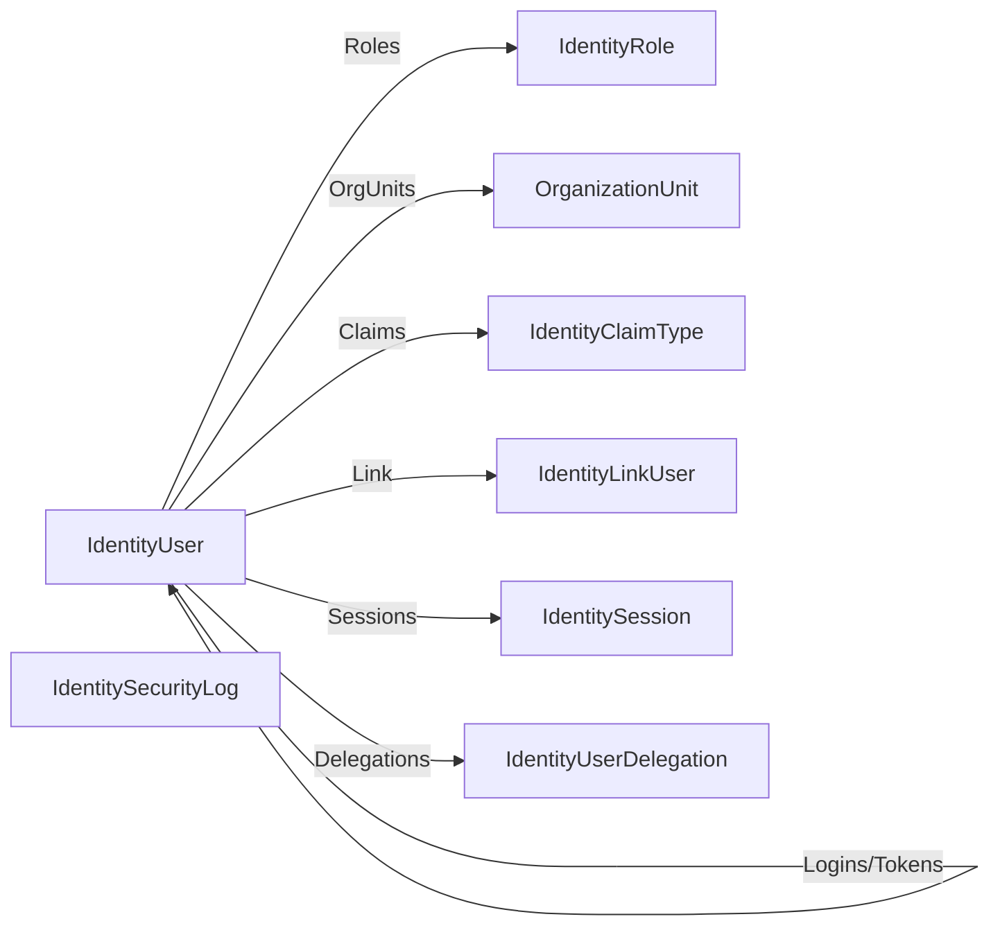

The Identity module is ABP's wrapper around ASP.NET Core Identity. It owns the user/role/claim model, organization units, security logs, account linking, passkeys, and the dynamic claims pipeline. Source lives under `/home/daytona/repos/abpframework/abp/modules/identity/src/`, split across the standard ABP layers (`Domain.Shared`, `Domain`, `Application.Contracts`, `Application`, `HttpApi`, `AspNetCore`, `EntityFrameworkCore`, `MongoDB`, `Blazor*`, `Web`, `Installer`).

## Domain aggregates

All aggregates live in `modules/identity/src/Volo.Abp.Identity.Domain/Volo/Abp/Identity/`:

| Aggregate | File | Notes |
| --- | --- | --- |
| `IdentityUser` | `IdentityUser.cs` | `FullAuditedAggregateRoot<Guid>`, implements `IUser`, `IHasEntityVersion`; carries `Roles`, `Claims`, `Logins`, `Tokens`, `OrganizationUnits`, `Passkeys`, password history |
| `IdentityRole` | `IdentityRole.cs` | `AggregateRoot<Guid>`, `IMultiTenant`, `IHasEntityVersion`; flags `IsDefault`, `IsStatic`, `IsPublic` |
| `OrganizationUnit` | `OrganizationUnit.cs` | Tree node keyed by hierarchical `Code` (e.g. `"00001.00042.00005"`) |
| `IdentityClaimType` | `IdentityClaimType.cs` | Custom claim definitions with regex + value type |
| `IdentitySecurityLog` | `IdentitySecurityLog.cs` | Persisted security events (login success/failure, password change, …) |
| `IdentityLinkUser` | `IdentityLinkUser.cs` | Links two users across tenants for impersonation/switching |
| `IdentitySession` | `IdentitySession.cs` | Active sessions (device, IP, expiration) |
| `IdentityUserDelegation` | `IdentityUserDelegation.cs` | "Act as" delegations between users for a time window |

### Managers and stores

Domain services wrap ASP.NET Core Identity's `UserManager<T>`/`RoleManager<T>` so the rest of ABP can stay framework-agnostic:

- `IdentityUserManager` (`IdentityUserManager.cs`) — extends `UserManager<IdentityUser>` with org-unit, default-role, password-history, passkey and delegation helpers.
- `IdentityRoleManager` (`IdentityRoleManager.cs`) — adds tenant-aware role queries.
- `OrganizationUnitManager` (`OrganizationUnitManager.cs`) — handles hierarchical `Code` generation and move/delete.
- `IdentityClaimTypeManager`, `IdentitySecurityLogManager`, `IdentityLinkUserManager`, `IdentityUserDelegationManager`.
- `IdentityUserStore` / `IdentityRoleStore` / `IdentitySecurityLogStore` adapt domain repositories to ASP.NET Identity's `IUserStore`/`IRoleStore` contracts.

### Dynamic claims

`IdentityDynamicClaimsPrincipalContributor` (paired with `IdentityDynamicClaimsPrincipalContributorCache`) plugs into ABP's `ClaimsPrincipalFactory` so claims (roles, custom `IdentityClaimType`s, org-unit codes) can be **refreshed from the database without re-issuing the auth cookie/JWT**. The cache options live in `IdentityDynamicClaimsPrincipalContributorCacheOptions.cs`.

### External login & passkeys

`IExternalLoginProvider` / `IExternalLoginProviderWithPassword` (and the `ExternalLoginProviderBase` / `ExternalLoginUserInfo` types) let you plug LDAP, Active Directory, or custom IDPs into `IdentityUserManager.LoginAsync`. Passkeys are first-class: `IdentityUserPasskey.cs` plus `IdentityUserPasskeyExtensions.cs` add WebAuthn credentials to users.

## Application services

Implementations in `modules/identity/src/Volo.Abp.Identity.Application/Volo/Abp/Identity/`:

- `IdentityUserAppService` — CRUD, role assignment, lookup by id/name/email, assignable roles.
- `IdentityRoleAppService` — CRUD plus `GetAllListAsync`.
- `IdentityUserLookupAppService` — read-only search, count, lookup-by-id (used by other modules over an integration contract).
- `Integration/IdentityUserIntegrationService.cs` — cross-microservice user lookup that does **not** require the caller to depend on the full Identity contracts.

DTOs and `IIdentityUserAppService` / `IIdentityRoleAppService` interfaces live in `Volo.Abp.Identity.Application.Contracts`.

## HTTP API

Controllers in `modules/identity/src/Volo.Abp.Identity.HttpApi/Volo/Abp/Identity/`:

| Method | Route | Purpose |
| --- | --- | --- |
| `GET` | `/api/identity/users` | List users (`GetIdentityUsersInput`) |
| `POST` | `/api/identity/users` | Create user |
| `GET` | `/api/identity/users/{id}` | Get user by id |
| `PUT` | `/api/identity/users/{id}` | Update user |
| `DELETE` | `/api/identity/users/{id}` | Delete user |
| `GET` | `/api/identity/users/by-id/{id}` | `FindByIdAsync` (nullable) |
| `GET` | `/api/identity/users/by-username/{userName}` | Find by username |
| `GET` | `/api/identity/users/by-email/{email}` | Find by email |
| `GET` | `/api/identity/users/{id}/roles` | Roles for user |
| `PUT` | `/api/identity/users/{id}/roles` | Replace user's roles |
| `GET` | `/api/identity/users/assignable-roles` | Roles current caller may assign |
| `GET` | `/api/identity/users/lookup/{id}` | Public user lookup by id |
| `GET` | `/api/identity/users/lookup/by-username/{userName}` | Lookup by username |
| `GET` | `/api/identity/users/lookup/search` | Paged lookup search |
| `GET` | `/api/identity/users/lookup/count` | Total user count |
| `GET` | `/api/identity/roles` | Paged role list |
| `GET` | `/api/identity/roles/all` | All roles |
| `GET` | `/api/identity/roles/{id}` | Get role |
| `POST` | `/api/identity/roles` | Create role |
| `PUT` | `/api/identity/roles/{id}` | Update role |
| `DELETE` | `/api/identity/roles/{id}` | Delete role |

Routes are declared in `IdentityUserController.cs`, `IdentityRoleController.cs`, `IdentityUserLookupController.cs`, and `Integration/IdentityUserIntegrationController.cs`.

## Persistence and UI

EF Core mappings sit in `Volo.Abp.Identity.EntityFrameworkCore` (with `AbpIdentityDbContext`); the MongoDB counterpart lives in `Volo.Abp.Identity.MongoDB`. The web surface ships in three flavors — `Volo.Abp.Identity.Web` (MVC Razor Pages), `Volo.Abp.Identity.Blazor` and `Volo.Abp.Identity.Blazor.MudBlazor` (+ Server/WebAssembly hosts) — all consuming the same HTTP API via the `Volo.Abp.Identity.HttpApi.Client` dynamic proxies.

See [Account](/modules/account) for the sign-in / register UI built on top of this module, and [Permission Management](/modules/permission-management) for how user-/role-keyed permission grants are stored.
