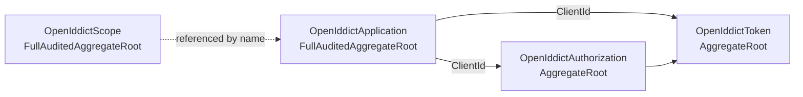

The OpenIddict module is ABP's **recommended authorization-server implementation**. It wraps the [OpenIddict](https://documentation.openiddict.com) libraries so OAuth2/OIDC entities (applications, scopes, authorizations, tokens) live as proper ABP aggregate roots — persisted through ABP repositories, audited, cleanable by a background worker, and seedable from configuration.

Source projects under `/home/daytona/repos/abpframework/abp/modules/openiddict/src/`:

| Project | Purpose |
| --- | --- |
| `Volo.Abp.OpenIddict.Domain.Shared` | Constants / errors |
| `Volo.Abp.OpenIddict.Domain` | Aggregates + ABP store/manager implementations |
| `Volo.Abp.OpenIddict.AspNetCore` | Wires the OpenIddict ASP.NET Core handlers (`AddServer`, `AddValidation`) into the ABP module pipeline |
| `Volo.Abp.OpenIddict.EntityFrameworkCore` / `*.MongoDB` | Repository + mapping implementations |
| `Volo.Abp.OpenIddict.Installer` | NuGet `content` payload |
| `Volo.Abp.PermissionManagement.Domain.OpenIddict` | Permission management provider for OpenIddict resources |

## Aggregates



Each entity lives under its own folder in `modules/openiddict/src/Volo.Abp.OpenIddict.Domain/Volo/Abp/OpenIddict/`:

- `Applications/OpenIddictApplication.cs` — `FullAuditedAggregateRoot<Guid>` holding `ClientId`, `ClientSecret`, `ClientType` (public/confidential), `ApplicationType`, `ConsentType`, JSON-serialized `Permissions`, `Requirements`, `RedirectUris`, `Settings`, etc.
- `Scopes/OpenIddictScope.cs` — Scope definitions (`Name`, `DisplayName`, `Description`, `Resources`).
- `Authorizations/OpenIddictAuthorization.cs` — Persistent consents/permanent grants linking `Subject` ↔ `ApplicationId`.
- `Tokens/OpenIddictToken.cs` — Issued access/refresh/authorization codes; cleaned up by `TokenCleanupBackgroundWorker`.

> **Multi-tenancy:** the wrapper models are explicitly `[IgnoreMultiTenancy]` (see `OpenIddictApplicationModel.cs`) — OAuth clients/scopes are **host-wide** even when the host runs in multi-tenant mode. Tokens and authorizations follow OpenIddict's own `Subject` semantics.

## Stores, caches, managers

ABP supplies its own `IOpenIddictXxxStore` implementations sitting on top of repositories, so OpenIddict reads/writes through ABP's UoW pipeline:

- `AbpOpenIddictStoreBase<TRepository>` — base class wiring `IRepository`, `IUnitOfWorkManager`, `IGuidGenerator`, `AbpOpenIddictIdentifierConverter` (Guid ↔ string), and `IOpenIddictDbConcurrencyExceptionHandler`. Provides JSON `WriteStream`/`ReadStream` helpers used by every store.
- `Applications/AbpOpenIddictApplicationStore.cs`, `Scopes/AbpOpenIddictScopeStore.cs`, `Authorizations/AbpOpenIddictAuthorizationStore.cs`, `Tokens/AbpOpenIddictTokenStore.cs`.
- Caches: `AbpOpenIddictApplicationCache`, `AbpOpenIddictScopeCache`, `AbpOpenIddictAuthorizationCache`, `AbpOpenIddictTokenCache` decorate the stores with `IDistributedCache`.

Managers override the OpenIddict managers to publish ABP distributed events on writes:

```csharp
public class AbpApplicationManager : OpenIddictApplicationManager<OpenIddictApplicationModel>, IAbpApplicationManager
{
    public override async ValueTask UpdateAsync(OpenIddictApplicationModel application, CancellationToken ct = default)
    {
        var entity = await Store.FindByIdAsync(IdentifierConverter.ToString(application.Id), ct);
        var oldClientId = entity?.ClientId;
        // ... cache invalidation, then base update, then publish distributed event
    }
}
```

Equivalent wrappers exist for `AbpScopeManager`, `AbpAuthorizationManager`, and `AbpTokenManager`.

## Data seeding

`OpenIddictDataSeedContributorBase` is the recommended base class for application templates (microservices, MVC, Angular, etc.) to bootstrap a starter set of clients and scopes. It exposes:

```csharp
protected virtual Task CreateScopesAsync(OpenIddictScopeDescriptor scope) { ... }

protected virtual Task CreateOrUpdateApplicationAsync(
    string applicationType,
    string name,                    // ClientId
    string type,                    // Public / Confidential
    string consentType,
    string displayName,
    string secret,
    List<string> grantTypes,
    List<string> scopes,
    List<string> redirectUris = null,
    List<string> postLogoutRedirectUris = null,
    string clientUri = null,
    string logoUri = null);
```

It performs the right permission inflation (e.g. when `grantTypes` includes both `authorization_code` and `implicit` it adds the proper response-type permissions, and it enforces "no secret for public clients / secret required for confidential clients"). Derived contributors typically read client definitions from `appsettings.json` via `IConfiguration` and call `CreateOrUpdateApplicationAsync` once per client.

## Token cleanup

`Tokens/TokenCleanupBackgroundWorker.cs` runs `TokenCleanupService` on a schedule defined by `TokenCleanupOptions`, removing expired authorizations and tokens through the standard OpenIddict managers — keeping the database lean even under heavy issuance.

## Related modules

- [Account](/modules/account) — `Volo.Abp.Account.Web.OpenIddict` provides the login UI that drives `/authorize` and `/token`.
- [Identity Server](/modules/identity-server) — the legacy alternative, kept for migration scenarios.
- [Permission Management](/modules/permission-management) — `Volo.Abp.PermissionManagement.Domain.OpenIddict` integrates client-permission grants for OpenIddict applications.
