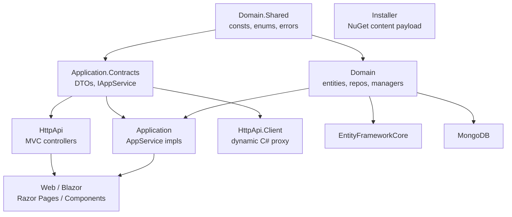

ABP's `modules/` directory hosts the pre-built **application modules** that the framework ships out of the box. Each module is itself a small ABP application — domain logic, an application service layer, an HTTP API, UI, and EF Core + MongoDB persistence — packaged so a host application can `[DependsOn]` it and instantly gain users, tenants, settings, permissions, blogs, docs, and more.

## What an ABP application module is

A module is a **vertical slice** of functionality, distributed as a set of NuGet packages mirroring ABP's recommended DDD layering. Every module under `/home/daytona/repos/abpframework/abp/modules/<name>/src/` contains roughly the same project shape:

| Layer | Purpose |
| --- | --- |
| `*.Domain.Shared` | Constants, enums, exceptions, localization, error codes — safe to reference everywhere |
| `*.Domain` | Aggregate roots, domain services (`*Manager`), repository interfaces, domain events |
| `*.Application.Contracts` | DTOs, `IAppService` interfaces, permission/feature/setting definitions |
| `*.Application` | `AppService` implementations orchestrating the domain layer |
| `*.HttpApi` | ASP.NET Core controllers that expose `IAppService`s as REST |
| `*.HttpApi.Client` | Typed HTTP proxies for the controllers (consumed by SPAs/microservices) |
| `*.EntityFrameworkCore` | EF Core mappings + repository implementations |
| `*.MongoDB` | MongoDB mappings + repository implementations |
| `*.Web` / `*.Blazor*` | MVC Razor Pages or Blazor Server/WASM UI |
| `*.Installer` | NuGet `content` payload used by the ABP CLI to install the module |

A few modules add `*.AspNetCore` (middleware/cookie integration like Identity) or split admin vs. public surfaces (CMS Kit, Blogging, Docs).

## Modules shipped in this repo

<CardGroup cols={2}>
  <Card title="Identity & Account" href="/modules/identity">Users, roles, claims, org units, sign-in.</Card>
  <Card title="OpenIddict / IdentityServer" href="/modules/openiddict">OAuth2/OIDC authorization server.</Card>
  <Card title="Permission, Feature, Setting" href="/modules/permission-management">Authorization, multi-tenant features, configuration.</Card>
  <Card title="CMS Kit & Docs" href="/modules/cms-kit">Content building blocks and documentation portal.</Card>
</CardGroup>

| Module | One-liner |
| --- | --- |
| [`identity`](/modules/identity) | ASP.NET Identity-based users, roles, claim types, organization units, security logs, dynamic claims |
| [`account`](/modules/account) | Register / login / forgot-password UI plus profile management, with OpenIddict and IdentityServer hosts |
| [`openiddict`](/modules/openiddict) | ABP wrapper over the OpenIddict OAuth2/OIDC server (applications, scopes, tokens, authorizations) |
| [`identityserver`](/modules/identity-server) | Legacy Duende IdentityServer integration; superseded by `openiddict` |
| [`permission-management`](/modules/permission-management) | Persistent permission grants with user/role/client value providers |
| [`feature-management`](/modules/feature-management) | Persistent feature toggles per tenant/edition |
| [`setting-management`](/modules/setting-management) | Persistent settings per global/tenant/user scope |
| [`tenant-management`](/modules/tenant-management) | Multi-tenant `Tenant` aggregate with per-tenant connection strings |
| [`audit-logging`](/modules/audit-logging) | Persisted audit logs, action logs, entity change logs |
| [`background-jobs`](/modules/background-jobs) | Default DB-backed store for ABP's background job system |
| [`blob-storing-database`](/modules/blob-storing-database) | `IBlobProvider` implementation that stores BLOBs in the application database |
| [`cms-kit`](/modules/cms-kit) | Reusable content building blocks: blogs, comments, reactions, ratings, tags, pages, menus, media |
| [`blogging`](/modules/blogging) | Standalone blog module (now superseded by CMS Kit blogs) |
| [`docs`](/modules/docs) | Documentation portal serving projects from File System, GitHub, or DB sources |
| [`users`](/modules/users) | Cross-module abstractions (`IUser`, `UserData`, lookup contracts) |
| [`basic-theme`](/modules/basic-theme) | Free MVC/Blazor "Basic" theme |
| [`virtual-file-explorer`](/modules/virtual-file-explorer) | Dev-time web UI for browsing the Virtual File System |
| [`client-simulation`](/modules/client-simulation) | Load-test/client-simulation harness with a web dashboard |

## How modules wire together

Every module ships an `Abp<Name><Layer>Module : AbpModule` class. A host application picks the layers it needs and depends on them transitively. For example, a typical web host depends on `AbpIdentityWebModule`, which pulls in `AbpIdentityHttpApiModule` → `AbpIdentityApplicationModule` → `AbpIdentityDomainModule` → `AbpIdentityDomainSharedModule`, plus `AbpIdentityEntityFrameworkCoreModule` for persistence. The ABP CLI's "install" command uses the `*.Installer` project to copy a package into the host solution.
