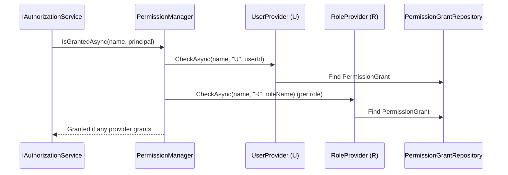

The Permission Management module is the **persistence and management surface** for ABP's authorization system. The permission *definitions* (what permissions exist) live in the host's `PermissionDefinitionProvider`s, but the *grants* (which subject is granted which permission) are stored and queried by this module.

Source under `/home/daytona/repos/abpframework/abp/modules/permission-management/src/`, plus two satellite packages that integrate other modules:

- `modules/identity/src/Volo.Abp.PermissionManagement.Domain.Identity/` — User & Role value providers.
- `modules/openiddict/src/Volo.Abp.PermissionManagement.Domain.OpenIddict/` — Client value provider for OpenIddict applications.
- `modules/identityserver/src/Volo.Abp.PermissionManagement.Domain.IdentityServer/` — Same, for legacy IdentityServer clients.

## Core aggregates

In `Volo.Abp.PermissionManagement.Domain/Volo/Abp/PermissionManagement/`:

```csharp
public class PermissionGrant : Entity<Guid>, IMultiTenant
{
    public virtual Guid?  TenantId     { get; protected set; }
    public virtual string Name         { get; protected set; }  // permission name
    public virtual string ProviderName { get; protected set; }  // "U" | "R" | "C"
    public virtual string ProviderKey  { get; protected internal set; }  // user id / role name / client id
}
```

Other domain types:

| Type | Role |
| --- | --- |
| `IPermissionGrantRepository` | Storage abstraction for `PermissionGrant`. |
| `PermissionDefinitionRecord` / `PermissionGroupDefinitionRecord` | Persistent (DB) representation of statically declared permission definitions, populated by `StaticPermissionSaver`. |
| `IDynamicPermissionDefinitionStore` | Reads the persistent records into the in-memory `IPermissionDefinitionManager` so microservices can share definitions. |
| `IStaticPermissionSaver` | Serializes the in-process permission definitions into the DB on app start. |
| `PermissionGrantCacheItem` / `PermissionGrantCacheItemInvalidator` | Per-`(name, provider, key)` cache plus event-bus invalidation. |
| `IPermissionManager` | High-level read/write API used by the management UI. |
| `IResourcePermissionManager` | Variant that scopes grants to a `Resource` (used by tenant-aware features). |

## Permission manager

`PermissionManager.cs` reads through the registered providers in order to answer "does subject X have permission P?". For a write (admin grant/revoke) it delegates to the matching `IPermissionManagementProvider`, which inserts/deletes a `PermissionGrant` row:

```csharp
public abstract class PermissionManagementProvider : IPermissionManagementProvider
{
    public abstract string Name { get; }   // "U", "R", "C", "T"

    public virtual async Task<MultiplePermissionValueProviderGrantInfo> CheckAsync(
        string[] names, string providerName, string providerKey)
    {
        using (PermissionGrantRepository.DisableTracking())
        {
            // returns Granted / NotGranted per name based on PermissionGrant rows
        }
    }
}
```

## Value providers (U / R / C)

ABP ships three permission **value providers** that plug into `PermissionManager`:

| Provider | Name | Key | Package |
| --- | --- | --- | --- |
| **User** (`U`) | `UserPermissionManagementProvider.cs` | `IdentityUser.Id` | `Volo.Abp.PermissionManagement.Domain.Identity` |
| **Role** (`R`) | `RolePermissionManagementProvider.cs` | role name | `Volo.Abp.PermissionManagement.Domain.Identity` |
| **Client** (`C`) | `ApplicationPermissionManagementProvider.cs` | OpenIddict `ClientId` | `Volo.Abp.PermissionManagement.Domain.OpenIddict` (and `*.IdentityServer`) |

There is also a tenant (`T`) provider in `Volo.Abp.PermissionManagement.Domain` for tenant-scoped grants. Each provider has a **resource** variant (`UserResourcePermissionManagementProvider`, `RoleResourcePermissionManagementProvider`, `ApplicationResourcePermissionManagementProvider`) that adds a `ProviderKey` discriminator, enabling permissions scoped to a specific entity instance.

Event handlers keep grants consistent: `UserDeletedEventHandler`, `RoleDeletedEventHandler`, `RoleUpdateEventHandler` (renames), and `OpenIddictApplicationClientIdChangedHandler` / `OpenIddictApplicationDeletedEventHandler` all live in their respective satellite packages.

## Lookup flow



## Persistence and UI

- `Volo.Abp.PermissionManagement.EntityFrameworkCore` / `.MongoDB` — `PermissionGrant` + `PermissionDefinitionRecord` mappings.
- `Volo.Abp.PermissionManagement.HttpApi` + `.Web` / `.Blazor*` — the familiar "Permissions" management modal used from the Identity and Tenant Management pages.

## Related

- [Identity](/modules/identity) — provides users and roles that the U/R providers key on.
- [OpenIddict](/modules/openiddict) — provides applications (clients) that the C provider keys on.
- [Feature Management](/modules/feature-management) and [Setting Management](/modules/setting-management) — sibling modules that follow the same value-provider pattern for features and settings.
