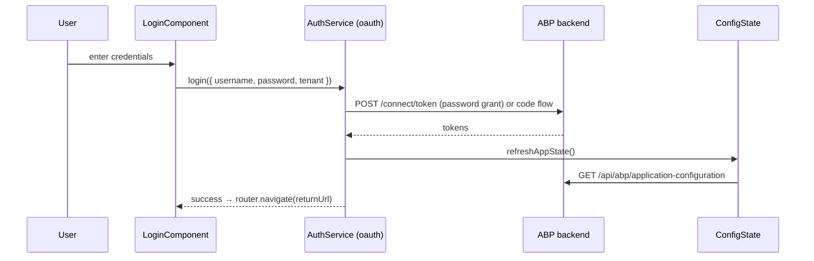

`@abp/ng.account` (`npm/ng-packs/packages/account/`) ships the user-facing authentication screens, while `@abp/ng.account.core` (`packages/account-core/`) ships the headless services they share. Splitting them lets headless apps (MAUI Blazor, custom UIs) reuse the auth orchestration without pulling in the components.

## account package

```
packages/account/src/lib/
├── account.module.ts
├── account-routing.module.ts
├── account.routes.ts            // standalone route table
├── components/
│   ├── login/
│   ├── register/
│   ├── forgot-password/
│   ├── reset-password/
│   ├── change-password/
│   ├── manage-profile/
│   └── personal-settings/
├── defaults/
├── enums/
├── guards/
│   ├── authentication-flow.guard.ts   // redirects when already authenticated
│   └── extensions.guard.ts            // applies object-extensions to manage-profile
├── models/
├── resolvers/
├── services/
├── tokens/
└── utils/
```

The routes live under `/account/*` and are typically mounted on the `account` layout from `theme-basic`. Each screen is a standalone component that uses Reactive Forms with validators from `@abp/ng.core/validators`.

### Guards

- `authentication-flow.guard.ts` — protects `/account/login` and `/account/register` so authenticated users don't see them again; bounces back to the configured return URL.
- `extensions.guard.ts` — runs `ExtensionsService` for `manage-profile` so downstream apps can extend the profile form (extra fields) without forking.

## account-core package

```
packages/account-core/src/lib/
├── auth-wrapper.service.ts   // multi-tenancy + local login flag, tenant-box visibility
└── tenant-box.service.ts
```

`AuthWrapperService` exposes streams the components bind to:

```typescript
@Injectable()
export class AuthWrapperService {
  readonly multiTenancy = inject(MultiTenancyService);
  private configState = inject(ConfigStateService);

  isMultiTenancyEnabled$ = this.configState.getDeep$('multiTenancy.isEnabled');

  get enableLocalLogin$(): Observable<boolean> {
    return this.configState.getSetting$('Abp.Account.EnableLocalLogin')
      .pipe(map(value => value?.toLowerCase() !== 'false'));
  }

  tenantBoxKey = 'Account.TenantBoxComponent';
  get isTenantBoxVisible() {
    return this.isTenantBoxVisibleForCurrentRoute && this.multiTenancy.isTenantBoxVisible;
  }
}
```

That logic decides whether to render the tenant-switcher above the login form and whether to enable the local username/password form (versus only social/SSO providers).

`TenantBoxService` is the smaller helper used by the standalone tenant-box component to set the active tenant via `MultiTenancyService.setTenantByName(...)`.

## Login flow



The login component calls `AuthService.login(...)`. With `@abp/ng.oauth` installed, that resolves to `AbpOAuthService`, which delegates to an `AuthFlowStrategy` (code or password) — see [oauth](/ng-packs/oauth).

<CardGroup cols={2}>
  <Card title="oauth" href="/ng-packs/oauth">Auth flow strategies behind login</Card>
  <Card title="identity" href="/ng-packs/identity">Admin user/role management</Card>
  <Card title="core" href="/ng-packs/core">ConfigStateService & MultiTenancyService</Card>
  <Card title="theme-basic" href="/ng-packs/theme-basic">Hosts the account layout</Card>
</CardGroup>
